## 1 Introduction

Mendix allows you to publish REST web services natively from the Desktop Modeler. This how-to will show you how to publish a REST service in an example project. This example will demonstrate the GET operation for a published REST service.

**This how-to will teach you how to do the following:**

* Create a published REST service and return the results in JSON or XML

## 2 Prerequisites

Before starting this how-to, make sure you have completed the following prerequisites:

* Install [Desktop Modeler](https://appstore.home.mendix.com/link/modelers/) version 7.11 or higher

## 3 Setting Up the Example Project

To create the example project you will use in the next sections for publishing your REST service, follow these steps:

1. Create a new project in the Desktop Modeler.
2. Rename the **MyFirstModule** module to **RESTExample**.
3. Open the domain model of the RESTExample module.
4.  Create entities with an association like this:

	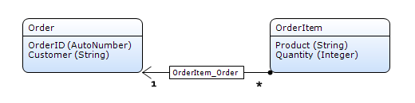

5. You need pages for entering order data, so create an overview page for the **Order** entity In the RESTExample module.
6. Create a **NewEdit** page for the orders, then add a data grid to the **Order_NewEdit** page that displays the **OrderItems** over an association.

Your page should now look like this:

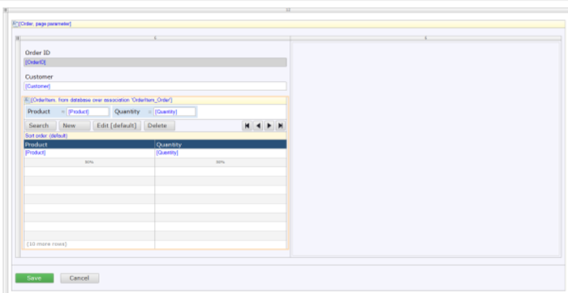

Add the overview page to your project navigation and run the application. Create a couple of orders and order lines by filling in the appropriate fields.

## 4 Publishing the Service

To be able to use the data from your model in the REST service, you need to create a message definition.

### 4.1 Creating the Mapping

1.  In the **Project Explorer**, right-click the **RESTExample** module and select **Add** > **Mappings** > **Message Definitions**:

	

2. In the **Add Message Definition** dialog box, enter *MD_Orders* as the name for this definition.

3.  The message definition is now opened and you need to select the entity to use for the MD_Orders definition. To do this, select **Add** and in the dialog box, click **Select** , then choose the **Order** entity from the list.

	

4. After selecting the **Order** entity, the **Structure** part of the dialog box is filled with only the **Order** object selected.

5. Select the **OrderID** and **Customer** attributes

6.  Expand the **OrderItem_Order** association and select the **Product** and **Quantity** attributes:

	

7. Click **Ok** to close the dialog box.

8. Close the message definition, and make sure to save the definition if asked!

### 4.2 Configuring the REST Service

1.  In the **Project Explorer**, right-click the **RESTExample** module and select **Add** > **Published Services** > **Published REST Service**:

	

2. Enter *PRS_OrderService*  for the **Name** of your REST service. The REST service is now opened

3.  Add a new resource to your service by clicking **Add**, and *GetOrderByID for the **Resource name**:

	

	Click **OK** to close the dialog box.

4.  Add an operation to your resource by clicking **Add** in the **Operations for resource** section:

	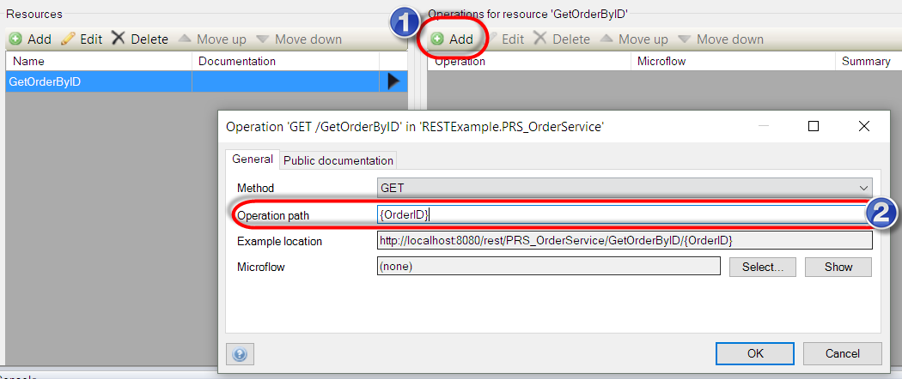

5. Add `{OrderID}` in the **Operation path** field (make sure to include the braces). This will allow the REST service to be invoked with the OrderID in the URL shown in the **Example location** field of the dialog box.
6.  In the same dialog box, click **Select** next to the **Microflow** field. As you do not have a microflow for this operation, click **New** in the following dialog box to create a new microflow for the RESTExample module. Enter *PRS_GetGetOrderByID* for the **Name** of this new microflow: 

	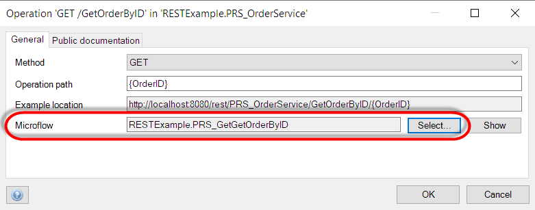

7. Click **Show** to start editing the newly created microflow.
8. Add two parameters: **httpRequest** and **OrderID**.
9.  Add an action to the microflow to convert the **OrderID** variable (string) to an integer variable. This is needed to be able to search for the OrderID (autonumber).

	

10. Add a second activity to the microflow to retrieve the **Order** based on the **OrderID**. This retrieve action from the database returns 1 order.
	
	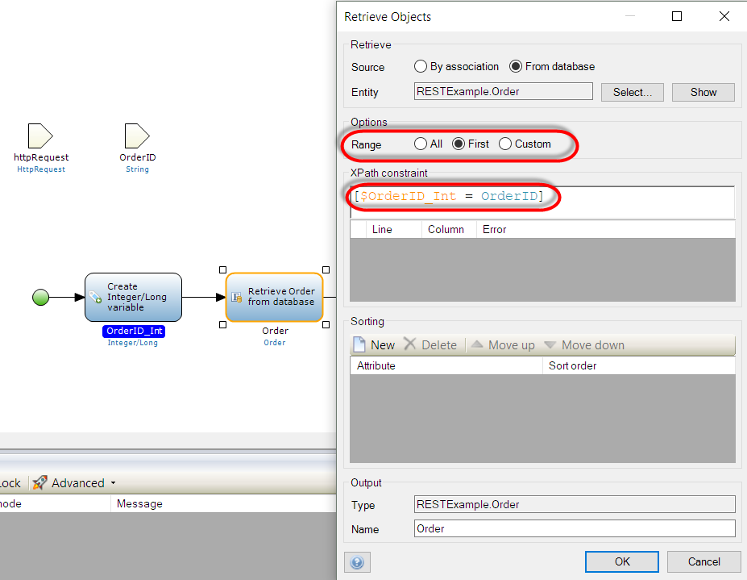

11. From the Project Explorer, right-click the RESTExample module and select **Add** > **Mappings** > **Export Mapping** to add a new mapping named **EM_ExportOrder**:

	

12. In the **Select schema elements for export mapping** dialog box, select the **Message definition** option, and then select the **MD_Orders** mapping created earlier via the **Select** button:

	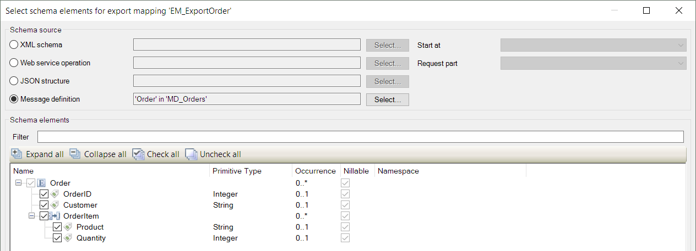

	Make sure to select all the attributes a shown above, then click **OK**.

13. In the export mapping that is shown, map the objects to the same objects from the domain model (either by double-clicking or dragging from the **Connector** pane). Make sure to map the attributes with the same names. Your mapping should look like this:

	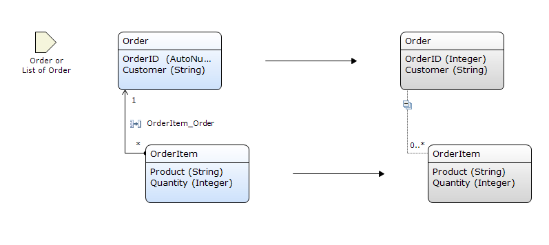

14. Now go back to the **PRS_GetGetOrderByID** microflow and add an Export with mapping activity.
15. In the **Mapping** field of the dialog box, select the mapping created above in [step 11](#eleven). For the **Parameter** field, select the **Order** object retrieved with the database retrieve action in the microflow. 
16. Select **JSON** for the result, and store the output in a **String variable**. Enter *Order_JSON* for the variable's **Name**.

	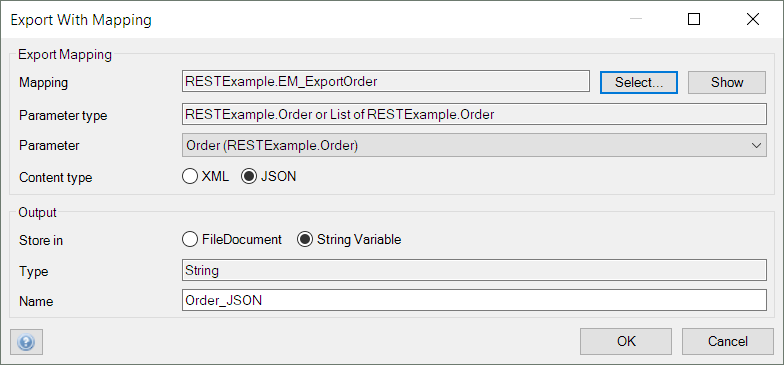

16. Add a an activity to the microflow to create an object of the type **HttpResponse**:

	

	The **StatusCode** will return "OK" as a 200 message. The content of the message is mapped to the exported JSON from [step 16](#sixteen). And add the **HttpVersion** that you will be using (in this case, `HTTP/1.1`).

17. Add an activity to the microflow for adding a header to the response:

	

	Set the member **Key** to `'Content-Type'` and the **Value** to `'application/json' `(or `'application/xml'` if your response contains XML rather than JSON). Set the **System.HttpHeaders** association to your HTTP response.

18. Open the end activity in your microflow and select **$NewHttpResponse** as the return value. You should have no errors, and your microflow should look like this:

	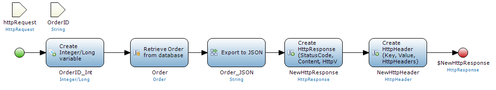

### 4.3 Viewing the App

To view and try out your app, follow these steps:

1. Run your app and open it in the browser via this URL: http://localhost:8080/rest-doc/.
2.  You will see a page with the documentation of all your published REST services:

	

3.  Click the **PRS_OrderService** link to view the details:

	

4. Click **GET** followed by **Try it out**.
5.  Fill in a **OrderID** and click **Execute**:

	

	This will execute the request and return the result in the **Response body**:

	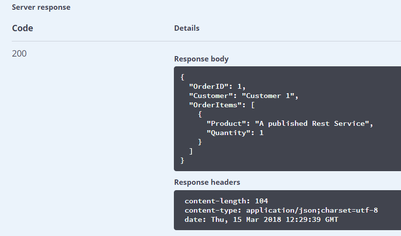

Cool! You have published your first REST service from Mendix.

## 5 Error Handling

In this new service, no error handling has been implemented. For example, if you now execute your service and enter a string in the **OrderID** parameter (or leave it out), you will see a 500 or a 404 generic error. So, error handling should be implemented to publish a robust service.

### 5.1 Adding Error Handling

1. Open the **PRS_GetGetOrderByID** microflow, right-click the first activity, then select the option to **Set Error Handling** to **Custom with rollback**.

2.  After the first activity, add an activity that creates a new HttpResponse object. Enter *NewHttpErrorResponse* for the **Name**, and map the attributes like this:

	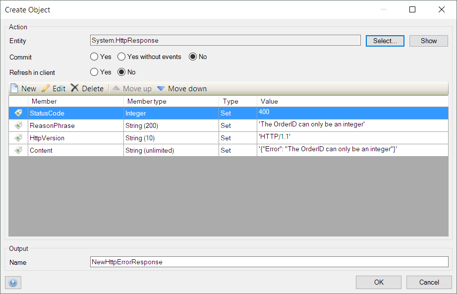

	For the **Content** member, the value is this JSON string: `'{"Error": "The OrderID can only be an integer"}'`.

3. Set the new activity as the custom error handler.
4.  Below this activity, add a **Create object** activity that creates a new httpHeader object:

	

	Make sure to associate the header to the **NewHttpErrorResponse**.

5. Add a new endpoint for the microflow and set **NewHttpErrorResponse** as the return value.
6. Test your error handler as you did with the app in section [4.3 Viewing the App](#viewing). Enter some characters in the **OrderID** parameter and observe the response of the request. 

### 5.2 Additional Error Handling

Now that you covered the error handling of the parameter parsing, it's time to handle empty responses. This is not really an error, but an indication of what happened when nothing was returned is always a good idea.

To add the error handling for those situations when the OrderID parameter is filled but no result is found, follow these steps:

1.  After the activity for retrieving from the database, add an exclusive split activity with the following statement: `$Order != empty`. 

	The true exit is connected to the activity for exporting to JSON. For the false exit, add new Create object activities that create a **NewhttpErrorNotFoundResponse** and a **NewhttpErrorNotFoundHeader**:

	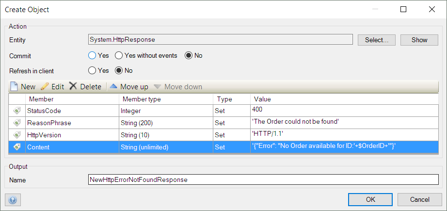

	The **Content** is filled with the following string: `'{"Error": "No Order available for ID:'+$OrderID+'"}'`.

	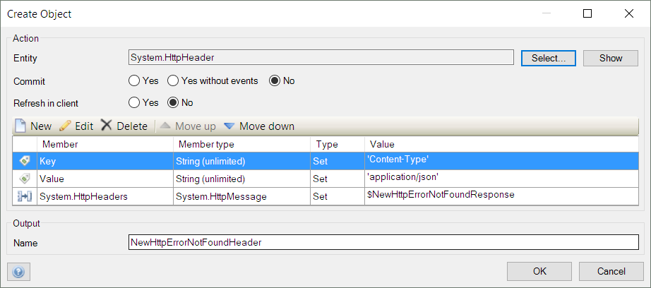

2. Configure the end activity to return the **NewHttpResponse**. The microflow should now look like this:

	

3. Test your new error responses as you did with the app in section [4.3 Viewing the App](#viewing).

# 6 Related Content

* For more information on creating published REST services in Mendix (including GET, POST, and DELETE operations), see [Published REST Services](/refguide/published-rest-services)
