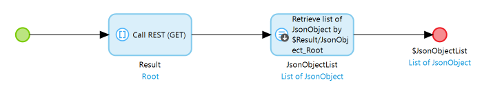
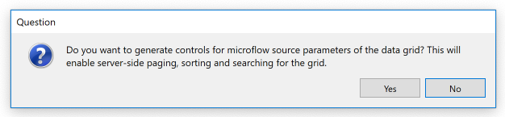
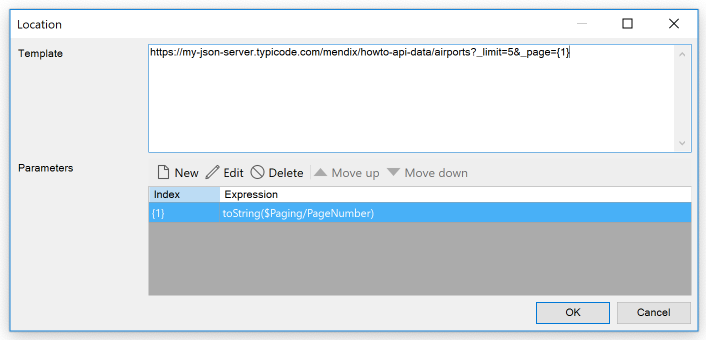
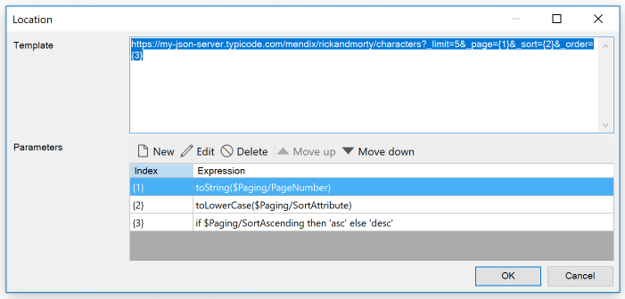
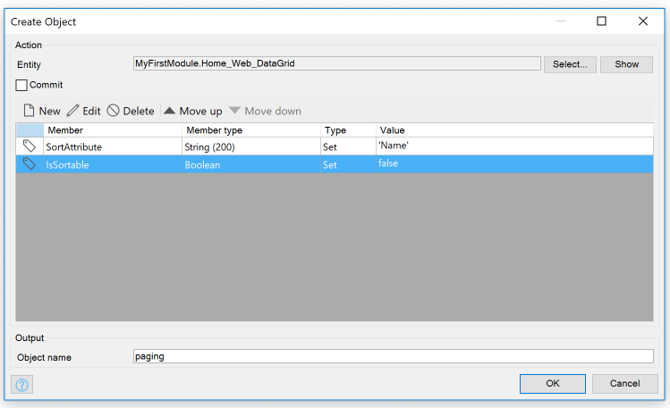

## 1 Introduction

It is often very useful to use the data grid with a microflow, for example, to retrieve data from another system. However, there was a big pain point here: when using a microflow as datasource you did not have the option to do sorting or paging, which is a much needed functionality for UX and performance.

This how-to will teach you how to create a data grid with a microflow data source which retrieves data from a REST service and add server-side paging and sorting to it.

## 2 Prerequisites

As we will be using a REST service to provide us with the data, you should know how to consume a REST service. If you are not familiar with that you can follow [this how-](../integration/consume-a-rest-service)to to get up to speed.

You will also need modeler version 8.2 or higher.

## 3 Create a microflow datasource

We will use a REST service which provides us with all the characters from the [Rick and Morty](https://www.rickandmorty.com/) cartoon. The REST service url is https://my-json-server.typicode.com/mendix/rickandmorty/characters and we can use this to create an JSON structure and import mapping for this REST service, if you need more information on how to do this you can read up on this in the  [“](../integration/consume-a-rest-service)[Consume a REST Service”](https://docs.mendix.com/howto/integration/consume-a-rest-service) how-to.

Once we have that set-up we can start calling the REST service from our microflow datasource. To create a microflow data source which returns a list of characters:

1. Create a new microflow.
2. From the **Toolbox**, drag a **Call REST service** activity onto the microflow and double-click it.
3. Press **Edit** to change the location **Template** field to `https://my-json-server.typicode.com/mendix/rickandmorty/characters`. Press **OK** to accept the change.
4. On the **Response** tab, set **Response handling** to **Apply import mapping.**
5. Press **Select** and select the import mapping you created.
6. For **Variable**, enter *Result.*. Press **OK** to accept the changes.
8. From the **Toolbox** drag the **Retrieve** activity onto the microflow and double-click it.
9. Click **Select** for the association and expand the **Result** variable, and select **JsonObject_Root (List of JsonObject)** association. Press **OK** to accept this association.
10. Right-click the **Retrieve** activity and select **Set $JsonObjectList as return value**.

## 4 Create a data grid with a microflow data source

In previous step we create a microflow which return a list of characters, we can now use this microflow as a datasource for a data grid

1. From the **Toolbox** drag the **Data grid** widget on a page.
2. Double-click the blue header of the newly placed data grid and go to the **Data source** tab.
3. Change the **Type** to **Microflow**. Press **Select** and select the microflow you created in previous step. Press **OK.** to accept the changes to the data source.
4. Studio Pro asks “Do you want to automatically fill the contents of the data grid?”, answer this question by clicking **Yes.**
5. Then Studio Pro asks “Do you want to generate controls for microflow source parameters of the data grid? This will enable server-side paging sorting and searching for the grid.”, answer this question by clicking **Yes.**

This will generate a data view around your data grid, creates the necessary widgets and nanoflows, and adds the **Paging** object as an input to your microflow. 

## 5 Adding paging support to the microflow datasource

In the previous step we added the **Paging** input parameter to your microflow. This parameter contains the **PageNumber** attribute which is updated when you navigate through the pages with the paging bar in the client.
In this step we will use this attribute to retrieve the correct page from the REST service instead of all the characters:

1. Open the the data source microflow.
2. Double-click the **Call REST service** activity, click **Edit** for the location and change **Template** to `https://my-json-server.typicode.com/mendix/rickandmorty/characters?_limit=5&_page={1}`
3. Click **New** for a new parameter and enter the following expression `toString($Paging/PageNumber)` for this parameter. Press **OK** to accept this expression.

4. Press **OK** to accept the changes for the location, and press **OK** once more to accept the changes for the **Call REST service** activity.

Deploy your app and navigate to the page where you added your data grid. You can now use your newly added server side paging by using the paging bar buttons above the data grid.

## 6 Adding server-side sorting support to the microflow data source

Now we have service-side paging for our data grid, but let's not stop there, let's also add server-side sorting to it as well.

Clicking the header on the data grid in the client will update the **Paging** entity by setting the attribute **SortAttribute** to the attribute which is associated to the header you clicked, and the **SortAscending** is set to **true** for ascending and **false** for a descending sort order. What we need to do is use these attributes when calling our REST service:

1. Open the data source microflow of the data grid.
2. Double-click the **Call REST Service** activity. Click **Edit** for the location and append `&_sort={2}&_order={3}` to the **Template**.
3. Click **New** to add the second parameter and enter the following expression `toLowerCase($Paging/SortAttribute)`. Press **OK** to accept this expression.
4. Click **New** to add the third parameter and enter the following expression `if $Paging/SortAscending then 'asc' else 'desc'`. Press **OK** to accept this expression.

5. Press **OK** to accept the changes in the location and press **OK** once more to accept the changes in the **Call REST service** activity.

Redeploy your app and navigate to the page where you added the data grid. Clicking the header of the columns shows your server-side sorting in action! 

### 6.1 Setting a default sort order

Sometimes you may want to set a default sort order, so that when the user has not clicked a header the data is shown in the default sort order:

1. Open the page containing the data grid.
2. Right-click on the data view surrounding the data grid and select **Go to data source nanoflow**.
3. Double-click on the **Create** activity. Click **New** to set the value for a member of the **Paging** entity.  Select **SortAttribute** from the member dropdown and set **Value** to `'Name'`.
Press **OK** to accept the changes to the member, and press **OK** once more to accept the changes to the **Create** activity.

Redeploy your app and navigate to the page where you added the data grid. The data will be shown ordered by **Name**.

### 6.2 Disabling server-side sorting

You might have a REST service which doesn't support sorting, or you don't want your users to be able to change the sort order. In that case you might want to disable the sort so that clicking the header doesn't have any effect at all:

1. Open the page containing the data grid.
2. Right-click on the data view surrounding the data grid and select **Go to data source nanoflow**.
3. Double-click on the **Create** activity. Click **New** to set the value for another member of the **Paging** entity. Select **IsSortable** from the member dropdown and set **Value** to **false.** 

Redeploy your app and navigate to the page where you added the data grid. The data will still be shown ordered by **Name**, but you can no longer change the sorting by clicking the header.

## 8 Read more
* [Consume a REST Service](consume-a-rest-service.md)
