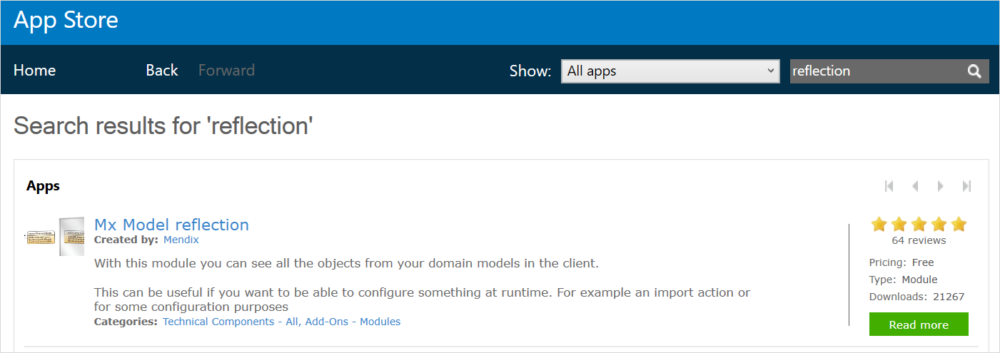
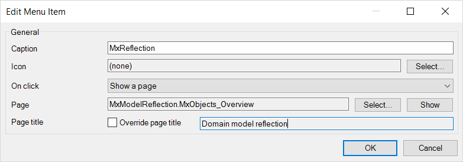
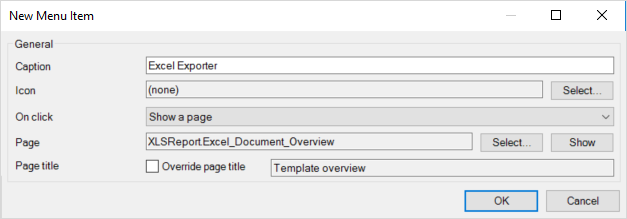
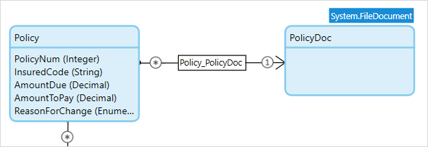
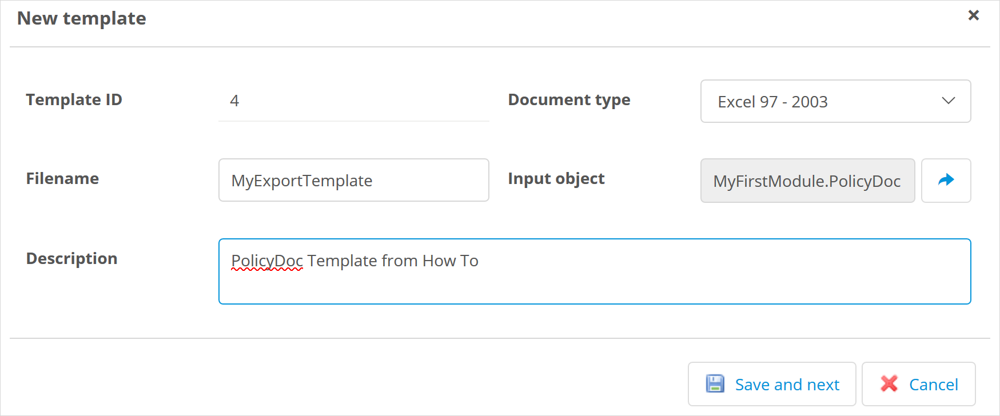
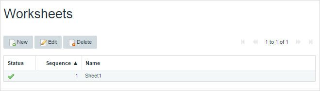
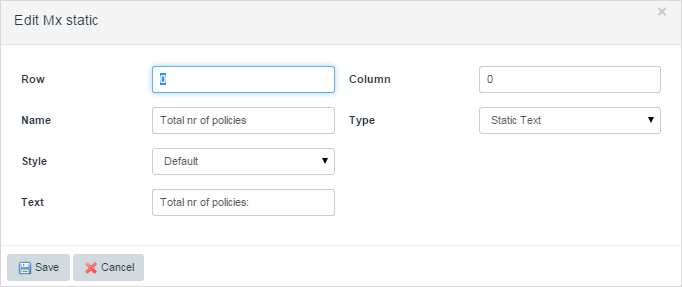
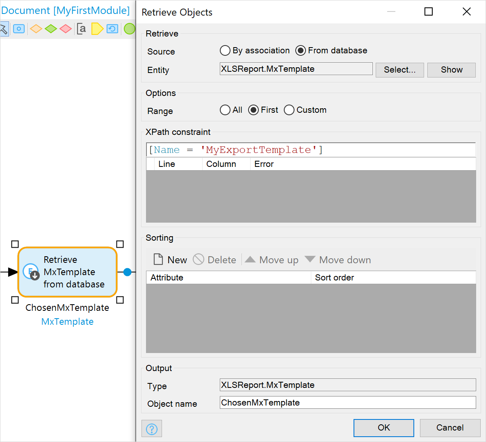
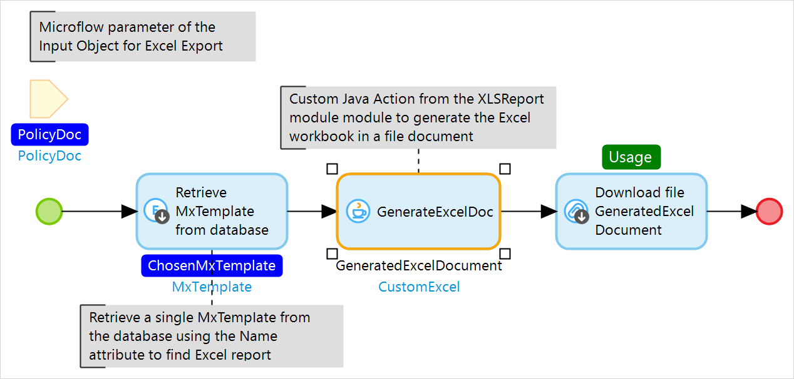

## 1 Introduction

It is standard Mendix functionality to export items from a data grid in a Mendix application to the Excel format via an **Export to Excel** button. However, in instances where more customized Excel documents are required, an app can leverage Mendix App Store content to create custom Excel documents based off of configurable templates. To achieve this, your app will require two Mendix App Store modules and the subsequent configuration of the documents.

## 2 Downloading the Required App Store Modules

In this section, you will learn how to download the necessary modules from the Mendix App Store. In just a few clicks, the modules will be imported into your app project. The modules required for this process are [Mx Model Reflection](/appstore/modules/model-reflection) and [Excel Exporter](/appstore/modules/excel-exporter).

{}
The Mx Model Reflection module is used in most Mendix apps. The purpose of this module is to enable the app to reflect into the domain model (entities and attributes) and microflow definitions at runtime.
{}

To download the modules, follow these steps:

1. Open the **Mendix App Store** from within Studio Pro.
2.  Search for the keyword *reflection* and select **Mx Model reflection**:

    

3. Click **Download** to include the module in your app project. It will be imported into **Project** > **App Store modules** in the **Project Explorer**.
4. Search for the keyword *Excel*, select **Excel exporter**, and download that module into your app project:

	
	
{}
Depending on the layout selected when the project was created, errors in Studio Pro may arise due to the new module's default layouts. To correct this, open each page that has an error and update the layout to the desired layout within the app.
{}

## 3 Adding Navigation Items to Allow Users to Configure Settings

In this section of the how-to, you will learn how to add the required pages in the app project's **Navigation** that are needed to configure both the Mx Model Reflection and the Excel Export templates that will be used within the app.

1.  In Studio Pro, open **Project** > **Navigation**.
2.  Add a new item to the Navigation to access **MxModelReflection.MxObjects_Overview**:

    

3.  Add a new item to the Navigation to access **XLSReport.Excel_Document_Overview**:

    

4.  Open **Project Security** and assign these two modules to the Administrator user role:

	

## 4 Creating an Input Object Entity

1.  In Studio Pro, open the domain model for your app project and add an entity to serve as a "master export" entity that is of specialization **FileDocument.**

2.  Create an association between the newly created entity and the entity(ies) that you will want to serve as a base for the Excel export.

    

## 5 Configuring Mx Model Reflection

In this section, you will learn how to run the Mx Model Reflection synchronization so the app can leverage the output from that process to create highly customizable Excel Export templates.

To run the MxModelReflection sync, run your app, view it, and follow these steps:

1.  Click the **MxReflection** navigation item to open the MxReflection overview page.
2.  Select each module the app needs to synchronize and click **Click to refresh**.
3.  Under **Synchronize all entities and microflows of checked modules on the left**, click **Click to refresh** .

## 6 Creating Excel Export Templates

In this section, you will learn how to create a basic Excel export template within your app. This section will cover an overview of the various configuration items to enable you to start building the desired templates.

{}
The Excel Exporter has many moving pieces that allow the configurations to be as simple or complex as the user desires. This how-to will go over the basics to get you started, but building the desired template will vary according to configuration options.		
{}

### 6.1 Configuring the Basic Template Setup

To set up a template, run your app, view it, and follow these steps:

1.  Click **Excel Exporter** to open the exporter overview page.
2.  Click the **New** to create a new template.
3.  Configure the **Filename** (without extension) to be the default file name when the template is used. This is the **Name** by which the template can be identified.

	{}The file name can always be changed when the template is used within a microflow.
	{}

4.  Configure the **Input Object** to be the file document entity that is associated to your entity to be exported.
5.  Provide a **Description** for identifying and documenting what this exact template is used for.

    

6.  Specify the **Date time export format** for how the dates and times should appear in the Excel file once exported.

### 6.2 Creating the Worksheet Layout

1.  Under the **Worksheets** section for the template, select **New** to create a new sheet template:

    

2.  Specify the **Name** that will be given to the sheet when the file is exported.
3.  Configure the **Row Object** that you want to export and set the reference to the template input object (if input object is used).
4.  Configure the **Start retrieved data at row** to set the ordinal number in which the data should be exported.

	{}This setting will possibly trim the result set being exported, as the export will go from this value to the end of the list of data
	{}

5.  Select if the export should export distinct only or allow duplicate data
6.  Specify the **Column default width** and **Row default height** (or leave them as defaults).
7.  Specify if the extract will **Use Static Data** or not.

	{}If static data is used, that will be configured below.
	{}

8.  Specify if the **Default text style** that will denote the pre-defined style to be applied to the exported data.
9.  Specify if the **Default header text style** that will denote the pre-defined style to be applied to the header data.

	{}Specifying styles are addressed in the section below.
	{}

### 6.3 Configuring the Dynamic Column Data

1. On the **Column Data tab**, select **New** to create a new export column:

	

2. The **Column number** will be set automatically, but can be overwritten to the desired ordinal number.
3. Define a **Name** for the column and specify if that **Name** should be the **Column Header** as well when exported.
4. Specify the **Retrieve type** to identify if this column will be an attribute or a reference.
5. Specify the **Select attribute** to identify the exact attribute on the row entity in which this column corresponds to.
6. Specify if the column should result in an aggregate. Note that  only types of decimal, integer, and long can be aggregated.

### 6.4 Configuring Static Data in the Sheet

1.  Open the **Static Data tab** and select **New** to create a new export column.

	

2.  Specify the **Row** and **Column** that the static value should be placed.
3.  Enter a name for the cell in the **Name** field.
4.  Specify the **Type** by selecting if the cell is **Static Text, Object Data, or Aggregate Function.** This example uses **Static Text** (which changes the **Name** field into **Excel Text** upon selection).
5.  Specify the **Style** that should be applied to the cell.

### 6.5 Configuring Custom Cell Formatting & Styling

1.  Back on the main page for your new template, click **New** in the **Styles** section to create a new style that can be applied to any of the data in the Excel export:

	

3.  Specify the properties of the style that will be applied to the cells. 
4.  Click **Save** to make the style available for dynamic columns, static columns, and headers.

## 7 Calling the Excel Export Module via Microflow

In this section, you will learn how to call the newly created Excel export template in your application. 

To retrieve the template and generate the document, follow these steps:

1. Create a microflow that either takes an inbound parameter of the object that needs to be exported, or retrieve that object into your microflow.

2. In the microflow, retrieve a single object which is the template you set up earlier to use for the export.

	

2.  In your microflow, call the **XLSReport.GenerateExcelDoc** Java action (available from the module's **JavaActions** folder) to pass the required objects to the module.

	

3.  In your microflow, download the resulting FileDocument object.

Your microflow should look similar to this:

## 8 Running the Microflow

There are two things missing now from the app.

1. There is no data to download.
2. There is no way to run the microflow.

### 8.1 Creating Data

To allow you to enter some data, you will need to generate some pages and then enter some data into them.

1. Right-click on the **PolicyDoc** entity in the domain model and select **Generate overview pages…**.
2. Select both **PolicyDoc** and **Policy** and click **OK**.
3. Link the generated overview page(s) into the app, either through the home page or the app navigation.
4. Run the app and enter some data to create **Policy** entity. You can link all, or some, of the Policy objects to a **PolicyDoc** object.

### 8.2 Running the microflow

To run the microflow you created above, you will need to create another microflow which is added to the navigation. This microflow can do one of the following things:

* Retrieve a **PolicyDoc** object which already has associations to **Policy** objects and pass this as the parameter to the microflow — this will export all the Policy objects you associated with the PolicyDoc when you entered the data
* Create a **PolicyDoc** object and associate it with existing **Policy** objects and pass this as the parameter to the microflow — this will export all the Policy objects you associated with the PolicyDoc in the microflow

{}
If you create a **PolicyDoc** with no associations to **Policy** objects, you will export an empty spreadsheet with the structure defined in the template.
{}

## 9 Read More

* [Import Excel Documents](importing-excel-documents)

