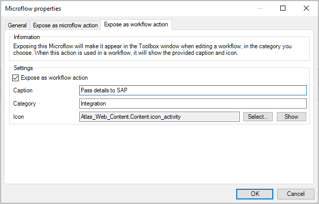
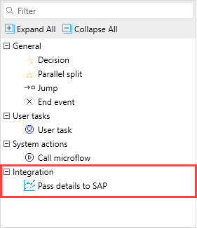

## 1 Introduction 

You can expose a microflow as a workflow action and add it to the workflow toolbox. This is particularly useful if you plan to reuse the microflow logic several times and turning it into a custom workflow action is a good alternative to using the [Call microflow](/refguide/call-microflow) action. There are the following advantages to having the custom workflow action: 

* It Makes logic more reusable.
* The workflow process is more visualized and understandable.
* It saves you time: dragging and dropping a ready-to-use action is faster than configuring the **Call microflow** action.  

**This how-to will teach you how to do the following:**

* Expose the microflow as the workflow action

## 2 Prerequisites

Before starting this how-to, make sure you have completed the following prerequisites:

* Familiarize yourself with workflow terms. For more information, see [Workflows](/refguide/workflows). 
* Your project has the following modules [Workflow Commons](https://marketplace.mendix.com/link/component/117066) and [Mendix SSO](https://marketplace.mendix.com/link/component/117212) modules. Fore more information on how to set up Workflow Commons in an existing app, see [Adding a Workflow to an Existing App: Setting Up the Basics](/refguide/workflow-setting-up-app).
* Install Atlas 3 from the Mendix Marketplace. As a result of installing Atlas 3, your app should contain the following modules that Workflow Commons depends on: Atlas_Core, Atlas_Web_Core_Content, and DataGrid.

## 3 Exposing the Microflow as the Workflow Action

For example, you have the Employee Onboarding process set up in your app. For more information on how to configure this process with workflows, see [How to Configure a Workflow in Studio Pro for the Employee Onboarding Process](workflow-how-to-configure). You have an integration with the SAP system and have a microflow called **ACT_SAP_PASS_DATA** that passed details to your HR system. To be able to quickly reuse the logic of this microflow in the Employee_Onboarding workflow and other workflows, do the following:

1. Open the microflow.

2. Right-click the working area of the microflow and select **Properties**.

3. In the **Microflow properties** dialog box, open the **Expose as workflow action** tab.

4. Select the **Expose as workflow action** check-box:

    

5. The properties for the new workflow action appear. Do the following:

    1. Set the **Caption** to **Pass details to SAP**.

    2. Set **Category** to **Integration**.

    3. Set Icon to **icon_activity**:

        

6. Click **OK**.

Good job! You have configured the custom workflow action.

## 4 Using the Custom Action in Workflows

Now that you have exposed the microflow as the custom workflow action, you can use it directly from the workflow toolbox. Do the following:

1. Open the Employee_Onboarding workflow.

2. Open the **Toolbox** and find the newly created **Integration** category there > the **Pass details to SAP** action:

    

3. Drag and drop the action to the workflow.

Congratulations! You have turned the microflow into the custom workflow action and can easily use it in the workflow editor.

## 5 Read More

* [How to Configure a Workflow in Studio Pro for the Employee Onboarding Process](workflow-how-to-configure)
* [Microflow Properties](/refguide/microflow)
* [Adding a Workflow to an Existing App: Setting Up the Basics](/refguide/workflow-setting-up-app)