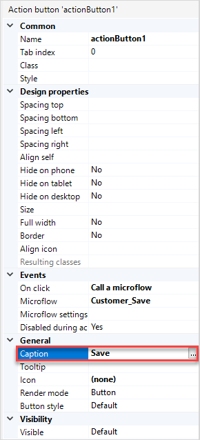
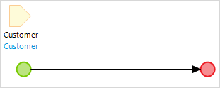

## 1 Introduction

Mendix uses visual models called microflows to define the logic of your application. A microflow is a visual way of expressing what traditionally would be written in code. This how-to explains how you can create a custom save button on a detail page using a microflow. You will replace a default save button with the save button that shows a message to end-users after they click it. 

**This how-to will teach you how to do the following:**

* Recreate the logic of the default **Save** button
* Create a custom **Save** button

## 2 Prerequisites

Before starting with this how-to, make sure you have completed the following prerequisites:

* Create a basic data layer (for details, see [How to Create a Basic Data Layer](/howto/data-models/create-a-basic-data-layer))
* Create overview and detail pages for the customer object (for details, see [How to Create Your First Two Overview & Detail Pages](/howto/front-end/create-your-first-two-overview-and-detail-pages))
* Create a menu item to access the customer overview page (for details, see [How to Set Up the Navigation Structure](/howto/general/setting-up-the-navigation-structure))

## 3 Replacing the Default Save Button with a Custom One

To replace the default **Save** button with a custom one, follow these steps:

1.  Open the **Customer_Detail** page:

    

2. Select the **Save** button press <kbd>Delete</kbd> to remove it.

3. Right-click the drop-zone under the **Cancel** button, select **Add widget**, and then select **Call microflow button**.

4.  In the **Select Microflow** dialog box, click **New** to create a new microflow. called **Customer_Save**.

    

5. After the button is created, open its **Properties** pane.

6. Change the **Caption** property to *Save*:

    

7. Set a floppy disk as the **Icon**:

    

You have created a button that calls a microflow.

## 4 Recreating the Default Save Behavior

You need to recreate the default Save behavior to customize it afterwards. Do the following:

1.  Right-click the new **Microflow** button and select **Go to microflow** to open the new microflow. The microflow should look like the one below:
    
    

2. Open the **Toolbox** and select the **Commit object(s)** activity there:

    

3. Drag a **Commit object(s)** action from the **Toolbox** to the flow between the start and end events.
4.  Double-click the **Commit object(s)** activity to open its properties.

5.  In the **Input** section, select **Customer** for **Object or List**, and click **OK**:
    
    

6.  Open the **Toolbox**, find the **Close page** activity there, and drag and drop it to the flow after the **Commit object(s)** activity:

    

You have recreated the default **Save** button logic.

## 5 Extending the Microflow with Your Own Functionality

To extend the logic with a custom message that will be shown when end-users click the button, do the following:

1. Open **Toolbox**, find the **Show message** activity, and drag and drop it after the **Close page** activity.

2.  Double-click the new activity to open its properties.

3. In the **Template** property enter a text that will be displayed in the message. Type in *Customer is saved!* 

    

4. Click **OK** to save the changes. 

Congratulations! You have created a microflow and customized the **Save** button: 

   

## 6 Read More

* [Define Access Rules Using XPath](define-access-rules-using-xpath)
* [Work With Lists in a Microflow](working-with-lists-in-a-microflow)
* [Configure Error Handling](set-up-error-handling)
* [Optimize Microflow Aggregates](optimizing-microflow-aggregates)
* [Extract & Use Sub-Microflows](extract-and-use-sub-microflows)
* [Microflow Activities](/refguide/activities)
