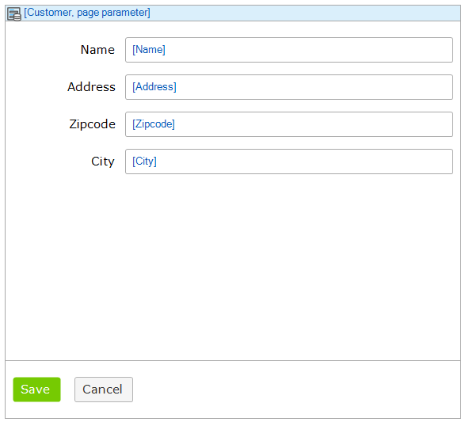
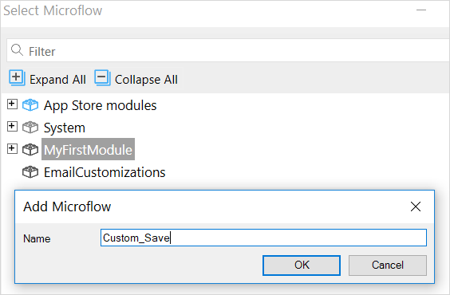
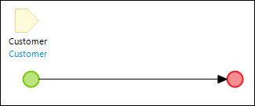
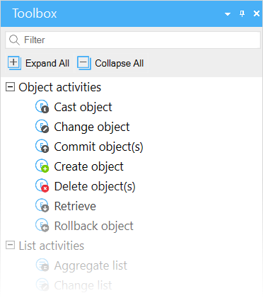
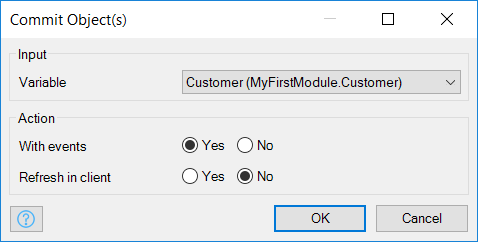
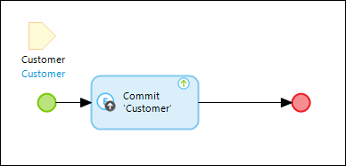
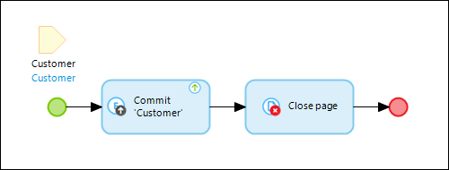
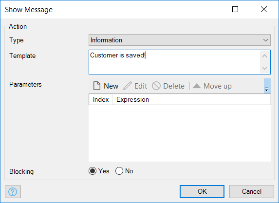
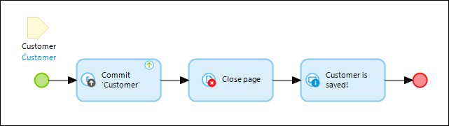

## 1 Introduction

Mendix uses visual models called microflows to define the logic of your application. A microflow is a visual way of expressing what traditionally would be written in code. This how-to explains how you can create a custom save button on a detail page by utilizing microflows.

**This how-to will teach you how to do the following:**

* Create a custom Save button

## 2 Prerequisites

Before starting with this how-to, make sure you have completed the following prerequisites:

* Create a basic data layer (for details, see [How to Create a Basic Data Layer](../data-models/create-a-basic-data-layer))
* Create overview and detail pages for the customer object (for details, see [How to Create Your First Two Overview & Detail Pages](../front-end/create-your-first-two-overview-and-detail-pages))
* Create a menu item to access the customer overview page (for details, see [How to Set Up the Navigation Structure](../general/setting-up-the-navigation-structure))

## 3 Replacing the Default Save Button with a Custom Save Button

To replace the default Save button with a custom one, follow these steps:

1.  Open the **Customer** detail page, which should look like this:

    

2. Right-click the **Save** button and remove it by selecting **Delete**.
3. Right-click the drop-zone under the **Cancel**, select **Add widget**, and then select **Call microflow button**.
4.  In the **Select Microflow** dialog box, click **New** to create a new microflow called **Customer_Save**.

    

5. After the button is created, double-click it to open its properties editor.
6. Change the **Caption** to *Save*.
7.  Change the **Icon** to an image of your choice.

    

8. Click **OK** to save the new microflow button.

## 4 Re-creating the Default Save Behavior

1.  Right-click the new **Microflow** button and select **Go to microflow** to open the new microflow. The Microflow should look like this:
    
    

2. Open the **Toolbox** from the bottom-right corner of Studio Pro:

    

3. Drag a **Commit object(s)** action from the **Toolbox** to the line between the green start and red end events, which will insert a commit action activity.
4.  Double-click the new activity to open its properties:

    

5.  In the **Input** section, select **Customer** for **Object or List** and click **OK**. The microflow should now look like this:
    
    

6.  Drag a **Close page** action from the **Toolbox** to the line between the green start and red end events, which will insert a close page action activity. You have now re-created the default save behavior, and the m should look like this:

    

## 5 Extending the Microflow with Your Own Functionality

1. Drag a **Show message** action from the **Toolbox** to the line between the start and end events, which will insert a show message activity.
2.  Double-click the new activity to open its properties:

    

3. Select the **Type** of message.
4. Enter a message as a **Template** value.
5.  Click **OK** to save the properties. The microflow should now look like this:

    

## 6 Read More

* [Define Access Rules Using XPath](define-access-rules-using-xpath)
* [Trigger Logic Using Microflows](triggering-logic-using-microflows)
* [Extend Your Application with Custom Java](extending-your-application-with-custom-java)
* [Work With Lists in a Microflow](working-with-lists-in-a-microflow)
* [Optimize Retrieve Activities](optimizing-retrieve-activities)
* [Configure Error Handling](set-up-error-handling)
* [Optimize Microflow Aggregates](optimizing-microflow-aggregates)
* [Extract & Use Sub-Microflows](extract-and-use-sub-microflows)
* [Button Widgets](/refguide/button-widgets)
* [Microflow Activities](/refguide/activities)
