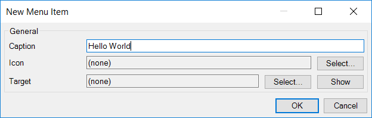
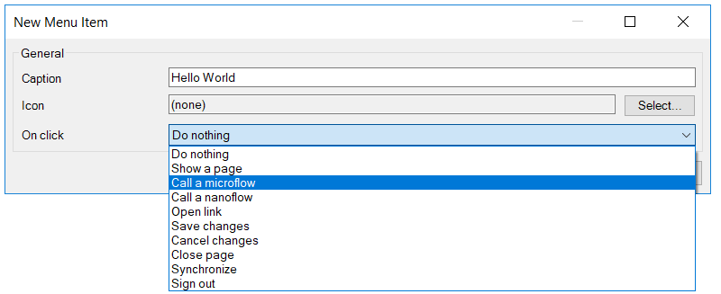
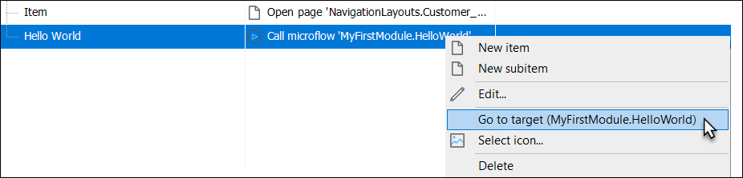
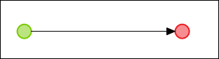
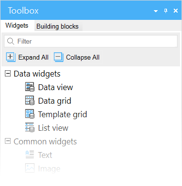
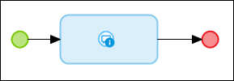
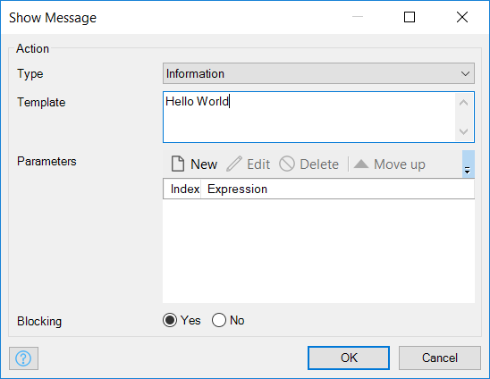

## 1 Introduction

Mendix uses visual models called microflows to define the logic of your application. Microflows are visual ways of expressing what traditionally would be written in code. This how-to explains how you can create a very simple "Hello World" microflow.

**This how-to will teach you how to do the following:**

* Create a menu item
* Create and edit a microflow

## 2 Creating a Menu Item

Microflows can be triggered in many different ways (for details, see [Trigger Logic Using Microflows](triggering-logic-using-microflows)). For this how-to, you'll be using a menu item to trigger the new microflow.

To create a menu item, follow these steps:

1.  Open the **Navigation** editor, add a menu item in the desktop navigation settings, and enter the caption of *Hello World*:

    

2.  Click **Select...** in the **Target** section of the **New Menu Item** dialog box to open the **Select Navigation Target** pop-up window:

3.  For **On click**, select **Call a microflow**:

    

4.  In the **Select Microflow** dialog box, select a microflow and then click **New**:

    

5. Enter *HelloWorld* for the **Name** of the new microflow.
6. Save the new menu item by clicking **OK**.

## 3 Editing the New Microflow

To edit the new microflow, follow these steps:

1.  Open the new microflow by right-clicking the new menu item created in [2 Creating a Menu Item](#CreatingaMenuItem) and selecting **Go to target** from the context menu:

    

    You will see an empty microflow like this:

    

2.  Open the **Toolbox** in the bottom-right corner of Studio Pro:
    
    

3.  Drag a **Show message** action from the **Toolbox** to the line between the green start even and red end event, which will insert a show message activity:

    

4. Double-click the message activity to open the **Show Message** properties editor.
5.  Enter *Hello World* for the **Template** value and click **OK**:

    

6.  Click **Run Locally** and then **View** to see the application in your default browser.
7. Locate the new navigation item in the menu bar and click it to see the message.

## 4 Read More

* [Define Access Rules Using XPath](define-access-rules-using-xpath)
* [Trigger Logic Using Microflows](triggering-logic-using-microflows)
* [Create a Custom Save Button](create-a-custom-save-button)
* [Extend Your Application with Custom Java](extending-your-application-with-custom-java)
* [Work with Lists in a Microflow](working-with-lists-in-a-microflow)
* [Optimize the Retrieve Activities](optimizing-retrieve-activities)
* [Configure Error Handling](set-up-error-handling)
* [Optimize Microflow Aggregates](optimizing-microflow-aggregates)
* [Extract and Use Sub-Microflows](extract-and-use-sub-microflows)
