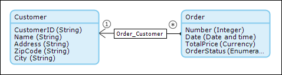
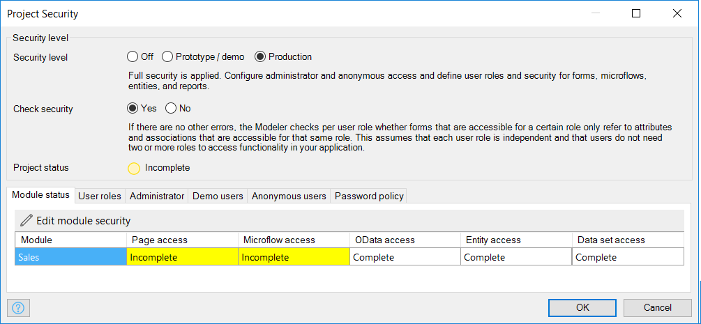
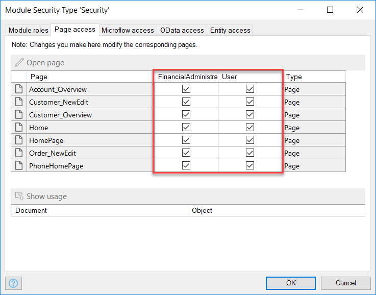
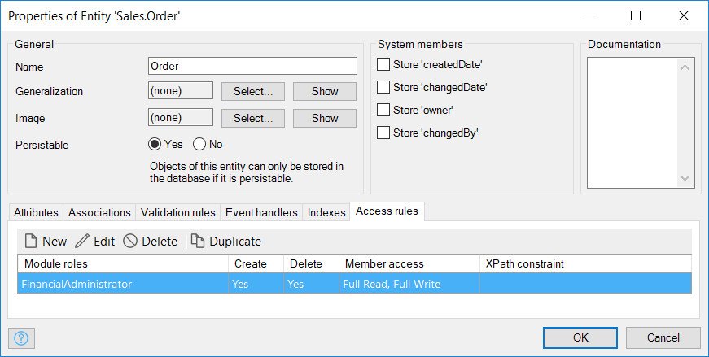
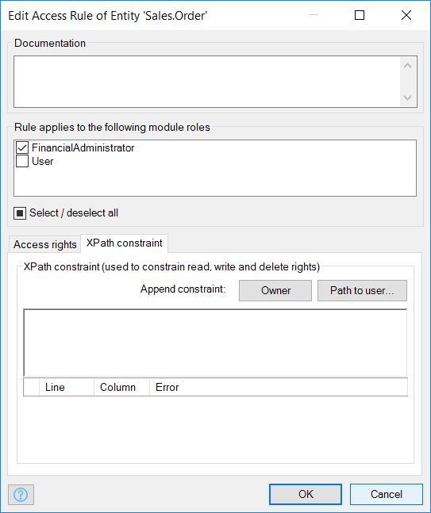
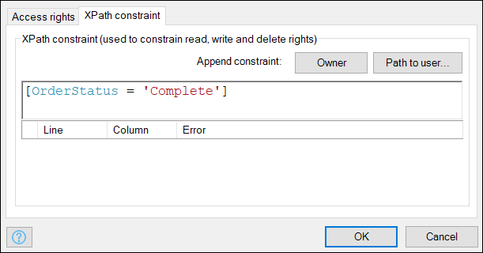

## 1 Introduction

The access rules of an entity define what a user is allowed to do with the objects of the entity. Users can be allowed to create and/or delete objects and to view and/or edit member values. A member is an attribute or an association of an entity. Furthermore, the set of objects available for viewing, editing, and removing can be limited by means of an XPath constraint (for details, see [XPath Constraints](/refguide7/xpath-constraints) in the Mendix Reference Guide). For more information on access rules, see [Access Rules](/refguide7/access-rules) in the Mendix Reference Guide.

In this how-to, you will prepare a data structure (including security), a GUI, and some example data for customers, orders, and a financial administrator account. After this preparation, you will define the access rules for the Order entity using XPath on the payment status. The XPath will constrain the order so it can only be seen by a financial administrator when the payment status of the order is set to "paid."

**This how-to will teach you how to do the following:**

* Define access rules for an entity using XPath

## 2 Preparing the Data Structure, GUI, and Example Data

The access rules used in this how-to contain customer and order data. To define the access rules, you first need to set up the data structure, user roles, and GUI to maintain customer and order data. For details on how to create a data structure and GUI, see [How to Create and Deploy Your First App](../modeling-basics/create-and-deploy-your-first-app).

To prepare the data structure, GUI, and example data, follow these steps:

1. Create the following domain model:

    

    For more information on creating a domain model, see [How to Create a Basic Data Layer](../data-models/create-a-basic-data-layer).
2. Create overview and detail pages to manage the Customer and Order objects (for more information on creating these pages, see [How To Create Your First Two Overview and Detail Pages](../ux/create-your-first-two-overview-and-detail-pages)).
3. Create menu items to access the Order and Customer overview pages (for more information on creating menu items, see [How to Set Up the Navigation Structure](../ux/setting-up-the-navigation-structure)).
4. Set the **Security level** of you application to **Production** (for more information, see [How to Create a Secure App](../security/create-a-secure-app)).

    
    
5. Enter *FinancialAdministrator* for the **Name** of the new user role on the **User roles** tab (for more information on adding roles, see [How to Create a Secure App](../security/create-a-secure-app):

    
6. Give both module roles access to all your created pages, and create separate read and write access rights to all your created entities (for more information on how to set the entity access, see [How to Create a Secure App](../security/create-a-secure-app)):

    

    

7. Add the following customer data to your app:

    
8. Add the following order data to your app:

    
9. Add an account to your application with the user role *FinancialAdministrator*:

    

## 3 Defining the Access Rules on the Order Entity Using XPAth

In the previous section, you set up a basic data structure and created some sample data. In this section, you you will define the access rules on the Order entity so that orders can only be viewed by a financial administrator if the payment status of the order is set to "Complete." You will do this by adding an XPath constraint to the Order entity for the FinancialAdministrator module role.

To define the access rules on the Order entity using XPath, follow these steps:

1.  Open the **Access rules** tab for the **Order** entity:

    

2.  Double-click the **FinancialAdministrator** module role to open its properties and go to the **XPath constraint** tab:

    
    
3.  To constrain the access of the financial administrator to only "Complete" orders, add the following **XPath**:

    

4. Click **OK** and re-deploy your application.
5.  When you log in with the **Financial Administrator** account, you will see that only completed orders are shown in the orders overview:

    

## 4 Related Content

* [How to Trigger Logic Using Microflows](triggering-logic-using-microflows)
* [How to Create a Custom Save Button](create-a-custom-save-button)
* [How to Extend Your Application with Custom Java](extending-your-application-with-custom-java)
* [How to Work with Lists in a Microflow](working-with-lists-in-a-microflow)
* [How to Optimize Retrieve Activities](optimizing-retrieve-activities)
* [How to Configure Error Handling](set-up-error-handling)
* [How to Optimize Microflow Aggregates](optimizing-microflow-aggregates)
* [How to Extract and Use Sub Microflows](extract-and-use-sub-microflows)
