## 1 Introduction

Most application logic can be developed using microflows. Microflows are very powerful and contain a lot of the features that you need in every application. To prevent you from getting stuck due to a missing feature, Mendix microflows are extendable. So, whenever you feel something is missing, you can add it yourself with the use of Java actions. 

**This how-to will teach you how to do the following:**

* Extend your application with custom Java code

## 2 Prerequisites

Before starting this how-to, make sure you have completed the following prerequisites:

* Read [How to Create and Deploy Your First App](../modeling-basics/create-and-deploy-your-first-app)
* You need Eclipse: download it [here](https://eclipse.org/)

{}

You can use any text editor to create custom Java actions, but we highly recommend using Eclipse. The Modeler contains a **Deploy for Eclipse** feature verifying that everything that needs to be configured in Eclipse is done automatically. All you have to do is import the project into your Eclipse working environment.

{}

## 3 Adding Java Actions in the Modeler

1. Right-click the **MyFirstModule** module and select **Add** > **Resources** > **Java action**.
2. Enter *ReverseCustomerName* for the **Name** of the new Java action and click **OK**:

    

3.  In the **Java Action** wizard, click **Add** to add a parameter and do the following:</br>

    1. Enter *inputCustomer* for the **Name** of the new parameter</br>
    2. Select **Object** as type.</br>
    3. Click **Select...** for **Entity** and select **MyFirstModule.Customer** as the object type.</br>
    4. Click **OK**.</br>

    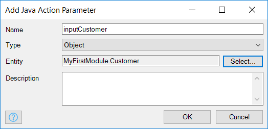

4. Back on the **Java Action** wizard, change the return type of the Java action to **String** and click **OK** to save the Java action:

    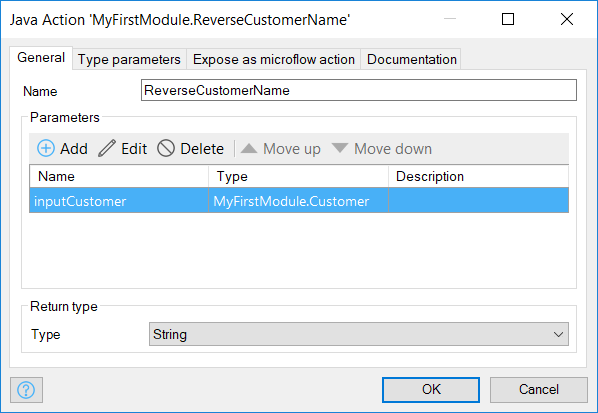

5. Select **Project** > **Deploy for Eclipse** in the Modeler:

    

## 4 Editing the Java Action in Eclipse

To edit the Java action in Eclipse, follow these steps:

1. Open **Eclipse** and right-click somewhere in the **Package Explorer**.
2. Select **Import...** from the menu:

    

3. In the **Import** window, select **Existing Projects into Workspace** and click **Next**:

    

4. Set the project directory as the root directory for this project and click **Finish**:

    

    If you don't know what the project directory is, select **Project** > **Show Project Directory in Explorer** in the Modeler:

    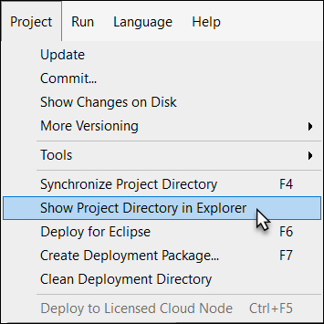

5. Double-click **ReverseCustomerName.java** in the **Package Explorer** of Eclipse:

    

    In the Java code, there is a placeholder marked with `//BEGIN USER CODE` and `//END USER CODE` comment statements. This is where you can add your own Java code. The modeler will never overwrite the code between those two statements.

    

    As you can see, the Modeler generated a variable for the input customer object name `inputCustomer`. You can use that variable to get the name of the customer and reverse it like this:

    ```java
    String customerName = this.inputCustomer.getName(this.getContext());
    return new StringBuilder(customerName).reverse().toString();
    ```

6. Insert the above code between the `//BEGIN USER CODE` and `//END USER CODE` comment statements. It should look like this:

    

7. Save the Java action in Eclipse:

    

## 5 Calling the Java Action from a Microflow

1. Open the Modeler and locate the **Customer_Overview** page.
2. Right-click and add a new **Action** button to the control bar of the data grid and change the caption to *Reverse Name*:

    

3. Double-click the new **Action** button and in the **Edit Action Button** dialog box, set **On click** to **Call a microflow**:

    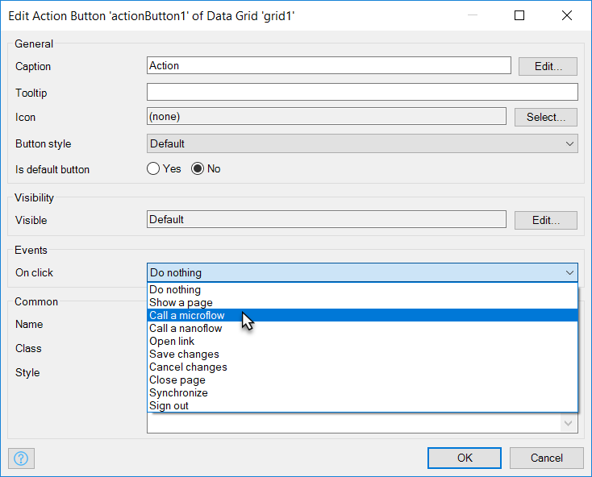
4. In the **Select Microflow** dialog box, click **New** to create a new microflow.
5. Enter *Customer_ReverseName* for the **Name** of the new microflow and click **OK**:

    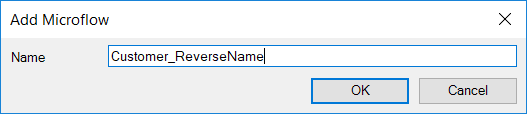

6. Back on the **Edit Action Button** dialog box, click **Show** next to **Microflow** to open the new microflow, which should look like this:

    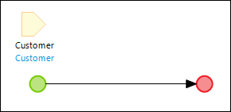

7. Drag the **ReverseCustomerName** Java action from the **Project Explorer** onto the line between the green start event and red end event. This generates a Java action activity:

    

8. Double-click the generated activity to open the **Call Java Action** properties editor, and then click **Edit** for the first input to open the argument editor:

    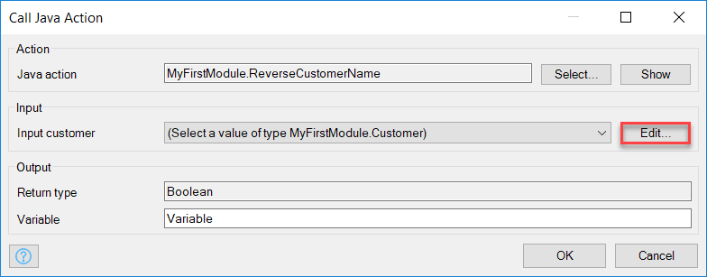

9. Press and hold the <kbd>Ctrl</kbd> key and then press the spacebar to open the code completion editor.
10. Select **$Customer (MyFirstModule.Customer)**:

    

11. Click **OK** to save the expression.
12. In the **Call Java Action** window, change the output **Variable** to *ReversedName*:

    

13. Click **OK** to save the properties. The microflow should now look like this:

    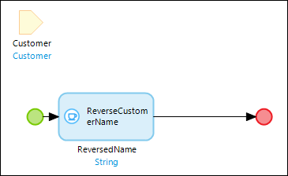

14. Open the **Toolbox** from the bottom-right corner of the Modeler:

    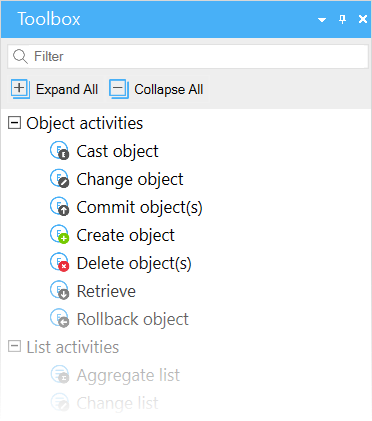

15. Drag a **Show message** activity from the **Toolbox** to the line between the green start and red end event.
16. Double-click the activity to open the **Show Message** properties editor.
17. Enter *Reversed name: {1}* for **Template**:

    

18. Click the **New** button to add a new parameter to open the expression editor.
19. Select **$ReversedName (String)**, which is the output variable of the Java action:

    

20. Click **OK** to save the parameter. The show message activity properties should now look like this:

    

21. Click **OK** to save the show message activity. The microflow should now look like this:

    

## 6 Deploying and Seeing the Results

1. Click **Run** to deploy the application to the cloud. The Modeler automatically commits the changes to Team Server for version control.

    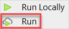

2.  As soon as the deployment process is completed, click **View** to open the application in your browser:

    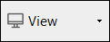

3.  Open the customers overview, select a row, and click **Reverse Name**. You should now see a message pop-up window with the reversed customer name.

## 7 Related Content

* [How to Define Access Rules Using XPath](define-access-rules-using-xpath)
* [How to Trigger Logic Using Microflows](triggering-logic-using-microflows)
* [How to Create a Custom Save Button](create-a-custom-save-button)
* [How to Work with Lists in a Microflow](working-with-lists-in-a-microflow)
* [How to Optimize Retrieve Activities](optimizing-retrieve-activities)
* [How to Set Up Error Handling](set-up-error-handling)
* [How to Optimize Microflow Aggregates](optimizing-microflow-aggregates)
* [How to Extract and Use Sub Microflows](extract-and-use-sub-microflows)
