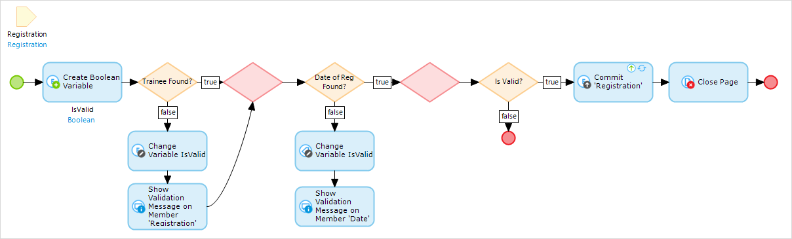
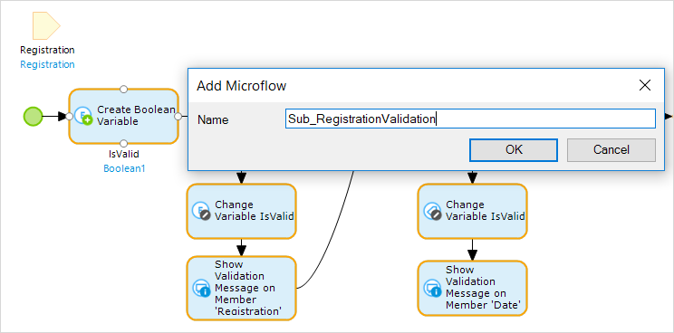
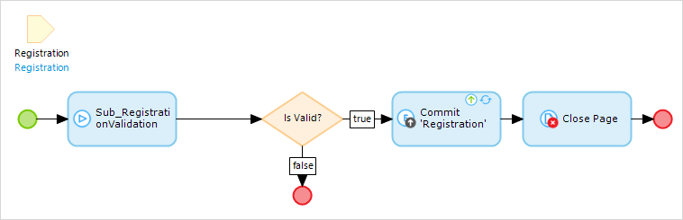
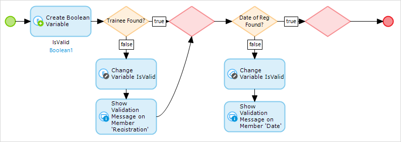

## 1 Introduction

When you are building large microflows that span multiple functions, the best practice is to break down the large microflow into more manageable parts based on those functions. To better manage your logic, you can create sub microflows. 

**This how-to will teach you how to do the following:**

* Extract sub microflows
* Use sub microflows
* Troubleshoot extractions of sub microflows

## 2 Prerequisites

None.

## 3 When to Use Sub Microflows

### 3.1 First Example

The first example of using sub microflows is when you are doing a large data import. If you are creating a microflow that imports data into the system, there are usually different parts to the process. The first part can be data validation. An example of data validation is checking if the values are empty. If the values are empty, then you might not want to import the data, or you might want the application to throw an error.

Once the data is validated, you import and map it into your Mendix domain model. This is a separate action within the data import. It is ideal to do all the validations at the beginning of the imported microflow and to do all the mapping at the end.

You can break down the validation and mapping into sub microflows to better manage the logic. Furthermore, if you need to reuse the validation during the import at other steps in the application, you can reuse the sub microflow.

### 3.2 Second Example

The second example of using sub microflows is when you are doing data validation and saving an object to the database. The example in [4 How to Use Sub Microflows](#HowtoUseSubMicroflows) will cover in detail how to use a sub microflow for validation.

### 3.3 Other Examples

There are many other examples of when it is useful to create sub microflows. The goal is to reuse sub microflows to condense your logic. Feel free to use sub microflows whenever you see the need for it.

## 4 How to Use Sub Microflows

The following example microflow checks to see if a registration has a trainee assigned and a registration date. If the registration passes both of these checks, the registration is committed to the database.

In this scenario, it makes sense to create a sub microflow for the validation steps. If you do this, you can reuse this sub microflow in other microflows where you need to validate a registration again.

To create a sub microflow for the validation steps, follow these steps:

1. Select the area you want to capture and use as a sub microflow:

    

2. Right-click an item in the selection and select **Extract sub microflow...**:

    

3. Enter a name for the sub microflow:

    

    {}

    The best practice is to identify sub microflows by their name. You can use "Sub_MicroflowDescriptionHere", "Subflow_MicrocflowDescriptionHere", or any other notation you feel works best. The key is to be consistent when you name your microflows so that it is easy for other team members to understand and find the microflows they need.

    {}
4. Click **OK** to create your first sub microflow:

    

5. Open the sub microflow by right-clicking the **Sub_RegistrationValidation** microflow and selecting **Go To microflow**:

    

The new sub microflow wil do the registration validation. You can reuse this sub microflow whenever you need to do a registration validation. 

## 5 Troubleshooting Extractions of Sub Microflows

If you get errors, this usually means you have not provided the right input or output parameters. Check your parameters and make sure that they are configured properly. 

In addition, make sure you have highlighted the correct activities that you want to turn into a sub microflow.

## 6 Conclusion

The extra sub microflow option is based on the Mendix reusability principle. You can reuse any sub microflows in other parts in the application. Furthermore, when you have very large and complex microflows, using sub microflows can help you break down and better manage your logic and business processes. 

## 7 Related Content

* [How to Define Access Rules Using XPath](define-access-rules-using-xpath)
* [How to Trigger Logic Using Microflows](triggering-logic-using-microflows)
* [How to Create a Custom Save Button](create-a-custom-save-button)
* [How to Extend Your Application with Custom Java](extending-your-application-with-custom-java)
* [How to Work with Lists in a Microflow](working-with-lists-in-a-microflow)
* [How to Optimize Retrieve Activities](optimizing-retrieve-activities)
* [How to Set Up Error Handling](set-up-error-handling)
* [How to Optimize Microflow Aggregates](optimizing-microflow-aggregates)
* [Microflows](/refguide7/microflows)
