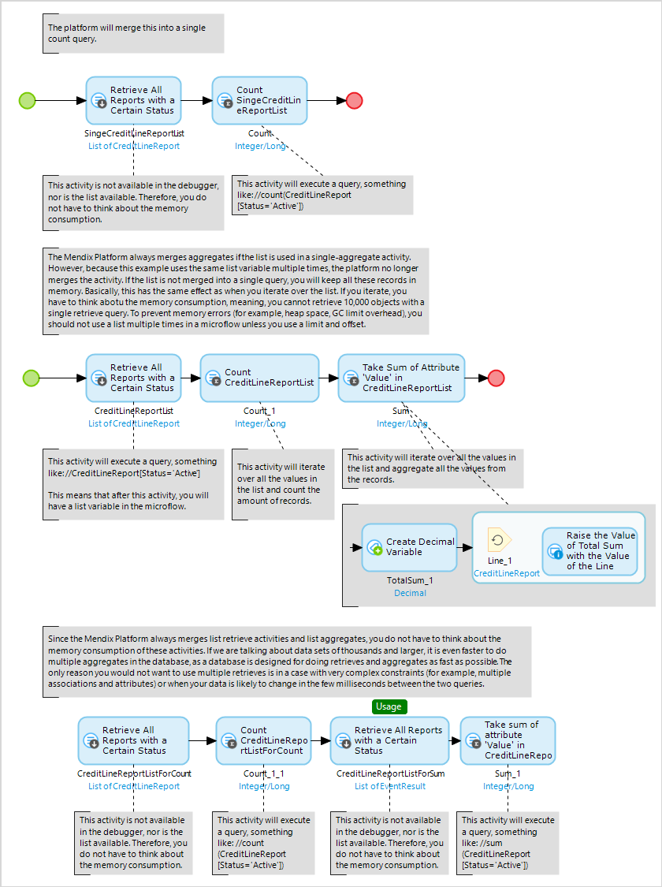

In some projects, it is necessary to evaluate large datasets in a microflow (for example, for reporting purposes). If all those microflows do a lot of retrieves and aggregates on large datasets, it is easy to run into performance or memory problems. 

When a database retrieve activity is only used in list aggregate activities, the platform can automatically merge these two activities into a single action. This executes a single aggregate query on the database. So, if you retrieve all 100k log lines from a database and only do a count on the list, you don’t receive a heap space, because the microflow would never place all 100k records in the memory. However, if you reuse the same list variable for multiple list aggregates, this no longer applies.

Apparently the platform only merges the activities together as long as a list is only used for one single aggregate. So as soon as you start reusing the list variable anywhere, you can end up with memory issues.

The next time you want to do multiple aggregates on the same list variable, just create two separate retrieve activities. You will then prevent memory errors and the speed process will also improve.

## Related Content

* [How to Define Access Rules Using XPath](define-access-rules-using-xpath)
* [How to Extend Your Application with Custom Java](extending-your-application-with-custom-java)
* [How to Work with Lists in a Microflow](working-with-lists-in-a-microflow)
* [How to Trigger Logic Using Microflows](triggering-logic-using-microflows)
* [How to Create a Custom Save Button](create-a-custom-save-button)
* [How to Optimize Retrieve Activities](optimizing-retrieve-activities)
* [How to Configure Error Handling](set-up-error-handling)
* [How to Optimize Microflow Aggregates](optimizing-microflow-aggregates)
* [How to Extract and Use Sub Microflows](extract-and-use-sub-microflows)
