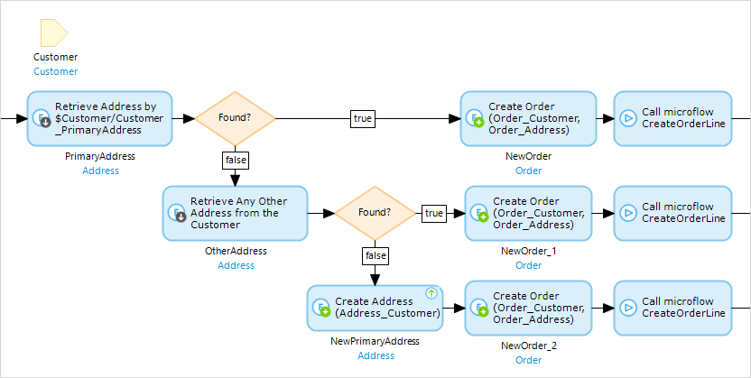
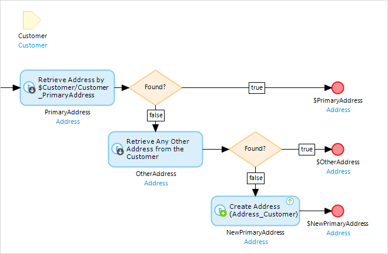
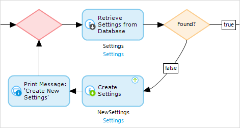

## 1 Introduction

Often in processes you need to retrieve objects in order to complete the process. But what if those objects cannot be found? Usually additional actions are required, but since the objects you retrieve and create are assigned different variable names, sometimes you cannot merge them back into a single flow.

**This how-to will teach you how to do the following:**

* Find and create objects to continue your process
* Retrieve an instance of an object

## 2 Finding and Creating Objects to Continue Your Process

A common example is shown below in which creating an order needs to be associated with the customer and its primary address. This example ends up in three different flows and cannot be merged back into the main flow, because that causes the **OtherAddress** or **NewPrimaryAddress** to be unreachable. 

Preventing the creation of the same objects multiple times on different places causes a lot of unnecessary maintenance. One solution for this is to copy the logic (partially) into a sub-microflow (as shown in the example), but this doesn't make it easier to read.

You can easily work around this by using a sub-microflow at a different place. In order to avoid making exceptions in your microflow for the default behavior, do not put the standard logic in a sub microflow that is difficult to read (because of one exception earlier in the process). Since we got to this point because of an exception, it makes the most sense to solve this problem by altering the exception and changing it so that it fits in our standard flow.

The easiest way to implement this is to move all the logic for acquiring the primary address into a sub-microflow. This way, all the logic acquired after getting the address only needs to be specified once, and the microflow is still easily readable. 

The **GetCustomerPrimaryAddress** sub-microflow contains the same logic as the original example, except this way there is only one result: the correct primary address.

## 3 Retrieving an Instance of an Object

Sometimes you need to have a specific instance of an object, and building a sub-flow for just one retrieve-and-create seems like too much work. An alternative is to build your own loop, which allows you to have one main flow but still be able to find and create objects during this process.

However, there is the risk of creating an infinite loop if the retrieve applies a constraint that is not set correctly during the create. So, always be sure to print a log message so that you can easily identify any problems in your design.

## 4 Related Content

* [How to Define Access Rules Using XPath](define-access-rules-using-xpath)
* [How to Extend Your Application with Custom Java](extending-your-application-with-custom-java)
* [How to Work with Lists in a Microflow](working-with-lists-in-a-microflow)
* [How to Trigger Logic Using Microflows](triggering-logic-using-microflows)
* [How to Create a Custom Save Button](create-a-custom-save-button)
* [How to Optimize Retrieve Activities](optimizing-retrieve-activities)
* [How to Configure Error Handling](set-up-error-handling)
* [How to Optimize Microflow Aggregates](optimizing-microflow-aggregates)
* [How to Extract and Use Sub Microflows](extract-and-use-sub-microflows)
