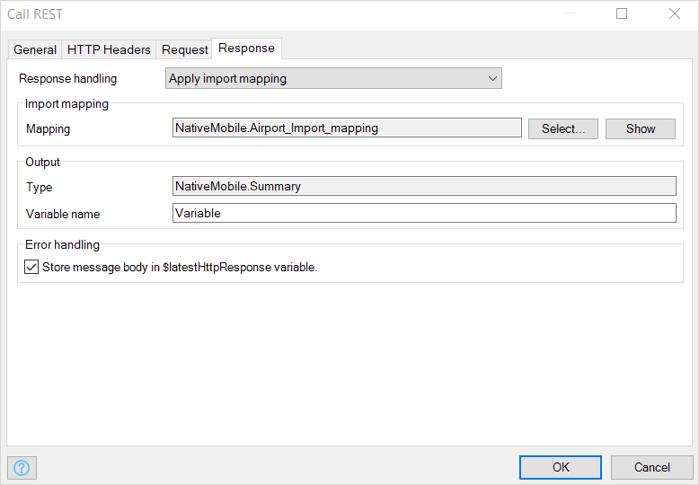
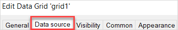
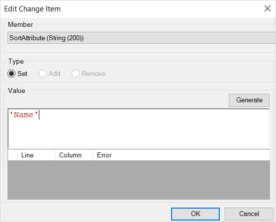
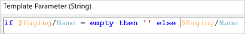

## 1 Introduction

A data grid and a microflow can be a powerful way to retrieve and display data from another system. Here you will learn to use a microflow as a data source with sorting and paging enabled. Doing so will improve your app's UX and accelerate its performance.

This how-to will teach you how to do the following:

* Create a data grid with a microflow data source which retrieves data from a REST service
* Add server-side paging and sorting to that data grid

## 2 Prerequisites

Before starting this how-to, make sure you have completed the following prerequisites:

* If you are not familiar with using data from REST services, read [Consume a REST Service](/howto/integration/consume-a-rest-service)
* Mendix 8.2 and above

## 3 Creating a Microflow Data Source

In this section you will create a JSON structure and import mapping for a REST service. To do this, complete the first four sections of [Consume a REST Service](/howto/integration/consume-a-rest-service) — (until **Adding an Input Entity to the Domain Model** is done). 

You must complete these steps with *one crucial change*: you must use this REST service URL for your JSON snippet: `https://my-json-server.typicode.com/mendix/howto-api-data/airports`.

Once successful, your project should have the following elements:

* A JSON structure based on the airport data:

	{}{}

* Import mapping:

	{}{}

* An input entity added to the domain model:

	{}{}

Now you can start calling the REST service from your microflow data source. To create a microflow data source which returns a list of characters, do the following:

1. Right-click your module, click **Add Microflow**, and create a new microflow named *Call_REST*.
2. From the **Toolbox**, drag a **Call REST service** activity onto the microflow.
3. Double-click your **Call REST service** activity.
4.  Click the **Location** > **Edit** button: 

	{}{}

5.  In the **Template** field, add `https://my-json-server.typicode.com/mendix/howto-api-data/airports` then click the **OK** button:

	{}{}

6.  Click the **Response** tab:

	{}{}

7. Select **Apply import mapping** from the **Response handling** drop-down menu.
8. Click **Mapping** > **Select** and select the import mapping you created.
9.  For **Variable Name**, type *Result.* Click **OK** to accept the changes:

	{}{}

10. From the **Toolbox** drag the **Retrieve** activity onto the microflow and double-click it.
11. Click **Association** > **Select**, click **Expand All**, and select **JsonObject_Summary (List of NativeMobile.JsonObject)**. 
12. Click **OK** to accept this association.
13. Right-click the **Retrieve** activity and select **Set $JsonObjectList as return value**:

	{}{}

## 4 Creating a Data Grid with a Microflow Data Source

In previous section you created a microflow which return a list of characters. Next you will use this microflow as a data source for a data grid:

1. From the **Toolbox**, drag and drop a **Data grid** onto a page.
2. Double-click the blue header of the newly-placed data grid.
3.  Click the **Data source** tab:

	

4. Select **Type** > **Microflow**. 
5. Click **Microflow** > **Select** and select the **Call_REST** microflow. 
6. Click **OK** to accept the changes to the data source.
7.  When you see the **“Do you want to automatically fill the contents of the data grid?”** pop-up window, click **Yes**:

	{}{}

8.  When you see the  **“Do you want to generate controls for microflow source parameters of the data grid? This will enable server-side paging sorting and searching for the grid.”** pop-up window, click **Yes**:

	{}{}

This generates a data view around your data grid, creates the necessary widgets and nanoflows, and adds the **Paging** object as an input to your microflow:

{}{}

## 5 Adding Paging Support to the Microflow Data Source

In the previous section you added the **Paging** input parameter to your microflow. This parameter contains the **PageNumber** attribute which is updated when you navigate through the pages with the paging bar in the client. In this section you will use the **PageNumber** attribute to retrieve a specified page from your REST service:

1. Open the the **CallREST** microflow.
2. Double-click the **Call REST service** activity. 
3. Click **Location** > **Edit**.
4.  Change **Template** to `https://my-json-server.typicode.com/mendix/howto-api-data/airports?limit=5&_page={1}`:

	{}{}

5.  Click **Parameters** > **New** for a new parameter and enter the following expression `toString($Paging/PageNumber)` for this parameter:

	{}{}

6. Click **OK** to accept this expression.
7. Click **OK** to accept the changes for the location, and click **OK** once more to accept the changes for the **Call REST service** activity. You are now back at your microflow.

Deploy your app and navigate to the page where you added your data grid. You can now use your newly added server-side paging by using the paging bar buttons above the data grid. 

## 6 Adding Server-Side Sorting Support to the Microflow Data Source

Now you have service-side paging for your data grid. Next, add server-side sorting to it.

Clicking the header on the data grid in the client will update the **Paging** entity by setting the attribute **SortAttribute** to the attribute which is associated to the header you clicked, and the **SortAscending** is set to **true** for ascending and **false** for a descending sort order. 

Use these attributes when calling your REST service:

1. Open your **Call_REST** microflow.
2. Double-click the **Call REST service** activity. 
3. Click **Location** > **Edit**.
4.  Add `&_sort={2}&_order={3}` to the end of your current **Template** address:

	{}{}

5.  Click **Parameters** > **New** to add the second parameter and enter the following expression `toLowerCase($Paging/SortAttribute)`:

	{}{}

6. Click **OK** to accept this expression.
7.  Click **Parameters** > **New** to add the third parameter and enter the following expression `if $Paging/SortAscending then 'asc' else 'desc'`:

	{}{}

8. Click **OK** to accept this expression.
9. Click **OK** to accept the changes in the location. 
10. Click **OK** once more to accept the changes in the **Call REST service** activity.

Deploy your app again and navigate to the page with your data grid. Click the column headers to see your server-side sorting in action!


### 6.1 Setting a Default Sort Order

You can set a default sort order for data. When a user has not clicked a header, the data will be ordered in the default sort order:

1. Open the page containing your data grid.
2. Right-click the data view surrounding the data grid.
3. Select **Go to data source nanoflow**.
4.  Double-click the **Create object** activity: 

	{}{}

5. Click **New** to set the value for a member of the **Paging** entity.  
6. Click the **Member** drop-down menu and select **SortAttribute (String (200))**. 
7.  Set **Value** to `'Name'`:

	{}{}

8.  Click **OK** to accept the changes to the member, and click **OK** once more to accept the changes to the **Create object** activity.

Deploy your app again and navigate to the page with your data grid. The data will be shown ordered by **Name**.

{}{}

### 6.2 Disabling Server-Side Sorting

Apps that use a REST service which does not support sorting, or apps which do not enable users to change sorting order, require special functionality. In these cases, disable sorting so that clicking the header has no effect:

1. Open the page containing the data grid.
2. Right-click the data view surrounding the data grid and select **Go to data source nanoflow**.
3. Double-click the **Create object** activity. 
4. Click **New** to set the value for another member of the **Paging** entity. 
5. Select **Member** > **IsSortable (Boolean)** from the drop-down menu.
6.  Type *false* into **Value**:

	

7. Click **OK** to accept the changes to the member, and click **OK** once more to accept the changes to the **Create object** activity.

Deploy your app again and navigate to the page with your data grid. The data will still be shown ordered by **Name**, but you can no longer change the sorting by clicking the header. Note the lack of an arrow above the **Name** header.


## 7 Add Server-Side Searching

If you are using Mendix 8.3 or above, generating controls also generates input fields for all your attributes of the entity the microflow returns. These inputs can be used by your user to enter search criteria, which can be used to filter the data set on the server. Any data entered in the input fields by the user is set in the **Paging** entity which is passed to the data source microflow. 

You only need to use this data in your microflow and pass the search criteria to your REST call to get a filtered set of data. As an example, follow the instructions below to filter the **Name** attribute:

1. Open your **Call_REST** microflow.
2. Double-click the **Call REST service** activity.
3. Click **Location** > **Edit**.
4.  Add `&name_like={4}` to the end of your current **Template** address:

	{}{}

5.  Click **Parameters** > **New** to add the fourth parameter and enter the following expression:

	```
	if $Paging/Name = empty then '' else $Paging/Name
	```

	{}{}

6. Click **OK** to accept this expression.
7. Click **OK** to accept the changes in the location. 
8. Click **OK** once more to accept the changes in the **Call REST service** activity.

Deploy your app again and navigate to the page with your data grid. Enter a value for a part of the name, for example *International*, and click **Search** to see your server-side searching in action!

## 8 Read More

* [Consume a REST Service](/howto/integration/consume-a-rest-service)
* [JSON Structures Guide](/refguide/json-structures)
* [Consumed REST Services Guide](/refguide/consumed-rest-services)
