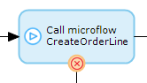
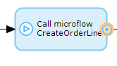
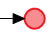
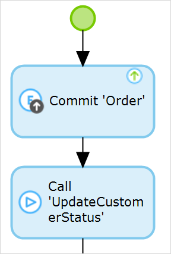
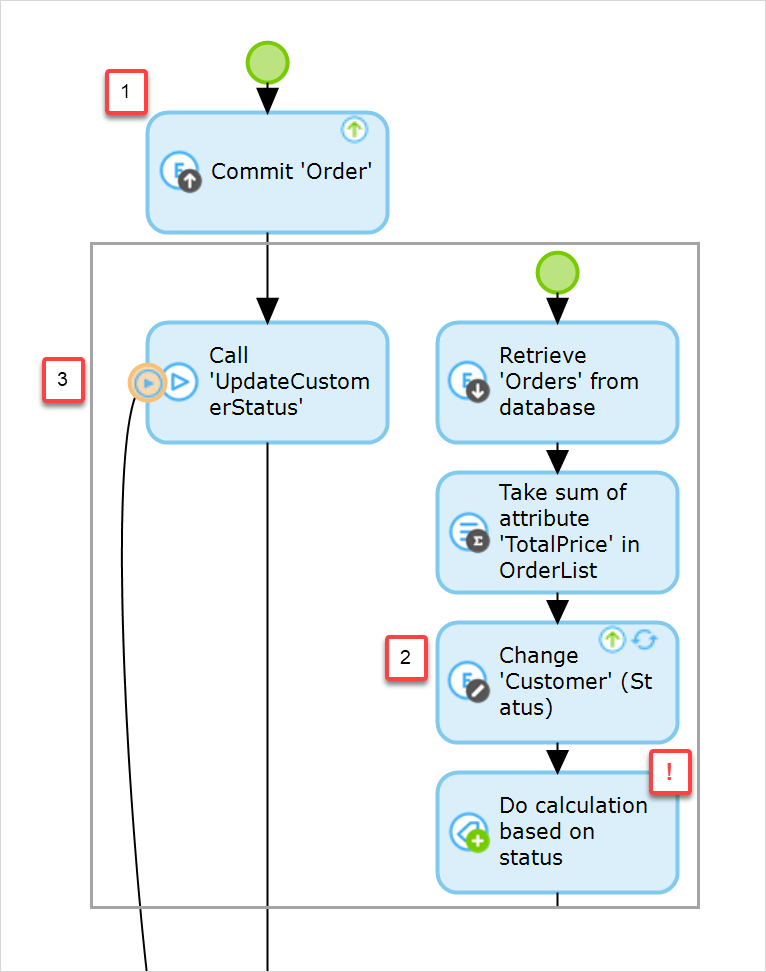
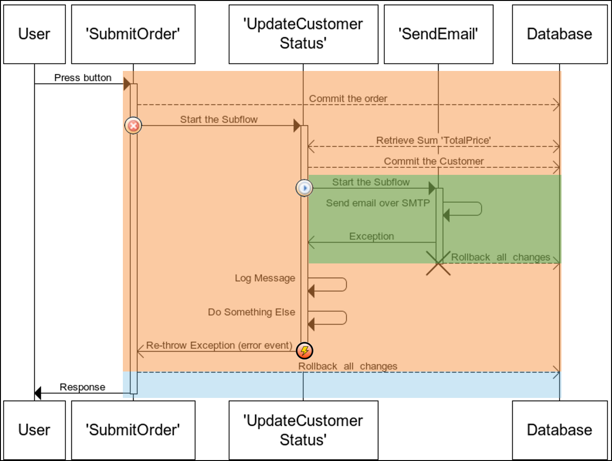

## 1 Introduction

When working with microflows, it is important to realize that there are always transactions. These transactions help in achieving the correct result, and in case something goes wrong, they also help us to keep all the information in our application consistent. 

**This how-to will teach you how to do the following:**

* Set up the various error handling components

## 2 Transactions

### 2.1 Transactions Keep Your Data Consistent

Everything that happens in the platform happens in a transaction. What is more, unless otherwise specified, everything is executed, or nothing is executed. Accordingly, if you don't specify any error handling and the microflow you are trying to execute gives you an error, nothing will be executed. That means that all the objects you created or changed will be reverted, you will not get the text feedback, and the platform will not show the new page. Either every single step in the microflow is successfully executed, or nothing is executed. That is the only way to keep processes and data consistent. 

### 2.2 Transactions Keep the Changes Isolated

While updating or creating your objects, you do not want users to see temporary information or empty records because a microflow hasn't finished executing yet. 

To ensure that every user or process can only see persisted data, all the data changed in a transaction is only available within that specific transaction. None of the changes made inside that microflow will be available outside the microflow, not even to the user that initiated the microflow. The information will only be available to the whole application once the microflow has successfully completed all the actions.

### 2.3 Transactions Prevent Two processes from Using the Same Object at the Same Time

When an object is updated, the platform will place a lock on that object for the duration of the transaction. That means that while the transaction is running, no other transactions are allowed to read or write in that same object. As soon as the transaction has finished, the lock will be released automatically and any waiting processes will continue normally.
 
Please note that this isn't the same as preventing two users from editing the same object. It is still possible for two users to open the same object and change it 1 milliseconds after each other. The latest change will still be applied.

## 3 Error Handling Components

| Type | Image | Description |
| --- | --- | --- |
| **Error Handling – Custom With Rollback** |  | Everything that happened up to the error will be rolled back, and a new transaction will be initiated. Only the changes executed in the error handler flow will be executed. 
| **Error Handling – Custom Without Rollback** |  | Any action taken inside the microflow can be reverted, but everything that happened before the error will be kept.The microflow will continue over the custom error handler flow.
| **Continue** |  | Any action taken inside the microflow can be reverted, but everything that happened before the error will be kept. The microflow will continue as if nothing happened. Avoid using this option – you should only use this in the more complicated combinations of multiple error handlers. You want to make sure that you at least log the error message. If it breaks, you need to know about it.
| **End Event** |  | This is the end of the microflow transaction and all actions are executed at the end of the main microflow.|
| **Error End Event** |  | This re-throws the error to all parent microflows after executing the custom activities. See [Error Event](/refguide7/error-event) for more details.

### 3.1 Transactions

There are many different combinations of error handling and transactions that we can configure, and below you'll find several. This should present some of the possibilities and help you understand how the different configurations behave.

### 3.2 Default Error Handling

With default error handling, there is always a transaction running. But since there is no custom error handling specified, the platform will create one transaction for all the actions executed in the microflow. All subflows will be executed in the same transaction. The changed order and customer information is only available inside the transaction until the microflow transaction has completed.

### 3.3 Error Handling – Custom with Rollback

Any submicroflow initiated with error handling set to **Custom with Rollback** will NOT initiate a new transaction. The original transaction will be re-used in the subflow. If an error occurs, the transaction will be completely reverted and a new transaction will be initiated so the custom error flow can continue using that new transaction.

Because you are switching transactions, merging back to the original process is not recommended, as this will result in inconsistent data. If you use error handling with rollback in a subflow, you should make sure that all parent microflows are configured to use error handling continuously. It is preferable that you re-throw the exception after running your custom actions.

### 3.4 Error Handling – Custom without Rollback

A submicroflow with error handling set to **Custom without Rollback** will always create a sub-transaction. All actions within the parent microflow will be persisted, and what happens inside the sub-microflow is determined by the sub-microflow. If no custom error handling is specified in the submicroflow, only the changes in the submicroflow can be reverted in case of an error. 

## 4 Combinations of Different Types of Error Handling

Most of the time you will be using a single activity with custom error handling. However, if you are developing more complicated processes where you are sending data outside of the application, it is important to realize what happens when an error occurs later in the process. For example, you don't want to send out notifications about a status change if an error occurs and therefore reverts the change.

Especially when interacting with other systems, you need to think about how you want to process the errors. The best solution depends on what you want to do: continue, skip/revert the record you are working on, or keep the changes you have made so far but stop the process. All of these options can be done as long as you know what you want to achieve. The instructions below will show you a couple of examples of how you can use different combinations of the error handling options. 

### 4.1 Rollback in the Parent Flow, Rollback in the Subflow

| Color | Description |
| --- | --- |
|  | *Initial transaction* – this transaction is initiated when the microflow started. Custom error handling with rollback does not initiate any transactions. Therefore, the microflow is executed, but all the actions in both the parent and the subflow will be reverted. None of the changes made anywhere in this transaction will be applied. |
|  | *Transaction initiated by custom with rollback activity* – after catching the exception, a new transaction is initiated to execute the remainder of the microflow activities. |

### 4.2 Rollback in the Parent Flow, Continuing in the Subflow

| Color | Description |
| --- | --- |
|  | *Initial transaction* – this transaction is initiated when the microflow starts. This transaction will be completely reverted, because the subflow re-throws the exception. None of the changes made during this transaction will be persisted. (If the subflow wasn't rethrowing the exception, all changes except 'SendEmail' would have been persisted in the database.) |
|  | *Transaction initiated by custom with rollback activity* – after catching the exception, a new transaction is initiated to execute the remainder of the microflow activities. |
|  | *Transaction initiated by subflow* – at the start of the subflow, a new transaction is initiated. Any changes made in this transaction will be reverted because the activities in the 'SendEmail' subflow use default error handling. |

 

### 4.3 Continuing in the Parent Flow, Rollback in the Subflow

| Color | Description |
| --- | --- |
|  | *Initial transaction* – this transaction is initiated when the microflow starts. This transaction will complete successfully and any changes made during this transaction will be persisted. |
|  | *Transaction initiated by subflow* – at the start of the subflow, a new transaction is initiated. All changes in this transaction will be reverted because of the custom error handler "with rollback." As a result, the change on the customer will not be applied. |
|  | *Transaction initiated after the exception was caught by the error handler* – when this transaction is initiated, after executing some actions, it will re-throw the original exception. These changes will be persisted because of the error handling on the initial sub-microflow call. |

 

### 4.4 Continuing in the Parent Flow, Continuing in the Subflow

| Color | Description |
| --- | --- |
|  | *Initial transaction* – nothing will be reverted. The only difference compared to successful execution is that no e-mail will be sent, and the process will finish using the error flow instead of the normal process flow.
|   | *Transaction initiated by subflow* – at the start of the subflow, a new transaction is initiated. All the changes in this transaction will be kept, because the 'SendEmail' subflow is configured to continue without rollback. Even though the exception is re-thrown, the initial microflow call is configured for custom without rollback; therefore, none of the changes will be reverted. The process will just take the error flow instead of the default flow.
|  | *Transaction initiated by subflow* – at the start of the subflow, a new transaction is initiated. Any changes made in this transaction will be reverted, because the activities in the 'SendEmail' subflow use default error handling.

## 5 Best Practices

Consider the following best practices for error handling:

* Always use a log activity to print the error message and stack trace
* Never use the continue option, since that doesn't give you the option to print any info (the platform will just ignore the error)
* Always add custom error handling on integration or e-mail activities
* Don’t over-do it – you can specify a lot of complicated error handling combinations, but this makes it more difficult (and slower) for the platform to evaluate the microflow, and it also makes it more difficult to predict the exact behavior in case of an exception

## 6 Related Content

* [How to Define Access Rules Using XPath](define-access-rules-using-xpath)
* [How to Trigger Logic Using Microflows](triggering-logic-using-microflows)
* [How to Create a Custom Save Button](create-a-custom-save-button)
* [How to Extend Your Application with Custom Java](extending-your-application-with-custom-java)
* [How to Work with Lists in a Microflow](working-with-lists-in-a-microflow)
* [How to Optimize Retrieve Activities](optimizing-retrieve-activities)
* [How to Optimize Microflow Aggregates](optimizing-microflow-aggregates)
* [How to Extract and Use Submicroflows](extract-and-use-sub-microflows)
