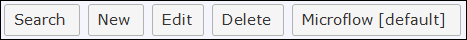
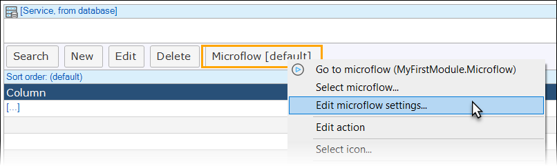
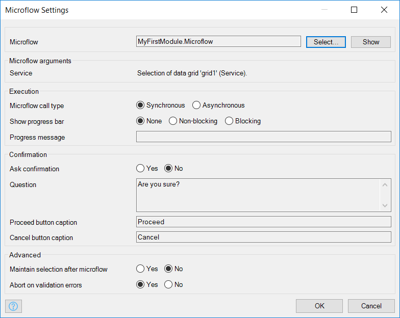

To add custom logic to your Mendix application you can use microflows. Microflows can be triggered in various ways, i.e. buttons, input fields, scheduled events, and more. This how-to will teach you how to configure the properties and settings of a microflow button placed on a grid or reference set selector. You will start with adding the microflow button to the right widget. Next you will need to configure the right properties and settings of the microflow button. 

## 1 Preparations

Before starting this how-to make sure you complete the following prerequisites:

*   [Creating a basic data layer](../data-models/create-a-basic-data-layer)
*   [Creating your first two Overview and Detail pages](../ux/create-your-first-two-overview-and-detail-pages)

## 2 Triggering Logic Using a Page Button

In this exercise you will add a microflow button to a grid or a reference set selector and configure it. In this example you will add the button to the Datagrid widget, but this way the settings of the button will apply to the reference set selector and all the grid widgets.

### 2.1 Adding a Button to a Data Grid

1.  Open you project in the **Mendix Desktop Modeler**.
2.  Open page with a **Datagrid**.
3.  Select the **menu bar** of the Datagrid.
4.  Right click the menu bar.
5.  Select **Add button** > **Action**:

    

6. Double-click the new button and enter *Microflow* for the button's **Caption**. The **Microflow** button will be visible on the menu bar of the data grid.

You will do more configuration of this button below.

### 2.2 Configuring the Microflow Properties

At the moment there is only a button with no microflow behind it yet. In this exercise you will configure the button settings. 

1.  Double-click the **Microflow** button to open its properties.

    

2. In the **Edit Action Button** dialog box that opens, the first property to configure is the one that converts the action button into a button that calls a microflow. Go to **Events** > **On click** and select **Call a microflow**. This will open the **Select Microflow** dialog box, where you can specify the microflow that is executed when the button is clicked.
3. For the purposes of this how-to, you will create a new microflow. Click **New** to create this microflow, and keep the name as **Microflow**.

    

4. Back in the **Edit Action Button** dialog box, you can set the following parameters:

    | Property | Description |
    | --- | --- |
    | **Caption** | This property indicates what text will be shown on this button. This is a translatable text. |
    | **Tooltip** | This property indicates what text will be displayed when users mouse over the button. |
    | **Icon** | This property indicates which image will be shown in front of the caption of the trigger. |
    | **Button style** | This property indicates the style of the button. |
    | **Is default button** | This property indicates whether this button is the default button of the grid or reference set selector. A grid or reference set selector can only have one default button. The default button is triggered when clicking or double clicking a row. Whether a click or a double click triggers it depends on the 'default button trigger' property of the [Data grid](/refguide7/data-grid), [Template grid](/refguide7/template-grid) or [Reference set selector](/refguide7/reference-set-selector).  |
    | **Visible** | By default, whether or not an element is displayed in the browser is determined by how the page is designed and the user's roles within the application. However, the page can be configured to hide the element unless a certain condition is met. **Attribute**: When checked, this setting hides the widget unless the value of a particular attribute has a certain value. Only boolean and enumeration attributes can be assigned to this purpose. **Ignore security**: Check this box if you want the microflow button to be visible even if security says it should be hidden. |
    | **Name** | This property specifies the name of the microflow in the page builderClass: The class property allows you to specify a cascading style sheet (CSS) class for the widget. This class will be applied to the widget in the browser and the widget will get the corresponding styling. The class should be a class from the theme that is used in the project. It overrules the default styling of the widget. |
    | **Style** | The style property allows you to specify additional CSS styling. If a class is also specified, this styling is applied _after_ the class. |

    {}

    The styling is applied in the following order:

    *   Default styling defined by the theme the project uses
    *   The 'Class' property of the widget
    *   The 'Style' property of the widget

    {}

5. Click **OK** to save the properties.

### 2.3 Configuring the Microflow Settings

The microflow button has been added to the grid and the properties have been set. With the properties you can customize the appearance of the microflow button, in this section you are going to set the 'on click settings', which you can use to customize which parameters to pass to the microflow, whether to show a progress bar and more.

1.  **Right click** the microflow button.
2.  Select **Edit microflow settings**.

    

    The **Microflow Settings** window opens with five sections.
    
    

3. Configure the sections described below, and then click **OK**.

#### 2.3.1 Microflow Section

The **Microflow** is the one that will be executed. Its parameters should match the parameters that are passed to it.

Click **Select** to select another microflow, or **Show** to go to the microflow editor of the selected microflow.

#### 2.3.2 Microflow Arguments Section

The **Service** setting is the data grid that is to be passed to the microflow.

#### 2.3.3 Execution Section

These are the execution settings:

*   **Microflow call type** – this property indicates whether the connected microflow is executed synchronously or asynchronously
    * With **Synchronous** microflows, the microflow is started and the client waits for the result
    * With **Asynchronous** microflows, the microflow is started on the server but the client does not wait for the result, and it will check the server every ten seconds to see if the microflow is done executing

*  **Show progress bar** – this property indicates whether a progress bar is shown during the execution of the microflow; the message shown in the progress bar can be set with the 'Progress message' property

    | Value | Description |
    | --- | --- |
    |  **None** | No progress bar is shown. |
    |  **Non-Blocking** | A progress bar is shown, but the end user can continue working. |
    |  **Blocking** | A progress bar is shown and the end user must wait until the microflow is done. |

*  **Progress message** – the progress message is shown along with the progress bar if the progress bar is either non-blocking or blocking

{}

Set the duration only to asynchronous if you experience problems. Sometimes if a request takes too long to handle, the request will be sent again by an (impatient) proxy server.

{}

#### 2.3.4 Confirmation Section

You have the option to ask for confirmation before proceeding with the microflow. This is useful in cases where an operation modifies or deletes a lot of data or when it takes a lot of time to complete. The user will be prompted with a question whether to continue with this operation.

{}

The title of the confirmation pop-up is determined by a system text (category 'Message dialog title').

{}

*   **Ask confirmation** – here you can specify whether you want to ask for confirmation or not
*   **Question** – this is the question that you want to show to the user (for example, "Are you sure you want to empty the trash can?")
*   **Proceed button caption** – this is the caption for the button that proceeds with the execution of the microflow (for example, "Empty trash can")
*   **Cancel button caption** – this is the caption for the button that cancels the execution of the microflow (for example, "Cancel")

#### 2.3.5 Advanced Section

There are two more advanced settings:

*   **Maintain selection after microflow** – this is only for grid microflow buttons and specifies whether the selection of the data should be maintained after executing the microflow
*   **Abort on validation errors** – you can choose to abort the microflow on validation errors  here

## 3 Related Content

*   [Defining access rules using XPath](define-access-rules-using-xpath)
*   [Extending Your Application with Custom Java](extending-your-application-with-custom-java)
*   [Working With Lists in a Microflow](working-with-lists-in-a-microflow)
*   [Triggering Logic using Microflows](triggering-logic-using-microflows)
*   [Creating a Custom Save Button](create-a-custom-save-button)
*   [Optimizing Retrieve Activities](optimizing-retrieve-activities)
*   [Error Handling](set-up-error-handling)
*   [Optimizing Microflow Aggregates](optimizing-microflow-aggregates)
*   [Extract and use sub microflows](extract-and-use-sub-microflows)
