## 1 Introduction 

Workflow is a new visual language in Mendix Studios that allows you to build extendable processes. It is fully integrated with other visual languages, such as microflow editor and page editor. 

This how-to explains how to build an employee onboarding process using the workflow editor. 

**This how-to will teach you how to do the following:**

* Creating a workflow
* Creating user tasks for different user roles
* Configuring pages for the user tasks
* Restricting page access to the relevant user roles
* Using a microflow to extend logic of the workflow
* Testing your workflow from the perspective of different users
* Creating a decision

The how-to describes the following use case: 

You would like to build an employee onboarding process. At first, an HR specialist needs to initiate the onboarding process for a new employee. The employee's manager will then step in and select devices for the employee. Afterwards the manager needs to specify whether the new hire is working from the office or home . The Facilities department will then need to prepare a workspace. Depending on where the new hire works from (the office or home), the Facilities department will either prepare a desk or ship the devices to the employee's address. 

## 2 Prerequisites

Before starting this how-to, make sure you have completed the following prerequisites:

* Your project has the WorkflowEssentials module.

* {}[remove this for Private Beta]{}Familiarize yourself with workflow terms and how to perform basic functions in the workflow editor. For more information, see [Workflows](). 

* Make sure that the domain model of the module you are working in looks the following way:

  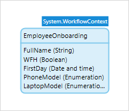

* Make sure you have the following enumeration configured:

  * The Location enumeration:
  
    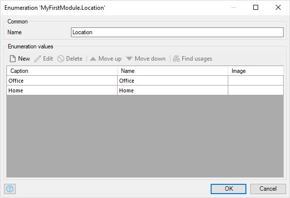
  
  * The PhoneModel enumeration:
  
    
  
  * The LaptopModel enumeration:
  
    
  
* Make sure you have an **EmployeesToOnboard** page that contains a form and has the **EmployeeOnboarding** entity as the data source:

    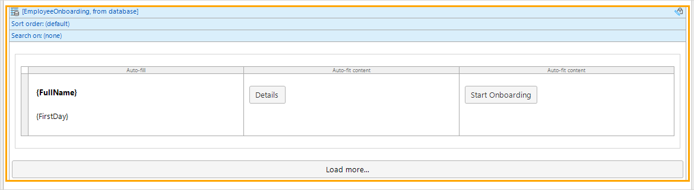
  
* Make sure that project security is configured the following way:

    * You created HR, Facilities, and Manager user roles and they have necessary module roles assigned to them:
    
        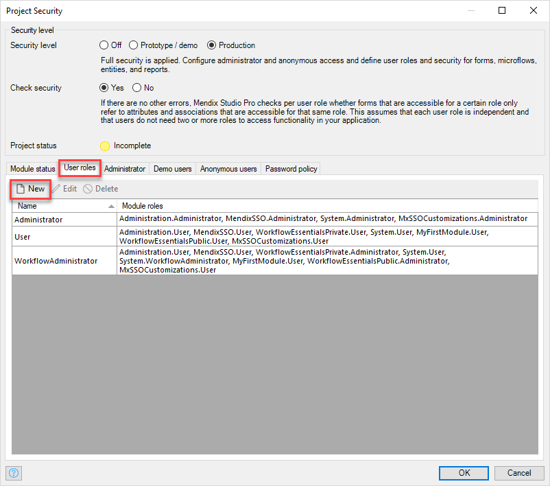
    
    * Demo users are configured for all the roles:
    
        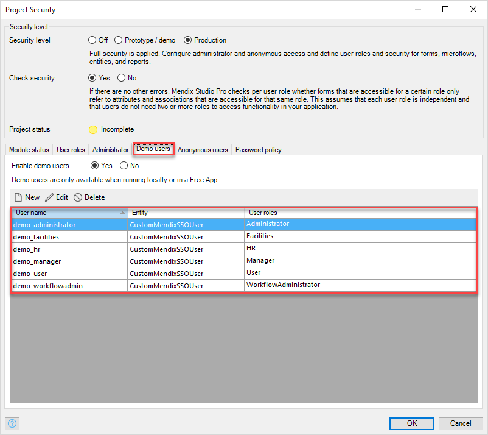

## 3 Creating a Workflow

First of all, you need to create a workflow that you will add activities to and create pages for. Do the following:

1. In the Project Explorer, right-click the **MyFirstModule** module and select Add workflow in the drop-down menu.

    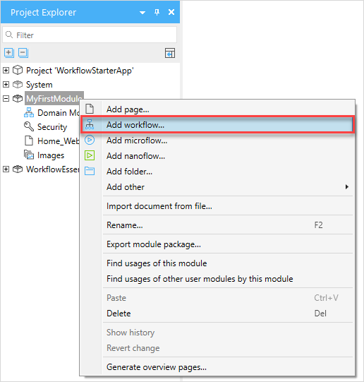

2.  In the **Add workflow** dialog box, set the **Name** to *Employee_Onboarding* and click **OK**.

    
    
3. To open the workflow properties, make sure that no activity is selected in the workflow editor and navigate to the **Properties** pane. 

4. Click the **Workflow entity** property:

    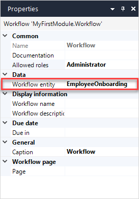

5. In the **Select Entity** dialog box, select the **EmployeeOnboarding** entity and click **Select**. This entity serves two purposes: it holds input data for executing the workflow and will carry the data that is added during the execution of the workflow.  

    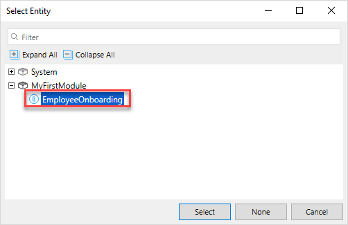
    
6. Open properties and click the ellipsis icon in the **Page** property to create a page that an admin will use to monitor all workflow instances.
   
7. In the **Select web page** dialog box, click the **New** button:
   
    
    
8. In the **Create web page** dialog box, you can see the templates for workflow pages. Do the following:
   
    1. Set the **Page name** to **WorkflowOverview**.
    
    2. Set **Navigation layout** to **Atlas_Default (Atlas_UI_Resources)**.
    
    3. Select **Workflow Overview** template.
    
    4. Click **OK**.
    
        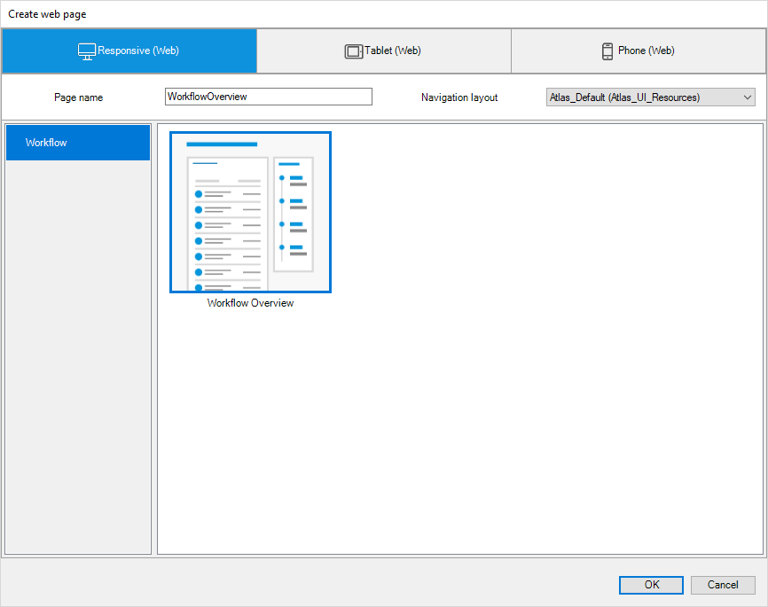

Good job! You have created a workflow and configured its properties. 

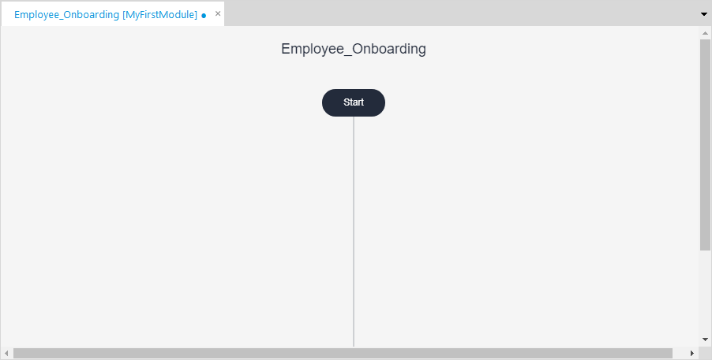

## 4 Triggering the Workflow from a Page

To start you workflow, you need to trigger it. In this use case, the workflow is started by an HR specialist who should fill in the new hire's name, the first day, and then click the **Start Onboarding** button that will trigger the workflow. 

You have an **EmployeesToOnboard** page that contains a list of all employees and has the **EmployeeOnboarding** entity as the data source:

The page access is restricted to the HR user role:

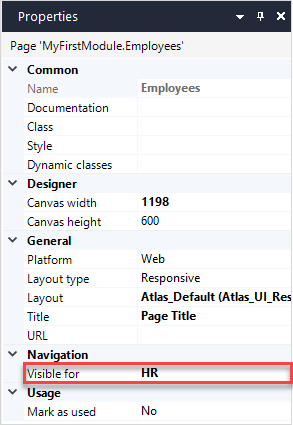

To add a button that will initiate the workflow, do the following:

1. Open the **Toolbox** and search for a **Button** widget.

2. Drag and drop the button inside the list view.

3. Open the button properties and set the **On-click** property to **Call workflow**:

    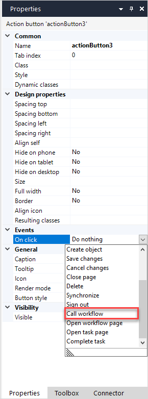

4. Click the ellipsis icon in the **Workflow** property.

5. In the **Select Workflow** dialog box, select Employee_Onboarding workflow and click **OK**.

    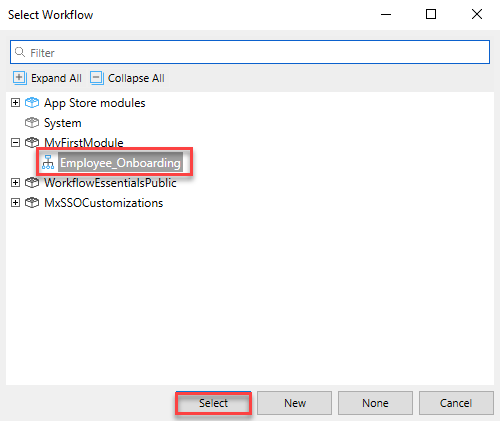
    
6. Set **Caption** of the button to **Start Onboarding**.

Good job! Now when the HR specialist clicks the button, the workflow will start. 

## 5 Selecting a Device for the New Hire {#select-device}

The manager of a new employee will get a task to specify devices for the new hire. For this functionality you need to add activities to the workflow. Follow the steps below: 

1. Navigate to the **Toolbox** pane, find a **User task** activity, and drag and drop it to the workflow editor.

2. Select the **User task** activity and open the **Properties** pane. 

3. To be able to differentiate this user task from other ones, set the **Task name** property to **SpecifyDevice**. 

4. Set the **Caption** property to **Specify Device**.

    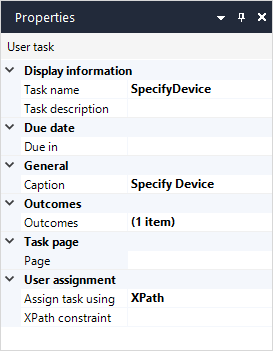 

5. To create a page where the manager will specify devices for the new employee, click the ellipsis icon in the **Page** property.

6. In the **Select web page** dialog box, click the **New** button.

    

7. In the **Create web page** dialog box, you can see the templates for workflow pages. Do the following:

    1. Set the **Page name** to **SpecifyDevice**.

    2. Set **Navigation layout** to **Atlas_Default (Atlas_UI_Resources)**.

    3.  Select the **User Task Extended** template.

    4. Click **OK**.

        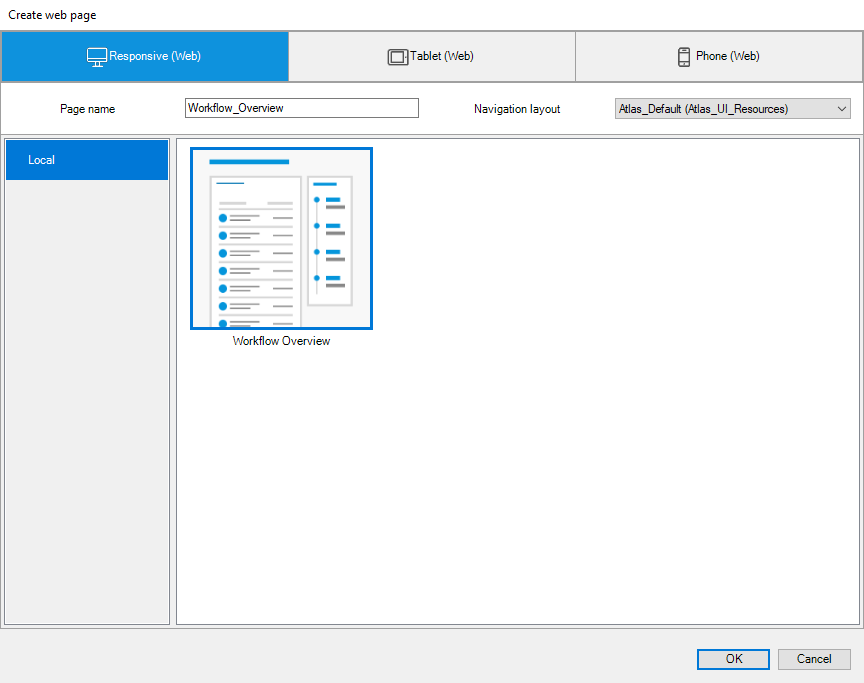

8. As only the Manager should specify devices for the new employee, you need to restrict the user task to the Manager role. Click the ellipsis icon in the **Assigned to** property.

9. In the **Edit assigned to** dialog box, type in the expression: `[System.UserRoles = '[%UserRole_Manager%]']` and click **OK**.

10. Now you need to make sure that only the relevant information is displayed on the **SpecifyDevice** page. In the Project Explorer, double-click the **SpecifyDevice** page to open it.

11. By default, all attributes are added to the data view with the employee details. You need to leave only the attributes related to the task. You also need to make sure that the manager can change only a specific field in the form. For example, the name of the employee has been entered by the HR department, so the manager does not need to change it and should have this field as read-only.

    Do the following:

    1. Select the text box for the **FullName** attribute and go to its properties.

    2. Set the **Editable** property to *Never* to make the field read-only.

    3. Delete the **Location** radio buttons and **First day** date picker widgets as they are not relevant for this task. 

    4. Leave the **Phone model** and **Laptop model** radio buttons:

        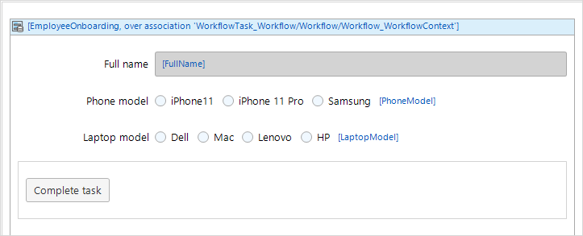

12. Only the Manager role can access and interact with the **SpecifyDevice** page, restricting the access to this page is the next step. Navigate to the page properties and do the following:

    1. In the **Visible for** property, click the ellipsis icon.

    2. In the **Select Module Roles** dialog box, select **Manager** and click **OK**:

        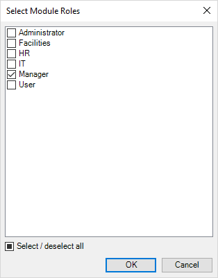

Great job! You have created the user task for the Manager role:

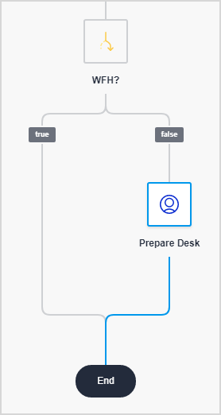

## 6 Specifying a Location for the New Hire {#specify-location}

To proceed with the onboarding, the Manager needs to indicate whether the new hire will work from the office or home. Follow the steps below:

1. Open the workflow editor.

2. Open the **Toolbox**, drag and drop a **User task** activity to the path, and do the following:

    1. Set **Task name** to **Specify_Location** and set **Caption** to **Specify Location** referring to steps 2-4 of the [Selecting a Device for the New Hire](#select-device) section.
    2. Set a new page called **SpecifyLocation** for the **Page** property referring to steps 5-7 of the [Selecting a Device for the New Hire](#select-device) section.
    3. Restrict the **Specify Location** user task to the Manager role referring to steps 8-9 of the [Selecting a Device for the New Hire](#select-device) section.

3. Now you need to make sure that only the relevant information is displayed on the **SpecifyLocation** page and that only the Manager role has access to it. In the Project Explorer, double-click the **SpecifyLocation** page to open it.

4. By default, all attributes are added to the employee detail form, while you need to leave only the attributes which are related to the task. You also need to make sure that the Manager can change only specific fields in the form. 

    Do the following:

    1. Select the text box for the **FullName** attribute and go to its properties.

    2. Set the **Editable** property to *Never* to make the field read-only.

    3. Delete the **First day** date picker widgets as it is not relevant for this task. 

    4. The **Phone model** and **Laptop model** radio buttons should not be editable as well. Repeat steps 4a and 4b to make these fields read-only.

        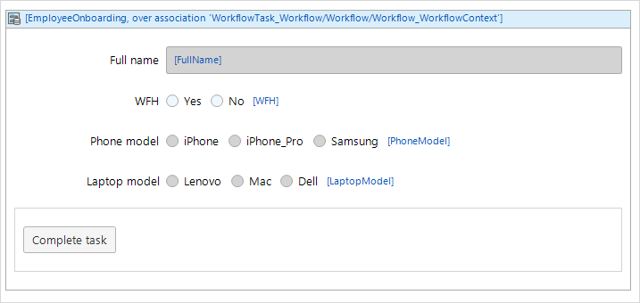

    5. To restrict access of the page to the Manager role only, follow step 12 of the [Selecting a Device for the New Hire](#select-device) section.
    

You have created the user task for the Manager to specify whether the new employee is working from the office or home.

## 7 Following Different Paths for the Hire's Location

Depending on whether the new hire is working from the office or home, there are two different processes to onboard this hire: prepare a desk in the office or send the laptop and phone to the new hire's home address. This step of the onboarding process should be done by the Facilities department.

Do the following:

1. Open the workflow editor > **Toolbox** and drag and drop the **Decision** activity after the **Specify Location** user task. 

    
    
2. Decision means that the workflow path can split and follow one of the outcomes depending on the condition of the decision. For more information, see [Decision](/refguide/decision). Open the decision properties and do the following:

    1. Set the **Caption** to **Location?**.
    2. Click the ellipsis icon in the **Condition** property.
    3. In the **Condition** dialog box, type in the expression that will split the flow into two depending on the **Location** attribute: `$workflowContext/Location`.

        

3. Since the Location enumeration has two values: Office and Home, two outcomes of the decision are added automatically to the workflow: 

    

4. Now you need to configure what happens in both scenarios: when the new hire works from the office and when the new hire works from home. Open the **Toolbox**, drag and drop a **User task** activity to the **Office** path, and do the following:

    1. Name the user task **Prepare_Desk** and set its title to **Prepare Desk** referring to steps 2-4 of the [Selecting a Device for the New Hire](#select-device) section.

    2. Set a new page called **PrepareDesk** for the **Page** property it referring to steps 5-7 of the [Selecting a Device for the New Hire](#select-device) section.

    3. Restrict the **Prepare Desk** user task to the Facilities role referring to steps 8-9 of the [Selecting a Device for the New Hire](#select-device) section.

        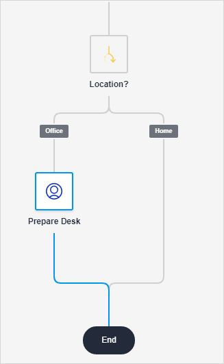

5. You need to make sure that only the relevant information is displayed on the **PrepareDesk** page. In the Project Explorer, double-click the **PrepareDesk** page to open it.

6. By default, all attributes are added to the employee detail form. You need to make sure that the Facilities department will be able to view the fields but not change them. Do the following: 
   
    1. Select the data view with the employee details and go to its properties.
      
    2. Set the **Editable** property to *No* to make all fields in the form read-only.
       
        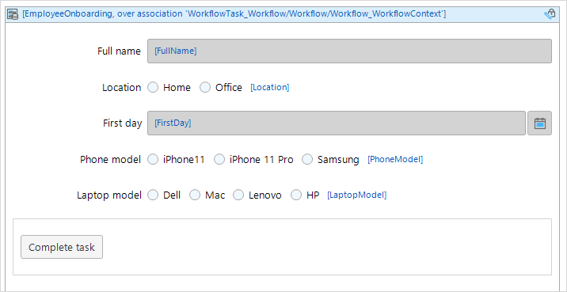
   
7. To restrict access to the page to the Facilities role only, follow the step 12 of the [Selecting a Device for the New Hire](#select-device) section.

8. Now you need to create a user task for Facilities when the employee is working from home. Open the workflow editor.

9. Open the **Toolbox**, drag and drop a **User task** activity to the **Home** path, and do the following:

    1. Name the user task **Ship_Devices** and set its title to **Ship Devices** referring to steps 2-4 of the [Selecting a Device for the New Hire](#select-device) section.
    2. Set a new page called **ShipDevices** for the **Page** property it referring to steps 5-7 of the [Selecting a Device for the New Hire](#select-device) section.
    3. Restrict the **Ship Devices** user task and **ShipDevices** page to the Facilities role referring to steps 8-9 of the [Selecting a Device for the New Hire](#select-device) section.

10. You need to make sure that only relevant information is displayed on the **ShipDevices** page and that this page can be accessed by the Facilities department only. In the Project Explorer, double-click the **ShipDevices** page to open it.

11. Repeat steps 11-13 above to make the employee detail form read-only and to restrict the page access to the Facilities role.

Great job! You have configured the decision and user tasks on whether the new hire is working from the office or from home. 

## 8 Extending Workflow Logic

You can extend workflow logic by calling a microflow. If the new employee works from the office, you would like to show in the system that the desk prepared by the Facilities department is assigned to this new employee. This way, HR and Management will see where the new colleagues is sitting in the office. You have an **Assign_Desk** microflow that you can use. 

To call a microflow in your workflow, do the following:

1. Open the workflow editor > **Toolbox** and drag and drop the **Call microflow** activity after the **Prepare Desk** user task:

    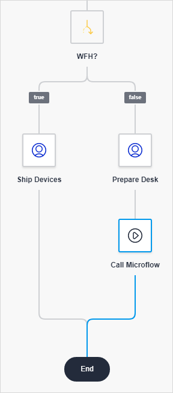

2. Open **Call microflow** properties and click the ellipsis icon in the **Microflow** property.

3. In the **Select microflow** dialog box, select the **Assign_Desk** microflow and click **Select**. 

    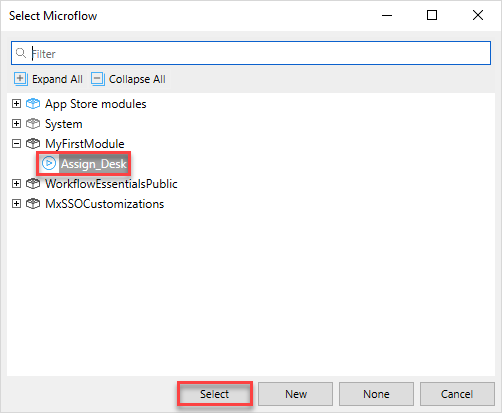

4. Change the **Caption** property to **Assign Desk**. 

5. If you create a microflow from the workflow, parameters and the **Complete task** activity are added automatically. Open your microflow and make sure it has the **Complete task** activity:

    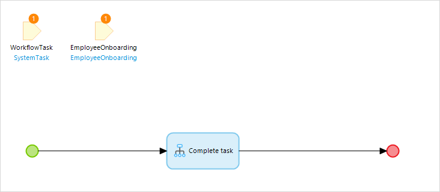

6. Make sure that the microflow will pass necessary data back to the workflow. For example, if your microflow can have several outcomes, make sure you selected the correct one in the **Complete task** activity properties:

    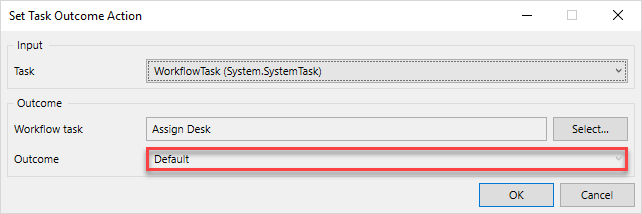

You can now add the actual desk assignment logic to the microflow, which falls outside the scope of this how-to. For more information on microflows and their properties, see [Microflows](/refguide/microflows) and [Microflow Properties](/refguide/microflow).
Now if the Manager indicates that the new employee works from home, the desk prepared by the Facilities department will be assigned to the new employee and will be shown in the system. 

Congratulations! The onboarding workflow is completed, and you can test it with different roles by running your application locally. 

## 9 Testing the Workflow

Now you can test your workflow from the perspective of different users. 

For certain user roles, there are default end-user and admin pages. 

For example, users who have tasks assigned to them (Manager, Facilities roles) will see their task inbox and dashboards pages where they can manage and monitor tasks assigned to them:

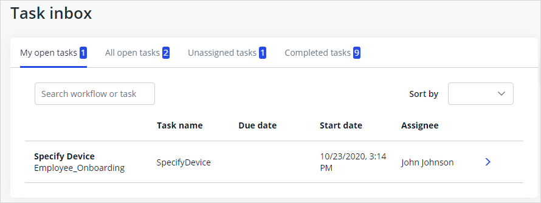

The Workflow Admin role has access to the Workflow Admin Center and can monitor all workflows, can view the progress of workflows, and change the workflow settings:

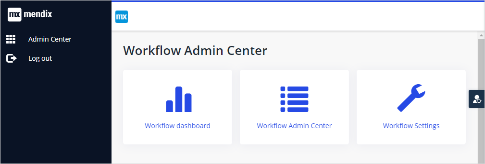

The Admin role is able to manage users:

Users who have tasks assigned to them (Manager, Facilities roles) will see their task inbox and dashboards pages where they can manage and monitor tasks assigned to them:

To test your workflow, you need to switch between different user roles. Follow the steps below:

1. In the top bar of Mendix Studio Pro, click **Run locally**.

2. After your app is deployed, click **View**.

3. In your browser, log in as an Admin user.

4. Click the user icon on the right to switch to another user role:

    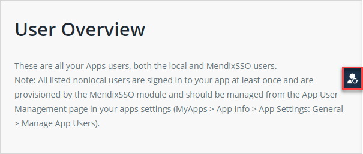

5. Switch between different demo user roles to test the use case. Do can do the following:

    1. Start the onboarding process.
    2. Test the process: switch users, view inbox for each user, complete tasks, see how new inbox items are created for the user roles you configured at the next task in the process.
    3. Open the Workflow Admin Center.
    4. Open the Workflow Dashboard.

Great job! You have deployed your app locally and tested your workflow from the perspective of different users. You can now work on adding more functionality to your app. 

