In this how-to, you will learn how to work with a list of objects in a microflow. To manage this list you will first retrieve a filtered list of objects from the database. Mendix utilizes XPath constraints to apply filters. To learn more about XPath, see [XPath Contains](/refguide7/xpath-contains) in the Mendix Reference Guide. Secondly, you will iterate over the retrieved list of objects and calculate the total price of all the orders in a [Loop](/refguide7/loop). You will end this how-to with an alternative to calculating aggregated values over a list of objects.

## 1 Preparing the Data Structure, GUI and Example Data

To see the results of this how-to it is necessary that you setup a test project with test data.

Before you continue, make sure that you know how to create:

*   **Domain models**, if you need more info, take a look at this [how-to](../data-models/create-a-basic-data-layer).
*   **Overview and detail pages**, if you need more info, take a look at this [how-to](../ux/create-your-first-two-overview-and-detail-pages).
*   **Menu items**, if you need more info, take a look at this [how-to](../ux/setting-up-the-navigation-structure).

1.  Create the following domain model:

    

2.  Create **overview** and **detail** pages to manage objects of type **Customer** and **Order**.
3.  Create **menu items** to access the **Order** and the **Customer** overview pages.
4.  Add the following customer data to your app:

    

5.  Add the following order data to your app:

    

## 2 Retrieving a Filtered List of Objects from the Database

In the previous section you have set up a basic data structure and created some sample data. In this section you will retrieve all the 'Processing' orders. To achieve this you will add a microflow button to the 'Orders' overview. In this microflow you will add a 'Retrieve from database' 'Action activity' with an XPath constraint. The XPath constraint will filter the retrieved list to only the 'Invoiced' orders.

1.  Create a new microflow by right-clicking the module and selecting **Add** > **Microflow**.
2.  Name the Microflow _IVK_SetOrderToComplete_.

    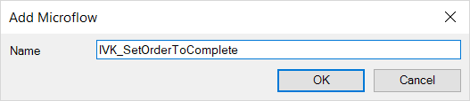

3.  Save the new menu item by clicking **OK**. You should see an empty Microflow like this:

    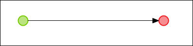

4.  Add an **Action** button to the toolbar of the orders overview:

    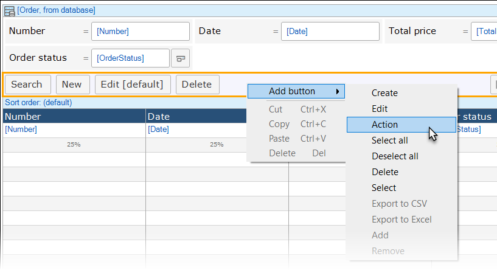

5.  Double-click the action button and in its properties, enter *Set Processing to Complete* for the **Caption**.
6.  For **On click**, select **Call a micrfolow**, and then select the **IVK_SetOrderToComplete** microflow.

    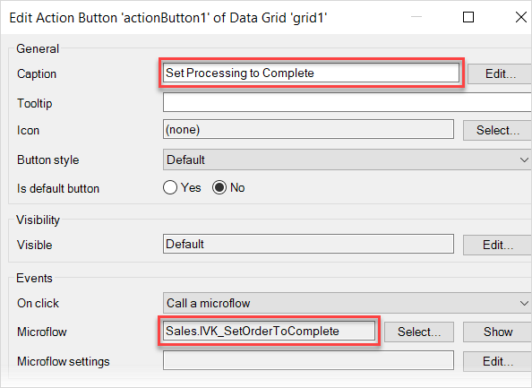

7.  Open the **IVK_SetOrderToComplete** microflow by right-clicking the new button and selecting **Go to microflow**.
8.  Open the **Toolbox**. It should be on the bottom right of the Desktop Modeler.

    

9.  Drag a **Retrieve** action from the toolbox to the line between the green start and red end event. This inserts a retrieve action activity.

    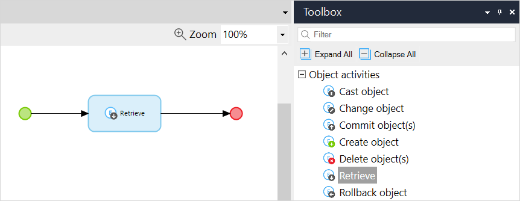

10. Double-click the retrieve activity to open its properties.
11. Select **From database** for the **Source** option.
12. Set the following properties: 
    a. For **Entity**, select **Order**_ 
    b. For **Name**, enter **OrderList** 

    {}
    With the currents settings your retrieve action gets every order in the database, using the XPath expression in the following steps you will filter the results that come back from the database.

    {}
13.  Add the following XPath expression in the XPath constraint field: `[OrderStatus = 'Processing']`. This expression will filter the list to only orders with the status **Processing**.
14. Your properties screen should look like this:

    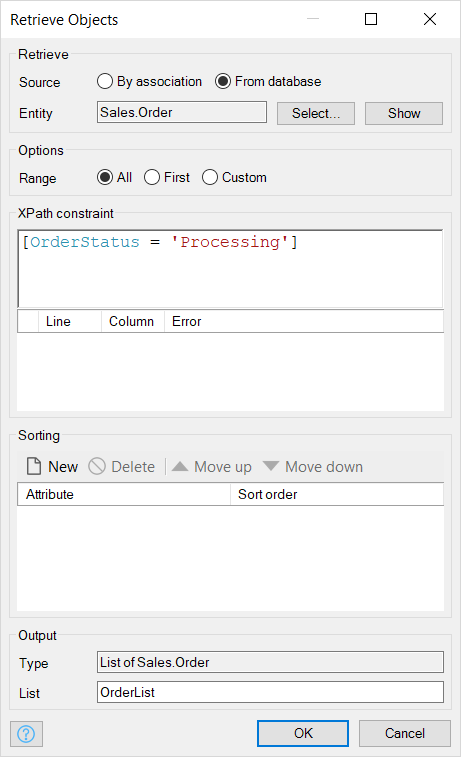

    {}
    With the currents settings your retrieve action gets all the 'Processing' orders in the database. In the next section you will edit this list of orders.

    {}

    You should see a Microflow like this:

    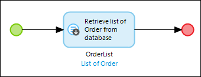

## 3 Iterate Over a List of Objects

In the previous section you retrieved a list of orders with the status 'Processing'. In this section you will iterate over this list and change the status of each object individually to 'Complete'. To do so you will use a 'Loop' to iterate over the 'OrderProcessingList' and use the 'Change object' activity to change the status of the order object.

1.  Open the **IVK_SetOrderToComplete** microflow created in the previous section.
    
    

2.  Drag a **Loop** action from the **Toolbox** to the line behind the **OrderProcessingList** action activity.

    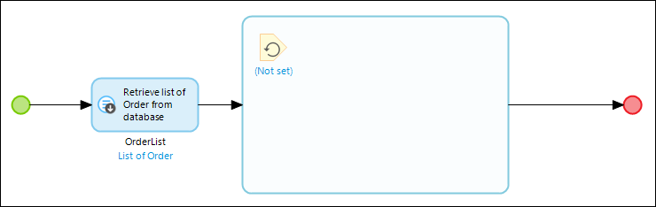

    {}

    For each object the flow inside the loop is executed. The flow starts at the element that has no incoming sequence flows. A loop can contain all elements used in microflows, with the exception of start and stop events. Additionally, a loop (and only a loop) can contain break events and continue events.

    The iterator which looks the same as an input object represents the variable that holds one element of the list for each iteration. Beneath it the name of the variable is shown in black and the type of the variable in blue. For more information take a look at this [documentation](/refguide7/loop?utm_source=businessmodeler&utm_medium=software&utm_campaign=modeler)

    {}

3.  Double click the loop activity and select the **OrderList** to iterate over.

    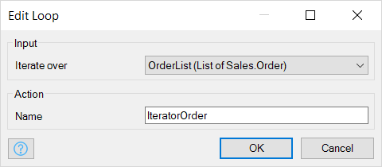

4.  Drag a **Change object** activity inside the loop:

    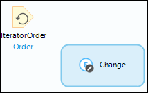

5.  Double click the **change activity** to open its properties.
6.  Select the **IteratorOrder** at the **Variable** drop-down menu and click the **New** button. This will open the **Edit Change Item** editor.
7. Set the following properties: 
    a. For **Member** select **Orderstatus**. 
    b. For **Value** enter `MyFirstModule.OrderStatus.Complete`. 

    

8. Click **OK**. Your properties screen should look like this:

    

9. Set **Commit** and **Refresh in Client** to **Yes** to commit your changes to the database and refresh your list in the client so your changes will be visible, then click **OK**. Your microflow should look like this:

    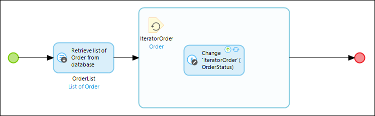

11. **Re-deploy** your application.
12. Click the **Set Processing to Complete** button. The orders with status 'Processing' will now be changed to 'Complete'.

    

## 4 Calculating a Total List Value Using a Variable and a Loop

In the previous section you iterated over a filtered list of objects using a 'Loop'. In this section you will use a loop to calculate the total sum of all your orders. To calculate this sum you will generate a variable, which will be changed for every iteration in the loop.  

1.  Add a new microflow button to your order data grid with the following details: 
    a. **Caption** of the button:  Calculate Total Order Price
    b. **Name** of the microflow: IVK_CalculateTotalPriceOrders
2.  In the new microflow, add a **Retrieve** activity for **Orders** and a loop for this list to the microflow.

    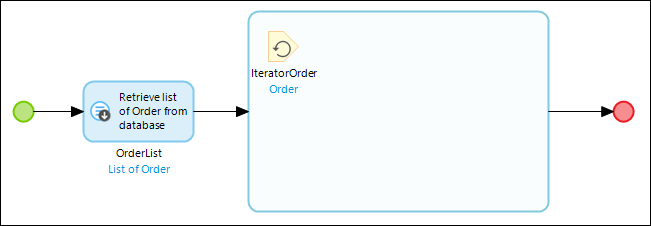

3.  Drag a **Create variable** before the Orderslist.

    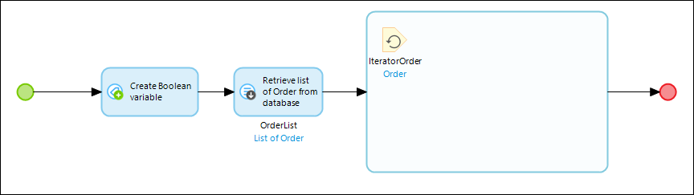

4.  Double click the **variable** to open its properties and set the following properties: 
    a.  For **Data type** select **Float**. 
    b.  In the value editor, enter `0`. 
    c.  For **Variable** enter *CalculatedTotalPrice*. 

    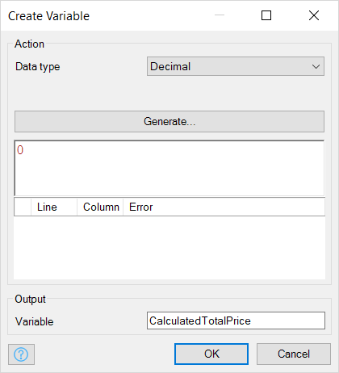
    
5.  Add a **Change** variable inside the loop.

    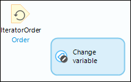

6.  Double click the **change** variable activity to open its **properties** and set the following properties: 
    a. For **Variable** select **CalculatedTotalPrice**. 
    b. For **Value** enter `$CalculatedTotalPrice + $IteratorOrder/TotalPrice`. 

    {}

    By iterating over the list, the price of every order will be added one by one to the 'CalculatedTotalPrice' variable

    {}

    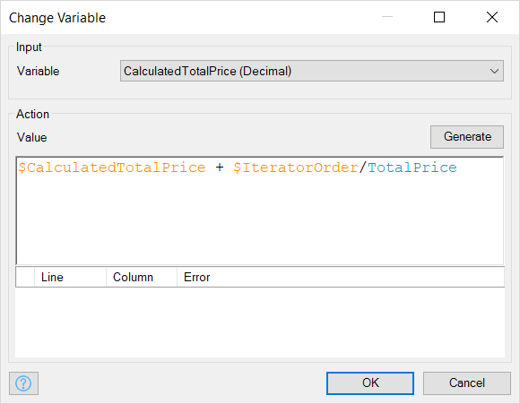

7.  Drag a **Show Message** action from the toolbox to the end of the microflow.
8.  Double-click the **message** activity to open its properties and set the following properties: 
    a.  For **Template** enter *Total calculated price: {1}*. 
    b.  For **Parameters** add `toString($CalculatedTotalPrice)`. 

    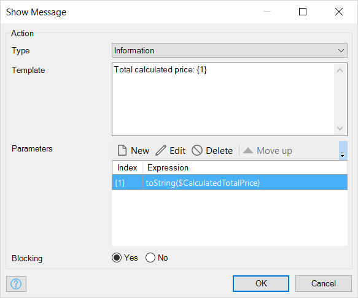

9. Click **OK**. You should see a Microflow like this:

    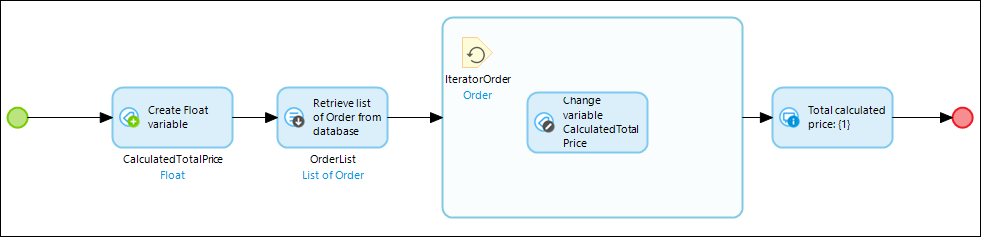

10.  **Re-deploy** your application.
11. Click the **Calculate total order price** button and you will see the price of all the orders added up.

    

## 5 Calculate a Total List Value Using an Aggregate Function

In the previous section you iterated over a list to add the value of single object to a total price variable. In this section you will use the 'aggregate list' function to calculate the total price instead of using a loop. The aggregate list can be used to calculate aggregated values such as the maximum, minimum, sum, average and total amount of objects over a list of objects.

1.  Open the **IVK_CalculateTotalPriceOrders** microflow and remove the loop and the **CalculatedTotalPrice** variable.
2.  Add an **Aggregate list** activity after the **Orderlist**.

    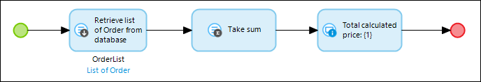

3.  Double click the aggregate list activity to open its properties and set the following properties: 
    a. For **Variable** select **OrderList**. 
    b. For **Function** select **Sum** (see the [documentation](/refguide7/aggregate-list) for the description of the other functions). 
    c. For **Attribute** select **TotalPrice**. 
    d.  For **Variable** enter a descriptive name like _SumTotalPrice_. 

    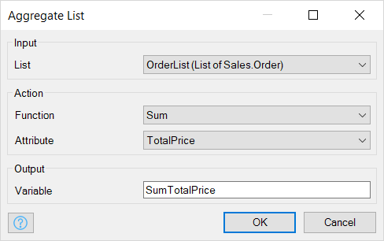

4.  Click **OK**.
5.  Double click on the message activity and replace the `$CalculatedTotalPrice` variable in the **Parameters** expression with the `$SumTotalPrice` variable.
    
    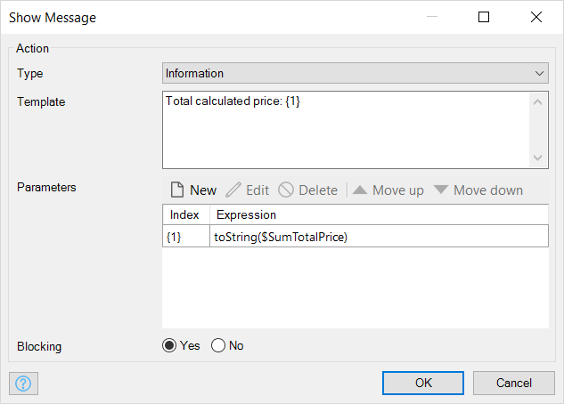

6.  Click **OK**. Your microflow should look like this:
    
    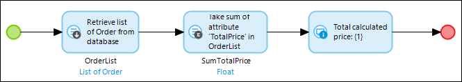

7.  Re-deploy your application.

8.  Click the **Calculate total order price** button and you will see the same price of all the orders added up.
    
    

## 6 Filter List of Orders on the City of the Associated Customers

In the previous sections you filtered the list of orders from database on attributes of the order entity itself. In this section you will constrain on attributes over the associated customer object. In the example of this section you will set the order status of all customers in Rotterdam to the status 'Complete'.

1.  Open the microflow **IVK_SetOrderToComplete**.
2.  Open the **OrderList** retrieve activity.
3.  Add an **XPath constraint** over the association to customer, constraining on the city (Rotterdam) of this customer.

    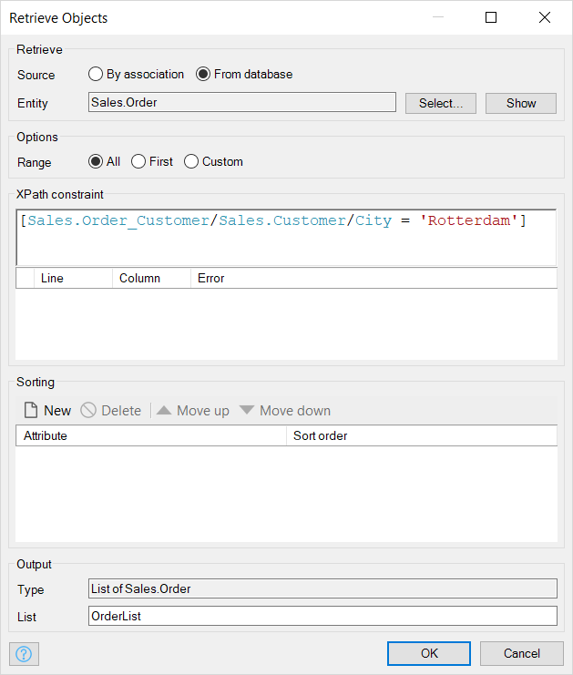

4.  Click **OK** and **re-deploy** your application.
5.  Open the application in the browser.
6.  Click the **Set Processing to Complete** button. All the orders from customers in Rotterdam are set to **Complete**.

    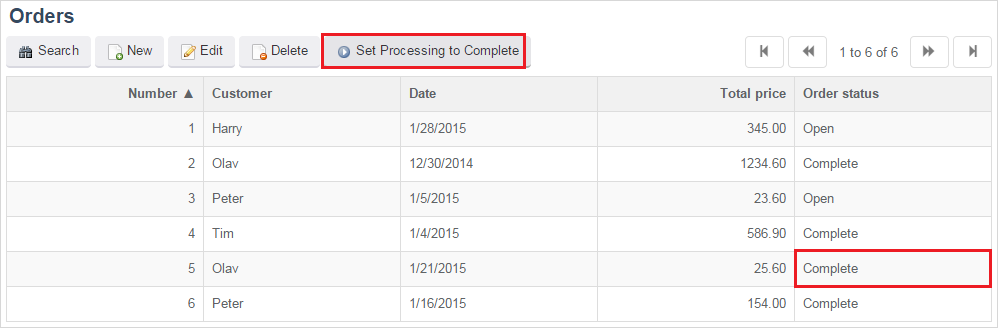

## 7 Related Content

*   [Defining access rules using XPath](define-access-rules-using-xpath)
*   [Extending Your Application with Custom Java](extending-your-application-with-custom-java)
*   [Working With Lists in a Microflow](working-with-lists-in-a-microflow)
*   [Triggering Logic using Microflows](triggering-logic-using-microflows)
*   [Creating a Custom Save Button](create-a-custom-save-button)
*   [Optimizing Retrieve Activities](optimizing-retrieve-activities)
*   [Error Handling](set-up-error-handling)
*   [Optimizing Microflow Aggregates](optimizing-microflow-aggregates)
*   [Extract and use sub microflows](extract-and-use-sub-microflows)
*   [XPath](/refguide7/xpath)
*   [XPath Constraints](/refguide7/xpath-constraints)
*   [Aggregate List](/refguide7/aggregate-list)
