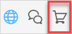
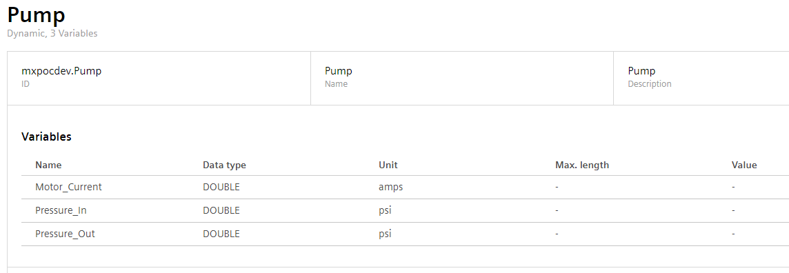
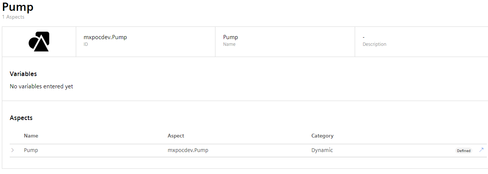
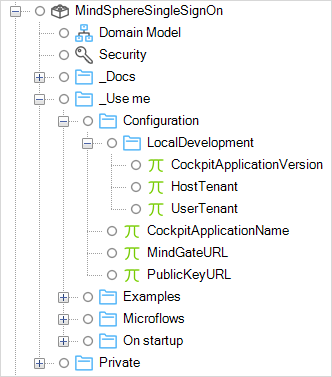
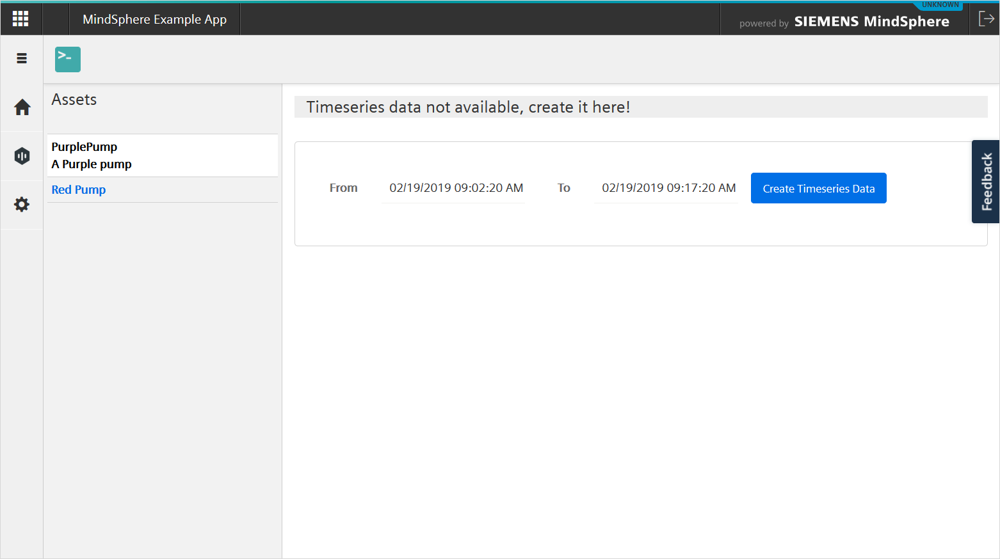

## 1 Introduction

You can write Mendix apps which analyze data held in MindSphere, the open, cloud-based IoT operating system from Siemens. To help you build your app, the **Pump Asset Example** app is available in the Mendix App Store and can be used as the starting point for a new Mendix app.

**ADD APP STORE LINK ABOVE**

This documentation provides more explanation of the MindSphere example app. Please note that this app is not production-ready. It is designed as an example of how you might begin to build a Mendix/MindSphere app.

You can get more detailed information on how to deploy your app to the MindSphere Platform in [Deploying to MindSphere](/developerportal/deploy/deploying-to-mindsphere).

## 2 Prerequisites

To deploy your app to MindSphere, you need the prerequisites described below.

### 2.1 Roles

You need a MindSphere user account on a developer tenant. This account needs the following core roles:

* mdsp:core:Developer
* mdsp:core:StandardUser
* mdsp:core:TenantUser

### 2.2 Opening the App in the Desktop Modeler

In the Desktop Modeler, follow these steps:

1. Open the Mendix App Store by clicking the icon in the top-left of the menu bar:

2. Enter *MindSphere* in the search box, and in the results, select {NAME}:

3. Click **Download** to start using this starter app:

### 2.3 Assets

This example app displays information about pumps. If there are no pump assets created yet for your tenant, you will need to create them using the MindSphere **Asset Manager** in the launchpad.

For this example app you will have to create Pump assets based on a **Pump** aspect with the following properties:

| **Name**       | **Data type** | **Unit** |
| -------------- | ------------- | -------- |
| Motor_Current | DOUBLE        | amps     |
| Pressure_In   | DOUBLE        | psi      |
| Pressure_Out  | DOUBLE        | psi      |

To create your assets perform the following steps:

1.  Login to MindSphere and go to the **MindSphere Asset Manager**.

    

2.  Select **Aspects**.

3.  Click **Create aspect**.

4.  Create a *dynamic* aspect called *Pump*.

5.  Set up the following variables:

    | **Name**       | **Data type** | **Unit** |
    | -------------- | ------------- | -------- |
    | Motor_Current | DOUBLE        | amps     |
    | Pressure_In   | DOUBLE        | psi      |
    | Pressure_Out  | DOUBLE        | psi      |

    The result should look like:

    

6.  Select **Types**.

7.  Click **Create Type**.

8.  Create a **BasicAsset** called *Pump*.

9.  Add the aspect *Pump* to the asset type.

    

10. Select **Assets**.

11. Click **Create asset**.

12. Select the type *Pump*.

13. Type the *Name* and click **Save**. Location information is optional.

14. Create more assets if required.

    You should now have one or more Pump assets which you can use in the example app:

    

More information on creating assets is available in the MindSphere [Asset Manager - System Manual](https://documentation.mindsphere.io/resources/html/asset-manager/en-US/index.html).

## 3 Deploying the Example App

To deploy the example app, you will need to configure the app, push it to Cloud Foundry, and set it up in the MindSphere launchpad.

These instructions are available in the deployment documentation: [Deploying to MindSphere](/developerportal/deploy/deploying-to-mindsphere).

### 3.1 App Configuration

Within the app, you will need to set the following constants correctly:

* CockpitApplicationName (the *Name* of your app in the MindSphere Developer Cockpit)
* MindGateURL
* PublicKeyURL

To deploy locally, you will need to configure the three constants above plus:

* CockpitApplicationVersion
* HostTenant
* UserTenant

### 3.2 User Scopes{#userscopes}

The example app has two Mendix user roles, *Admin* and *User*. These are mapped to the two application scopes *admin* and *user*. The MindSphere *user* role should be mapped to the *user* scope. The MindSphere *admin* scope should be mapped to both the *user* and *admin* scopes.

This means that a MindSphere user who is given the **Admin Role** for the app will be given the *admin* and *user* scopes and will therefore have the Mendix user roles *admin* and *user*.

### 3.3 Core Roles

To access the MindSphere APIs, the app needs to be given **Core Roles**. This Asset Management example app needs the following core roles:

* assetmanagement.standarduser – this allows the app to read or update assets and images, and to read asset types and aspect types in the Asset Management Service
* iot.timAdmin – this gives the app read, write and delete access to time series

{}
Without these core roles, the app will not have access to the asset management or time series APIs of MindSphere.
{}

For more information see the MindSphere documentation [Roles & Scopes for Applications](https://developer.mindsphere.io/concepts/concept-roles-scopes.html#asset-management).

## 4 MindSphere Pump Asset Example App

The **PumpAssetExample** module within the app uses the MindSphereAssetManagementConnector and MindSphere APIs, via Mendix native REST, to create and view time series information for an asset.

It is based on the standard Mendix starter app for Mendix version 7.22. It also has additional modules which are required for integrating with and deploying to MindSphere. These additional modules are:

* MindSphere SSO
* MindSphere Theme Pack
* MindSphere OS Bar Connector

The use of these modules is covered in more detail in [Deploying to MindSphere](/developerportal/deploy/deploying-to-mindsphere).

It also uses the **MindSphere Asset Management Connector**. This is described in section 6, [MindSphere Asset Management Connector](#assetconnector).

To use the app:

1.  View the app either from the MindSphere launchpad, or by running the app locally from the Desktop Modeler and clicking **View**.

2.  If you are not running from the MindSphere launchpad, log in to MindSphere using your MindSphere credentials. (If you are in the MindSphere launchpad, the app will use Single Sign-On to log you in automatically).

3.  Click **Go to Assets** to view a list of assets.

    

4.  If you are running locally, you will need to provide *Client ID* and *Client Secret* credentials for your app. If you are running in the MindSphere launchpad, you will be logged on using Single Sign-on.

5.  The assets are displayed using the **Get asset type by id** and **Get all assets** actions of the *MindSphere Asset Management Connector*.

6.  Click an asset.

    

7.  If no time series data is available, you will be asked to create it; click **Create Timeseries Data**.  
    This creates some sample data and uploads it to MindSphere using the REST API through Mendix's native REST functions.

8.  You will see the time series data which has been generated. This is retrieved from MindSphere, again using Mendix's native REST functions.

9.  Click on a magnifying glass to enlarge a time series chart.

    

    The enlarged chart can display three limit lines: Info, Warn, and Error. If you have an admin role in the app, you can configure these for your tenant.

10. Click the settings icon in the menu. You will only see this if you have the *admin* role.

    

    These values are held in the **LimitConfig** entity of the *PumpAssetExample* module domain model. When this entity is accessed, a constraint is used so that only the limits for the user's tenant are displayed. This enables the app to be multi-tenant.

## 5 Notes on App Design

### 5.1 Single Sign-on

The app uses Single Sign-on (SSO) to identify the user. This is initiated in the *Runtime* tab of the Project Settings, where the microflow *MindSphereSingleSignOn.RegisterSingleSignOn* is called on startup. This microflow sets up two configurations for the user.

#### 5.1.1 User role

The user is given the role of *user* or *admin* within MindSphere. These roles are translated to MindSphere scopes which are matched to the Mendix user role. With the recommended mapping, a user with the app role *user* in MindSphere will be given the Mendix user role *user*.

See section 3.2, [User Scopes, for a more complete description](#userscopes).

#### 5.1.2 Multi-tenant support

The user is also connected to their MindSphere tenant. This enables security to be placed on persistent Mendix entity objects.

MindSphere SSO provides the user’s tenant as the **Name** attribute in the **Tenant** entity.

By utilizing this value when an entity is accessed, the Mendix app can be made multi-tenant. Note that security has to be applied explicitly in the action which accesses the entity, it cannot be applied to the entity itself.

In this app there is a **Limit** entity which is a specialization of **MindSphereSingleSignOn.TenantObject**. This holds a set of limits which should be displayed on the time series chart. The limits are set for each tenant individually.

When the app needs to get a list of limits, it calls the sub-microflow DS_GetLimitConfigs which returns a list of all limits for this tenant. The **Retrieve Objects** action applies an XPath constraint to ensure that only objects for this user’s tenant are retrieved.

When the list of limits is required, this microflow is called to ensure that tenant-based security is applied.

### 5.2 Access Token

The Access Token action is called at the start of every microflow which accesses MindSphere. This refreshes the access token and ensures that errors are not introduced because the access token has expired.

### 5.3 Asset Management

Asset Management (retrieving assets and asset types) is performed using the MindSphere Asset Management Connector. This is described in section 6, [MindSphere Asset Management Connector](#assetconnector).

### 5.4 Native REST

The time series information is accessed using Mendix native REST. Native REST can also be used to access MindSphere using other APIs.

For instructions on how to use Mendix native REST see [How To Consume a REST Service](/howto/integration/consume-a-rest-service).

### 5.5 PUT Time Series

In ACT_PutTimeSeriesData, the timeseries data is created as a MindSphere time series using a native REST(PUT) action. It this is successful, MindSphere returns a 204 code and this is checked in the exclusive split *Put request completed successfully?*

However, MindSphere will queue this request internally and the data will not be available until MindSphere has processed the queue. To ensure that this does not impact the app flow, the sub-microflow DS_GetTimeSeriesDataWithRetry is called. This attempts to read the time series data back from MindSphere until either it is successful, or it reaches the maximum number of retries (set in the constant *MaxRetryAfterPutTimeSeries*). There is a delay between each retry which follows an increasing arithmetic series.

## 6 MindSphere Asset Management Connector{#assetconnector}

The MindSphere Example App uses the MindSphere Asset Management Connector to obtain asset information from MindSphere.

The MindSphereAssetManagementConnector module is the standard connector for managing assets within MindSphere. It can be found in the App Store modules of the example app. It is also available as a stand-alone module in the App Store: [MindSphere Asset Management Connector](https://appstore.home.mendix.com/link/app/108806/).

This module contains a Mendix domain model which maps the data structure of MindSphere assets. It also provides two microflow actions which can be used to retrieve assets and asset types from MindSphere:

* Get all assets
* Get asset type by id

These implement the *GET /assets* and *GET /assettypes/{id}* APIs described in the MindSphere documentation [Asset Management Service – API Specification Europe 1](https://developer.mindsphere.io/apis/advanced-assetmanagement/api-assetmanagement-api-swagger-3-9-0.html).

{}
To use these actions, the app must have at least the core role *mdsp:core:assetmanagement.standarduser* to allow it to read or update assets and images, and to read asset types and aspect types in the Asset Management Service.

For more information see the MindSphere documentation [Roles & Scopes for Applications](https://developer.mindsphere.io/concepts/concept-roles-scopes.html#asset-management).
{}

### 6.1 Asset Management Domain Model{#assetdm}

The two microflow actions populate the Asset Management Domain Model:

This domain model mirrors the asset manager data model, which is described in detail in the MindSphere documentation here: [Asset Management Service](https://developer.mindsphere.io/apis/advanced-assetmanagement/api-assetmanagement-overview.html). In addition, there is a **GetQueryParams** entity which is used to pass additional parameters to the microflows.

#### 6.1.1 GetQueryParams

A **GetQueryParams** object is used to control which objects which are returned. This object needs to be populated and passed to the microflow action. If no GetQueryParams object is passed, then the defaults are used.

GetQueryParams has the following attributes, which match the parameters of the APIs described on the MindSphere developer site here: [Asset Management Service – API Specification Europe 1](https://developer.mindsphere.io/apis/advanced-assetmanagement/api-assetmanagement-api-swagger-3-9-0.html).

| **Attribute** | **Description**                                                                                                    | **Default** | **Example**          |
| ------------- | ------------------------------------------------------------------------------------------------------------------ | ----------- | -------------------- |
| Page          | The page of objects requested, this enables you to retrieve a different page of objects                            | 0           | 2                    |
| Size          | The number of objects returned for each page, this allows you to control the number of items returned in each call | 10          | 15                   |
| Sort          | The name of the object attribute to sort the objects                                                               | name        | description          |
| Filter        | Additional filtering criteria                                                                                      | -           | Name contains "pump" |
| exploded      | For AssetType objects, specifies if all inherited Variables and Aspects should be included                         | false       | false                |

More information on pagination is available here: [Asset Management Service - Pagination](https://developer.mindsphere.io/apis/advanced-assetmanagement/api-assetmanagement-references-pagination.html).

More information on filtering functions is available here: [Asset Management Service - Filtering](https://developer.mindsphere.io/apis/advanced-assetmanagement/api-assetmanagement-references-filtering.html)

### 6.2 How to Use the Connector

The module adds two actions which a developer can use to retrieve Asset and AssetType objects, together with their associated Variable objects, from MindSphere using the API. You can find these actions in the **Toolbox** under *MindSphere Asset Management APIs*.

To use the MindSphere API, you must have an *Access token*. The *MindSphere SSO* module creates one for you by linking the Mendix user to a user set up in MindSphere and creating an access token which authorizes the user. For more information, see [Deploying to MindSphere](/developerportal/deploy/deploying-to-mindsphere).

{}
The MindSphere asset management actions should always be preceded by the **Access token** action, to ensure that the access token does not expire.

{}

#### 6.2.1 Get All Assets

The **Get All Assets** microflow action retrieves assets which, optionally, match a query. It returns a single object, of type *AssetsResponse*, which is associated with all the assets which match the query. It also returns objects of type **Location**, **AspectType**, and **Variable** which are associated with the assets.

It implements the API call .../api/assetmanagement/v3/assets?{Get query params}.

* Auth token – a string containing an access token, retrieved by the *Access token* action
* Get query params (optional) – an object of type **GetQueryParams** containing additional parameters for the query (see section 6.1, [Asset Management Domain Model](#assetdm), for more details)
* E tag (optional) – an integer which acts as a counter for optimistic locking
* Variable (AssetsResponse) – an object of type **AssetsResponse** which is associated with retrieved objects of type **Asset**, **Location**, **Page**, **Lock**, **FileAssignment**, **AspectType**, and **Variable** which contain additional information about these assets

This populates the following entities in the domain model:

* AssetsResponse
* Page
* Asset
* Location
* Lock
* FileAssignment
* AspectType
* Variable

For more information about these entities, and what is returned by the *GET /assets* API call, see the *Models* and *GET /assets* sections of the [Asset Management Service – API Specification Europe 1](https://developer.mindsphere.io/apis/advanced-assetmanagement/api-assetmanagement-api-swagger-3-9-0.html).

{}
By default, MindSphere limits the data returned to the first ten assets. This behavior can be modified through a GetQueryParams object.
{}

#### 6.2.2 Get Asset Type by ID

The **Get Asset Type By ID** microflow action gets a single asset type, using its **AssetTypeId**. It also retrieves all the following associated objects:

* Variable
* AspectType
* AspectTypeWrapper

It implements the API call .../api/assetmanagement/v3/assettypes/{Asset type id}?{Get query params}.

The parameters are as follows:

* Auth token – a string containing an access token, retrieved by the *Access token* action
* Get query params (optional) – an object of type **GetQueryParams** containing additional parameters for the query (see section 6.1, Asset Management Domain Model(#assetdm), for more details)
* E tag (optional) – an integer which acts as a counter for optimistic locking
* Asset type id – a string containing the value which should be matched to the _id attribute of the asset type required. This should be in the format {tenant}.{asset type}
* Variable (AssetType) – an object of type **AssetType** which is associated with retrieved objects of type **AspectTypeWrapper**, **AspectType**, and **Variable** which contain additional information about this asset type
