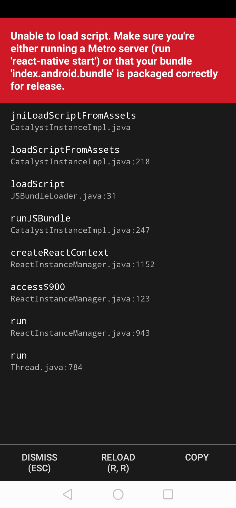
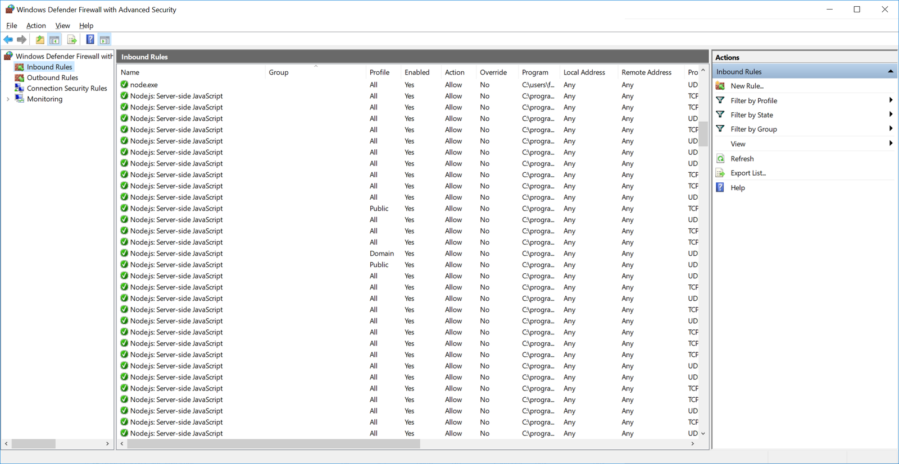

## 1 Introduction

Mendix strives to make building and running native apps as simple as possible. However, owing to the reality that third-party software and several steps are required for each native mobile app, problems arise. If you are having issues while building or running native mobile apps, please consult the sections below to see if your issue has already been solved.

## 2 Make it Native App

To troubleshoot issues related to the [Make it Native](/refguide/getting-the-make-it-native-app) app, see the sections below.

### 2.1 "Unable to Load Script"

Depending on your device settings and network characteristics, the Make it Native app can fail to connect to the runtime. If so, the make it Native app shows the following message:

This failure is often caused by the Windows Defender firewall. In such cases, attempts to open the runtime URL from the mobile browser will also fail. To mitigate this issue, please do the following:

1. Make sure that your computer and the mobile device are connected to the same network.
1. Make sure that incoming connections are allowed by doing the following:
    a. Open **Firewall & Network Protection** settings in Windows.
    b. Go to **Advanced Settings**.
    c. Select the **Inbound Rules** and scroll to the **Node.js** entries.
    d. For each Node.js entry, note their values in the **Program** column. They should all have a green check mark in front of them. 
    e. If the **Program** column shows a Mendix installation directory, then there should be a green icon in front of the entry. If this is not the case, double-click the entry and select **Allow the connection**:
    
    

1. Windows distinguishes between two types of networks: private and public. Windows Defender Firewall applies stricter regulations for public networks. If, and only if, you are connected to a trusted network, configure the network as **Private** on your computer.

### 3 Read More

* [How to Debug Native Apps (Advanced)](native-debug)
* [Native Builder Reference Guide](/refguide/native-builder)
