## 1 Introduction

Mendix has great tools for debugging web applications, including the offline and online debugger, but a lot of people don’t know that these tools can also be used to debug and test mobile applications.

**This how-to will teach you how to do the following:**

* Build and run a Mendix mobile app that connects to your local development machine
* Debug the mobile app using Mendix debugging tools, Chrome DevTools and the Safari Web Inspector

## 2 Prerequisites

Before starting this how-to, make sure you have completed the following prerequisites:

* Ensure that you have a network utilities tool on your mobiledevice (I use [PingTools](https://play.google.com/store/apps/details?id=ua.com.streamsoft.pingtools) on Android, and [NetworkPing Lite](https://itunes.apple.com/us/app/network-ping-lite/id289967115?mt=8) on iOS) in order to ensure connectivity between your device andyour computer
* Ensure that you have an Adobe ID that you can use to sign in to PhoneGap Build ([https://build.phonegap.com/apps](https://build.phonegap.com/apps))
* You need a paid Apple Developer Membership - see [Apple Membership](https://developer.apple.com/support/membership/) for more details

## 3 Mendix and PhoneGap <a name="MendixAndPhonegap"></a>

Before we begin, it’s important to understand how Mendix Hybrid Mobile apps work, and the relationship between the Mendix application and the PhoneGap service. [Adobe PhoneGap](https://phonegap.com/) provides a way for users to create mobile applications using web technologies, like Mendix. PhoneGap (PG) essentially creates a wrapper for a Mendix application that is recognized and treated like a native application by mobile platforms. All your application’s logic, appearance, and functionality are controlled by Mendix. PhoneGap then, in a way, *translates* these aspects of your application into a language that can be understood by Android and iOS. That being said, there are some facets of your application’s configuration that need to be configured in the PhoneGap application and not in Mendix. We’ll return to this a little later.

The basic function of the PhoneGap app is to ensure that all the necessary libraries (called PhoneGap Plugins) are loaded and available to the application, and then initialize the Mendix application from a target URL. As soon as the Mendix app has been initialized, the app’s Mendix logic then takes over. There are a couple of benefits that we, as Mendix developers, gain from the fact that the PhoneGap app initializes based on a URL: One, changes that we make to the application logic do not require a full rebuild of both the Mendix app and the PhoneGap app (just the Mendix one); and two, that we can instruct the PhoneGap app to initialize based on an IP address (rather than the production URL) and debug a mobile application running locally on our laptop, in order to further increase the speed of our iterations.

## 4 Android and macOS <a name="AndroidMac"></a>

This is perhaps the easiest combination of mobile target platform and development environment to get to work. 

### 4.1 macOS Configuration

Since the Mendix Modeler only runs on Mendix, we need to make sure that your virtual (windows) machine can be accessed by the outsideworld. To do that, the network setting much be shared between the virtual machine and your Mac, and the appropriate ports forwarded. Follow these steps to configure your development environment with Parallels:

1. Open the Parallels **Configure** dialog.

      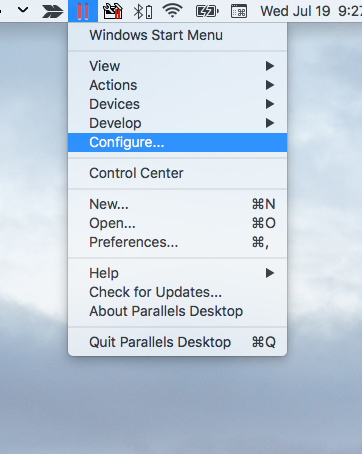
      
2. Go to the **Hardware** tab.

      

3. Make sure that the **Source** for **Network 1** is set to **Shared Network**. Click the lock to make changes.

4. Open the Parallels **Preferences** dialog.
      
      

5. Go to the **Network** tab.
6. Make sure that the **Connect Mac to this network** option is checked.

       |

7. Click **+** button at the bottom of the page to add a new Port Forwarding Rule with the following settings:
      * Protocol: *TCP*
      * Source Port: *8080*
      * Forward to: *Win10*
      * Destination Port: *8080*
      
      
      
8. Add another rule, this time forwarding port *8090*.

9. Start the Mendix app locally, and verify that your mobile device can ping your development machine.

10. Find the local IP of your development machine on your network by going to **settings > network**.

      

11. Verify that your device can ping this address:

      

### 4.2 PhoneGap Configuration

You can use PhoneGap Build to build the native application and tell it to intialize based on this new URL, rather than the default. Follow these steps to download a package, update it, and upload it to PhoneGap Build: 

1. Go to home.mendix.com and open your app.
2. Go to the **Mobile App** page.
2. Configure this page as you normally would and then click **Publish for Mobile App Stores**.
      
      

3. Select **Do it Yourself** and then click **Download Customizable Package**.
      
      

4. Extract the downloaded package and then navigate to the `/dist/` folder.
      
      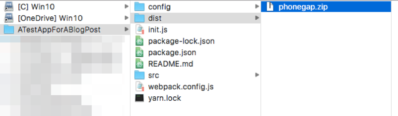

5. Extract the contents of the **phonegap.zip** file and open the `www/settings.json` file.
      
      

6. Change the `url` property to the IP address of your local machine, with the port 8080.

   ```javascript
   {
     "url": "http://10.140.149.92:8080",
     "hybridTabletProfile": "",
     "hybridPhoneProfile":  "",
     "enableOffline": false,
     "requirePin": false
   }
   ```

7. Save your changes and zip the unzipped phonegap.zip files you just extracted.
   
      

8. Upload the new zip file to a new app on PhoneGap Build.
   
      

9. When your app has finished building in the cloud, download it and run it to connect to your Mendix app running on your local machine.

### 4.3 Android Configuration

1. Enable the developer options on your Android device. See [Configure On-Device Developer Options](https://developer.android.com/studio/debug/dev-options.html#enable) for more information.
2. Connect your device to your development machine and when the popup appears on your mobile device to allow USB debugging, choose **Allow**.
      
      
  
3. Open the **Chrome** browser.
4. Open the **Chrome Developer Tools (F12)**.
5. Click the options icon (vertical ellipsis) and select **More tools** > **Remote devices**.

   
   
4. Select your device from the list.

   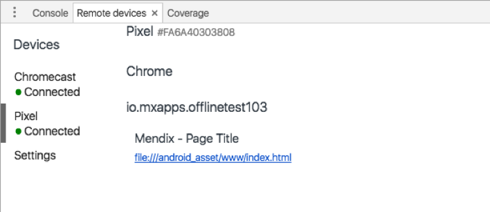
   
5. Inspect the tab from your mobile device to preview the view from your device on-screen and to gain access to the Chrome web inspector and the rest of the Developer Tools.

You can now take advantage of all the debugging tools you know and love with Mendix, including offline breakpoints, quick updates/refreshes, and the Chrome Developer Tools.

## 5 iOS and macOS <a name="iosAndMac"></a>

### 5.1 Apple Developer Configuration

In order to build (and debug) a Mendix iOS app, you need to ensure that you have the right setup in your Apple Developer Account. You'll need a Developer Provisioning Profile that includes your device ID and a Signing Certificate. If you already have an iOS Development provisioning profile, you can continue with [5.2 PhoneGap Configuration](#PhonegapConfiguration). Follow these steps to set up an iOS provisioning profile:

1. Go to [developer.apple.com](https://developer.apple.com/) and log in to your account.
2. Click **Certificates, IDs & Profiles** in the left-hand navigation.
3. Click the `+` button to create a new certificate.
4. Select **iOS Development** and click **Continue**.

      
   
4. Follow the instructions to create a Certificate Signing Request (CSR) and click **Continue**.
   
      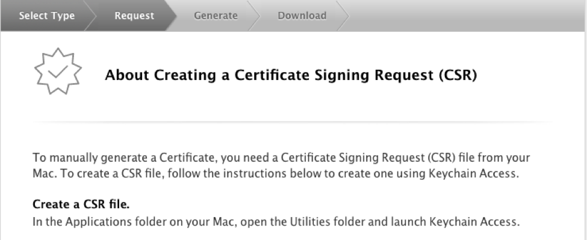
   
5. Upload your new CSR and click **Continue**.

      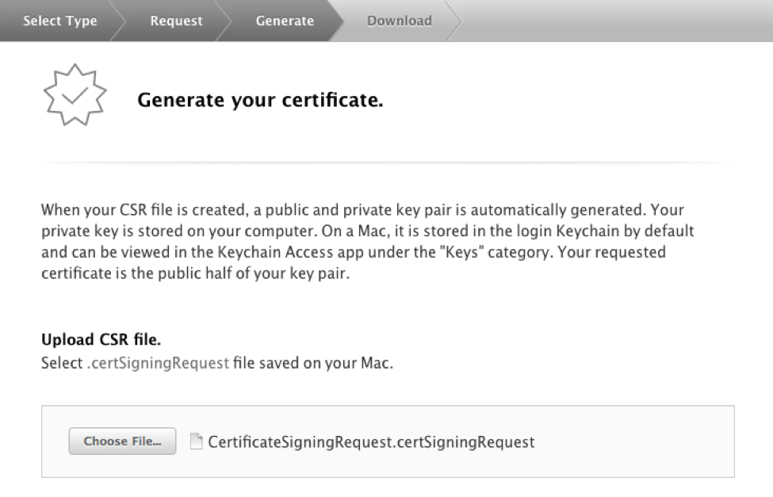
   
6. Download your new certificate and click **Done**.

      
   
7. On your Mac, open **Keychain Access** and select **Import Items…** from the **File** menu.

      
   
8. Select your new certificate.

      
 
9. Right-click on the certificate in the list of certificates and select **Export**.

      
    
10. Save this as a **.p12** file, and remember this for later. You'll need this to build your Phonegap application.

      
    
11. Return to the **Certificates, Identifiers & Profiles** page.
12. Navigate to the **App IDs** page, located under **Identifiers**.
13. Click the `+` button to create a new **App ID**.
14. Enter an **App ID Description** and **Explicit App ID** and select the necessary Apple services your app will need, then click **Continue**.

      
    
15. Click **Register**, then **Done**.
16. Connect your iOS device and open **iTunes**.
17. Navigate to your device overview in iTunes, and click where it lists the serial number to reveal the UDID.

      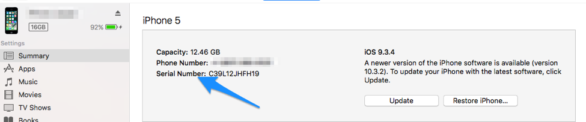
    
18. When you see the UDID, right-click it and select **Copy**.

      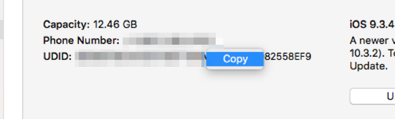
    
19. Return to the **Certificates, Identifiers & Profiles** page and navigate to the **All** page under **Devices**.
20. Click the `+` button to add a new device.
21. Enter a name for the device and paste the UDID.

      
    
22. Navigate to **All** under **Provisioning Profiles**.
23. Click the `+` button to create a new Provisioning Profile.
24. Select **iOS App Development** and click **Continue**.

      
    
24. Select your new **App ID** from the dropdown and click **Continue**.

      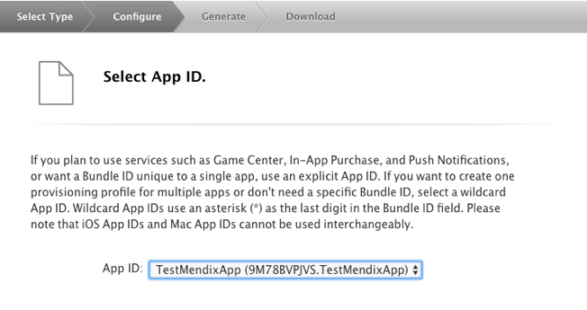
      
25. Select your new Certificate and click **Continue**.

      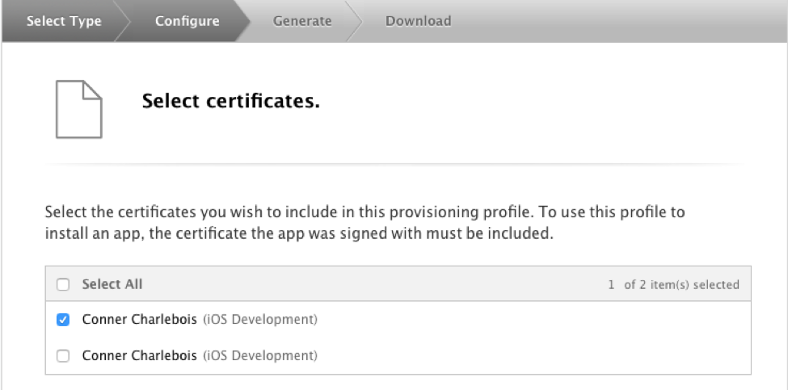
    
26. Select the devices you want to test your app and click **Continue**.

      
    
27. Give you new Provisioning Profile a name and click **Continue**.

      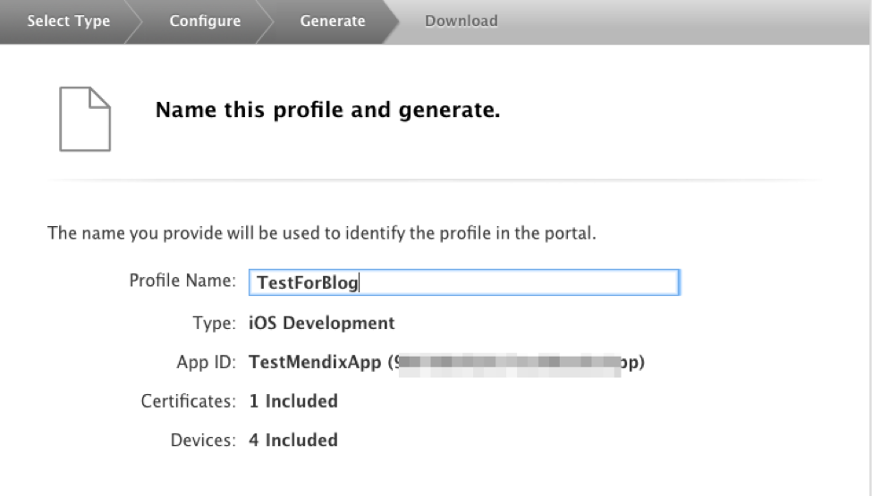
    
28. Download your Provisioning Profile (you'll need this for Phonegap).


### 5.2 Phonegap Configuration <a name="PhonegapConfiguration"></a>

You can use PhoneGap Build to build the native application and tell it to intialize based on this new URL, rather than the default. Follow these steps to change the PhoneGap Build

1. Go to **home.mendix.com** and open your app.
2. Navigate to the **Mobile App** page, listed under Deploy.
3. Configure this page as you normally would and click **Publish for Mobile App Stores**.

   

4. Select **Do it Yourself** and click **Download Customizable Package**.

   

5. Unzip the downloaded package and navigate to the `/dist/phonegap.zip` file.

      

6. Extract the contents of this file and find `www/settings.json`.

   

7. Change the `url` property to the IP address of your local machine, with the port 8080.

   ```javascript
   {
     "url": "http://10.140.149.92:8080",
     "hybridTabletProfile": "",
     "hybridPhoneProfile":  "",
     "enableOffline": false,
     "requirePin": false
   }
   ```

8. Save your changes and rezip the `phonegap/` directory in `/dist/`.

   

9. Upload the new zip file to a new app on Phonegap Build.

   

10. Navigate to **Edit Account** from the account menu.

   

11. On the **Signing Keys** tab, click **Add a Key** under **iOS**.

 

12. Choose your .p12 certificate (from Step 12 in the Apple Developer Configuration) section and your enw provisioning profile.

    

13. Click the lock to temporarily unlock your key.

    

14. Return to the app online and choose your new key from the dropdown. This will trigger a new build of your app.

    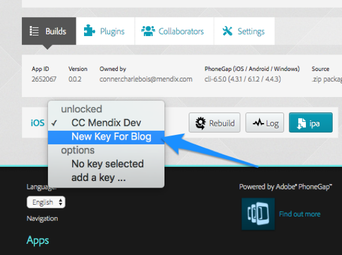

15. When your app finishes building in the cloud, scan the QR code to download the app and run it on your iOS device.

### 5.3 iOS Configuration

1. Go to **Settings > Safari** on your iOS device.

   
   
2. Select **Advanced**.

   
   
3. Ensure that **Web Inspector** is turned on

   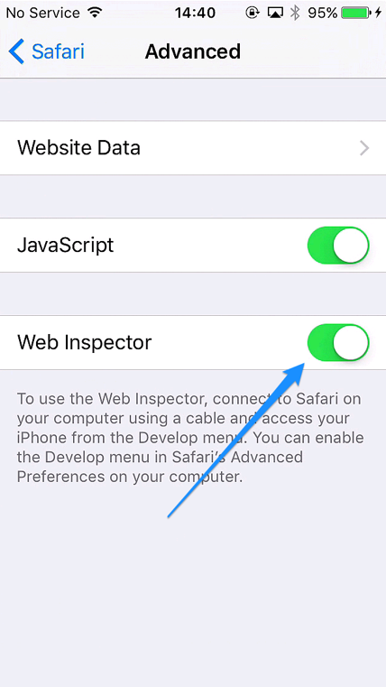
   
4. Ensure that your iPhone can ping your development machine (if you haven't already)

   
   
5. Return to the running Mendix app on your iOS device.
6. Open Safari on your Mac.
7. If you don't have the **Develop** option on your menu bar, open **Safari > Preferences**.

   
   
8. On the **Advanced** tab, ensure that **Show Develop Menu in menu bar** is checked.

   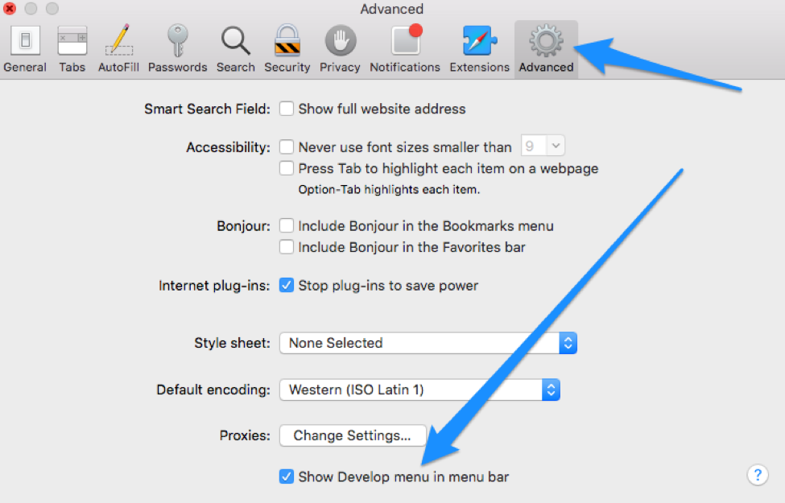
   
9. From the Develop menu, select your device and running application.

   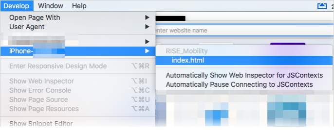
   
10. This will bring up the **Safari Web Inspector** for your device! 

## 6 Android + Windows <a name="AndroidAndWindows"></a>

### 6.1 Windows Configuration
Follow these steps to test your computer's connection to your device:

1. Open the command prompt and type `ipconfig /all` and find the IPv4 address of your wireless adapter.

   
   
2. Verify that your device can ping this address.

   

### 6.2 PhoneGap Configuration
You can use PhoneGap Build to build the native application and tell it to intialize based on this new URL, rather than the default. Follow these steps to create a new configuration:

1. Go to **home.mendix.com** and open your app.
2. Navigate to the **Mobile App** page under Deploy.
3. Configure this page as you normally would and then choose **Publish for Mobile App Stores**.

      
      
4. Select **Do it Yourself** and then click **Download Customizable Package**.

   

5. Unzip the downloaded package and navigate to the `/dist/phonegap.zip` file.

   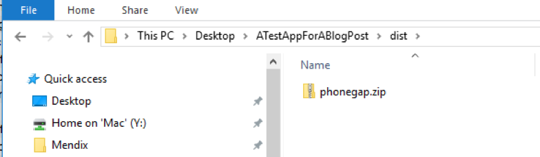

6. Extract the contents of this file and find `www/settings.json`.

   

7. Change the `url` property to the IP address of your local machine, with the port 8080.

   ```javascript
   {
     "url": "http://10.140.149.92:8080",
     "hybridTabletProfile": "",
     "hybridPhoneProfile":  "",
     "enableOffline": false,
     "requirePin": false
   }
   ```

8. Save your changes and rezip the `phonegap/` directory in `/dist/`.

   

9. Upload the new zip file to a new app on Phonegap Build.

   

10. When your app finished building in the cloud, download the app and run it to connect to your Mendix app running on your local machine!

##### Android Configuration

1. Enable the developer options on your Android device. See [Configure On-Device Developer Options](https://developer.android.com/studio/debug/dev-options.html#enable) for more information.
2. Connect your device to your development machine and when the popup appears on your mobile device to allow USB debugging, choose **Allow**.
      
      
  
3. Open the **Chrome** browser.
4. Open the **Chrome Developer Tools (F12)**.
5. Click the options icon (vertical ellipsis) and select **More tools** > **Remote devices**.

   
   
4. Select your device from the list.

   
   
5. Inspect the tab from your mobile device to preview the view from your device on-screen and to gain access to the Chrome web inspector and the rest of the Developer Tools.

You can now take advantage of all the debugging tools you know and love with Mendix, including offline breakpoints, quick updates/refreshes, and the Chrome Developer Tools.

For more help with Android remote debugging, check out [Get Started with Remote Debugging Android Devices](https://developers.google.com/web/tools/chrome-devtools/remote-debugging/).

