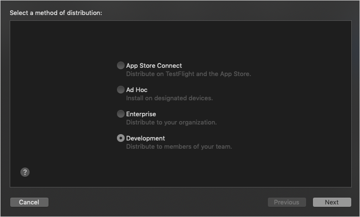
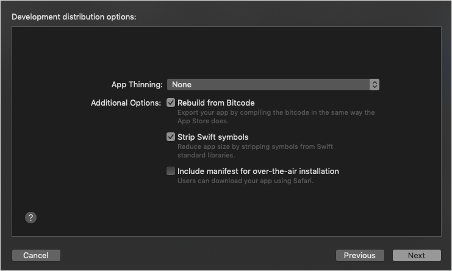
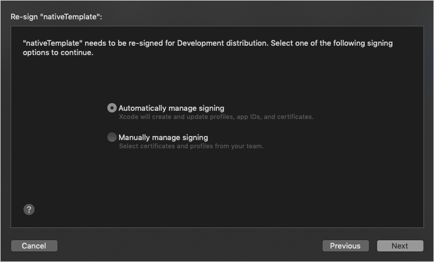
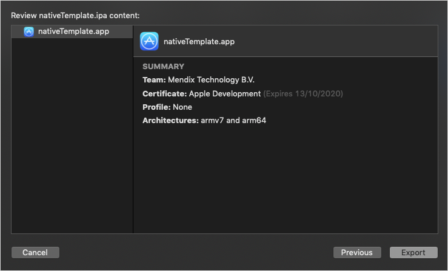

## 1 Introduction

This how-to will teach you how to go from a blank slate to an app running on a device.

The Mendix Native Mobile Builder is the UI tool to set up and build your Mendix Native Mobile Apps. It is directly accessible in Mendix Studio Pro v8.15 and above versions for all projects with a native mobile navigation profile.

## 2 Prerequisites {#prerequisites}

Before starting this how-to, make sure you have completed the following prerequisites:

* Mendix Studio Pro 8.15 or later installed using the online installer. The offline installer does not include the Mendix Native Mobile Builder dependency.
* Read [How to Get Started with Native Mobile](/howto/mobile/getting-started-with-native-mobile) to see how to create, style and debug an application with Mendix Studio Pro
* Deploy your native mobile app to the cloud via Studio Pro and have the cloud address of your deployed application available
* A [GitHub](https://github.com/) account.
* An [App Center](https://appcenter.ms/) account. We recommend a paid account if you will be building and deploying regularly.

### 2.1 Platform-Specific Prerequisites

If you plan to deploy your app for testing on an iOS device, make sure you have completed the following prerequisites:

* Register for an Apple Developer Account
* Have an iOS device for testing the iOS package that will be produced
* Have an iOS deployment certificate and a provisioning file for which your device is activated
* Have Xcode installed on your computer for deploying the iOS package to your test device

If you plan to deploy your app for testing on an Android device, make sure you have an Android device available.

## 3 Getting Your Tokens

To use the Native Builder, you will first need to get tokens to authenticate with GitHub and App Center. If you already have tokens for your GitHub and App Center, you do not need to complete these sections.

### 3.1 GitHub Token {#github-token}

1. Go to [GitHub](https://github.com/) and sign in.
2. Go to [Settings](https://github.com/settings/profile) by clicking your profile picture in the top-right corner of the page.
3. Click [Developer settings](https://github.com/settings/apps) at the bottom of the left menu.
4. Navigate to [Personal access tokens](https://github.com/settings/tokens) and then click **Generate new token** to create a new personal access token.
5. In the **Note** field, write *Native Builder*.
6. Under **Select scopes**, select **repo**.
7. Click **Generate token**.
8. Store your token in a secure place. You will not be able to see it again. If you lose it, you will have to create a new token and delete your old one.

### 3.2 App Center Token {#appcenter-token}

1. Go to [App Center](https://appcenter.ms/apps) and sign in.
2. Click your profile icon in the top-right corner, then click **Settings**, and then **Account Settings**.
3. In the **API Tokens** tab, click **New API token**.
4. Add a description of your token, select **Full Access**, then click **Add new API token**, and then **New API Token**.
5. Store this token in a secure place as well. You will not be able to see it again. If you lose it, you will have to create a new token and delete your old one.

## 4 Build your native App

{}
The Mendix Native Mobile Builder needs to communicate with GitHub and App Center. Therefore, make sure your firewall permissions do not restrict the tool.
{}

From Mendix Studio Pro:

1. Navigate to the Project and then Build Native Mobile App:

   {}{}

1. When Mendix Native Mobile Builder launches you are greeted with the home screen:

   {}{}

1. Select Build app for distribution.
1. Fill in the app name, the app identifier. By default the wizard provides some defaults, but you might want to align the app identifier to use your company's reversed URL, or change the app name to something besides the project name:

   {}{}

1. Click **Next Step** when ready.
1. In the **Tokens** screen fill in your GitHub and App Center API token. The tool will verify the tokens grant sufficient access to valid accounts and notify you if they do not:

   {}{}

1. Click **Next Step** when ready.
1. Select **Choose your icon** if you already have an image you would like to use as an icon, or just continue if you are satisfied using the default image. You can change app icon later if you wish:

   {}{}

1. Click **Next Step** when ready.
1. Select **Choose your splash screen** if you already have an image you would like to use as a splash screen, or just continue if you are satisfied using the default image. You can change the splash screen later if you wish:

   {}{}

1. Click **Next Step** when ready.
1. Drag and drop your custom fonts onto the field if you already have a selection of fonts you would like to use, or continue if you do not need to add custom fonts. You can add custom fonts later if you wish:

   {}{}

1. Click **Next Step** when ready.

You have now completed the mandatory basic configuration needed to be able to build your project and should be in the **Build app for distribution** step:

   {}{}

1. Fill in an intentional version number. For defaults, we reccomend the following guidelines:

* Versions lower than 0.5.0 for alpha
* Versions ranging from 0.5 to 0.9.x for beta
* Versions starting from 1.0.0 for release.

1. Fill in your **Runtime URL**. It can be the IP of your local machine if you plan on testing against a locally running Mendix Studio Pro installation. If you deployed your app already to Mendix Cloud, you can point it to the URL of the deployed runtime as found via the Cloud Portal.
1. Click the **Build** button to start the build.
1. The tool will setup your GitHub repository commit your changes, configure App Center with two new projects, one for iOS and one for Android and continue with building the apps:

   {}{}
   {}{}

1. When the build completes, you can scan the QR code provided to install the app to your device. Currently the QR code service is only supported for Android devices:

   {}{}

## 5 Signing your apps {#signing-a-build}

By default, App Center builds are unsigned and cannot be released on the Google Play Store or the Apple App Store. To release your apps, you must provide your signature keys to Mendix Native Mobile Builder. Signature keys prove the authenticity of your app and prevent forgeries. For more information to how to acquire these keys, see the [Managing App Signing Keys Reference Guide](/refguide/managing-app-signing-keys).

### 5.1 Set up signing for iOS {#signing-for-ios}

iOS Support two type of signing configurations. Development and Release. The type of the build depends on the type of Provisioning file and Certificate that was used for configuring the tool.

1. From within Mendix Native Mobile Builder, choose iOS under Certificates:

   {}{}

1. Upload your provisioning file and P12 certificate and type in your password. The tool will verify that:

* The app identifier of the app is included in the Provisioning file
* The Certificate is included in the Provisioning file
* The password can unlock the certificate

   If it errors, please correct the issue and try again:
   
   {}{}

1. Click **Save**.

With that you have completed setting up signing for iOS and the next build will use the provided configuration to sign the iOS app.

### 5.2 Setup signing for Android {#signing-for-android}

1. From within Mendix Native Mobile Builder, choose Android under Certificates:

   {}{}

1. Upload your keystore file and provide the keystore password, the key alias and the key password as defined when setting up the keystore. The tool will verify that:

   * The keystore password is valid
   * The key alias exists in the provided keystore

   If it errors, please correct the issue and try again:
   
   {}{}

1. Click **Save**.

With that you have completed setting up signing for Android and the next build will use the provided configuration to sign the Android app.

## 6 Distributing {#distributing}

For distributing your binaries, setup, signing for [iOS](#signing-for-ios) and [Android](#signing-for-android) using your release certificates and keystore and build your binaries.

For distributing to a specific platform, see the subsequent sections below:

* [Distributing for Android](#android-distributing)
* [Distributing for iOS](#ios-distributing)

### 6.1 Distribute the iOS app to App Store Connect {#ios-distributing}

Depending if you choose to sign your iOS app or not, the output of the build will result to be an IPA or XCArchive, respectively. IPA files can be directly distributed to App Store Connect for further processing. XCArchives require XCode to sign and generate an IPA before they can be further processed.

#### 6.1.1 Distribute a signed IPA

To be able to upload your app to App Store Connect, you will have to have setup a new app via the App Store Connect website using the name and app id you used to build the app. Follow the [App Store Connect Guide to adding a new app](https://help.apple.com/app-store-connect/en.lproj/static.html#devbec4892b7) for a how to.

When signing your iOS app a file of type IPA is generated. To upload an IPA to the App Store, XCode includes a command line tool. Assuming XCode is installed and the extra Command Line tools setup, the command to upload the IPA is the following:

    ```
    xcrun altool --upload-app --type ios --file "path/to/application.ipa"
    --username "YOUR_APPSTORE_USER_EMAIL" --password "YOUR_APPSTORE_PASSWORD"
    ```

Replace the filepath with the absolute path to the IPA file, the username with your developer app store email address and password with the respective password.

The command will first verify your IPA is well packaged and ready to be shipped and will then upload it to TestFlight for further processing.

#### 6.1.2 Distributed an unsigned XCArchive

Local signing is useful if you only want to test your app on a device, or you do not have a distribution certificate and have run out of build minutes on App Center when signing with a developer certificate.

In order to deploy the _nativeTemplate.xcarchive_ on a device or on the App Store, an Apple developer account and a development team is required. If one is available, do the following:

1. Using Xcode, double-click the _nativeTemplate.xcarchive_ file and it should open with the built-in *Application Loader* software.
1. Click the _Distribute App_ button to start the local signing flow.:

   {}{}

1. Select **Development**:

   {}{}{}

1. Choose a **Development Team**:

   {}{}

1. Configure your **Development distribution options**:

   {}{}

1. Select a re-signing option:

   {}{}

1. Review your *.ipa* content and click **Export**:

   {}{}

1. Congratulations. You now have a signed _.ipa_ file:

   {}{}

### 6.2 Distribute the Android app to Google Play {#android-distributing}

A signed Android APK can be uploaded to Google Play store directly. For more info on setting up a new app and uploading your binaries follow Google's guide on [Uploading an app](https://support.google.com/googleplay/android-developer/answer/113469?hl=en).

## 7 Read More

* [How To Get Started with Native Mobile](/howto/mobile/getting-started-with-native-mobile)
