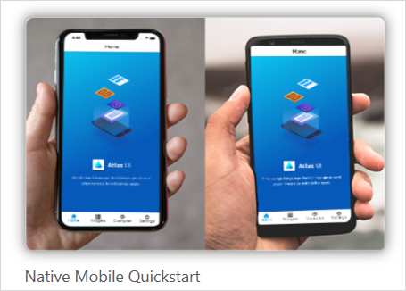
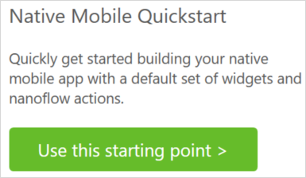
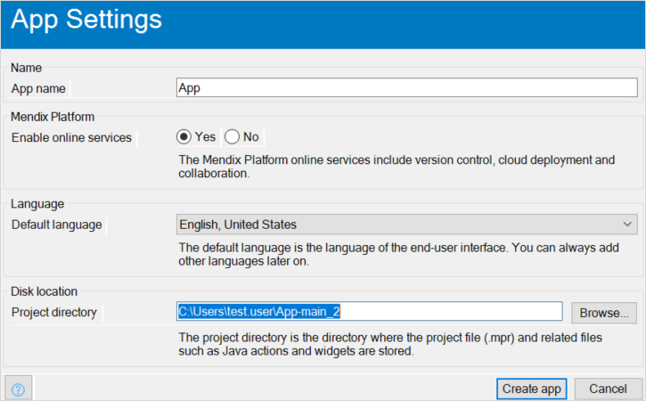
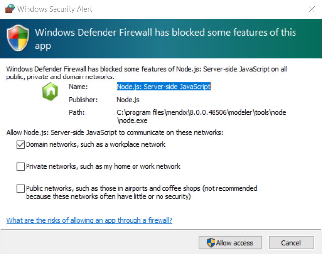
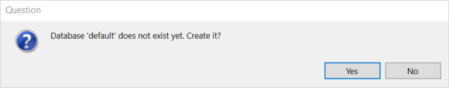
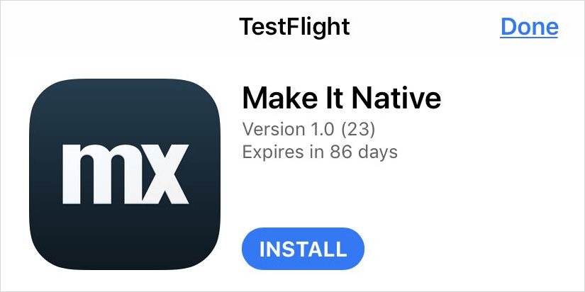
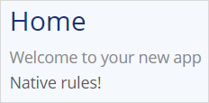

## 1 Introduction

{} With next release, also Mention that also possible using blank app or add to existing app project, and how to (because Atlas needs to be updated) {}

To use Mendix Studio Pro's native app capabilities, you can use the [Native Mobile Quickstart](https://appstore.home.mendix.com/link/app/109511/) app from the Mendix App Store. This app is optimized to quickly build a native mobile app. Out of the box, this app gives you a native page, a native phone profile to enable native device navigation, a native layout with menus, and native widgets and actions which leverage device capabilities.

The Native Mobile Quickstart app also includes four modules:

* **Administration** – helps you manage users
* **Atlas UI Resources package** – allows for app styling
* **Nanoflow Commons** – contains generic useful nanoflow actions
* **Native Mobile Actions** – contains various native widgets and nanoflow actions that leverage device capabilities

## 2 Prerequisites {#prerequisites}

Before starting this how-to, make sure you have completed the following prerequisites:

* Have a mobile device to test your native app 
* For information on device requirements, see [System Requirements](/refguide/system-requirements)
* If you wish to use an emulator for Android mobile testing, install a product such as [Bluestacks](https://www.bluestacks.com/nl/index.html) or [Genymotion](https://www.genymotion.com/) (your emulator must have Google Play services supported)

## 3 Creating a New Project Based on the Quickstart App{#quickstartapp}

{}[add Apple App Store link to MakeItNative app]{}

For details on making a Mendix app using the Native Mobile Quickstart app template, download the [Make It Native](https://play.google.com/store/apps/details?id=com.mendix.developerapp) app. Using the Make It Native app to view the changes to your Mendix app, see the sections below.

### 3.1 Starting a Quickstarter App Project

To start a new app based on a template, follow these steps:

1.  Open Mendix Studio Pro. Select **File** > **New Project** , and then select the Native Mobile Quickstart app: 

	{}{}

2.  Next, click **Use this starting point**:

	

3.  Click **Create app** to close the dialog box:

	{}{}

4.  Click **Run Locally** to see the app in action:

	

5.  After running your app, you may see a Windows Security Alert dialog box. Accept the permissions selected by default and click **Allow access** to close the dialog box: 

	{}{}

6.  If asked to create database **'default'**, click **Yes**:

	{}{}

At this point you have a running native app. To view your app on a mobile device, however, you need to download the Make It Native app.

### 3.2 Downloading and Installing the Make It Native App

{}The sections below describe two options for doing this. #### Option 2: Using Mendix Studio Pro NOT AVAILABLE YET, SO REMOVE (INCLUDING INTRO)

Alternatively, you can navigate to the Make It Native app using Mendix Studio Pro: 

1. In Mendix Studio Pro, click the drop-down menu next to the **View button**, and then click **View in the Mendix App**.
2. This will bring up a dialog box. In the **Native mobile** tab, click either **Go to play store** or **Go to app store** to be brought to the Google Play Store or Apple App Store pages for the Make It Native app.
3. In the Apple or Android app store, you can download the Make It Native app to your device.{}

{}[replace screenshot below with two app store screens when they get new logos?]{}

{}Remove alert when app is added to Apple App store {}

#### 3.2.1 Downloading for Android

To view your app on an Android device (or emulator), you must download and install the Make It Native app from [Google Play](https://play.google.com/store/apps/details?id=com.mendix.developerapp):

{}{}

#### 3.2.2 Downloading for iOS {#downloading-for-ios}

To view your app on a iOS device, you currently need to use TestFlight to install the Make It Native app:

1. Download the [TestFlight](https://itunes.apple.com/us/app/testflight/id899247664?mt=8) app for your iOS device.
2.  On your device, either [click here](https://testflight.apple.com/join/KrcEFwo7), or scan the QR code below (which will trigger a notification you must tap) using your iOS device's standard camera app:

	

3. Click the **Install** button to install your Make It Native TestFlight app:

	

{}

The iOS version of the Make It Native app will be released soon to the public Apple App Store

{}

### 3.3 Viewing Your App on Your Testing Device

Viewing your app on a mobile device will allow you to test native features and other aspects of your app. This section is written for mobile devices, but you may use an Android emulator mentioned in the [Prerequisites](#prerequisites) section above. To view your app, follow these steps:

1. Locate your app's QR code in Mendix Studio Pro by clicking the drop-down menu next to the **View** button, then selecting **View in the Mendix App** and navigating to the **Native mobile** tab. Here you will see your test app's QR code.
2. Start the Make It Native app by tapping its icon on your device.
3.  Tap the  **Scan a QR Code** button:

	{}{}

4. If prompted, grant the app permission to access your device's camera.
5. Point your mobile device's camera at the QR code. It will automatically launch your test app on your mobile device.

{}

Your mobile device has to be on the same network as your development machine for the Make It Native app to work. If this is the case and the connection still fails, make sure that communication between devices is allowed in the Wi-Fi access point.

{}

Now you can see your app on your device. While this is just a template app, whenever you make changes you will be able to view them live on your Make It Native app.

You may notice an **Enable dev mode** toggle on the Make It Native app home page. Turning this toggle on will give you more detailed warning messages during error screens, as well as additional functionality on the developer app menu.

{}{}
	
### 3.4 Debugging Your Implementation

When changing your native app or designing a custom widget, you may need to debug your implementation. The Make It Native app exposes a developer mode which supports debugging native apps for expert developers. Using Google Chrome is recommended for this, as it starts automatically during debugging.

To start a debugging session, do the following:

1. Run your Mendix app project locally on your desktop.
2. Start the Make It Native app.
3. Select **Enable dev mode** in the Make It Native app.
4. Start your app project on your mobile device in Mendix Studio Pro by clicking **View** > **View in the Mendix App**.
5. With your mobile device, tap **Scan QR code**, then scan the QR code on your desktop.

When the Make It Native app finishes loading your app project, do the following:

1. Open the developer menu by using a three-finger long press.
2. Tap **Enable Remote js Debugging**.

Your mobile app project should start reloading, and a Chrome window should launch on your desktop pointing to a debugging address. Change the address in your browser's navigation bar to *localhost:8083/debugger-ui* manually and go to that page.

If Chrome launches but does not load your app, check that your app project is running in Mendix Studio Pro. If it is, click the **Stop** button, then click **Run Locally** again to restart your app. 

You should see this page:

If the status remains at **Waiting**, use the reload command (pictured above) to refresh your app. The **Waiting** status should change and indicate an **active** session:

Your browser's debugging tools should be pointing to your app project. Now, you can debug your app like you would any other web app. 

Outside of Chrome, other tools can help you debug Mendix apps (such as React Developer Tools). Regardless of which tool you use, remember that Mendix uses a different port (8083) than a default React Native installation would (8080).

### 3.5 Viewing Changes to Your App on Your Testing Device {#viewingchanges}

To see how changes made in Mendix Studio Pro are displayed live on your testing device, make a small change to your app.

1.  Put a text widget on your app's home page. Then, write some text into it. In this example, "Native rules!" has been added: 

	

2.  Click **Run Locally** to automatically update the running app on your device, and see your new text:

	
	
	When you click **Run Locally**, your app will automatically reload while keeping state. 

Should you get an error screen while testing your app, there are easy ways to restart it: 

* Tap your test app with three fingers to restart your app
* With the **Enable dev mode** toggle turned on, hold a three-fingered tap to bring up the developer app menu – here you can access **ADVANCED SETTINGS** and **ENABLE REMOTE JS DEBUGGING** 

{}[(link to future debug doc at the end of the last bullet above)]{}

## 4 Read More

* [Build Pluggable Widgets](../extensibility/pluggable-widgets)
* [Native Styling](/refguide/native-styling-refguide)