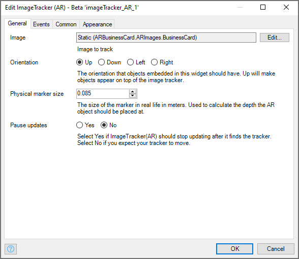
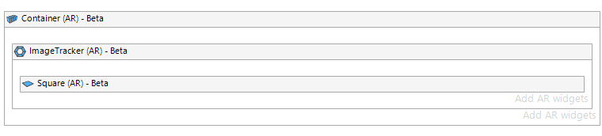
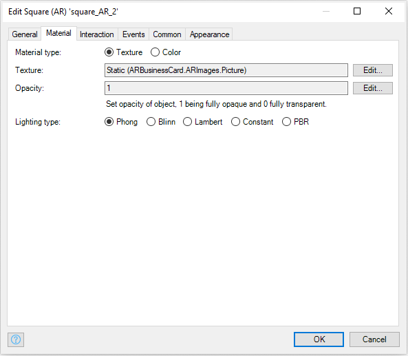
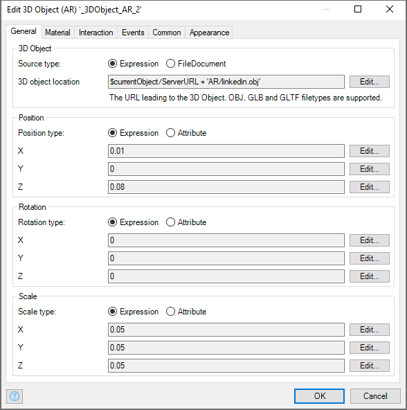
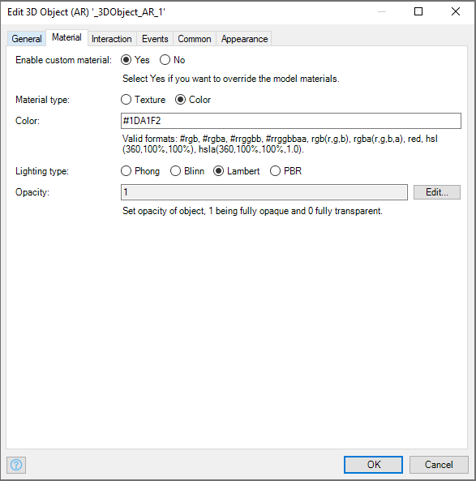
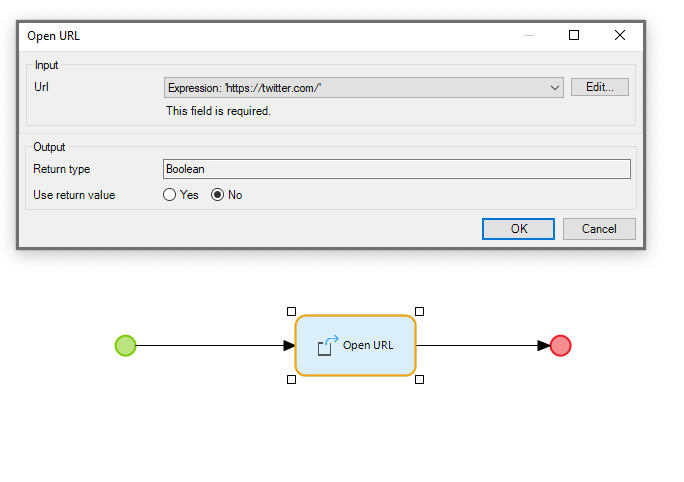
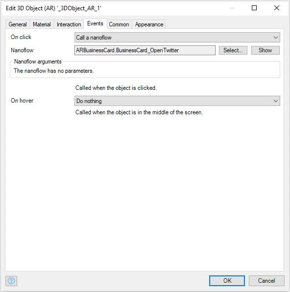

## 1 Introduction

Follow the sections below to build a demo. While doing so, you will become familiar with a whole range of augmented
reality (AR) widgets, and see them in action. At the same time, you will end up with an interesting demo that can easily
be customized for your own purposes. 

## 2 Prerequisites

Before starting this how-to, make sure you have completed the following prerequisites:

* Install Studio Pro and Developer Apps with AR capabilities
* Create a new empty page with **Container (AR)** and **ImageTracker (AR)** widgets
* Add your business card png as the **Image** to the **ImageTracker (AR)**
* Obtain 3D objects to add to your AR business card (we used logos of twitter and linkedin).
* Have a PNG of your business card

Download widgets:

* **Container (AR)**
* **ImageTracker (AR)**
* **Square (AR)**
* **3D Object (AR)**

When you have completed the prerequisites, your work should look like this:

## 3 Creating an AR Business Card Demo

For this project you will need to start a new project based on the Native Mobile Quickstart App, or use another
project with the Native Mobile Resources module imported from the Mendix App Store. First you will lay a virtual
business card over your real business card. You will need the **Square (AR)** widget and the imported PNG of the
business card you wish to use.

Ideally you should have several recognizable features on your image, specifically an image with a lot of edges and
contrast. The business card you are using in this document possesses these traits:

 

After you have added your business card as an image, remember to adjust the physical size in **Image Tracker (AR)** to
the exact size of your business card. Choose the width (the longest side) of your business card for this. This will
probably be around 8.5 centimeters:

Next you will add a virtual image of your business card to overlap the physical business card. To do this, add a
‘**Square (AR)**’ widget to your app’s home page. Note we already added a ‘**Container (AR)**’ and ‘**ImageTracker
(AR)**’ beforehand:

1. Double click the **Square (AR)** widget.
1. Select the **Material** tab.
1. Select **Material type** > **Texture**.
1. Select the image of your business card for the **Texture**. This should be the same image as you selected for your
   **Image Tracker (AR)**. When finished your dialog box will look like this:

5. Go back to the General tab, and fill out the size of your business card. The important sizes are X for the width of
   your business card and Y for the height.
6. Set Rotation > X to -90 to make sure the virtual image is rotated correctly.

Once this is all set up, run the project and check if it works in the Make It Native app. Here you should see the
virtual business card overlaying your real life one:

Next, add a picture of yourself to your virtual business card. Drag and drop another **Square (AR)** widget into
**ImageTracker (AR)** and add a picture of yourself to this. In our case we have used a square image with transparent
edges to make it appear round: 

Go to the **General** tab and place it about 8 cm (0.08,0,0) to the right of the first image and match the size with the
size of our business card image. You should now have this image right next to your business card image.

To finish this business card demo you need something people can click to find out more about your work. For this you will
add two social media logos, one of Twitter and one of LinkedIn. You can use any 3D object, for ours the following
settings correctly places them underneath our business card. But since scale can differ between 3D object this is not
guarenteed to work with your 3D objects.

Since you are using .obj files, you can alter the color or texture within Mendix. Currently, Twitter has a color of #1DA1F2 and Linkedin is #0A66C2:

Then all that is left is to add a nanoflow that opens a url, to the **Events** > **On click functionality**. Create a new
nanoflow with the **Open URL** action, this should be standard in the Native Mobile Quickstart app. Add your Twitter
profile URL here:

Congratulations, you now have a functioning AR business card demo with custom 3D objects!
