## 1 Introduction

Working with augmented reality (AR) is not all that different from implementing any other piece of Native functionality.
Using just a few widgets, you can add two-or-three dimensional AR to your native mobile application. In this how-to you
will make a 3D cube by dragging and dropping widgets into your Mendix app and then configuring them.

## 2 Prerequisites

Before starting this how-to, make sure you have completed the following prerequisites:

For Android:

- Have an Android mobile device that can [support ARCore](https://developers.google.com/ar/discover/supported*devices#android_play).
- Install [Google Play Services for AR](https://play.google.com/store/apps/details?id=com.google.ar.core&hl=en) on your device.
- Install the Make It Native app on your Android mobile device for testing purposes.

For iOS:

- Have an iOS mobile device that supports ARKit (iPhone 6S and up).
- Install the Make It Native app on your iOS mobile device for testing purposes.

## 3 Embedding Widgets in Your App

Create a new app by following these steps:

1. Open Mendix Studio Pro. Select **File** > **New App** , and then select the **Blank Native Mobile App**.
1. Click **Use this starting point.**
1. Name your app _Hello World_ and click **Create app** to close the dialog box.
1. Open the **Home_Native** page and remove the intro screen widget and other containers.
1. Download the Native Mobile AR module from the [Mendix Marketplace](https://marketplace.mendix.com/link/component/117209) and import it to your app.

You will begin by embedding the following widgets into your Mendix app:

- Container (AR)
- ImageTracker (AR)
- Cube (AR)

Embed the widgets in this order:

1. Drag and drop **Container (AR)** onto a native mobile page.
1. Drag and drop **ImageTracker (AR)** into **Container (AR)**.
1. Drag and drop **Cube (AR)** into **ImageTracker (AR)**:

   {}{}

Very little configuration is necessary to make your AR function. All you need is an image tracker. A tracker is an image
your AR can track and put AR effects on top of. Most images can serve as a tracker, provided they have enough contrast.
Complex images make for the best tracker, because they are easier for your device’s camera to track. Start by adding an
image to ImageTracker (AR):

1. Double-click your **ImageTracker (AR)** widget.
1. Click **Image** > **Edit**.
1.  Select a tracker from an image collection. This image will be the foundation of your AR application and is what your camera will track:

	{}{}

1. Set the physical size of this image tracker, this size is in meters. For example, if you printed the tracker to be 10 cm set **Physical marker size** to 0.1.
1. Double-click your **Cube (AR)** widgets.
1. Set **X**, **Y** and **Z** of Scale to 0.1. This way the **Cube (AR)** will be the same size as your physical tracker.
1.  Click **Run** in Mendix Studio Pro to automatically refresh your Make It Native app. Now your **Hello World AR** app is up and running. You should now see a simple white cube rendered on top of a tracker:

	{}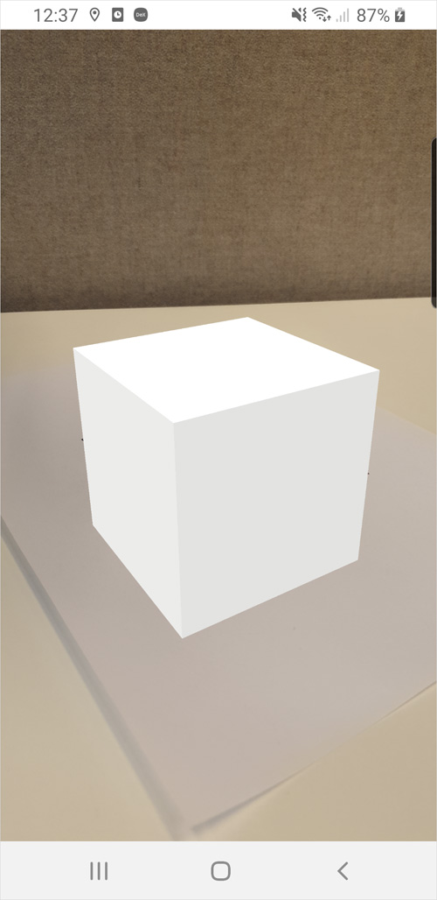{}

Now that you have a simple scene running, you will a closer look at the widgets you used to understand what they do.

### 3.1 Container (AR)

This widget starts an AR scene: the video feed you see on AR apps. It is named Container (AR) because this widget will hold all your other AR widgets. It is the foundation of every Mendix AR mobile application:

{}{}

### 3.2 ImageTracker (AR) {#ar-tracker}

The **ImageTracker (AR)** widget allows you to track an image. Like Container (AR), this widget can contain other AR widgets. All widgets you put into ImageTracker (AR) will stick to the image. That means that every object (Cube (AR), Sphere (AR), and others) will follow or track the image.

{}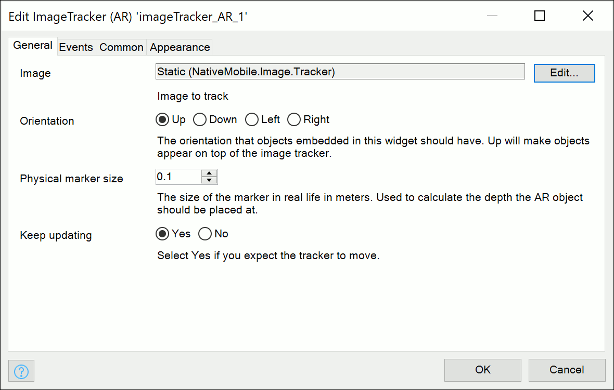{}

**Image** — in the **General** tab, you can provide your own image to this widget by clicking **Image** > **Edit**. While it is possible to add any image, some images work better for AR tracking than others. Images can best be tracked when they have high contrast and several edges:

{}{}

It is possible to use a more conventional image, like a company logo, as long as it has enough contrast and edges. If your image does not posses these qualities, you will notice AR elements floating in incorrect places and motion tracking failures as you move your camera. It is also possible that your image will not be recognized at all.

**Orientation** — this dictates the orientation of 3D objects on your tracker, not the orientation of the tracker itself. Leaving it on **Up** will make your 3D object appear right side up when you have it lying on a table.

Your standard cube will not look different when turned around. To show orientation, this tutorial has temporarily added the following texture was added (see the [Material](#material) section below to learn how to add your own texture to an object):

{}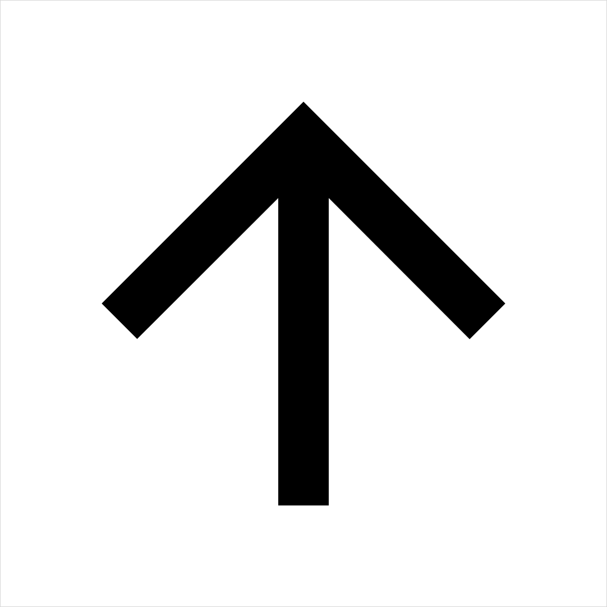{}

Here is a cube with the **Up** orientation:

{}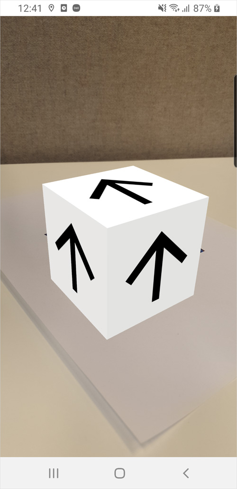{}

Here is a cube with the **Left** orientation:

{}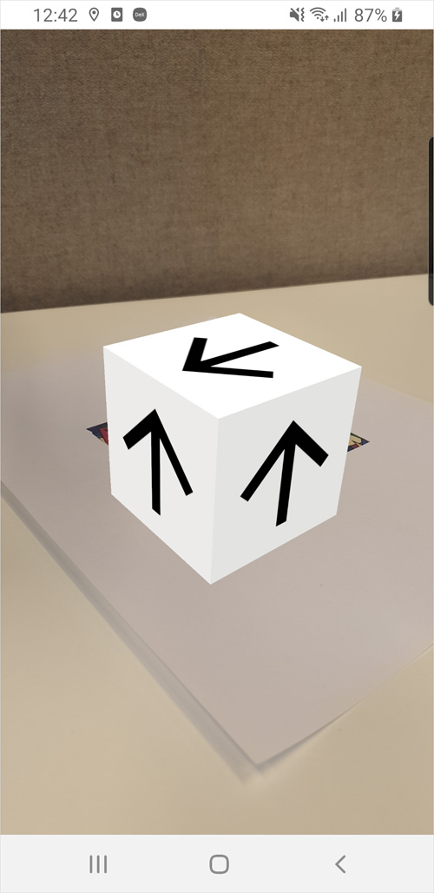{}

**Physical marker size** - this is where you put the physical size of your tracker, and how AR determains how far away the marker is. Since most phones will use only one camera, this value is used to calculate depth. Putting a wrong value here won't break AR, but will change the depth at which your objects are rendered. Which in turn may also lead to more jittering or 'vibrating' of your 3D models.

**Keep updating** - can be used for a more stable experience. When you keep this on **Yes** this will mean your application is constantly scanning and adjusting for the tracker, using that as it's main reference. If you set this to **No** the **ImageTracker (AR)** will stop after the tracker is found and then use the native ARCore/ARKit to further handle positioning. This will make your scene more stable, but obviously should not be used when you expect the tracker to move.

## 4 Configuring Your Cube (AR) Widget

The **Cube (AR)** widget will places a cube into the scene, specifically onto the **ImageTracker (AR)** widget. There are several properties you can configure in this widget to customize its behavior.

Having the **Cube (AR)** widget in the **ImageTracker (AR)** widget will render a white cube the same size as the image tracker directly on top of it. Next you will configure **Cube (AR)’s** properties.

### 4.1 General

The **General** tab contains basic properties for configuring position:

{}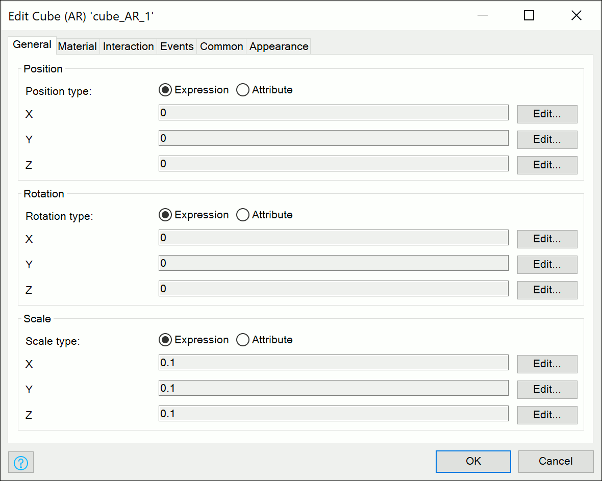{}

In the **General** tab you can configure **Position**, **Rotation**, and **Scale** (**X** stands for left/right, **Y** for up/down, and **Z** for depth):

*  **Position** — the position relative to the image tracker. For example, since the position is relative to the tracker size, set **X** to _0.1_ to make your object appear right beside the tracker instead of on top of it:

	Here is a cube in **Position** (0.1,0,0):
   
	{}{}
   
	Here is a cube in **Position** (0,0.1,0):
   
	{}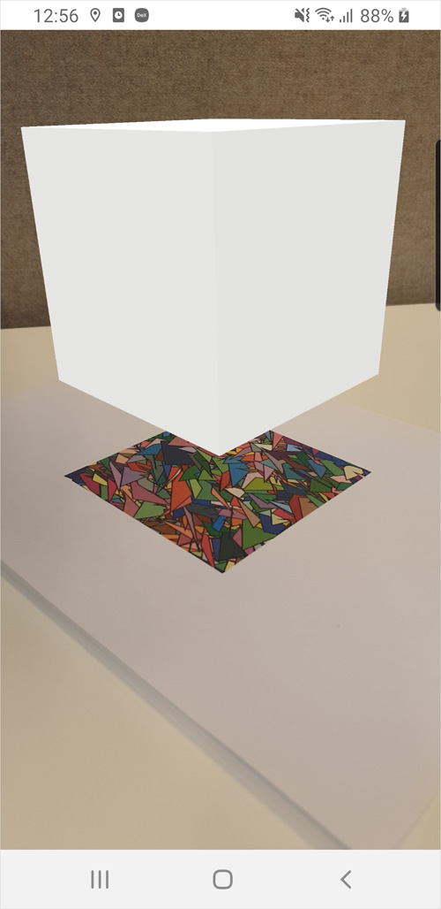{}
   
	Here is a cube in **Position** (0,0,0.1):
   
	{}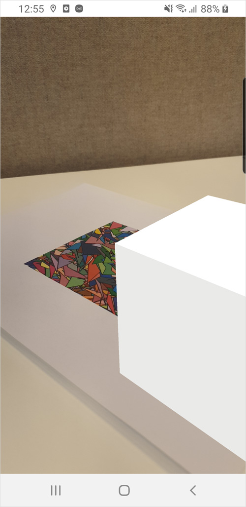{}

*  **Rotation** — the rotation of the cube in 360 degrees. Set **Rotation** **X** to _45_ to see your cube rotated 45 degrees on its X axis:

	Here is a cube with **Rotation** (0,0,0):
   
	{}{}
   
	Here is a cube with **Rotation** (45,0,0):
   
	{}{}

*  **Scale** — the size of the object, also relative to the tracker it is embedded in. When the **Scale** is set to _(0,0,0)_ the object will be invisible. Because **0.1** is exactly the size of the tracker, set **Scale X**, **Y**  and **Z** to _0.05_ to see your cube shrink in the tracker:

	Here is a cube with **Scale** (0.1,0.1,0.1):
   
	{}{}
   
	Here is a cube with **Scale** (0.05,0.05,0.05):
   
	{}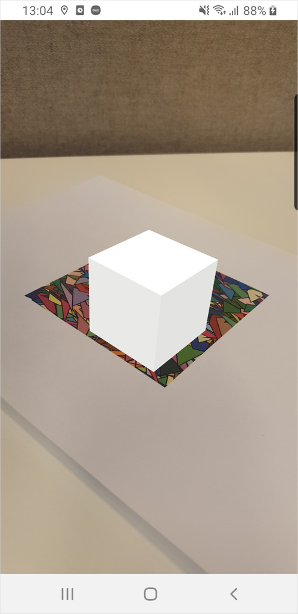{}

For **Position**, **Rotation** and **Scale** an **Attribute** can also be used to set the **Position**, **Rotation** and **Scale** **X** **Y** and **Z** values. These values will also get updated for example when the user uses their finger to move them. To use the **Attribute** option simply select this instead of **Expression** at **Position type**, **Rotation type** or **Scale type**.

### 4.2 Material {#material}

The **Material** tab contains properties for configuring appearance:

{}{}

* **Material type** - can be either **Texture**, **Color** or **Video**. **Material type** determains what will be put
  onto the cube, an image, a color or a looping video.

* **Texture** — an image you can place on the cube by clicking **Edit**. The image will appear on each face of the cube. Put the example tracker here as a texture to end up with this colorful cube (note that the cube now ignores  any **Color** value — if you want to make your cube one solid color, make sure the Texture is set to **none**):

	{}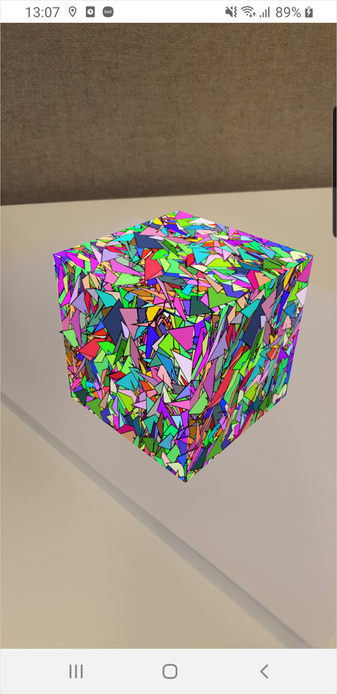{}

* **Color** — the color of the cube. You can have either a **Texture** or **Color**, but not both. _White_ is the  standard color. Change the value to _green_ to make your cube appear this way:

	{}{}

* **Video** - a link to a .mp4 video. This will play a looping video on the object.
* **Opacity** — the clarity or opacity of the cube. _1_ is fully opaque, while _0_ is fully transparent. Change the color of your cube back to _white_ and change the opacity value to _0.5_ to see your cube become partly transparent:

	{}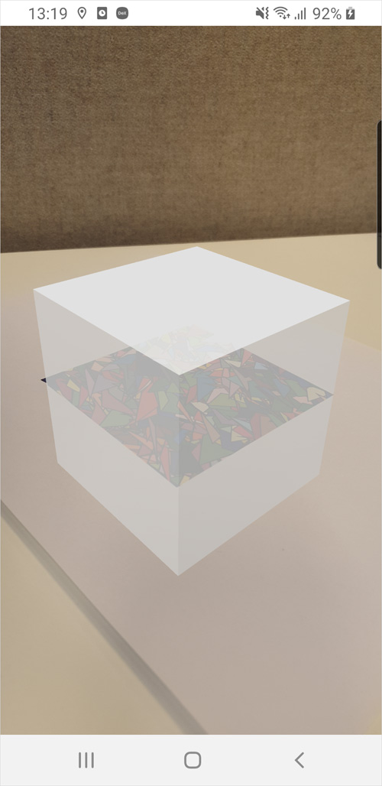{}

*  **Lighting type** — the way light from the scene will fall on your object. 
	**Phong**, **Blinn**, and **Lambert**  are standard configurations of adding light and shadows to your objects. They are also have relatively slight  processor power requirements. 		**Constant** means no light is added — just pure colors are shown. 
	**PBR** — (Physically Based Rendering) is the most advanced. PBR takes the entire scene into account when creating its  lighting, the intricacies of which are beyond this how-to. Change between the various **Lighting type** options to  see them in action:

	Here is a cube with **Lighting type** > **Phong**:
   
	{}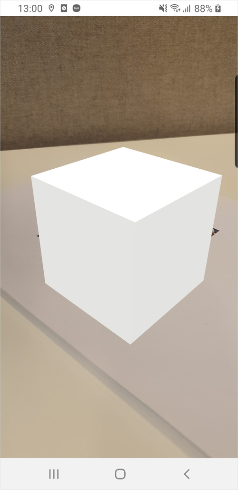{}
   
	Here is a cube with **Lighting type** > **Constant**:
   
	{}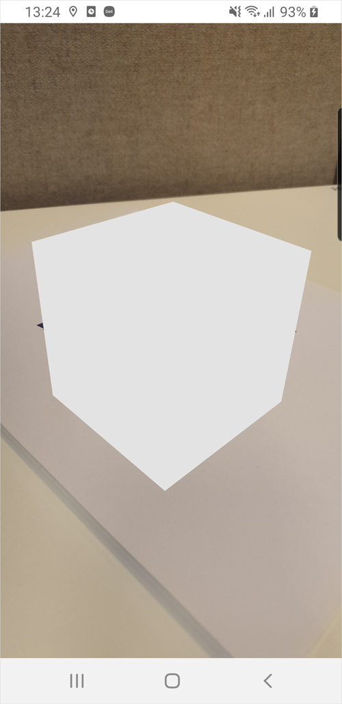{}

### 4.3 Interaction

**Interaction** is where Mendix AR gets more advanced. These properties dictate every way you can interact with your object. Enabling any of these will also allow you to catch the events they generate in the **Events** tab:

{}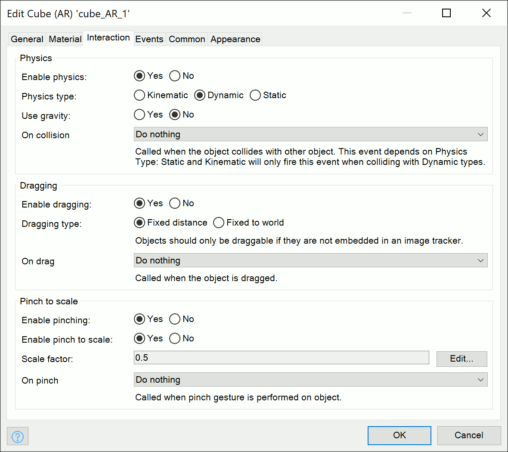{}

* **Physics** — dictates how your object interacts with other 3D objects. Enabling it will not show an immediate  visible difference, but it will make it possible for other objects to collide with this object. 
* **Physics type** —  how the object should physically behave. Selecting **Kinematic** will make your object move only when manipulated.  **Dynamic** objects will react to everything. **Static** objects will never move.
* **On collision** — an event that  is triggered when this objects collides with another 3D object with physics enabled. When this objects **Physics  type** is not **Dynamic** but is enabled, it can still collide with objects that are **Dynamic** and vice versa. However, **Kinematic** and **Static** object cannot generate this event with other objects that are **Kinematic** or  **Static**. 
* **Use gravity** — sets if the object should be affected by gravity. Setting it to ‘Yes’ will make your object fall until it meets another object with physics enabled. To put this information into practice, select  **Enable Physics** > **Yes**, select **Physics Type** > **Dynamic**, and select **Use Gravity** > **Yes** to enable  your cube’s physics:

	{}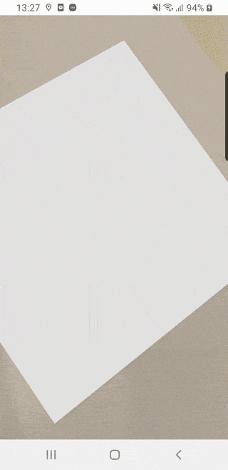{}

* **Dragging** — allows a user to manipulate an object by dragging it with their finger. This property gives users a very instinctive way to move objects. 
* **Dragging type** — the type of dragging behaviour you want, **Fixed  Distance** will make the object follow you at always the same distance as it started. **Fixed to world** will make the object stick to the world, for example objects like floors, desks, walls etc.
*  **On drag** — an event that is triggered when the object is moved through dragging:

	{}{}

*  **Pinching** — can be used to scale the object, similar to zooming in and out on a maps widget. Select **Enable  Pinching** > **Yes**, select **Enable Pinch to Scale** > **Yes**, and set the **Scale Factor** to 0.5, then pinch  out on your object to examine it in detail:

	{}{}

### 4.4 Events

The **Events** tab appears this way:

{}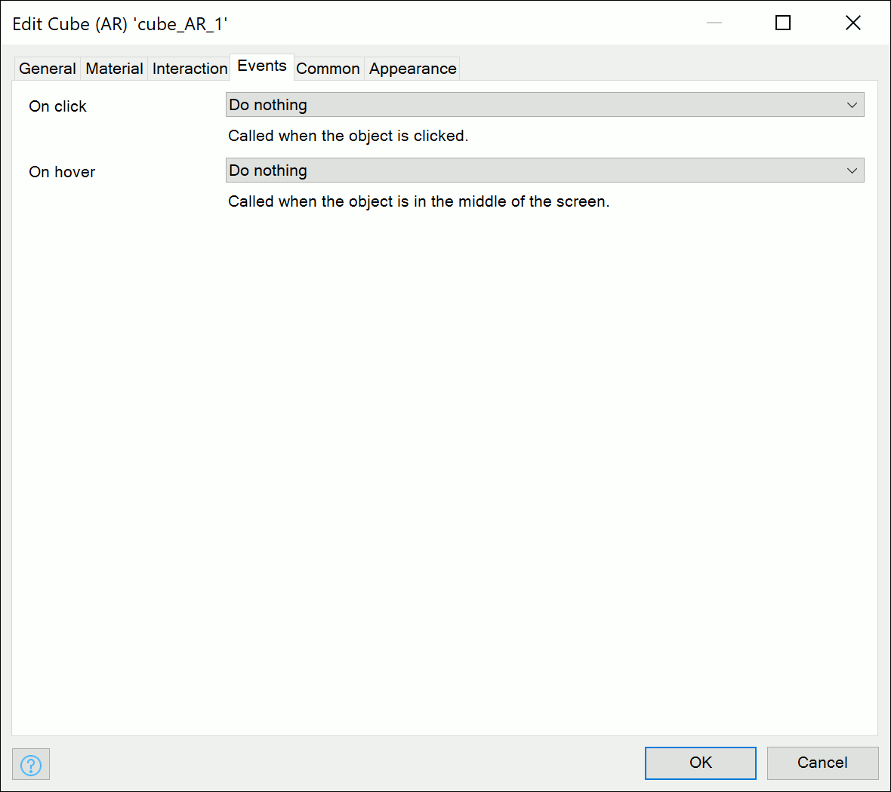{}

Events on 3D objects work like any other event on a widget. **On click** is called when the object is clicked, and **On hover** is called when the object is 'in focus' in the middle of the screen.

### 4.5 Common

The **Common** tab appears this way:

{}{}

The **Common** tab has two important properties:

* **Name** — is used internally in all AR Widgets and must be unique. It can be changed, but we recommend keeping its generated name.
*  **Visible** — is used to dictate the visibility of the AR component. This can be conditional just like most other widgets:

	{}{}

### 4.6 Appearance

The **Appearance** tab appears this way:

{}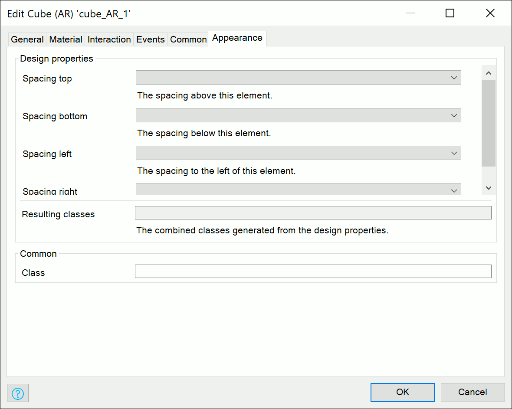{}

Currently the properties in the **Appearance** tab have no influence on AR widgets. This tab can be ignored.
