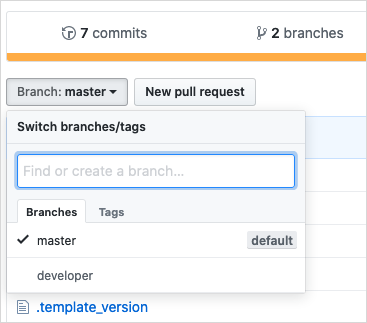
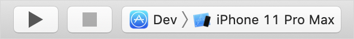

## 1 Introduction

As your Mendix app project matures, you may want to expand its functionality (such as by introducing custom widgets or logic that will require new native dependencies). One such customization could be adding a near-field communication (NFC) module to your app project. While the Make It Native app suffices for testing basic apps, as your app adds custom dependencies — like custom native widgets or fonts — you will need a more tailored developer app.

A custom developer app helps you by serving as a replacement for the Make It Native app, and should be used when you have custom widgets and logic which are not supported by the Make It Native app. Custom developer apps are apps you can generate yourself using your current project structure, your custom modules, and any other requirements to test your evolving app. Custom developer apps feature the same functionality as the Make It Native app but are tailored to your needs.

## 2 Prerequisites

* Complete [How to Get Started with Native Mobile](/howto/mobile/getting-started-with-native-mobile)

## 3 Build Your Developer App

1. Open a command line interface (CLI) such as Command Prompt.
2. Navigate to the directory of your Native Builder:

	```
	cd {path to Native Builder executable file}
	```

3. Run the following command to build your project's custom developer app:

	```
	native-builder.exe build dev-app --project-name {your project's name}
	```

	This command does the following: <br />
	a. Creates a branch named `developer` based on the commited changes to your `master` <br />
	b. Starts a build using the developer app flavors for your project
4. Wait until the Native Builder completes your builds.

As with a release build, when the Native Builder is done building you should have two archives for each build: an iOS and an Android build. These archives can be found under the build output path `{build output path}` with **Dev** prepended to their name. The default `{build output path}` is the `./builds` folder relative to your `native-builder.exe` location.

## 4 Installing Your Custom Developer App

### 4.1 Android

By default your custom developer app will be unsigned. To get a signed *IPA*, follow the steps in the [Signing Your Build](deploying-native-app#signing-a-build) section of *How to Deploy Your First Mendix Native App*. Your Custom developer app branch is named **developer**.

For Android the output of the build is an *APK* file. *APK* files can be directly installed on devices or emulators.

#### 4.1.1 Installing on an Emulator

With your emulator running, install your app in your emulator by doing the following:

1. Drag and drop the *APK* onto the emulator's window.
2. Wait for the installation to be done.
3. Open the app from the launcher.

#### 4.1.2 Installing on a Device

There are various ways install an app on a device. Installing using a USB is detailed below, but you can use a different method if it suits you. Do the following to install your *APK* onto a device:

1. Connect your device to your machine via USB.
2. Enable file transfer on your device (differs per device).
3. Open **This PC** in File Exploer; your device should be listed as an external device.
4. Drag and drop your *APK* onto your device.
5. Wait for it to finish transfering.
6. Open your device's file manager.
7. Navigate to the root of the file system.
8. Tap the *APK* to install.
9. Go through the installation steps.
10. Open the app from the launcher.

### 4.2 iOS

By default your custom developer app will be unsigned. To get a signed *IPA*, follow the steps in the [Signing Your Build](deploying-native-app#signing-a-build) section of *How to Deploy Your First Mendix Native App*. Your custom developer app branch is named **developer**.

The unsigned output of an iOS build is an *XCArchive* file. *XCArchive* files require manual signing before they are ready to be installed on a device.

The signed output of iOS build is an *IPA* file. If correctly signed, *IPA* files can be installed on physical devices.

Before installing, make sure you have completed the following prerequisites:

* Have a Mac OSX machine
* Install LTS builds of NodeJs and NPM (download [here](https://nodejs.org/en/))
* Install Cocoapods ([installation instructions](https://cocoapods.org/#install))
* Install the latest XCode version

#### 4.2.1 Installing on an Emulator

Builds with the Native Builder are stripped of simulator artifacts. Therefore, to run on an iOS Simulator you will have to build the developer branch locally from source by completing these steps:

1. Navigate to your GitHub repo.
2.  Switch to your **developer** branch:
   
	
   
3.  Click **Clone or Download** and then click **Download ZIP**:

	
   
4. Unzip the downloaded archive.
5. Open a terminal and change directory into the folder.
6. Run this command:

	```
	npm i && cd ios && pod install
	```

	This will install the node module dependencies and the iOS Dependencies
7.  In the **ios** folder, open the **NativeTemplate.xcworkspace** file:

	

8.  In XCode select the **Dev** target and the emulator you want to build your developer app for:

	

9. Click **Play**.

#### 4.2.2 Distributing the Custom Developer App

To run your custom developer app on a device which is not a test device, you will have to sign the developer app with your certificates. 

For local builds, follow the [Local Signing](deploying-native-app#ios-local-signing) section of *How to Deploy Your First Mendix Native App* to sign the *.xarchive* file. 

If you want Native Builder to sign your custom developer app, follow the steps in the [Signing Your Build](deploying-native-app#signing-a-build) section of *How to Deploy Your First Mendix Native App*.

## 5 Read More

* [How to Deploy Your First Mendix Native App](deploying-native-app)
* [How to Use Over the Air Updates](how-to-ota)