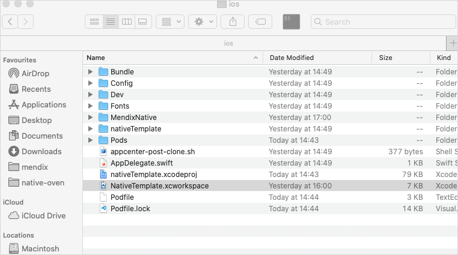

## 1 Introduction

With your project maturing, you will want to expand the functionality and even introduce custom widgets or logic that will require new native dependencies. An example of that could be a NFC module. While the MakeItNative app is a nice first touch with the platform and supports all common flows that come with the latest version of Mendix Studio Pro, it falls short when it comes to fascilitating custom dependencies, as are custom native widgets, fonts or other.

For this purpose we introduced Custom Developer Apps. Custom Developer Apps are apps you can generate yourself using your current project structure, your custom modules and any other requirements to accompany the ever growing needs of your app. Custom Developer Apps, feature the same functionality as the MakeItNative app, but are tailored to your needs, by you.

## 2 Prerequisites

- Have finished the [How to Get Started with Native Mobile](/howto/mobile/getting-started-with-native-mobile)

## 3 Build your developer app

1. Open a command line interface (CLI) such as Command Prompt.
2. Navigate to the directory of your Native Builder:

   `cd {path to Native Builder executable file}`

3. Run the following command to build your project's developer app:

   `native-builder.exe build dev-app --project-name {your project's name}`

   Replace `{your project's name}` with your actual project name.
   This command does the following:

   - Creates a branch named `developer` based on the commited changes to your `master`
   - Starts a build using the developer app flavors for your project

4. Wait for the Native Builder to complete.

As with a release build, when Native Builder is done building, you should have 2 archives for each build, iOS and Android, respectively. These archives can be found under the build output path `{build output path}/dev-app`. The default `{build output path}` is the `./builds` folder relative to `native-builder.exe` location.

## 2 Installing Your Developer App

### 2.1 Android

By default your Custom Developer App will be unsigned. If you instead wish to get a signed IPA please follow the steps in [Signing your build](deploying-native-app.md#signing-a-build). Your Custom Developer App branch is plainly called **developer**.

For Android the output of the build is an APK file. APK files can be directly installed on devices or emulators.

#### 2.1.1 Emulator

Given you have an emulator up and running.
To install on an emulator:

1. Drag & drop the APK onto the emulator's window.
2. Wait for the installation to be done.
3. Open the app from the launcher.

#### 2.1.2 Device

There are various ways to get an app installed to a device we are just listing one for educational purposes. Feel free to ignore our suggestion if you already know how.

To install the APK:

1. Connect your device using USB.
2. Enable File Transfer on your device (differs per device).
3. Open This PC in File Exploer; your device should be listed as an external device.
4. Drag & Drop the apk as you would do for a remote drive.
5. Wait for it to finish transfering.
6. On the device open the File Manager.
7. Navigate to the root of the file system.
8. Tap the apk to install.
9. Go through the installation steps.
10. Open the app from the launcher.

### 2.2 iOS

By default your Custom Developer App will be unsigned. If you instead wish to get a signed IPA please follow the steps in [Signing your build](deploying-native-app.md#signing-a-build). Your Custom Developer App branch is plainly called **developer**.

The unsigned output of an iOS build is an XCArchive. XCArchives require manual signing before they are ready to be installed on a device.

The signed output of iOS build is an IPA. If correctly signed IPAs can be installed on physical devices.

#### Prequisites

- Mac OSX machine
- Rescent NodeJs and NPM version
- Cocoapods
- Latest XCode version

#### 2.2.1 Emulator

Builds with Native Builder are stripped of simulator artifacts.
Therfor, to run on an iOS Simulator, you will have to build the developer branch locally from source.

Todo so:

1. Navigate to your GitHub repo
2. Switch to your **developer** branch.
    
3. Click the "Clone or Download" button and "Download ZIP".
   
4. Unzip the donwloaded archive.
5. Open a terminal and change directory into the folder.
6. Run:

   `npm i && cd ios && pod install`

   This will install the node module dependencies and the iOS Dependencies
7. In the **ios** folder, open the **NativeTemplate.xcworkspace** file

   

8. In XCode select the **Dev** target and the emulator you want to build your Developer App for
    
9. Press the play button.

#### 2.2.2 Device

To run on an device you will have to sign the Developer App with your certificates.
For local builds, follow the [Local Signing](deploying-native-app.md#ios-local-signing) guide to sign the xcarchive. If you want Native Builder to sign your developer app, follow the app signing steps in [Signing your build](deploying-native-app.md#signing-a-build).