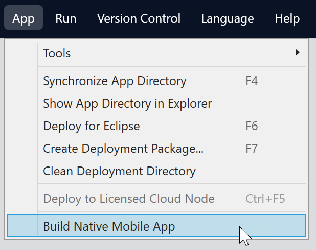
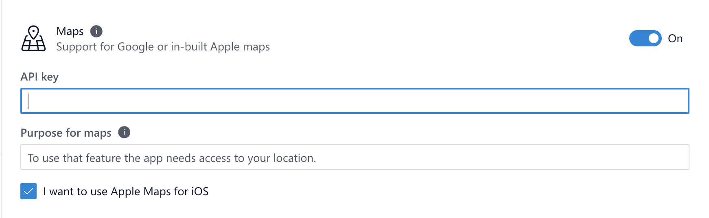

## 1 Introduction

The Maps module allows you to work with maps. Consult the instructions below to include map capabilities in your native mobile apps.

{}
The Mendix Native Mobile Builder does not currently support connections behind proxy servers. Please make sure you are not behind a proxy server and that your security rules allow access to the required services.
{}

## 2 Prerequisites

* Complete the [Prerequisites](/howto/mobile/deploying-native-app#prerequisites) section of *How to Deploy Your First Mendix Native Mobile App*
* Create an app on the [Google Cloud Console](https://console.cloud.google.com/google/maps-apis/overview) and have Google Maps enabled for Android (and iOS, if you wish to use Google Maps on iOS as well) and also posses an [API key](https://developers.google.com/maps/documentation/android-sdk/get-api-key). 
* Before you can start using the Google Maps Platform APIs and SDKs, you must sign up and create a [billing account] (https://developers.google.com/maps/gmp-get-started#create-billing-account).
* Install Mendix Studio Pro v8.15.0 and above to use the Native Mobile App Builder

## 3 Setting Up App Deep Linking {#set-up}

Make sure you have app containing the Maps module. This is a core module, so it is available in the **Widgets** panel. You can either add it to an existing app or make a new app from scratch. 

### 3.1 Configuring Map Provider

Next you will configure the **Maps** widget provider. You will have two choices: **Default** and **Google Maps**. Selecting **Default** will have your app use the default-enabled map on your device. This means using Google Maps on Android devices and Apple Maps on iOS devices. Selecting **Google Maps** as your **Maps** configuration will have only Google Maps used on both platforms:

1. Double-click your Maps widget and Selecting the **Map** tab. 
1. Select either the **Default** or **Google Maps** provider:

	{}{}

### 3.2 Configuring Maps Capability 

1. Set up a native template with the **Native Mobile App Builder**. This can be launched from the **App** menu as shown in [How to Deploy Your First Mendix Native Mobile App](/howto/mobile/deploying-native-app). Complete the wizard and configure the app's details and tokens:

	{}{}

1. Once done with the wizard, select the **Capabilities** menu item:

	{}{}

1. Enable the maps capability. This exposes a set of configurations:
   
	{}{}

	* As described in the Prerequisites section, the API key gives the maps widget access to Google Cloud services
	* The **Purpose for maps** string is a specialized text that tells Apple why you need to use maps in your app (Apple requests explanation as maps use device location data)
	* **I want to use Apple Maps for iOS** mirrors the decision explained in the Configuring Map Provider section above
   
1. Click the **Save** button. 
1. Navigate to the build page then click **Build**.

{}
When running locally from source, on iOS you have to run `pod install` once more
{}

## 4 Read More

* [How to Deploy Your First Mendix Native Mobile App](deploying-native-app)
* [How to Get Started with Native Mobile](getting-started-with-native-mobile)

