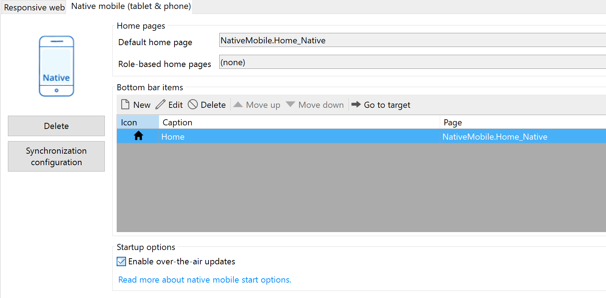
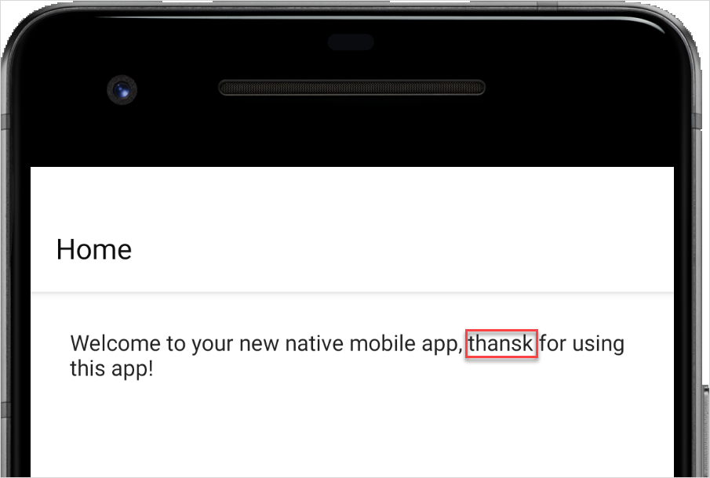

## 1 Introduction

With Mendix Studio Pro 9.7, you can update your Mendix native apps over the air (OTA). OTA updates are a fast and painless way of updating elements like layouts, pages, assets, or even your app's business logic (such as nanoflows and JavaScript actions) without the burden of going through the entire release process.

Native apps are separated into two parts: a wrapper that functions as a native iOS or Android app, and a bundle loaded dynamically by the wrapper. Elements like your business logic and static assets are part of this dynamically-loaded bundle. 

With OTA updates support via the Mendix runtime, you can simply deploy a new version of your app to the cloud and the apps will be updated automatically at the next restart as long as the device can access the runtime.

This way the model, the runtime and the apps can be kept seamlessly in sync.

{}
Currently OTA does not update your app while the app is open or minimized.
{}

{}
Mendix OTA updates replaces the now deprecated App Center's CodePush OTA updates solution. When opting in for OTA updates via the Mendix Runtime Codepush OTA updates will be disabled. 
{}

**This how-to will teach you how to do the following:**

* Explain the rational behind Mendix's OTA solution
* Enable OTA updates in your Native Mobile Profile
* Build your app 
* Preserve your model's integrity

## 2 Why you should consider using Mendix's OTA update solution

While we grew our experience in Native Mobile apps and looked at what our customers require, we identified the following short comings with third party OTA update solutions: 

* Third party service requirement.
* Complex release cycle. 
* No single point of truth.
* Lack of extensibility.

Let us look at these points individually. 

Third party service requirement, is self explanatory. It adds extra procurement steps; sometimes the companies behind the functionality might be blocked in certain regions. This adds unneeded overhead and costs time.

Complex release cycle, summarises the steps required to release a new OTA update. In general changes need to be deployed to the runtime and then an extra step is required to release the new OTA updates for the apps. That costs time, requires more thought than it should and can be error prone. 

No single point of truth means it is impossible to tell when and how the app should be updated or the new changes should be synchronised. Mendix removes a lot of complexity from thinking about things like synchronization or offline data. To do so, some premises have to be true. With third party solutions that is impossible to do accurately.

Lack of extensibility, is more technical and affects mostly us. We cannot easily extend the functionality to fit our needs, hence we can not deliver new and better features. Think of features like delta updates, a more efficient way of pushing OTA bundles, would be impossible to add with third party solutions.

With that in mind we developed a Mendix OTA update mechanism which focuses in solving those issues. 

We moved the responsibility of OTA back to the runtime, hence moving back to a single point of truth. 

In addition, instead of thinking of OTA packages and runtime deployments, we merged both actions in one. Instead deploying a new runtime is enough for the apps to get updated. 

As the runtime is the one providing the OTA bundles, no third party service is required. 

Finally by developing an in house solution we can continuously iterate and update the functionality to further enhance our offering.

## 3 Prerequisites {#prerequisites}

Before starting this how-to, make sure you have completed the following prerequisites:

* Use Mendix Studio Pro v9.7 or later.
* Deploy your app by completing [How to Deploy Your First Mendix Native Mobile App](deploying-native-app).
* Install your app on a test device or emulator.
* Read the [Offline-First](/refguide/offline-first) reference guide. Understand this document before issuing OTA updates or releasing new versions.

## 4 When to Use OTA Updates

### 4.1 Safely Pushing OTA Updates Without Redeploying {#safeToUpdate}

It is good practice to *always* redeploy your Mendix app before pushing a new OTA update. However, releasing an OTA update without redeploying your Mendix app to Mendix Cloud in these cases is usually safe:

* Style changes
* Static image, text, or other static asset changes
* Layout changes
* Nanoflow changes
* JavaScript action changes
* Widgets added or removed
* A new custom Javascript-only widget or module was added
* Non-destructive model changes (for more information, see [Offline-First](/refguide/offline-first))

### 4.2 When a Full Release Is Required

If you have made any changes directly to your iOS or Android app, you will have to fully redeploy your app to the app stores for the changes to take effect. OTA updates do not suffice and a full release is required in the following cases:

* The initial release of your app
* A Studio Pro version upgrade that requires a new [Native Template](/refguide/native-template) version
* You fundamentally changed your app's functionality (this is an Apple App Store limitation, and will require a re-release and re-review of your app by Apple — your app might be removed if you do not comply)
* A new native module has been added (such as the [Native Mobile AR](https://marketplace.mendix.com/link/component/117209) module—for more information see [Modules](/refguide/modules). 
* The app has been renamed
* The app's launcher icons have been changed
* The splash screen has been changed

## 5 Enable and build an app with Mendix OTA updates enabled {#build-with-ota-support}

By default OTA updates are disabled for your Native Mobile Profile. To enable them make sure you are on Studio Pro 9.7 or later then: 

1. Open your Project in Studio Pro 9.7 or later
1. Navigate to the Native Mobile Profile
1. Find and check the "Enable over-the-air updates checkox: 
{}{}
1. Deploy your app to the cloud

Next you must build new binaries with this capability toggled on, and then release the apps to their respective app stores (only users with the new apps will be able to receive OTA updates). To do these things, follow these steps:

1. Click **App** > **Build Native Mobile App**.
1.  Build an application for distribution.

To make the OTA update functionality available to your users, release the new binaries via the appropriate app stores. If you are testing the functionality you can now install the apps on your test devices.

## 6 Deploying an OTA Update

OTA updates let you correct mistakes in your published apps without issuing a new release. For example, imagine you issued a new release and later found a spelling mistake on your welcome screen:

{}{}

Before OTA updates, you would have to make a new release and configure it in the app stores. But OTA updates make fixing such a mistake easy.

To release a new version OTA, follow these steps:

1. Correct the message to *Welcome to your new native mobile app. Thank you for using this app!*
1. Save your changes.
1. Deploy your new app to the cloud

On the next restart of the application, the new OTA update will be downloaded and used. 

## 8 Read More

* [Deploy Your First Mendix Native Mobile App](/howto/mobile/deploying-native-app)
* [Offline-First](/refguide/offline-first)

