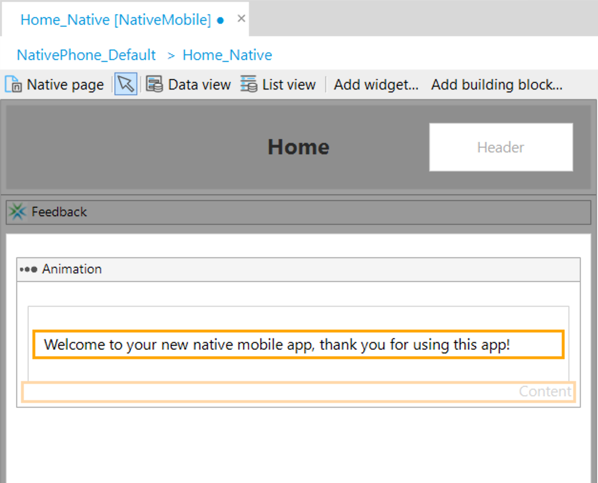

## 1 Introduction

With Native Builder 3.0 and Mendix Studio 8.4 we officially introduced the ability to update your Mendix Native Apps over the air (OTA).
OTA updates are a fast and painless way of updating things like layouts, pages, assets or even you app's business logic as are nanoflows and javascript actions.

To support, Mendix Native Apps seperate the app in two parts. A wrapper that is basically a Native iOS or Android app and a bundle that is being loaded dynamically by said wrapper. Things like you business logic and static assets are part of this bundle that is dynamically interchangable.

When you have changes you want to deploy, Mendix Native Builder can bundle them in a new updated bundle and painlessly deploy them. On the next app restart your app's users will be updated to the latest version and continue their business as usual.

OTA are bound to a specific app version and build number. That allows you to target specific updates to specific versions of you app. Therefor you can push an update for version 1.0.0, that might be a legacy version that support older devices and also push an update for your 2.0.0 version of your app that might include more features.

**This how-to will teach you how to do the following:**

* Push an OTA update for a release app
* Rollback an update
* Configure an already pushed update 

## 2 Prerequisites
Before starting this how-to, make sure you have completed the following prerequisites:

* Have Native Builder 3.0.0 or higher
* Have followed the How to Deploy your first Mendix Native App
* Have at least one build successfully ran with Native Builder v3.0.0 and Native Template v2.0.0 or later
* Have your app installed on test device or emulator
* Have read and understood the [Offline First]("/refguide/offline-first.md") reference guide

## 3 When to use over the air updates and when not

### 3.1 When OTA updates are safe to do without redeploying a new Mendix App {#safeToUpdate}
Over the air updates can be used without redeploying of a new Mendix App in cases like: 

- Style changes
- Static assets changes, static images, text etc. 
- Layout changes
- Javascript action changes
- Nanoflow changes
- Widgets shipped with Mendix added or removed
- A new custom javascript only widget or module was added
- Non destructive model changes (see: [Offline First]("/refguide/offline-first.md"))

### 3.2 When you will need to orchestrate a redeploy of your Mendix App before OTA
Over the air updates are only for native client specific changes. It does not replace a Mendix deploy action.
Therefor, you will still need to redeploy you Mendix App to Mendix cloud as usual. In these cases please follow the following order of deploying your app.

1) Deploy your Mendix App to the cloud.
2) Push a new **mandatory** update to your clients using Native Builder.

### 3.3 When you will have to do a full release

As a rule of thumb, if you have done any changes directly to the iOS or Android project, for 
the changes to take effect, you will have to fully redeploy you app to the app stores.
In addition over the air updates cannot be performend in the following cases: 

- You radically changed the app's functionality. This is a App Store limitation and will require a re-release and re-review of your app by Apple. Your app might be removed if you do not comply.
- A new native module has been added
- The app has been renamed
- The app's launcher icons have been changed
- The splash screen has been changed

## 4 Deploy An Over The Air Update
Let us assume we did a new release but realised there is a major typo in our welcome screen. Before over the air updates we would have to make a new release and go through the whole ordeal with the app stores. But over the air makes that a breeze.

To push a new version to be released via OTA, follow these steps:

1. Change the title and message as follow: 
   

2. Save the changes.
3. Note the version and build number of the app build you want to update. For this how-to we assume you app version is 1.0.0 and build number 1.
4. Open a Command Prompt.
5. Navigate to the directory of Native Builder, for example:
   
   `cd C:\<path to Native Builder>`

6. Run the following command to build and push a new update: 
   
   `native-builder.exe release push-update --project-name "CoolApp" --target-version "1.0.0" --build-number 1 --rollout-percentage 100 --mandatory`

   This command does the following:
   - Runs Mx Build to build your project
   - Packages your project to be pushed as a new update
   - Pushes the new update package for the app's version 1.0.0
   - Sets the rollout percentage to 100% (all app users)
   - Marks the update as mandatory for the app's users to install

7. Wait for Native Builder to complete.
8. Restart the app on the device. You should be greeted with the following message:

9.  Confirm the "update available" popup.
10. The app should reload and greet you with the following popup:

## 5 How to roll back updates
Sometimes and update might not perform as expected. Out of the box, when an update has failed, the auto update mechanism will try to recover by switching back to the bundle packaged with your app's binary. Non the less you will want to update your bundle by either fixing the issue and pushing a new update or by rolling back to the previous version.
Let us assume that we want to rollback an update. Maybe we released it to early or something is wrong with the latest update.

Todo so: 
1. First get the list of available releases. Run the following command: 

    `native-builder.exe release list --project-name "CoolApp"`

  

2. To now rollback v2 to v1 type the following command: 

    `native-builder.exe release rollback-update --project-name "CoolApp" --label "v1"`

  

3. Next time you open the app you should be greeted with the "Update available" prompt

### 5.1 When is it safe to roll back an update
Please see [When OTA updates are safe to do without redeploying a new Mendix App ](#safeToUpdate)

## 6 Configure an already pushed update
You might want to reconfigure an already pushed update for the following reasons: 

- You did a partial rollout and want to raise the number
- You want to make a update mandatory

To do so you will need to use the `patch-update` command.

### 6.1 Partial initial rollout
Is it for A/B testing or just to test stability it is good sometimes to test releases on a small number of your user base before fully rolling them out.

Todo so, run: 
  
  `native-builder.exe release push-update --project-name "CoolApp" --target-version "1.0.0" --build-number 1 --rollout-percentage 50 --mandatory`

Instead of passing a rollout percentage of 100% we are passing 50%. That means the update will be distributed over 50% of the app's user base. This number can be an arbitary integer from 1 and 100, representing 1% up to 100% of the user base.

When ready to fully rollout the update, simply run: 

  `native-builder.exe release patch-update --project-name "CoolApp" --target-version "1.0.0" --build-number 1 --rollout-percentage 100`

### 6.2 Releasing an optional update
As an extension of `rollout-percentage` you can make builds optional. 
To do so do: 
  
  `native-builder.exe release push-update --project-name "CoolApp" --target-version "1.0.0" --build-number 1 --rollout-percentage 100 --mandatory false`

Instead of the mandatory update popup, you app's users should now be greeted with a optional popup, allowing them to choose if they want to install the update or not. 

## 7 Think twice before doing destructive changes to your Model

Please read and understand the [Offline First]("/refguide/offline-first.md") reference guide. It is important to understand the implications of offline first.

Mendix Native Apps are offline first. **That means that you have to be extra cautious or avoid at all, doing changles such as:** 

- Changing the navigation profile
- Changing an offline first entity, in example entity name changes, new entity relationships etc.

**As rule of thumb you should avoid doing destructive changes to offline synced entities at any cost!**

In the rare cases this is unavoidable, releasing new app version or doing over the air updates, might put your app's users in a unrecoverable state. 

### A lesson hard learned

Say your Mendix developers were hard at work on optimizing the data store entity structure to speed up sync operations. They are quite happy with their results and feel confident releasing that morning. So they do. They push a new runtime, convieniently doing so by pressing the "Run" button in Mendix Studio Pro and run Native Builder to push a new update for the apps. All seem to work fine. 

That morning you engineers were hard at work gathering field data in a remote area. Later that afternoon the engineers are back and attempt to sync their data using the app's built in sync button. But it fails! They just do the only thing they can think of, which is, restarting the app. When the app starts they are greeted with the "Update available" screen; they hit the continue button; get updated and then their data is lost or partially synced.

### So what happened?

As a disclaimer this issue is independent from over the air updates and specific to offline apps. Your offline app runs a snapshot of your runtimes model locally. So as a Mendix Developer we have to think twice before doing major chages that might make the app's state unrecoverable. In this case the entity model has changed and when the app attempts to sync it fails.
This can create unrecoverable situations that will require a re-installation of the app and can lead to data loss for unsynced data.

## 8 Read More

- [Offline First reference guide]("/refguide/offline-first.md")
- [Codepush Introduction](https://docs.microsoft.com/en-us/appcenter/distribution/codepush/)
- [Using the CodePush UI](https://docs.microsoft.com/en-us/appcenter/distribution/codepush/using-ui)
