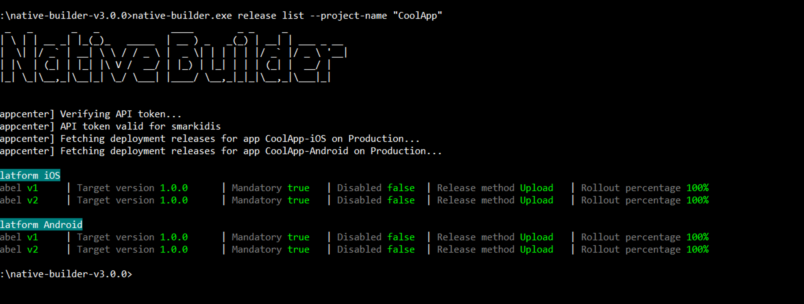

## 1 Introduction

With Native Builder 3.0 and Mendix Studio 8.3 we officially introduced the ability to update your Mendix Native Apps over the air.
Over the air updates are a fast and painless way of updating things like layouts, pages and assets. 

**This how-to will teach you how to do the following:**

* Push an over the air update for a release app
* Rollback and update
* Configure an already pushed update 

## 2 Prerequisites
Before starting this how-to, make sure you have completed the following prerequisites:

* Have Native Builder 3.0.0 or higher
* Have followed the How to Deploy your first Mendix Native App
* Have at least one build successfully ran with Native Builder v3.0.0 and Native Template v2.0.0
* Have your app installed on test device or emulator

## 3 Deploy An Over The Air Update
Let us assume we did a new release but realised there is a major typo in our welcome screen. Before over the air updates we would have to make a new release and go through the whole ordeal with the app stores. But over the air makes that a breeze.

To push a new version to be released via OTA, follow these steps:

1. Change the title and message as follow: 
   

2. Save the changes
3. Note the version and build number of the build you want to update. For this how-to we assume you app version is 1.0.0 and build number 1.
4. Open a Command Prompt
5. Navigate to the directory of Native Builder, for example:
   
   `cd C:\<path to Native Builder>`

6. Run the following command to build and push a new update: 
   
   `native-builder.exe release push-update --project-name "CoolApp" --target-version "1.0.0" --build-number 1 --rollout-percentage 100 --mandatory`

   This command does the following:
   - Runs Mx Build to build your project
   - Packages your project to be puhed as a new update
   - Pushes the new update package for the App's version 1.0.0
   - Sets the rollout percentage to 100% (all app users)
   - Marks the update as mandatory for the App's users to install

7. Wait for Native Builder to complete
8. Restart the app on the device. You should be greeted with the following message:

9.  Confirm the "update available" popup
10.  The app should reload and greet you with the following popup:

## 4 How to roll back updates
Let us assume that we want to rollback an update. Maybe we released it to early or something is wrong with the latest update.

Todo so: 
1. First get the list of available releases. Run the following command: 

    `native-builder.exe release list --project-name "CoolApp"`

  

2. To now rollback v2 to v1 type the following command: 

    `native-builder.exe release rollback-update --project-name "CoolApp" --label "v1"`

  

3. Next time you open the app you should be greeted with the "Update available" prompt

## 5 Partial initial rollout
Is it for A/B testing or just to test stability it is good sometimes to test releases on a small number of your user base before fully rolling them out.

Todo so, run: 
  
  `native-builder.exe release push-update --project-name "CoolApp" --target-version "1.0.0" --build-number 1 --rollout-percentage 50 --mandatory`

Instead of passing a rollout percentage of 100% we are passing 50%. That means the update will be distributed over 50% of the app's user base. This number can be an arbitary integer from 1 and 100, representing 1% up to 100% of the user base.

When ready to fully rollout the update, simply run: 

  `native-builder.exe release patch-update --project-name "CoolApp" --target-version "1.0.0" --build-number 1 --rollout-percentage 100`

`patch-update` is a commnd that allows you to modify a pushed updated. You can modify things like rollout percentage or make a release mandatory.

## 4 When to use over the air updates
Over the air updates can be used safely in cases like: 

- Style changes
- Static assets changes, static images, text etc. 
- Layout changes

## 5 When to not use over the air updates
Over the air updates should be avoided when runtime changes have occured. 

- Navigation profile changes have occured
- Model changes have occured, in example entity name changes

In this case

## 5 Read More

https://docs.microsoft.com/en-us/appcenter/distribution/codepush/using-ui
