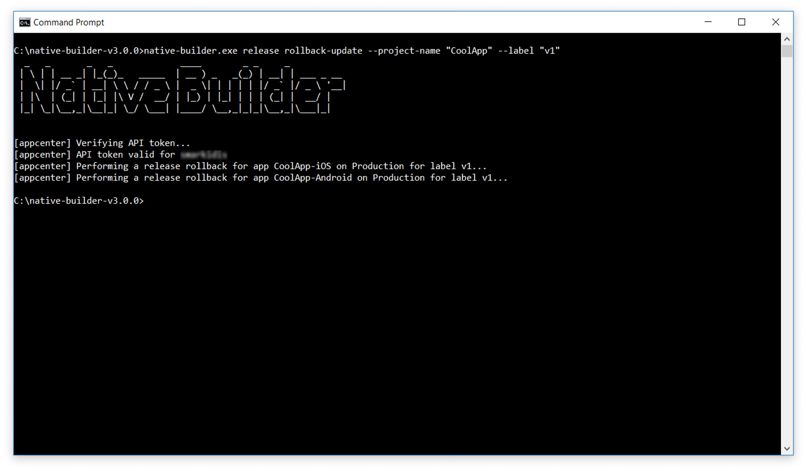

## 1 Introduction

Using Native Builder and Mendix Studio Pro, you can update your Mendix Native Apps over the air (OTA).
OTA updates are a fast and painless way of updating things layouts, pages, assets, or even you app's business logic (such as nanoflows and JavaScript actions).

Native apps are separated into two parts: a wrapper that is basically a native iOS or Android app and a bundle that is being loaded dynamically by said wrapper. Things like your business logic and static assets are part of this dynamically-loaded bundle. When you have changes you want to deploy, the Native Builder can bundle them in a new, updated bundle and painlessly deploy them. On the next app restart, your app's users will be updated to the latest version and continue their business as usual.

OTA updates are bound to a specific app version and build number. Therefore, you can target specific updates to specific versions of your app. For example, you can push an update for version 1.0.0 as a legacy version that supports older devices, and also push an update for the 2.0.0 version of your app which includes more features.

**This how-to will teach you how to do the following:**

* Push an OTA update for a released app
* Rollback an update
* Configure an already pushed update 

## 2 Prerequisites

Before starting this how-to, make sure you have completed the following prerequisites:

* Install Native Builder 3.0.0 or higher
* Install Mendix Studio Pro 8.4 or higher
* Complete [How to Deploy your First Mendix Native App](/howto/mobile/deploying-native-app)
* Complete at least one successful build using Native Builder v3.0.0 and Native Template v2.0.0
* Install your app on a test device or emulator
* Read the [Offline First Reference Guide](/refguide/offline-first)

## 3 When to Use OTA Updates

### 3.1 Safely Pushing OTA Updates Without Redeploying Your Mendix App {#safeToUpdate}

It is good practice to *always* redeploy your Mendix App before pushing a new over the air update. However, releasing an OTA update without redeploying your Mendix App to Mendix Cloud in these cases is usually safe:

* Style changes
* Changes to static images, text, or other static assets
* Layout changes
* Nanoflow changes
* JavaScript action changes
* Widgets shipped with Mendix added or removed
* A new custom Javascript-only widget or module was added
* Non-destructive model changes (for more information, see the [Offline First Reference Guide](/refguide/offline-first))

### 3.2 When a Full Release Is Required

If you have made any changes directly to your iOS or Android project, you will have to fully redeploy you app to the app stores for the changes to take effect. OTA updates do not suffice, and a full release is required, in the following cases: 

* The initial release of your app
* You fundamentally changed your app's functionality (this is a App Store limitation, and will require a re-release and re-review of your app by Apple — your app might be removed if you do not comply)
* A new native module has been added
* The app has been renamed
* The app's launcher icons have been changed
* The splash screen has been changed

## 4 Deploying An Over the Air Update

Over the air updates let you correct mistakes in your published apps without issuing a new release. For example, imagine you issued a new release and later found a spelling mistake on your welcome screen:

{}{}

Before OTA updates, you would have to make a new release and configure it in the app stores. But OTA updates make fixing such a mistake easy.

To release a new version OTA, follow these steps:

1.  Correct the title and message as follows: 

	{}{}

2. Save your changes.
3. Note the version and build number of the app build you want to update. This how-to assumes an app version of 1.0.0 and a build number of 1.
4. Open a command line interface (CLI) such as Command Prompt.
5. Navigate to the directory of your Native Builder:

	```
	cd {path to Native Builder executable file}`
	```

6. Run the following command to build and push a new update: 

	```
	native-builder.exe release push-update --project-name "CoolApp" --target-version "1.0.0" --build-number 1 --rollout-percentage 100 --mandatory
	```
	
	{}
This command does the following:<br />
* Runs Mx Build to build your project<br />
* Packages your project to be pushed as a new update<br />
* Pushes the new update package for the app's version 1.0.0<br />
* Sets the rollout percentage to 100% (all app users)<br />
* Marks the update as mandatory for the app's users to install
	{}

1. Wait for the Native Builder to complete.
2. Restart the app on your testing device. You should be greeted with the following message:

	{}{}

3.  Tap **Confirm** to update your app.
4.  The app should reload and greet you with the following dialog box:

	{}{}

## 5 Rolling Back Updates

Sometimes an update might not perform as expected. Out of the box, when an update fails, the automatic update mechanism will try to recover by switching back to the bundle packaged with your app's binary. In cases such as these, you should update your bundle by either fixing the issue and pushing a new update or by rolling back to the previous version.

Imagine you want to rollback an update. Maybe you released it too early or something is wrong with it. Rollback an update by following these steps:

1. Get your list of available releases by running the following command: 

	```
	`native-builder.exe release list --project-name "CoolApp"`
	```
	
	

2. To roll back from {v2} to {v1} type the following command: 

	```
	native-builder.exe release rollback-update --project-name "CoolApp" --label "v1"
	```
	
	{}{}

3. Next time you open your app, you should be greeted with the **Update available** dialog box. Tap **Confirm** to roll your app back on your device.

## 6 Initiating a Partial Initial Rollout

### 6.1 When it is Safe to Rollback an Update

For information on rollbacks, see [Safely Pushing OTA Updates Without Redeploying Your Mendix App](#safeToUpdate) above. The cases listed there also apply to rolling back safely.

### 6.2 Doing a Partial Rollout

In case you want to test the stability of a new update, it is good practice to test releases on a small number of users before fully rolling them out.

To roll out your app to only *some* of your users, run this command: 

```
`native-builder.exe release push-update --project-name "CoolApp" --target-version "1.0.0" --build-number 1 --rollout-percentage 50 --mandatory`
```

Instead of passing a rollout percentage of 100%, you are passing 50%. This means the update will be distributed to 50% of the app's user base. This number can be an any integer from 1 to 100, representing the percentage of your user base which will recieve the update.

To fully roll out the update, run this command: 

```
native-builder.exe release patch-update --project-name "CoolApp" --target-version "1.0.0" --build-number 1 --rollout-percentage 100
```

## 7 Configuring a Pushed Update

You might want to reconfigure an update which has already been pushed for the following reasons: 

* You did a partial rollout and want to raise the number
* You want to make a update mandatory

The key here is `patch-update`. The `patch-update` command allows you to modify a pushed updated. You can modify things like a rollout percentage, or you can choose to make a release mandatory.

### 7.1 Releasing an Optional Update

Using a modification of `rollout-percentage` you can make builds optional. To do so, run this command: 

```
native-builder.exe release push-update --project-name "CoolApp" --target-version "1.0.0" --build-number 1 --rollout-percentage 100 --mandatory false
```

Instead of the mandatory update dialog window, you app's users should now be greeted with a optional dialog window. This window will allow them to choose to install the update or not. 

## 8 Preserving your Model's Integrity 

Before issuing OTA updates or releasing new versions, please read and understand the [Offline First](/refguide/offline-first) reference guide. It is important to understand the implications of offline first.

Mendix Native Apps are offline first. This means you should be cautious when changing the following elements, and should avoid changing them if possible: 

* The navigation profile
* An offline first entity, for example entity name changes, new entity relationships, and more

Generally, you should avoid doing destructive changes to offline-synced entities. In the rare cases this is unavoidable, releasing a new app version or doing over the air updates might put your app's users in an unrecoverable state. 

### 8.1 Offline Apps and Data Loss

Data loss can occur when OTA updates or new releases coincide with apps being offline. For example, imagine your Mendix developers were hard at work optimizing the data store entity structure by consolidating entities to speed up sync operations. They release that morning. They push a new runtime by pressing the **Run** button in Studio Pro, and then run the Native Builder to push a new update to the apps. All seems to work fine. 

That same morning however, your engineers were hard at work gathering field data in a remote area. Later that afternoon the engineers return back to the city and attempt to synchronize their data using the app's built-in synchronize button. Their synchronization fails. They do the only thing they can think of: restart the app. When the app starts they are greeted with the **Update Available** screen. They hit the continue button, get updated, and their data is lost or partially synchronized.

This issue is independent from OTA updates and specific to offline apps. Your offline app runs a snapshot of your runtime's model locally. So as a Mendix Developer, you have to think twice before doing major chages that might make the app's state unrecoverable. In the example above the entity model was changed, and when the app attempted to synchronize it failed. This can create unrecoverable situations that will require a re-installation of the app, and can lead to data loss for unsynced data.

## 9 Read More

* [How to Deploy Your First Mendix Native App](/howto/mobile/deploying-native-app)
* [Native Builder Reference Guide](/refguide/native-builder)
* [Offline First Reference Guide](/refguide/offline-first)
* [Codepush Introduction](https://docs.microsoft.com/en-us/appcenter/distribution/codepush/)
* [Using the CodePush UI](https://docs.microsoft.com/en-us/appcenter/distribution/codepush/using-ui)
