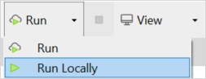
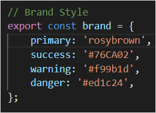
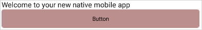
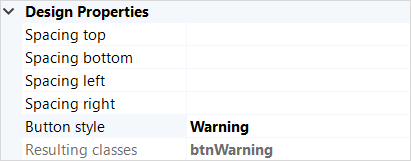
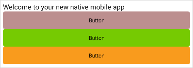
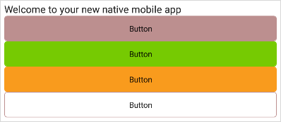
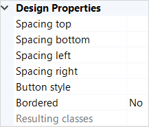
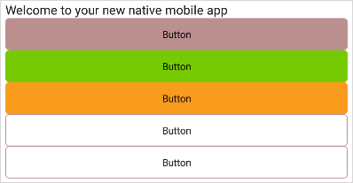

## 1 Introduction

With Mendix 8, you have the capacity to alter design properties with Mendix Studio Pro. Furthermore, because all native mobile styling is written in JavaScript, you have new ways of applying your styling customizations.

## 2 Prerequisites 

* Install an integrated development environment (IDE) of your choice (Mendix recommends [Microsoft Visual Studio Code](https://code.visualstudio.com/))
* Create a Mendix app based on the Quickstarter App template by following the [Creating a New Project Based on the Quickstart App](getting-started-with-native-mobile#quickstartapp) section of *Create and Test a Native Mobile App*

### 3 Customizing the Quickstart App

The Native Mobile Quickstart app is styled using an Atlas UI Resources package. This package consists of:

* Widgets
* Building blocks
* Page templates
* Page layouts 

These resources let you style your app with a wide variety of interface parts. However, you can customize them further by following these steps:

1.  Place a button widget on your app's home page:

	

2.  Click **Run locally** and then click **View** to see your app: 

	

	The button is white with blue text: its default styling. 

	

3. Open *theme/styles/mobile/core/variables.js* using your IDE of choice.
4.  Change the `brand.primary` from **#0595DB** to *rosybrown*:

	

5. Save your file.
6.  Click **Run locally** to apply your changes:

	

	You have successfully altered a default button to look rosy brown.

## 4 Classes

Classes are groups of styling properties which define how certain elements of your app will be rendered. Once you make a class, one which applies to a button for example, you can reuse that class to easily style subsequent buttons in the same way. For a list of the classes already provided to you, see [Mendix Atlas UI](../front-end/atlas-ui). To learn how to apply a class to a widget, follow the steps below.

1. Place a second button widget on your app's home page.
2. Run your app to view your button.
3. Select the button widget, and then click on the **Properties** panel. Under **Common** you will see the button's **Class** field.
4.  Type *btnSuccess* into the **Class** field:

	

5.  Click **Run Locally** to save and refresh your app. Notice the button turned green:

	
	
	You have successfully applied an Atlas-provided class to a button widget.

## 5 Design Properties

Design properties are easy-to-use classes in Mendix Studio Pro which you do not need to look up before using. Design properties are present inside Mendix Studio Pro with every widget they apply to. They can be accessed in the **Properties** panel, or by double-clicking the widget and clicking the **Appearance** tab for more advanced options. Design properties are particularly useful for creating generic styling for use on multiple widgets. Below you will use design properties to alter a button widget.

1. Place a third button widget on your app's home page.
2. Select the button, and find its **Design Properties** in the **Properties** panel.
3.  Click the **Button style** drop-down arrow and select **Warning**.

	

4.  Run your app again to see the *design* button's new color:

	

	Using design properties, you have changed the blue default button widget to orange. For any other warning buttons, you could easily apply the same design property.

## 6 Creating Your Own Classes {#6-creating-your-own-classes}

{}[throw core widget link in there when it comes online in the next few weeks]{}

When you have specific design requirements, you will need to build custom classes to fit. To harness the power of custom classes, follow the instructions below.

1. Place a fourth button widget on your app's home page.
2. Navigate to your Mendix app's folder using your IDE.
3. Open the **theme** folder of your app.
4. Open *styles/mobile/app/custom.js*.
5. Copy this code snippet into *styles/mobile/custom/custom.js*:

	```javascript
	export const className = {
		container: {
			<ViewStyle properties>
		},
		icon: {
		}
		caption: {
			<TextStyle properties>
		}
	}
	```
	
	When you alter a class on your own, you can look up the widget's structure in [core widgets refguide link TBR].

6. Create a custom button widget by removing the background color of the default button widget:

	```javascript
	export const className = {
		container: {
			backgroundColor: "transparent"
		},
		icon: {
		}
		caption: {
		}
	}
	```

7. Because your app already has default styling, you can remove the icon and caption properties. Also, change the constant to a unique, self-explanatory value such as `btnBordered`: 

	```javascript
	export const btnBordered = {
		container: {
			backgroundColor: "transparent"
		},
	}
	```

8. Save your work.
9. In Mendix Studio Pro, select your fourth button. In the **Properties** panel, type *btnBordered* into the **Class** field.
10.  Click **Run Locally** to see that your button's background color is transparent:

	
	
	You have successfully customized a simple button widget. Using these basic principles, you can go on to customize widgets with distinct looks.

## 7 Implementing Custom Design Properties

In this section you will learn to turn the class you made into a design property, so that it can be easily used by other people.

1. Place a fifth button widget on your app's home page.
2. Open *settings-native.json* in your IDE.
3. Find the `ActionButton` class. There are already design properties in `ActionButton`. Next, you will add some of your own.
4. Place this object under the first one in `ActionButton`:

	```javascript
	{
		"name": "Bordered",
		"type": "Toggle",
		"description": "Create a bordered button.",
		"class": "btnBordered"
	}
	```
4. In Mendix Studio Pro, press <kbd>F4</kbd> to synchronize your project directory.
5.  Select the fifth button. In **Properties** > **Design Properties**, your **Bordered** design property should now be visible:

	

6.  Enable the **Bordered** design property by clicking its drop-down menu and selecting **Yes**.

7.  Click **Run Locally** again and view your app:

	

	You have implemented your own custom design property. Other users can quickly harness your design property without having to consult a class name list.

Congratulations! By completing this how-to, you have learned how to alter a styling property, apply classes and design properties, and create your own classes and design properties.

## 8 Read More

* [Native Styling](native-styling)
* [Mendix Atlas UI](../front-end/atlas-ui)
* [Create and Test a Native Mobile App](getting-started-with-native-mobile)