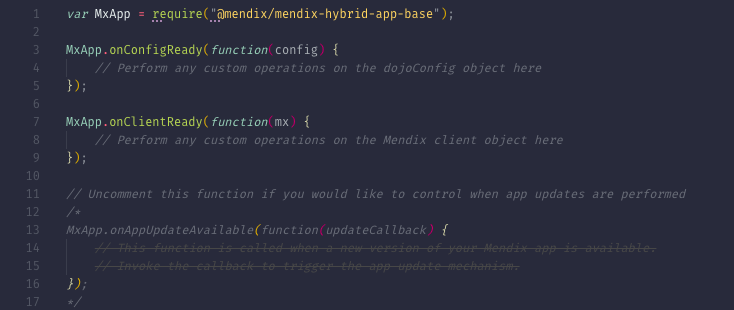
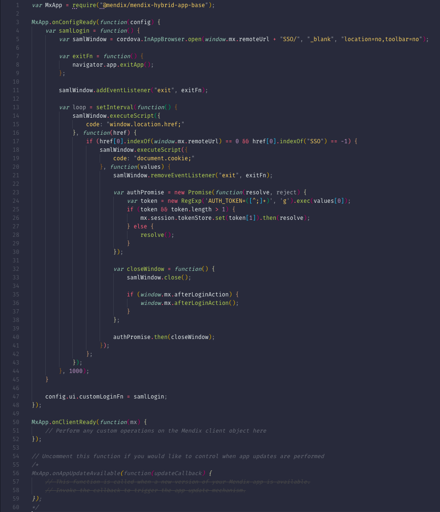

## 1 Introduction

This how-to will describe the challenges behind implementing SSO (single sign-on) in hybrid mobile apps and teach you how this can be solved in Mendix app projects.

## 2 Prerequisites

Before starting this how-to, make sure you have completed the following prerequisites:

* Have a [PhoneGap Build account](https://build.phonegap.com/)
* Be familiar with how the [SAML](https://appstore.home.mendix.com/link/app/1174/) module works
* Read [How to Publish a Mendix Hybrid Mobile App in Mobile App Stores](publishing-a-mendix-hybrid-mobile-app-in-mobile-app-stores)
* Read [Building a Mobile App with Mendix – Part 1](https://www.mendix.com/blog/building-mobile-app-mendix/)

## 3 Context

### 3.1 Mendix Mobile Apps, Hybrid Apps, Cordova, and PhoneGap Build

Mendix apps can be viewed in mobile web browsers. However, some features of mobile devices cannot be accessed through HTML and JavaScript. Also, if you want to publish your app in the Apple App Store or Google Play Store, you have to wrap your app in a native shell. Mendix uses [Cordova](https://cordova.apache.org/) to do this. Cordova creates a native wrapper around a web application and provides access to native functionality through a JavaScript API. These apps are called hybrid apps, because they are a hybrid of a web and a native app. To create binaries of your app, Mendix leverages PhoneGap Build so that you do not need to install software (Android SDK, XCode) for this.

### 3.2 How Authentication Against an IdP Works<a name="how"></a>

When authenticating against an identity provider (IdP), the following steps are taken:

1. The client (user agent) requests a page/resource from Mendix.
2. Mendix redirects the authentication request to the IdP by redirecting the client user agent there.
3. The IdP contacts the client and presents a login page.
4. The client authenticates against the IdP.
5. The IdP generates a SAML token and sends it back to the client, where it will be stored as a cookie.
6. The SAML token is sent to the Mendix Server by redirecting the client user agent back to the Mendix app.
7. After authentication, Mendix redirects the client to the page requested initially.
8. The client now requests the page requested initially.
9. Now that a security context exists, Mendix responds with the requested resource (page).<a name="diagram"></a>


Diagram source: [SAML 2.0 Web Browser SSO Profile](https://en.wikipedia.org/wiki/SAML_2.0#SP_POST_Request;_IdP_POST_Response)

## 4 The Problems<a name="problems"></a>

There are two main problems when trying to implement SSO on a hybrid app.

### 4.1 The First Problem<a name="firstproblem"></a>

The first problem is that the JavaScript needed to start up the app mobile functionality is stored inside the Mendix hybrid app. The application is loaded from the locally stored *index.html* file.

This is a problem because of all the browser redirects happening when doing the authentication against the IdP (as described in [3.2 How Authentication Against an IdP Works](#how)).

When a Mendix hybrid app is started on the mobile device, the localhost *index.html* page is loaded in order to load all the necessary JavaScript to run the app. However, to be able to authenticate the user, the user is redirected to the IdP, and then the IdP needs to redirect the user back to the app. The problem is that there is no way for the IdP to redirect to a localhost page, so there is no way to start the app while still including the right Cordova JavaScript.

### 4.2 The Second Problem<a name="secondproblem"></a>

The second problem is that Cordova does not store cookies permanently. And since Cordova does not store (authentication) cookies, when an app is closed, the IdP cannot recognize a returning user, so it will always ask the user for authentication.

## 5 The Solution

Mendix has created a standard approach to support SSO via the SAML module in a Mendix hybrid app. This approach contains reusable JavaScript code which can be added to the PhoneGap Build package that is used to build the app binaries. It also requires a simple configuration change on the SAML module. These components can be used by Mendix developers to make mobile apps compatible with SAML. However, care must always be taken to ensure the solution fits the requirements for specific projects.

### 5.1 The JavaScript<a name="javascript"></a>

The JavaScript code below will address the two problems described above.

To address the [first problem](#firstproblem), when the mobile app is starting to load, the JavaScript below will be executed. It opens a new window using [Cordova’s InAppBrowser](https://cordova.apache.org/docs/en/latest/reference/cordova-plugin-inappbrowser/), and all the redirects for the authentication are done there. When all the redirects are completed and the requested resource is sent from the Mendix Server back to the app (which is step 8 in the [SAML 2.0 Web Browser SSO Profile](#diagram) diagram), the authentication process is complete. The new window can then be closed, and the loading of the localhost *index.html* page can proceed.

```javascript
MxApp.onConfigReady(function(config) {

    var samlLogin = function() {
        var samlWindow = cordova.InAppBrowser.open(window.mx.remoteUrl + "SSO/", "_blank", "location=no,toolbar=no");
        var exitFn = function(){
            navigator.app.exitApp();
        };
        samlWindow.addEventListener("exit", exitFn);
        var cb = function(event) {
            if (event.url.indexOf(window.mx.remoteUrl) == 0 && event.url.indexOf("SSO") == -1) {

                samlWindow.removeEventListener("loadstop", cb);
                samlWindow.removeEventListener("exit", exitFn);

                samlWindow.executeScript({
                    code: "document.cookie;"
                }, function(values) {
                    var value = values[0] + ";";
                    var token = new RegExp('AUTH_TOKEN=([^;]+);', 'g').exec(value)[1];
                    window.localStorage.setItem("mx-authtoken", token);
                    
                    samlWindow.close();

                    if (window.mx.afterLoginAction) {
                        window.mx.afterLoginAction();
                    }
                });

            };
        }
        samlWindow.addEventListener("loadstop", cb);
    }
    config.ui.customLoginFn = samlLogin;

});
```

To address the [second problem](#secondproblem), after a successful authentication against the IdP, Mendix stores a token in the device’s local storage. The system will use that token from that moment on to create a new session for the user. The session is created in Mendix only, so a new authentication against the IdP will not be performed again. This token is a TokenInformation (part of the System module) object, and it can be accessed/edited in microflows. By default, this local token will never expire, but this can be overridden by changing the `com.mendix.webui.HybridAppLoginTimeOut` [custom runtime setting](/refguide/custom-settings). The downside of this approach is that access rights will not be updated upon login, since no interaction is done with the IdP. However, in most systems using SSO, user and role provisioning is handled separately from the authentication, so this might not be an issue.

### 5.2 The Hybrid App Package

To use the hybrid app package, follow these steps:

1.  Open your app in the Developer Portal and under **DEPLOY** in the left sidebar menu, click **Mobile App**.
2.  Click **Publish for Mobile App Stores**:

    
    
3.  Select **Do it yourself** and then click **Download Customizable Package**:

    

    This package you just downloaded is a customizable hybrid app package for your specific Mendix app. You can make changes to it, build a new PhoneGap Build package, and then upload it to PhoneGap Build to create the binaries (for example, APK for Android and IPA for iOS). To better understand the structure of what you just downloaded, see the **Folder Structure** section in the [Mendix PhoneGap Build App Template documentation](https://github.com/mendix/hybrid-app-template#folder-structure).

4.  Unzip the hybrid app package.
5.  Edit the *Entry.js* file (under `src\www\scripts`). The file should look like this:

    

6.  Add the JavaScript code provided in [5.1 The JavaScript](#javascript) under `MxApp.onConfigReady(function(config) {`. Your *Entry.js* file should now look like this:
       
    

7.  Create the PhoneGap Build package by following the instructions in the **Through Uploading to PhoneGap Build** section of the [Mendix PhoneGap Build App Template documentation](https://github.com/mendix/hybrid-app-template#through-uploading-to-phonegap-build). Be sure to read the **Prerequisites** and **Build on PhoneGap** sections of this documentation as well. This is an overview of the steps:<br>
    a. Install [node.js](https://nodejs.org/en/download/). <br>
    b. In the hybrid app root folder, execute **npm install**. <br>
    c. In the hybrid app root folder execute **npm run package**.<br>

8.  Create an APK or iOS package from the PhoneGap Build package. You can upload the new PhoneGap Build package (in the **dist** folder) to PhoneGap to build the APK or iOS binary.

    

9.  Set the **Enable mobile authentication token** flag to **true** in the **Provisioning** tab when configuring an identity provider in the Mendix SAML module. This will make sure the SAML module provides the correct login token to the JavaScript part.

    

## 6 Related Content

* [How to Deploy Your First Hybrid Mobile App](deploy-your-first-hybrid-mobile-app)
* [How to Publish a Mendix Hybrid Mobile App in Mobile App Stores](publishing-a-mendix-hybrid-mobile-app-in-mobile-app-stores)
* [How to Debug a Mobile App with Mendix](debug-a-mobile-app)
* [How to Debug a Hybrid Mobile Application](../monitoring-troubleshooting/debug-a-hybrid-mobile-application)
