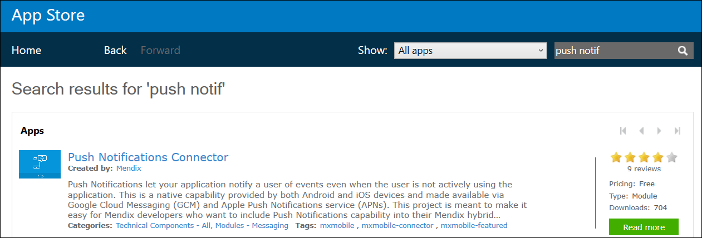
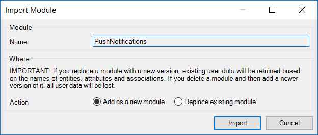
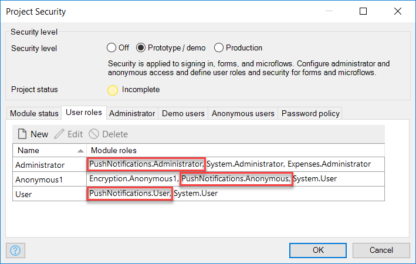

## 1 Introduction

This how-to will walk you through the steps needed to implement push notifications in your application.

**This how-to will teach you how to do the following:**

* Import the PushNotifications module
* Add the push notification widget and administrator pages
* Update several project files with the necessary dependencies
* Obtain FCM/APNs access/credentials and configure them with your application
* Build the hybrid mobile package

## 2 Prerequisites

Before starting this how-to, make sure you have completed the following prerequisites:

* Install Mendix Desktop Modeler version 7.1–7.3
    * Please note that 7.3 is the last version verified to work with [Push Notifications Connector module](https://appstore.home.mendix.com/link/app/3003/)
    * Download the Modeler in the [App Store](https://appstore.home.mendix.com/link/modeler)

## 3 Importing the PushNotifications Module from the App Store

The [Push Notifications Connector module](https://appstore.home.mendix.com/link/app/3003/) is published in the Mendix App Store. To import it into your project, click **App Store** in the top right of Modeler, which will open the App Store in a new tab. Search for "Push Notifications Connector" and click the title of the result:

On the resulting page, click the green **Download** button. Make sure that **Add as a new module** is selected, and then click **Import**:

## 4 Installing Module Dependencies

The PushNotifications module has two dependencies:

 * [Encryption module](https://appstore.home.mendix.com/link/app/1011/Mendix/Encryption)
 * [The Community Commons module](https://appstore.home.mendix.com/link/app/170/)
 
To include these dependencies, download them from the App Store in a way similar to how you installed the PushNotifications module. While importing, you may get a pop-up window with information about overwriting project files, which you can confirm by clicking **OK**.

{}

If your project is using an older version of the [Encryption module](https://appstore.home.mendix.com/link/app/1011/Mendix/Encryption), it might trigger an error for referencing a non-existent layout. You can fix this by assigning the master layout of the **Encryption.ResponsiveLayout_Certificate** layout to another layout (please note that in this specific use case, it is not important which layout is used). This does not apply to version 1.3.1 and above.

{}

After importing the module and the dependencies, your error dock will inform you that entity access is out of date. To fix this error, double-click the error and then click **Update security** at the top of the domain model pane.

## 5 Including the Push Notifications Snippet in the Application's Layouts

To properly register your device with a third-party remote push service (FCM or APNs) and display in-app notifications, you should put the widget on the pages of your app. You can accomplish this by
dragging the **PushNotification_Snippet** (located in the *_USE ME* folder in the PushNotifications module) into the layouts used by your app. Note that push notifications do not currently work on
the desktop.

If your app is offline-compatible, ensure that a sync button is available to the user so that device registration requests will be synchronized with the server. Also, make sure your app has an offline device profile (for details, see [Offline Device Profile](/refguide7/offline-device-profile) in the Mendix Reference Guide).

{}

Please do not remove the buttons with the caption **GCM Settings reference** and **Device Registration reference** from the PushNotification_Snippet. They are necessary to make the widget offline-compatible. Please note that both buttons are invisible to the user.

{}

## 6 Starting Connectors from Your "After Startup" Microflow

The PushNotifications module contains a microflow named **AfterStartup_PushNotifications** that will start the connectors for the FCM and APNs for you. Call this microflow from your **AfterStartup** microflow.

If your project uses Mendix SSO, most likely the **AppCloudServices.StartAppCloudServices** microflow is set to execute after startup (for details, refer to [Integrate Your App with Mendix SSO](/deployment/mendixcloud/integrate-your-app-with-mendix-sso) in the Mendix Reference Guide). We suggest that you change your startup microflow to a new microflow, from which you will call both after the startup microflows.

<iframe width="100%" height="491px" frameborder="0" src="https://modelshare.mendix.com/models/02c590e5-f8bf-4f0e-90d6-3719390ee863/onstartupacsandpushnotifications?embed=true" allowfullscreen=""></iframe>

## 7 Setting Up the Administration Pages {#setting}

Add the **PushNotifications_Administration** page to the project navigation, so it can be reached after you deploy your app. This page contains three tabs:
* **Pending Messages** – shows all the messages that are queued either because they were sent using the QueueMessage action or because previous attempts to send them failed
* **Devices** – contains a list of all the devices registered with the application and is useful for testing purposes
* **Configuration** – used to configure your application so that it can reach the respective services (APNs and FCM) later on

{}

Do not add the administration pages to the navigation layout of offline devices. The administration pages are not offline-compatible.

{}

## 8 Setting Up the Project Security for Your Module

On the **User roles** tab of the **Project Security** dialog box, include the following:
* The **PushNotifications.Administrator** role as part of the main **Administrator** role
* The **PushNotifications.User** role as part of the main **User** role
* The **PushNotifications.Anonymous** role role as part of the main **Anonymous** role (if your application allows anonymous users)

## 9 Deploying Your App

At this point, all the implementation steps are done and you can deploy your application to the Mendix Cloud. If you are using a free app, simply click **Run**.

{}

Make sure that the `Encryption.EncryptionKey` constant has a value before you start the application. If the value is not set, you will get a NullPointerException when you try to send a notification to APNs. If you are using a free app, set a default value for the constant in the model. Otherwise, configure the constant value in the Mendix Cloud portal.

{}

## 10 Setting Up Access to APNs and FCM

Set up access to APNs and FCM and configure them in your application. Please note that starting with FCM is recommended, because it is significantly less complicated than setting up APNs. You can return to this step later on to set up APNs.

For more details, see [How to Set Up the Apple Push Notification Server](setting-up-apple-push-notification-server) and [How to Set Up the Firebase Cloud Messaging Server](setting-up-google-firebase-cloud-messaging-server).

## 11 Building the Hybrid Mobile Application

You now need to build the hybrid mobile application. For an explanation on how to do this, see [How to Publish a Mendix Hybrid Mobile App](publishing-a-mendix-hybrid-mobile-app-in-mobile-app-stores).

For more information about the PhoneGap Build, refer to the [Adobe PhoneGap Build documentation](http://docs.phonegap.com/).

Please note that a free PhoneGap Build account is limited to a single application, whereas paid plans support multiple applications. As a consequence, you may need to delete an existing app from your PhoneGap Build environment in order to create a new one.
