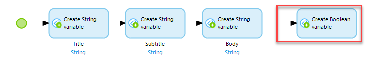
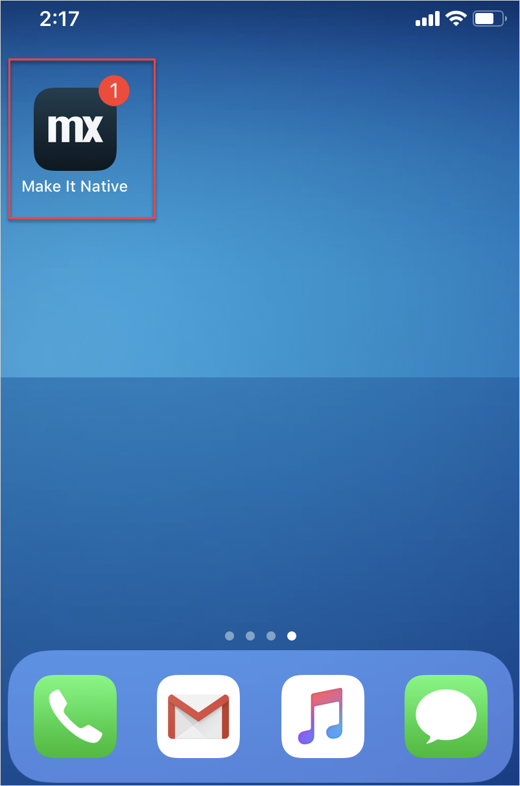

## 1 Introduction

Badges are crucial for many apps on iOS and Android. Badges differ in appearance based on platform, and often indicate important information in applications. For example with messaging applications, it is good practice to employ badges which alert users to new messages.

You will need to build badge functionality into your app so that when a user gets a notification, the app shows a badge on its app's icon. Also, badges are *not automatically decreased or removed* when a user checks an app. These two functions must be built manually by a developer.

## 2 Prerequisites 

Before starting this how-to, make sure you have completed the following prerequisites:

* Review the [basic differences](https://developer.apple.com/library/archive/documentation/NetworkingInternet/Conceptual/RemoteNotificationsPG/) between local notifications and push notifications
* Install the [Make it Native](/refguide/getting-the-make-it-native-app) app on your mobile device
* Complete the preceeding how-to's in this [Use Local Notifications](local-notif-parent) series

## 3 Setting a Badge Number

Since you know how to send a simple local notification, you can now set the badge number by following these steps:

1. Open **ACT_CreateAndSendNotification**.
2.  Drag and drop a **Create variable** activity to the right of the three string variables you made:

	{}{}

3. Double-click the variable activity and select **Data type** > **Integer/Long**.
4. Type *1* into the expression value field. 
5.  Type *badge_number* into the **variable name** field:

	{}{}

6. Click OK.
7.  Drag and drop a **Set badge number** JavaScript action to the right of your merge activity:

	

8. Double-click the badge number activity.
9.  Set the value of **Badge number** to **$badge_number**

	

10. Click **OK**.

Start and load the app on your mobile device and tap the button which calls your nanoflow. You will see a notification. Go to your device's start screen to see the notification badge on your app:

{}{}

## 4 Read More

* [Implement Push Notifications](implementation-guide)
* [Build JavaScript Actions](/howto/extensibility/build-javascript-actions)