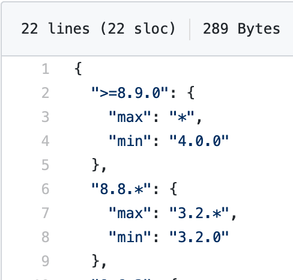
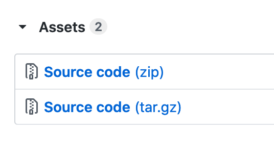
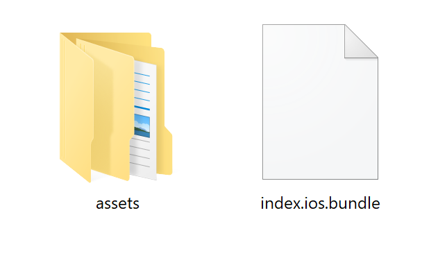
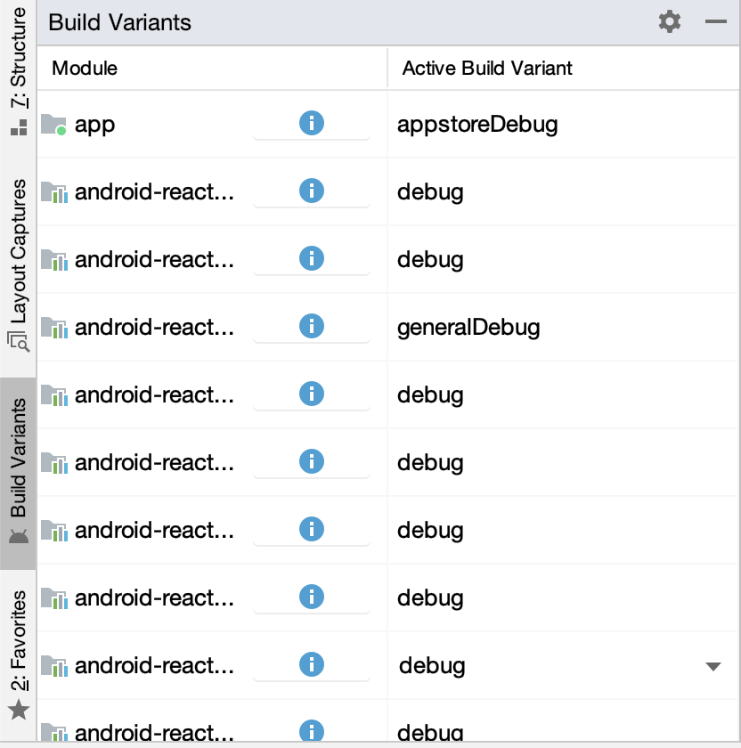
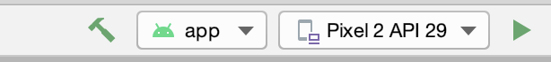
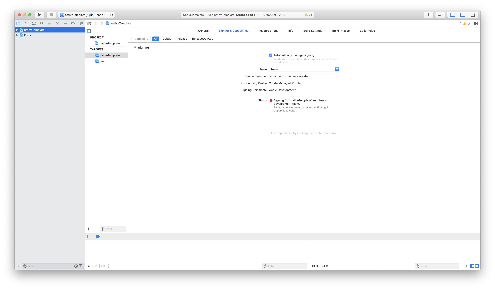
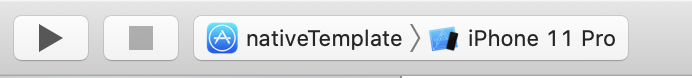

## 1 Introduction

By default when building your native mobile app binaries, Mendix uses [Visual Studio App Center](https://appcenter.ms/sign-in?original_url=%2Fapps) as a service so that users can build without having to install tools like XCode or Android Studio. However, there are cases when using App Center is not allowed or possible. In those situations, you can build your apps locally without an internet connection.

Follow the sections below through [Building Your Native App Project](#building-app-project) to complete your builds. To go beyond those instructions, see [Adding Dependencies](#adding-dependencies) and [Removing Dependencies](#removing-dependencies) sections below. These sections will allow you to further customize your local builds.

To understand the local build process, it is important to grasp a few basic concepts. Mendix native mobile apps are first and foremost React Native (RN) apps which follow the same rules as other RN apps:

* The JS code and static assets need to be bundled together for RN to use
* The bundled code and assets are put into a React Native Template that represents an iOS and Android app

In a similar fashion, MXBuild and the Mendix Native Template follow these rules:

* When using MXBuild, the JS code and static assets are bundled together
* The bundled code and assets are put into the Mendix Native Template that provides a foundation for both an iOS and Android version of your app

## 2 Prerequisites {#prerequisites}

Before starting this how-to, make sure you have completed the following prerequisites:

* Install [Node and NPM](https://nodejs.org/en/download/)
* Download the Native Builder [executable](https://www.dropbox.com/sh/hpw7sshut9bco68/AABackrr75rPSgW7u5LBMkMra?dl=0) to a folder of your preference and extract all contents
   * Use v1.0.0 with Mendix 8.0
   * Use v2.0.0 with Mendix 8.1.0 and above
   * Use v3.0.0 with Mendix 8.3.0 and above

For iOS builds:

* Have a Mac OS X machine 
* Install [XCode](https://apps.apple.com/us/app/xcode/id497799835?mt=12) and [CocoaPods](https://guides.cocoapods.org/using/getting-started.html) 

For Android Builds:

* Install [Android SDK](https://developer.android.com/studio) and [platform tools](https://developer.android.com/studio/releases/platform-tools)

## 3 Getting the Native Template

The Native Template is the base for building native mobile apps with Mendix. In essence, it is a React Native template with the extra dependencies and configurations required to run your Mendix app.

The Native Template is versioned against Mendix Studio Pro. This means the Studio Pro version you use to create your Mendix app dictates which version of the Native Template you should use. When using the Native Builder this is handled internally using the `--mendix-version` parameter. For more information on parameters, see the [Expanded Parameter Explanations](/refguide/native-builder#parameters) section of the *Native Builder Reference Guide*.

### 3.1 Determining Which Native Template Version to Use

To determine which version of the Native Template you should use, do the following:

1. Note which version of Studio Pro you are using.
1. Navigate to the [Native Template GitHub repository](https://github.com/mendix/native-template).
1. At the root of your project, open the *mendix_version.json* JSON file.

The keys of the dictionary represent the Mendix Studio Pro version. The `min` and `max` values are the minimum and maximum Native Template versions supported: 

{}{}

In the case of Mendix Studio Pro 8.9.x, you could choose any Native Template version from 4.0.0 to the latest. Ideally you should choose the most recent supported version

There is no best way of getting a copy of the Native Template. In the following sections we provide two ways to get the version you need.

#### 3.1.1 Getting the Native Template Using the Git CLI

This method is useful if you have Git installed. To get the Native Template, do the following:

1. Use `git@github.com:mendix/native-template.git` or `https://github.com/mendix/native-template.git` to clone the project locally. 
1. Run the following command: `git clone --single-branch --branch release/<major-version-number> <repo-url>`.

The final step differs based on your machine:

For a Windows machine building an Android app, do the following: 

1. Run `npm i`  to install the required dependencies.

For a Mac OS X machine building an iOS app, do the following:

1. Run `cd ios && pod install` to install the required dependencies.

#### 3.1.2 Getting the Native Template by Downloading the Source Code from GitHub

This method is useful if you do not have Git installed. To get the Native Template, do the following:

1. Navigate to the [Native Template releases](https://github.com/mendix/native-template/releases).
1. Scroll to the version you want to download.
1.  Select the source code binary to download a copy of the code:

	{}{}

1. Unzip the file.
1. Run `npm i && cd ios && pod install` to install the required dependencies.

Now that you have a copy of the Native Template checked out and ready, you can bundle your Mendix app project, move it into the Native Template folder, and compile everything together to produce your native app.

## 4 Bundling Your Mendix App

Bundling is the process of packaging everything you created in Studio Pro and making that package ready to be compiled into your native mobile app. Bundling in the case of a React Native app, and hence a Mendix Native App, includes transpiling the business logic and layout of your app into a JavaScript bundle and gathering all your static resources into the correct folder structure. 

For bundling your resources, the Native Builder supports an offline command that runs MXBuild (a headless version of Mendix Studio's app compiler) and generates the required bundle and assets. To bundle your app, do the following:

1. Run the following command:

	```
	native-builder.exe bundle --project-name "CoolApp" --output-path "C:\bundles" --project-path "<absolute-path>" --java-home "<absolute-path>" --mxbuild-path "<absolute-path>"
	```

The output path can be any location files could go. This command will do the following:

1. Run MXBuild against your project to generate the required bundle and assets.
1. Zip the output.
1. Move the zipped bundle and assets to the `--output-path`.

When completed you should have two zipped binaries: one for Android and one for iOS. Continue by doing the following:

1.  Unzip the iOS binary. The folder structure should be the following:

	{}{}

1. Move the folder's content to *{your Native Template root}/ios/Bundle*.
1.  Unzip the Android binary. The folder structure should be the following:

	{}{}

1. Move the folder's content to *{your Native Template root}/android/app/src/main*. Choose to overwrite if requested to do so.
1. Open *{your Native Template root}/android/app/src/main/res/raw/runtime_url* using a text editor.
1. Replace the URL with the correct URL for your runtime.
1. Open *{your Native Template root}/ios/Config/config.xcconfig*, then replace the value of `RUNTIME_URL=` with the correct URL for your runtime.

Congratulations! You have successfully completed the basic setup of a Native Template with the latest bundle and assets of your Mendix app project.

## 5 Building your Native Mobile App Project{#building-app-project}

Now that the Native Template is ready and includes the app's bundle, resources, and runtime URL configuration, it can be built into a native app. To build your project you can open the project with Android Studio or XCode for the Android and iOS project respectively, and then build as normal. More advanced use cases, such as apps for continuous integration pipelines, can make use of Gradle or xcodebuild to build the apps using command line.

In the sections below you can see the basic steps to get an app up and running on an emulator or device using Android or iOS IDEs.

### 5.1 Building an Android App with Android Studio

1. Run npm install in the project root to install the required dependencies.
1. Open Android Studio.
1. Select the `<Native Template root>/android` as the entry point for the project.
1. After synchronizing the project your Android Studio should look something like this:

	{}{}

   Mendix native mobile apps make use of **Build Variants** to build a release app or a custom developer app. The idea of **Build Variants** is a Gradle build system concept for sharing the same codebase but delivering different experiences.

1. Choose the **appstoreDebug** variant to be able to build and test your app on an emulator or connected device:

	{}{}
   
1. After a short time the project should be synchronized and the play button should be selectable. Select a device or create a device from the drop-down menu and click the play button to build and install your app on the device:

	{}{}

### 5.2 Building an iOS App with XCode

1. If you have not ran it yet, run `npm install` in the project root to install the required dependencies.
1. Change directory by running `cd ios` and run `pod install` to install the iOS dependencies.

	The iOS project is using CocoaPods for its dependency management. For more information on installing the CocoaPods dependency manager on your machine see CocoaPods [documentation](https://cocoapods.org/#install).

1. Open *.xcodeworkspace* using XCode.
1. Navigate to **Signing and Capabilities** and choose your **Team** from the drop-down menu:

	{}{}

	As with the Android **Build Variants** the iOS app makes use of **Build Targets** to switch between building a custom developer app or a release app.

1. From the drop-down menu choose **nativeTemplate** and the device you would like to run the app on, then click the play button to start a build for your app:

	{}{}

After the build succeeds the app should be running on the selected device and connected to the runtime using the runtime URL you provided. 

## 6 Adding Dependencies{#adding-dependencies}

At some point you will want to enhance your project with native pluggable widgets and functionality that will require the inclusion of React Native modules and libraries.

Mendix native mobile apps are build on top of React Native. Therefore, any React Native module can be added and used in a project. The same rules apply as with any React Native project.

### 6.1 Adding Dependencies For Native Templates v4.0.0 and Above

From Native Template v4.0.0 and above Mendix supports RN 0.6.x and therefore auto-linking. Auto linking is a React Native mechanism that allows React Native to link the native dependencies defined in the *package.json* file automatically with the native projects. To add dependencies for Native Template v4.0.0 and above, do the following:

1. Add the dependency to the root *package.json* of your Native Template using `npm i -s <dependency name>`.
1. If the dependency supports auto-linking when `npm install` is run it will automatically add itself correctly to the Android and iOS project. If the dependency does not support auto-linking or requires more configuration, follow its documentation to add the required entries manually.

### 6.2 Adding Dependencies For Native Templates Below v4.0.0

Native Template versions below v4.0.0 do not support React Native's auto-linking. Therefore always follow the manual steps of the dependency to add it to the Android and iOS projects.

## 7 Removing Dependencies{#removing-dependencies}

As the requirements of a project might change, so do the required native modules and libraries. To avoid bloating your app with unnecessary libraries, consider removing unused libraries. This process is not currently automated and requires a bit of consideration when identifying any unused libraries.

### 7.1 Removing Dependencies Which Support Auto-Linking for v4.0.0 and Above

To remove dependencies which support auto-linking, do the following:

1. Remove the dependency entry from the *package.json* file.
1. Run `npm i`.

### 7.2 Removing Dependencies Which Do Not Support Auto-Linking or for v.3.x and Bellow

To remove dependencies which do not support auto-linking, do the following:

1. Remove the dependency's entry from the *package.json* file.
1. Remove the dependency's entry from the *ios/Podfile* file.
1. Remove the dependency's `include` and `project` entries from the *android/setting.gradle*. For example, to remove the Firebase module remove the following: 

	```
	include ':react-native-firebase'
	project(':react-native-firebase').projectDir = new File(rootProject.projectDir, '../node_modules/react-native-firebase/android')
	```

1. Remove the dependency's `implementation` entry in the *android/app/build.gradle*. For example, to remove the Firebase module remove the following:

	```
	implementation project(":react-native-firebase")
	```

1. Remove any custom code included in the iOS or Android project.

## 8 Read More

* [How to Create a Custom Developer App](how-to-devapps)
