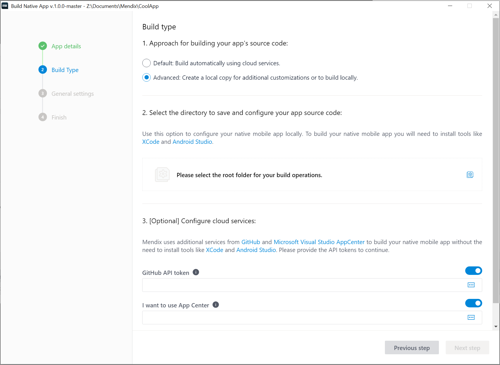
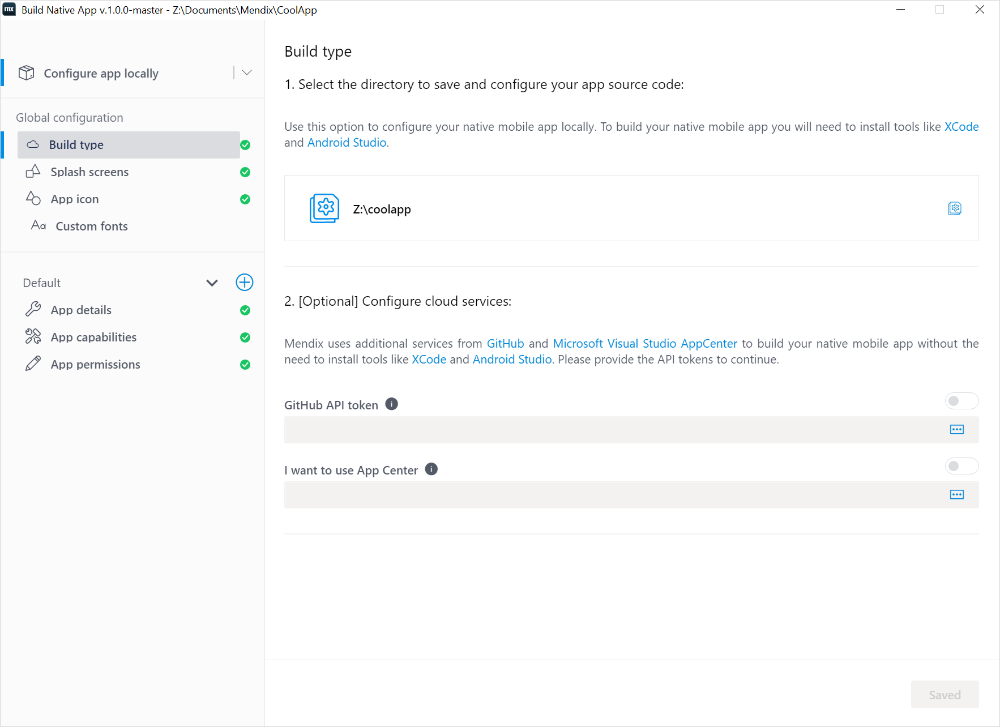

## 1 Introduction

By default when building your native mobile app binaries, Mendix uses [Visual Studio App Center](https://appcenter.ms/sign-in?original_url=%2Fapps) as a service so that users can build without having to install tools like XCode or Android Studio. However, there are cases when using App Center is not allowed or possible. In those situations, you can build your apps locally.

Follow the sections below through [Building Your Native App Project](#building-app-project) to complete your builds. To go beyond those instructions, see [Adding Dependencies](#adding-dependencies) and [Removing Dependencies](#removing-dependencies) sections below. These sections will allow you to further customize your local builds.

## 2 Prerequisites {#prerequisites}

Before starting this how-to, make sure you have completed the following prerequisites:

* Install [Node and NPM](https://nodejs.org/en/download/)

For iOS builds:

* Have a Mac OS X machine 
* Install [XCode 12.4](https://apps.apple.com/us/app/xcode/id497799835?mt=12) and [CocoaPods](https://guides.cocoapods.org/using/getting-started.html) 

For Android Builds:

* Install [Android SDK](https://developer.android.com/studio) and [platform tools](https://developer.android.com/studio/releases/platform-tools)

## 3 Use Mendix Native Mobile Builder to setup your local project

1.  Run Mendix Native Mobile Builder from your project: 

	{}{}

1. When Mendix Native Mobile Builder launches you will see the home screen:

	{}{}
1. Select **Build app for distribution**.
1.  Fill in your app's name and the app identifier. The wizard provides defaults, but you might want to align the app identifier to use your company's reversed URL, or change the app name in some other way:

	{}{}

1. Click **Next Step** when ready.
1.  In the **Build type** choose the **Advanced** checkbox. 
	{}{}
1. Select the folder you want your project's Native Template to be created. Valid choises, is an empty directory or a directory with a Native Template.
1. Disable any service you do not wish to use. App Center requires GitHub as a service to work.
1. Click **Next Step** until you reach the end of the wizard. Feel free to configure any step as needed.  
1. Select **Build type** from the side bar. 

	{}{}

	As you already selected to use the Advanced flow with this project it is not possible to switch back to just using Cloud services. But you can enable or disable any service as needed. If for instance GitHub is enabled, Native Mobile Builder will synchronize any local changes with your repository the next time you configure your project and commit your changes. But keep in mind that Mendix Native Builder is not a replacement of a Git client, and pushing local changes to a repository can add to the configuration time.

1. Select **Configure app locally** and fill in the information as needed for your app.
{}{}
1. Click **Configure locally**

	The process will start and it will:
	* Derive the required native dependencies for your project based on the pluggable widgets used in your project
	* Run MxBuild to build your project's app bundles
	* Checkout the correct version of Native Template for the Mendix Studio Pro version you are using
	* Configure the project

	If GitHub is enabled, in addition to the previous steps, it will: 
	* Commit the whole local copy to the project's repository

## 4 Building your Native Mobile App Project{#building-app-project}

Now that the Native Template is ready and includes the app's bundle, resources, and runtime URL configuration, it can be built into a native app. To build your project you can open the app with Android Studio or XCode for the Android and iOS project respectively, and then build as normal. More advanced use cases, such as apps for continuous integration pipelines, can make use of Gradle or xcodebuild to build the apps using command line.

In the sections below you can see the basic steps to get an app up and running on an emulator or device using Android or iOS IDEs.

### 4.1 Building an Android App with Android Studio

1. Run `npm install` in the app root to install the required dependencies.
1. Open Android Studio.
1. Select the `<Native Template root>/android` as the entry point for the app.
1. After synchronizing the app your Android Studio should look something like this. **Do not accept any suggestions to update to latest Gradle or Kotlin version!**:

	{}{}

   Mendix native mobile apps make use of **Build Variants** to build a release app or a custom developer app. The idea of **Build Variants** is a Gradle build system concept for sharing the same codebase but delivering different experiences.

1. Choose the **appstoreDebug** variant to be able to build and test your app on an emulator or connected device:

	{}{}
   
1. After a short time the app should be synchronized and the play button (**Run Locally**) should be selectable. Select a device or create a device from the drop-down menu and click the play button (**Run Locally**) to build and install your app on the device:

	{}{}

### 4.2 Building an iOS App with XCode

1. If you have not ran it yet, run `npm install` in the app root to install the required dependencies.
1. Change directory by running `cd ios` and run `pod install` to install the iOS dependencies.

	The iOS project is using CocoaPods for its dependency management. For more information on installing the CocoaPods dependency manager on your machine see CocoaPods [documentation](https://cocoapods.org/#install).

1. Open *.xcodeworkspace* using XCode.
1. Navigate to **Signing and Capabilities** and choose your **Team** from the drop-down menu:

	{}{}

	As with the Android **Build Variants** the iOS app makes use of **Build Targets** to switch between building a custom developer app or a release app.

1. From the drop-down menu choose **nativeTemplate** and the device you would like to run the app on, then click the play button (**Run Locally**) to start a build for your app:

	{}{}

After the build succeeds the app should be running on the selected device and connected to the runtime using the runtime URL you provided. 

## 5 Read More

* [How to Deploy Your First Mendix Native Mobile App](deploying-native-app)
* [How to Create a Custom Developer App](how-to-devapps)