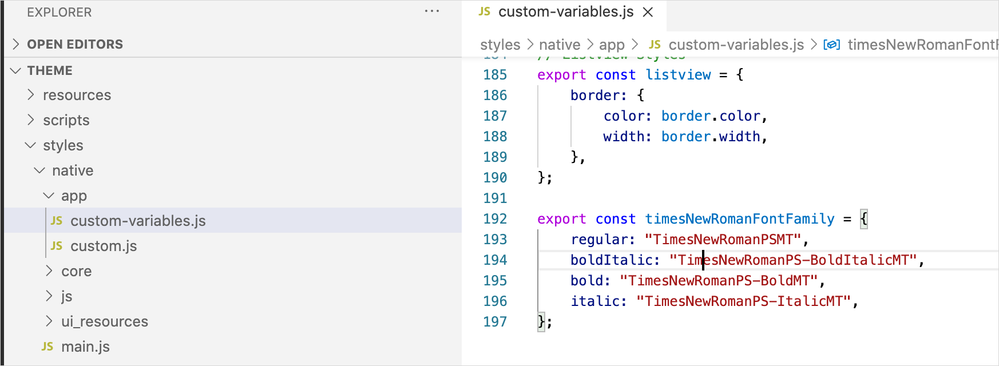
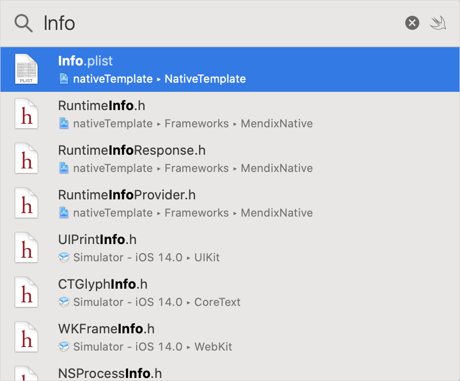
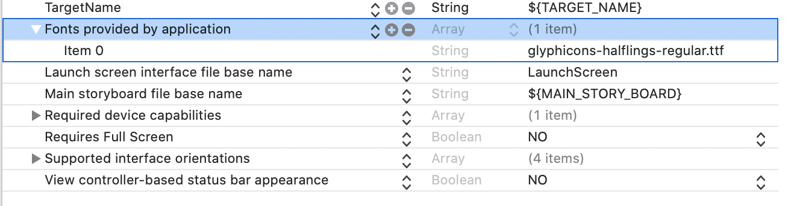
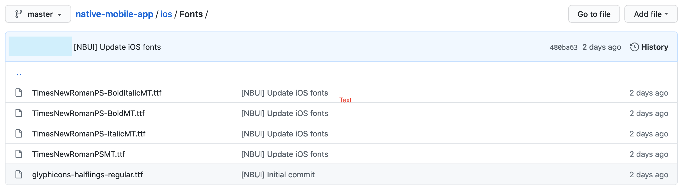

## 1 Introduction

Good typography plays a major role in conveying your app's message in a way that is unique to your company's flair. Setting up the fonts you need is as simple as drag and dropping the required fonts and setting your app's style. 

## 2 Introduction to fonts in Mendix Native Apps
When it comes to fonts several standards and types are extensively used in the industry. Most commonly, True type (.ttf), Open Type (.otf | .ttf) and Web Open Font Format (.woff). 

As this document focuses on Native Mobile platforms only, the later one can be safely ignored. 

Open Type fonts support a variety of metadata as also the possibility to package multiple font varieties in a single file. This feature is not supported for mobile platforms. You should have each variety of the Font Family you would like to add as a separate file. 

Android and iOS, both follow a different approach to fonts. Where Android requires an explicit declaration for each font added, iOS can derive the font type and font style dynamically. Of course, adding fonts to each platform requires a different approach. Where Android is expecting font files to exist in a specific folder, iOS requires the font files to be explicitly linked in its build process. 

Furthermore, both platforms follow a different approach in how they resolve available fonts. While iOS fully supports Open Type fonts and can select fonts based on their metadata; Android requires explicit linking of the font file to the weight and style.

React Native, the underlying framework of Mendix Native Apps attempts to unify the process of adding fonts. For example, fonts added under `assets/fonts` on android are explicitly linked in the project. These fonts are then exposed directly in the framework for styling your widgets using the common CSS properties we all know and love.

But there are limitations. In this case, Android has a very limited set of Font types supported. These are regular, bold, italic, and bold italic.

What does that mean for the app's CSS styles? 

For example, if we were to use the following snippet in our CSS like styles:
```
{ 
    fontWeight: 550
}
```
Our font, when running the app on Android, would end up looking regular instead of the semibold font we would expect. 

That is because Android would first look up the available font styles registered. Unable to resolve the weight it would fall back to the next best option. The same applies to styles.

In addition, Android expects the font filename to be a combination of the actual font family name, the weight, and style. For example for Time New Roman bold italic, `TimeNewRoman_bold_italic.ttf`. Failing to comply leads in the `fontFamily`, `fontWeight` and `fontStyle` attributes to fail to style text correctly.

So how can that be mitigated? 
First of all, explicitly styling of text using the common CSS text attributes `fontWeight`, `fontStyle` should be avoided. The results will vary per platform. 

Instead, postscript names should be used. That means, instead of a single `fontFamily` attribute with multiple weights and styles, a font family needs to be defined per weight and style combination.
Instead of: 
```
export const bold = {
    fontFamily: "Times New Roman",
    fontWeight: "bold" | "500"
}
```
Define a constant: 
```
export const timesNewRomanFontFamily = {
    regular: "TimesNewRomanPSMT",
    boldItalic: "TimesNewRomanPS-BoldItalicMT",
    bold: "TimesNewRomanPS-BoldMT",
    italic: "TimesNewRomanPS-ItalicMT",
};
```
Then define the styles as follow: 
```
export const boldText = { 
    fontFamily: timesNewRomanFontFamily.bold,
}
```
Now wherever we use `boldText` we will certainly get the expected result on both platforms consistently.

## 3 Add custom fonts with Mendix Native Mobile Builder 

Mendix Native Mobile Builder simplifies the adding of custom fonts to your project. It configures both Android and iOS projects and also provides the snippets needed to simply copy and paste in your Mendix project's native styles.

Todo so: 

1. Start Native Builder


1. Navigate to Custom Fonts


1. Drag and drop the fonts you would like to apply. For example, Time New Roman is being used here. When the process complete you should see the font family just uploaded in the list.


1. Extend the list using the arrow to the right. Verify the expected fonts are available. You can continue and add as many fonts as you prefer. 


1. When ready click the snippet button {}{} to get the code snippet to copy to your styles.


1. Build your app, to get the new binary with fonts included. 

## 4 Use custom fonts in your project

To use the new fonts to style your content:

1. Copy the snippet from Native Mobile Builder.


1. Open your styles js file and paste the snippet. For this example, the custom-variables.js file is being used. For more info on styling your app read the [Style Your Mendix Native Mobile App](https://docs.mendix.com/howto/mobile/how-to-use-native-styling#1-introduction) how to.


1. The constant can now be imported and be used to define the font family of any test style as needed. Elements styled using these classes will now be styled using the font.


## 5 Add custom fonts manually

While Mendix Native Mobile Builder simplifies things tremendously, you might find yourself in a situation where using the tool might not be possible.

### 5.1 Add custom fonts to an Android project
To manually add custom fonts to your Android app: 

1. Collect all the fonts you would like to use.

1. Use a tool like [Open Type Inspector](https://opentype.js.org/font-inspector.html) and derive the Postscript name for each font. 


1. Rename the fonts to much the Postscript name. For example for the Time New Roman font used in the example we have: 
    * TimesNewRomanPSMT, for regular.
    * TimesNewRomanPS-BoldMT, for bold.
    * etc

1. Copy the renamed fonts to the `android\app\src\main\assets\fonts` folder.

1. If you plan in using the tool to build your project commit your changes.


1. Build your Android app with your preferred method.

That concludes the how-to on manually adding custom fonts to an Android project.

### 5.2 Add custom fonts to an iOS project

To manually add fonts to an iOS project, XCode should be used. 

1. Collect all the fonts you would like to use

1. Use a tool like [Open Type Inspector](https://opentype.js.org/font-inspector.html) and derive the Postscript name for each font. 


1. Rename the fonts to much the Postscript name. For example for the Time New Roman font used in the example we have: 
    * TimesNewRomanPSMT, for regular,
    * TimesNewRomanPS-BoldMT, for bold,
    * etc.

1. Open XCode and select the workspace at `ios\NativeTemplate.xcworkspace`.

1. Drag and drop the renamed fonts to the `Resources/Fonts` folder in Project Explorer. 

1. Select both targets from the dialog that shows up. 


1. Your folder structure should look like the following:


1. Open the Info.plist file by pressing `⌘ + shift + O` and search for the file. 
Hit enter to open it.


1. Find the key `Fonts provided by the application`. Expand it if needed.


1. Press the `+` button next to the key, to create a new empty item in the list.

1. Type the font file name you wish to add as the value. In this case, we are adding the regular Time New Roman font, therefor the filename value is `TimesNewRomanPSMT.ttf`


1. If you plan in using the tool to build your project commit your changes.


1. Build your iOS app with your preferred method.

That concludes the how-to on manually adding custom fonts to an iOS project.