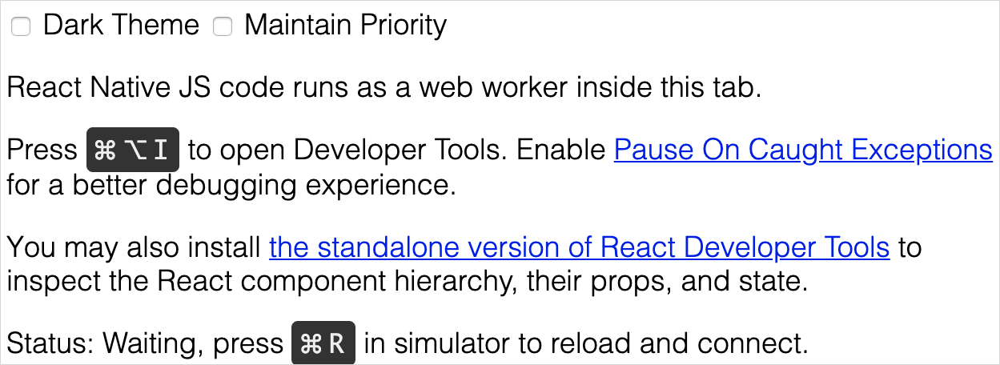
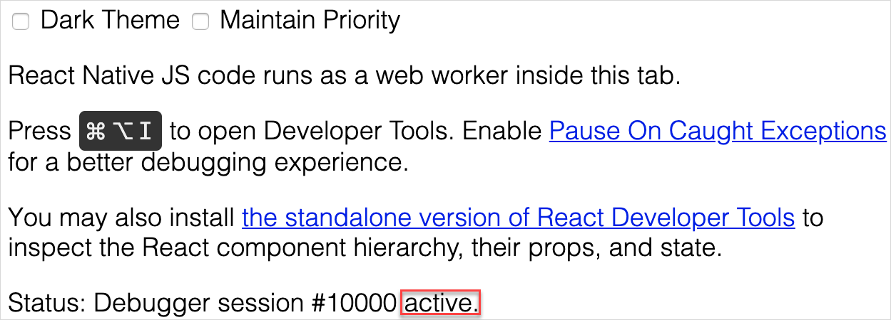

## 1 Introduction

When changing your native mobile app or designing a custom widget, you may need to debug your implementation. The Make It Native app exposes a developer mode which supports debugging native mobile apps for expert developers. Using Google Chrome is recommended for this, as it starts automatically during debugging.

## 2 Debugging Your Native App

To start a debugging session, do the following:

1. Run your Mendix app project locally on your desktop.
2. Start the Make It Native app.
3. Select **Enable dev mode** in the Make It Native app.
4. Start your app project on your mobile device in Mendix Studio Pro by clicking **View** > **View in the Mendix App**.
5. With your mobile device, tap **Scan QR code**, then scan the QR code on your desktop.

When the Make It Native app finishes loading your app project, do the following:

1. Open the developer menu by using a three-finger long press.
2.  Tap **Enable Remote js Debugging**.

Your mobile app project should start reloading, and a Chrome window should launch on your desktop pointing to a debugging address. Change the address in your browser's navigation bar to *localhost:8083/debugger-ui* manually and go to that page.

If Chrome launches but does not load your app, check that your app project is running in Mendix Studio Pro. If it is, click the **Stop** button, then click **Run Locally** again to restart your app. 

You should see this page:

If the status remains at **Waiting**, use the reload command (pictured above) to refresh your app. The **Waiting** status should change and indicate an **active** session:

Your browser's debugging tools should be pointing to your app project. Now, you can debug your app like you would any other web app. 

Other tools can help you debug Mendix apps, such as the [Using React Developer Tools](#rn-dev) section below. Regardless of which tool you use, remember that Mendix uses a different port (8083) than a default React Native installation would (8080).

### 2.1 Using React Developer Tools{#rn-dev}

React Developer Tools is an extension for [Chrome](https://chrome.google.com/webstore/detail/react-developer-tools/fmkadmapgofadopljbjfkapdkoienihi?hl=en) and [Firefox](https://addons.mozilla.org/en-US/firefox/addon/react-devtools/) browers which will allow you to see investigate the way your native page is rendering, adjust things like spacing in a live editor, and inspect the state and props of your pluggable and native widgets. You can consult Facebook's [official documentation](https://github.com/facebook/react/tree/master/packages/react-devtools) for extra information, but this document will teach you the basics of using React DevTools.

To install React Developer Tools, do the following:

1. Open your CLI and run NPX (an executable runner for NPM) with this code: `npx react-devtools@^3`. The `@^3` ensures compatibility with Mendix's React Native version.

#### 2.1.1 Debugging with a Simulator

Open your native app in your simulator of choice then do the following:

1. Select **Enable dev mode** on your native app.
2. Run `npx react-devtools@^3`.
3.  React Developer Tools will launch and connect to your simulator. You can now inspect and modify the React Native elements the same way you could modify HTML elements in Chrome:

	{}{}

#### 2.1.2 Debugging with the Make It Native App

To use the Make It Native app with React Developer Tools, do the following: 

1. Connect your mobile device to your laptop with a USB cord.
2. Run `adb devices` to ensure your device is listed.
3. Start your native app on your device with **Enable dev mode** selected.
4. Run `npx react-devtools@^3`.
5. Run `adb reverse tcp:8097 tcp:8097` to allow the applet to interact  with your device.
6. React Developer Tools will launch and connect to your device. You can now inspect and modify the React Native elements the same way you could modify HTML elements in Chrome:

	{}{}

## 3 Debugging Your Styling

With the Make It Native app, you can examine your styling and the structure of your pages. This makes it easier to debug, test, and inspect styling. Inspect and debug your styling by doing the following:

1. Install the LTS of [node.js](https://nodejs.org/en/).
2. Open your command line interface (CLI).
3. Run `npm i -g react-devtools@3` to install the React developer tools.
4. Run `react-devtools`.

After running `react-devtools` you will see the React developer tools GUI. To use the tools to debug your styling, do the following:

1. Open your app in the Make It Native app with **Enable dev mode** selected.
2. When running your app, shake your device to open developer settings.
3. Tap **Toggle Element Inspector** to start inspecting. 
4. Tap any styled element in your app (like a text element) to see its style information on your device and inspect and debug it in your React developer tools GUI.
5. Shake your device and tap **Toggle Element Inspector** to turn off the inspector off.

## 4 Read More

* [Get Started with Native Mobile](getting-started-with-native-mobile)
* [Debug a Mobile App with Mendix](debug-a-mobile-app)
* [Build Native Mobile Apps with Parallels](using-mendix-studio-pro-on-a-mac)