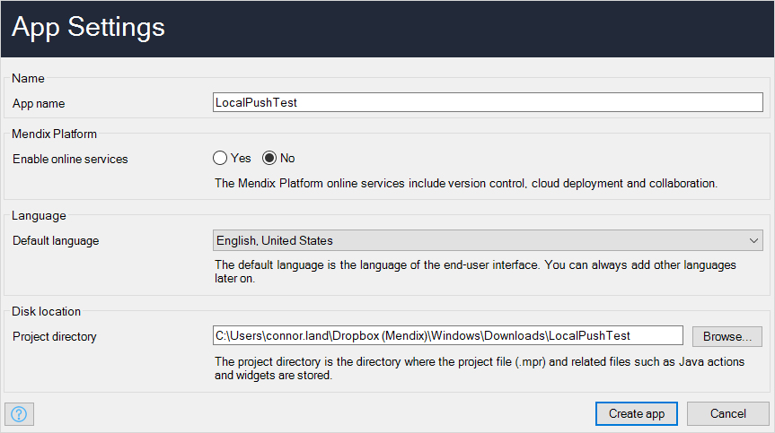
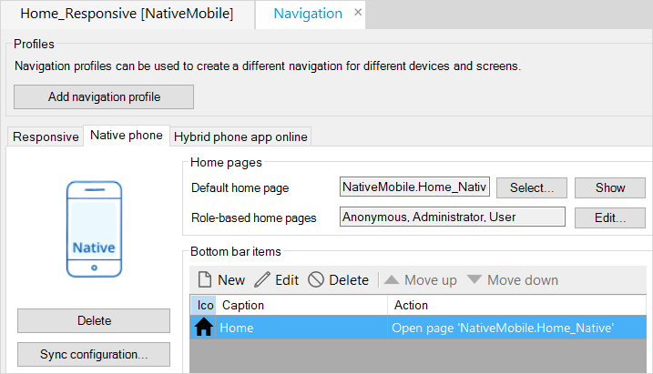
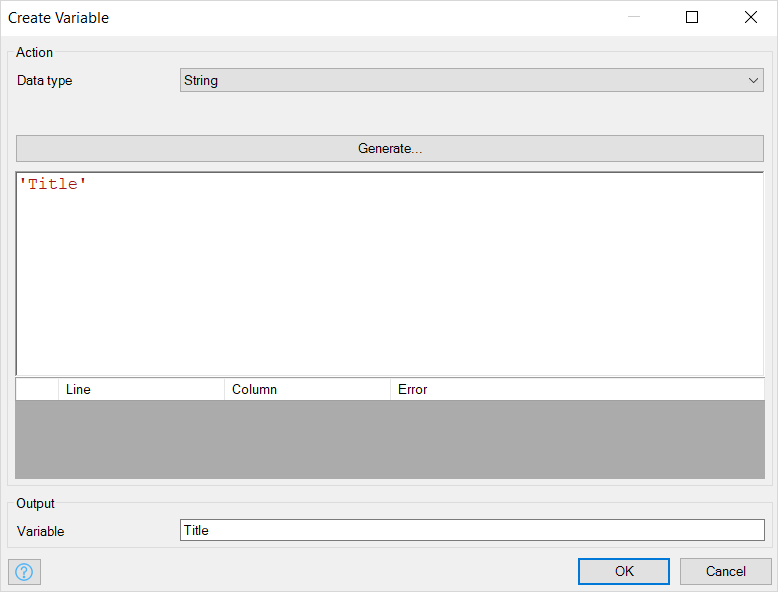
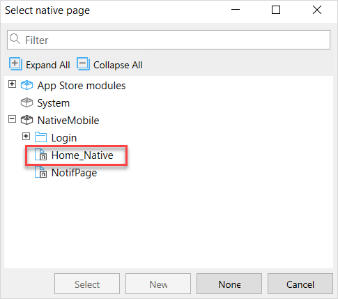
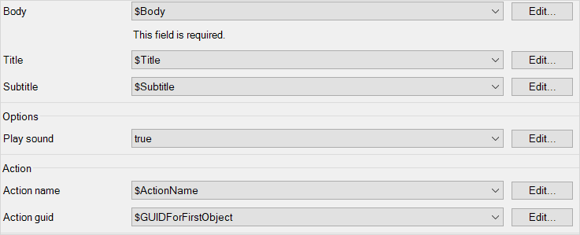

[todo: check that all "actions" are properly bolded]
[todo: correct all image caption text]

## 1 Introduction

This how-to will teach you to build local notifications for native applications. Local notifications will only allow you to schedule and send notifications confined to one mobile device. An example of a local notification might be an alarm app which sends a notification after an amount of time has elapsed.

**This how-to will teach you how to do the following:**

[todo: change some of these "understand" and "learn" verbs to more active, 'doing' verbs]

* Introduce the native notification module to your project 
* Configure the native notification module
* Understand the native notification module's JavaScript actions 
* Learn the capabilities of the new notification plugin widget for native (is this different than the bullet below?)
* Build an example app which uses native notifications

## 2 Prerequisites

Before starting this how-to, make sure you have completed the following prerequisites:

* Review the differences between local notifications and push notifications
* Install the Make it Native app on your mobile device

## 3 Create a Project and Configure Notifications

### 3.1 Display a Local Notification

1. Open Mendix Studio Pro.

2. Select **File** > **New Project**.

3.  Select the **Native Mobile Quickstart** app:

	

4.  Click **Use this starting point**:

	

5.  Click **Create App** to close the dialog box:

	{}{}

6.  Make sure you have a **Native Profile** enabled: [todo:check if this pic is right]

	{}{}

7.  Drag and drop a **Call nanoflow button** onto your app's home page, then click **New** to make a new nanoflow (note: you may wish to rename this button **Send Notification** later): 

	{}{}

8.  Name the nanoflow *ACT_CreateAndSendNotification* and click **OK**:

	{}{}

9. In **ACT_CreateAndSendNotification**, drag and drop three **Create variable** activities onto your nanoflow and set them as string variables titled *Title*, *Subtitle*, and *Body*:

   {}{}

10.  Double-click your **Title** activity and then configure the activity: 
	a. Make sure **Data type** is set to **String**. 
	b. Click **Generate**. 
	c. Type *Title* into the **Constant** field. 
	d. Type *Title* into **Output** > **Variable**. 
	e. Click **OK**:

	{}{}

11. Double-click your **Subtitle** activity and configure it as you did your **Title** activity.

12. Double-click your **Body** activity and configure it as your did your **Title** activity.

At this stage you will set up the final logic necessary to display a notification. You must account for the fact that if an app user has not given permission to that app to send notifications, it cannot send them. You must include a **Request notification permission** activity in your nanoflow to account for this, as well as a few other activities.

1.  Drag and drop a **Has notification permission** activity onto your nanoflow:

	{}{}

2.  Double-click your **Has notification permission** activity, enter *NotificationPermission* into **Variable**, then click **OK**:

	{}{}

3.  Drag and drop a decision after your **Has notification permission** activity onto your nanoflow:

	{}{}

4.  Double-click that decision and give it the **Caption** *Permission*:

	{}{}
	
5.  Click **Expression wizard**, select **Variable** > **NotificationPermission (Boolean)**, and then click **OK** until you are back at your nanoflow:

	{}{}
	
6.  Drag and drop a **Request notification permission** activity onto your nanoflow:

	{}{}

7.  Double-click your **Request notification permission** activity and set **Output** > **Variable** to *PermissionGranted*:

	{}{}

8.  Drag and drop a decision next to your **Request notification permission** activity.

	{}{}

9.  Connect your activities and decisions, and set those connections' values, like this:

	{}{}

10. Double-click the decision, then set the **Caption** as *Permission?*:
11. Click **Expression wizard**
12. Select **Value** > **Variable** > **Permission (Boolean)** from the drop-down menu. When finished, your **Decision** should look like this:

	{}{}

13. Navigate back to your nanoflow.

14. Drag and drop a **Show message** activity on your nanoflow and connect it like this: 

	{}{}

15.  Double-click your **Show message** activity, then do the following: 
	a. Select **Type** > **Error** from the drop-down menu. 
	b. Into **Template** type *No notfication permissions, go to your app permission settings to grant permission.*. 
	Click **OK**.

16. Drag and drop an **End event** under your **Show message** and connect them like this:

	{}{}

Now you will set up the final piece of your nanoflow's logic. 

1.  Delete your upper end event, drag and drop a **Merge** in its place, and rebuild your connections:

	{}{}

2.  Drag and drop a **Display Notification** activity and connect it to your merge like this:

	{}{}

4.  Set its **Body**, **Title**, and **Subtitle** to the variables that you created in the same nanoflow:

	{}{}

5.  Set **Play sound** to **true**.

	{}{}

6.  Set **Action name** and **Action guid** to **empty**:

	{}{}
	
7.  Select **Use return value** > **no**:

	

8. Click **OK**, navigate back to your nanoflow.
9.  Add a final **End event** next to your **Display notification** activity and connect it like this:

	

10. When you are all finished, your nanoflow will look like this:

	{}{}

Now you can run your app and see if your notification works.

1.  Start and load the app in your mobile device and tap the nanoflow button. [todo fix/elaborate this step]

	{}{}

2. You will be prompted to **Allow notifications**. Click **OK**:

3.  When you allow notifications, you will receive a notification immediately:

	{}{}

	If you did not see a notification, try clicking **Run Locally** to reload your app, then tap the **Send Notification** button again.

Congratulations! You can now see local notifications on your device. Next, you will learn how to configure an action when a user taps on a notification.

### 3.2 Set a Badge Number

Badges are crucial for many apps on both iOS and Android. Badge numbers can indicate important information in various applications. For example with messaging applications, it is good practice to indicate how many messages are unread.

You will need to build badge functionality into your app so that when a user gets a notification, the app shows a badge number on its app's icon. Also, badge numbers are *not automatically decreased or removed* when a user checks an app. These two things must be handled manually by a developer.

Since we covered how to send a simple local notification, we can also set the badge number by following steps:

1. Open **ACT_CreateAndSendNotification**.
2.  Drag and drop a **Create variable** activity to the right of the three string variables you made:

	{}{}

3. Double-click the variable activity and select **Data type** > **Integer/Long**.
4. Type *1* into the expression value field. 
5.  Type *badge_number* into the **variable name** field:

	{}{}

6. Click OK.
7.  Drag and drop a **Set badge number** JavaScript action to the right of your merge activity:

	

8. Double-click the badge number activity.
9.  Set the value of **Badge number** to **$badge_number**

	

10. Click **OK**.

Start and load the app on your mobile device and tap the button which calls your nanoflow. You will see a notification. Go to your device's start screen to see the notification badge on your app:

{}{}

### 3.3 Set an Action for When a Notification is Tapped

In this section you will learn to show a page when a user taps a notification. [TODO: change flow to start with dropping a "notificaitons" activity onto the home page, selecting "open page" on tap action, etc]

1. Right-click your project module and click  **Add page**.
2. Click the **Phone (Native)** pane.
3. Type *NotifPage* into **Page Name**.
4. Click **Blank** pane on the left and select the **Blank** page template. 
5. Click **OK** to create your page.
6. Drag and drop an **Open page button** widget onto your new native page.
7. Click your **Home_Native** page:

	

8. Click the **Select** button. Now you have a button which will bring you back to your home screen when you are testing:

	

9. Navigate back to your app's home page.

10. Drag and drop a **Notifications** widget onto your native home page. 

	{}{}

11. Double-click the widget.
12. Name your action *show_page*.
13. Click **Actions** > **New**. 
14. Select **On open to** > **Show a Page**.
15. Click **NotifPage** and click **Select**. Your finished action item should look like this:

	{}{}

16. Click the two **OK** buttons until you are back at your home page.

Navigate back to your **ACT_CreateAndSendNotification** nanoflow. There you will set up the logic for tapping a notification which brings you to a page. This process requires you set up a string variable. However, because this string variable will never be used with other variables — it will only be used for internal notification functionality — you will not set it up by dragging and dropping a create variable activity like you did before. You will set it up with an expression.

1.  Double-click your **Display Notification** activity:

	

2. Click **Action Name** > **Edit** 

	{}{}

3. Type `'show_page'` into the expression field:

	{}{}

4. Click the **OK** buttons until you are back at your nanoflow.

Great job setting up your notification. Now you can test it:

1. Click **Run Locally** to update your app.
2. Start the app on your mobile device.
3. Tap your **Send notification** button.
4. Tap the notification to navigate to the page you selected.
5. Tap the **Return to home page** button to navigate back to your home page.

Now you can show pages after notifications are tapped. Next you will learn to pass data to these pages. 

### 3.4 Send Data to Pages

Several apps make it so that when user taps a notification, the user is taken to specific page with specific parameters set. You can achieve this by sending data along with a notification. 

For example, a user could tap a notification about an entity object. They should be brought to a details page which shows an entity object's details. But in order to make that happen, you must set your notification up to pass that particular entity to its details page.

Every item in [todo: a/the?] Mendix database has an unique ID. If you want to pass an object, you must retrieve its GUID and pass it to your local notification. When the notification is tapped, the widget can use the GUID to retrieve and pass that specific object to the action it is configured with. [todo: check this paragraph — it's complicated]

Currently there is no way for you to use the GUID you passed using the **DisplayNotifcation** JavaScript action in a nanoflow or a page opened from a notification [todo: ask about if this tech will be improved?]. To solve this, you will create a workaround.

You will create the following things to send data to pages:

* **Two entities** — *TestEntity* to test how to show particular object, and *Notification* for your workaround
* **One page** — *DetailTestEntity* which will be shown on tapping a notification
* **One microflow** — *DS_TestEntity* to create dummy data for testing
* [todo: One Nanoflow — DS_Notification ??]

To make your two entities, do the following:

1.  Navigate to your domain model.
2.  Drag and drop a new entity onto your domain model: 

	{}{}

2.  Double-click it and name it *TestEntity*:

	{}{}

3. Click **Attributes** > **New**, name it *StringAttribute_1*, and click **OK**:

	{}{}

4. Click **OK** again until you are back at the domain model.
5. Create an entity *Notification* on your domain model with a string attribute *GUIDString*:

	{}{}

To set up a notification nanoflow, do the following:

1. Create a nanoflow named *DS_Notification*.  
2. Drag and drop a create object activity onto your nanoflow.
3. Double-click your create object activity.
4. Click **Entity** > **Select**.
5. Click **Notification**, then click **Select**.
6. Click **OK**.
5. Right-click your create object activity and select **Set $NewNotification as return value**:  

	{}{}

To create your microflow, do the following:

1. Create a microflow named *DS_TestEntity*.
2. Drag and drop a create entity activity onto your microflow.
3. Double-click your create entity activity.
4. Click **Entity** > **Select**.
5. Click **NativeMobile.TestEntity**.
6. Click **Select**.
7. Click **OK**.
8. Drag and drop a commit object activity onto your microflow.
9. Double-click your commit object activity.
10. From the **Object or List** drop-down menu, select **NewTestEntity (NativeMobile.TestEntity**.
11. Click **OK** to see your new microflow:

	{}{}

To make this microflow run after startup, do the following:

1. Double-click **Settings** in your Project Explorer:

   {}{}

2. Click the **Runtime** tab:

   {}{}

3. Click **After startup** > **Select**:

   {}{}

4. Click **DS_TestEntity** then click the **Select** button:

   {}{}

5. Click **OK**

To make your page, do the following: [todo: this page is "OnTap_Page". Is that obeying page name guidelines? Do the other pages (NotifPage) obey these guidelines?]

1. Crete a new blank native page named *OnTap_Page*.
2. Drag and drop a data view widget onto your new page.
3. Double-click your data view widget.
4. In **Data Source**, click **Entity (path)** > **Select**.
5. Click **TestEntity**.
6. Click **Select** to see the following:

	

7.  Click **OK**. 
8.  When asked "Do you want to automatically fill the contents of the data view?" click **Yes**.
9.  This will be the page your user sees when they tap the notification:

	{}{}

Next you will create a workaround which allows data to be passed to pages.

1. Create a nanoflow named *ACT_PassGUIDToNotification*.  
	a. Add a retrieve action to your nanoflow, set **Source** to **From Database**, and set **Range** to **First**. Click **Entity** > **Select** and select the **TestEntity**. In **Object name** type *FirstTestEntityObject*. Then click **OK**. This will be the object that gets the GUID:  
	
	
	
	b. Add a JavaScript Action Call activity to your nanoflow.   
	c. Double-click the action call activity.   
	d. Click **JavaScript Action** > **Select**.   
	e. Type *GetGuid* into the search field, click **GetGuid**, and click **Select**. This JavaScript action is available in the Mendix App Store under the NanoflowCommons module included in the Native Quickstarter template. [todo: will they already have this or not?]   
	f. Click **Entity Object** drop-down and click **$TestEntity**.   
	g. In **Variable name** field type **GUIDForFirstObject**.   
	h. Click **OK**.   
	c. Drag and drop 4 create variable activities onto your nanoflow: *Title*, *Subtitle*, *Body*, and *ActionName*. Give them the values *'title1'*, *'subtitle1'*, *'body1'*, and *'OpenPageWithParams'* respectively:  
	
	{}{}
	
	{}{}
	
	{}{}
	
	{}{}

	This is how all of your activities will look:
	
	{}{}
	
	d. Drag and drop a JavaScript action call activity onto your nanoflow. 
	e. Double-click the action call.
	f. Click **JavaScript action** > **Select**.
	g. Type *DisplayNotification* into the search field, click the corresponding JavaScript action, and click **Select**.
	e. Set the **Body**, **Title**, **Subtitle**, **Action name**, and **Action guid** to the corresponding variables you created previously:  

	{}{}

	f. Click **OK**.
	g. Drag and drop this nanoflow onto your app's **Home_Native** page to create a button which calls it, and name the button *Pass GUID to Notification*:  
	
	{}{}
	
2. Create a new blank page named *DetailTestEntity*. 
3. Drag and drop a data view onto this new page. Double-click the data view. 
4. Confirm **Type** > **Context** is selected, then click **Entity** > **Select**.
5. Select **TestEntity** as your **Entity (path)**. 
6. Click **OK**, then click **OK** when prompted about filling the data view. 

Good job! When a user taps a notification from the **Pass GUID to Notification** button, they will now be brought to the **DetailTestEntity** page. Next you will create a nanoflow which receives **notificationEntity** as a parameter, retrieves an object via this parameter, and passes the object to a page.

todo: take pics for the following list

1. Make a new nanoflow named *ON_tapNotification*.
2. Drag and drop a parameter onto your nanoflow. 
3. Click **Data Type** > **Select**. Click **Notification**, then click **Select**.
4. Fill **Name** in as *notificationEntity*.
5. Click **OK**.
6. Drag and drop a JavaScript action call onto your nanoflow.
7. Double-click the JavaScript action call, then click **Select**. 
8. Type *GetObjectByGuid* into the search field, click that action, then click **Select**. 
9. Click **Entity** > **Select**.
8. Click **Notfication** and then click **Select**.
8. From the **Object guid** click **Edit**.
9. Type *$NotificationEntity/GUIDString* into your argument field and click **OK**.
9. In **Object name** write *ReturnedObjectByGUID*.
10. Click **OK** to save and close your JavaScript Action settings.

Next you are going to create a show page action for **ON_tapNotification**.

1. Drag and drop a **Show Page** action onto your nanoflow.
2. Double click the show page action.
3. From the **Object to pass** drop-down menu select **ReturnedObjectByGuid**.
4. Click **Page** > **Select**, click **DetailTestEntity**, then click **OK**.
5. Click **OK** to close the **Show Page** activity settings, then navigate to your **Home_Native** page.

Now you will set up a data view on your home page.

1. Drag and drop a **Data View** widget on your **Home_Native** page.
2. Double-click your data view.
3. Select **Data source** > **Type** > **Nanoflow**.
4. Click **Nanoflow** > **Select** and choose **DS_Notification**.
5. Click **OK** to go back to your home page, and click **OK** on the subsequent data view dialog box.
5. Move the **Notifications** widget inside this data view.
6. Confirm that the text box in your data flow is using **GUIDString** as its data source:

	{}{}

7. Double-click your notifications widget.
8. Click **Actions** > **New**.
9. Create a **New Action** named *OpenPageWithParams*, set **On open** to **Call a nanoflow**, and select **ON_tapNotification**.

	{}{}

8. Start and load the app on your mobile device, tap the nanoflow button you created in 3.e, then tap the notification to navigate to the **DetailTestEntity** page with the proper object.

Explaining the workaround (all the steps/substeps above yes?):

* Since the Dataview is on your homepage and nanoflow is set as a data source, it creates an empty notification object. This object will be referred to as XwithGUID.
* We trigger a ACT_PassGuidToNotification: JSAction DisplayNotification creates a notification with respected params: title,subtitle,body,actionName,Guid. This is step happens before displaying notification.
* User taps the notification, before executing ON_tapNotification(because you set it in 4.b), you pass **XwithGUID** to your widget then set its GUID attribute programatically. Since you set the GUID attribute of the widget to **XwithGUID**, now you can use this in your **ON_tapNotification** nanoflow.
* Your widget executes **ON_tapNotification** that expects a notification object with GUID, which in this case will be **XwithGUID**. After this, you can safely use **ON_tapNotification**'s notification parameter for retrieval purposes.

## 4 Scheduling a Notification and Cancelling It

Local notifications should rarely notify a user right after they do an action. Here you will learn to configure local notifications to trigger after a period of time. To do this, you will use a JavaScript action named **ScheduleNotification**.

[todo: make sure to cover "on recieved" action in this section because we haven't yet]

We can still use our basic example in 3.1 by doing following changes:

1. Change JavaScript Action **Display Notification** to **Schedule Notification**.
2. Set the **Date** to **EndOfCurrentMinute**.
3. Change the **body**, **title**, and **subtitle** to the variables that you created. 
3. For now, set **Notification id** to empty.
4. Start and load the app in your mobile device.
5. Click the nanoflow button.

The notification should be displayed at the end of the minute. 

Be aware that if the app is in the foreground, it won't show any notification since its against user guidelines of IOS and Android. But it will still trigger onRecieve event. This will be enough for us to do custom actions like showing a page with pop-up layout.

But what if after scheduling the notification, we want to cancel notification it[todo: cancel after what? can make clearer? DONE] To do this you can use either the **Cancel Scheduled Notification** or **Cancel All Scheduled Notification** JavaScript actions. To cancel a specific notification, provide an identifier of that particular notification to **Cancel Scheduled Notification**. To cancel all notifications, call the **Cancel All Scheduled Notification** JavaScript action.

### 4.1 Cancelling all Scheduled Notifications

1. Create a nanoflow named  ACT_CancelAllScheduledNotifications
2. Create JsAction named "Cancel all scheduled notifications"
3. Set Use return value => false
3. Drag and drop this nanoflow to your home screen and name the button "cancel all".

Now we are set to see the effects of this new nanoflow we created.

Simply click the schedule notification button then click the cancel all button. You wont see any notifications at the end of the minute.

### 4.2 Cancelling a Specific Scheduled Notification

Now we will need to supply a "Notification ID" which needs to be cancelled. For that we need following changes in ACT_CreateAndSendNotification and :

1. Go to ACT_CreateAndSendNotification
2. Double-click the Schedule Notification to change "Notification id" by clicking edit. Then type and arbitrary string: "testId"
3. Create nanoflow named "ACT_CancelScheduledNotifications"
4. Inside this nanoflow create JsAction and choose "Cancel scheduled notification", double-click, set the id by clicking edit and type "testId" without quotes.
5. Drag and drop this nanoflow to your home screen and name the button "cancel specific notification". 

Simply click the schedule notification button then click the cancel specific notification button. You wont see any notifications at the end of the minute.