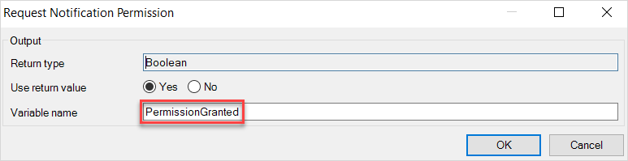
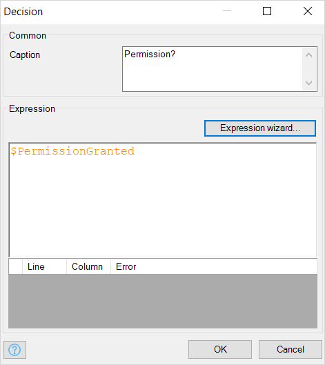
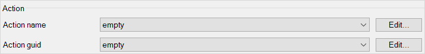
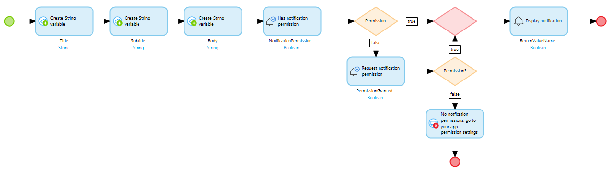

## 1 Introduction

This how-to will teach you to build local notifications for native mobile applications. Local notifications will only allow you to schedule and send notifications confined to one mobile device. These notifications do not use an internet connection. One use of a local notification might be an alarm app which sends a notification after an amount of time has elapsed.

**This how-to will teach you how to do the following:**

* Build a button connected to a nanoflow which calls a local notification
* Make your notification nanoflow request device permission for local notifications

## 2 Prerequisites

Before starting this how-to, make sure you have completed the following prerequisites:

* Review the [basic differences](https://developer.apple.com/library/archive/documentation/NetworkingInternet/Conceptual/RemoteNotificationsPG/) between local notifications and push notifications
* Install the [Make It Native](/refguide/getting-the-make-it-native-app) app on your mobile device

{}
To use push notifications with apps created with the Native Builder, make sure you have completed [How To Deploy Your First Mendix Native Mobile App](deploying-native-app) and the how-to's described in [Use Notifications](notifications)
{}

## 3 Creating an App and Configuring Notifications

Follow the instructions below to set up your first local notification:

1. Open Mendix Studio Pro.
2. Select **File** > **New App**.
3.  Select the **Blank Native Mobile App** (also available online [here](https://marketplace.mendix.com/link/component/109511/)):

	

4.  Click **Use this starting point**.
5.  Click **Create App** to close the dialog box:

	{}{}

6.  Make sure you have a **Native phone** profile enabled:

	{}{}

7.  Drag and drop a **Call nanoflow button** onto your app's home page, then click **New** to make a new nanoflow (note: you may wish to rename this button *Send Notification*): 

	{}{}

8.  Name the nanoflow *ACT_CreateAndSendNotification* and click **OK**:

	{}{}

9.  In **ACT_CreateAndSendNotification**, drag and drop three **Create variable** activities onto your nanoflow and set them as string variables titled *Title*, *Subtitle*, and *Body*:

	{}{}

10. Double-click your **Title** activity and then configure it: 
	a. Make sure **Data type** is set to **String**. 
	b. Click **Generate**. 
	c. Type *Title* into the **Constant** field. 
	d. Type *Title* into **Output** > **Variable**. 
	e. Click **OK**:

	{}{}

11. Double-click your **Subtitle** activity and configure similarly to your **Title** activity.

12. Double-click your **Body** activity and configure similarly to your **Title** activity.

Now you will set up the final logic necessary for your app to display a notification. A user must give permission for an app to send notifications. You will include a **Request notification permission** activity in your nanoflow to account for this, and include a few other activities.

1.  Drag and drop a **Has notification permission** activity onto your nanoflow:

	{}{}

2.  Double-click your **Has notification permission** activity, type *NotificationPermission* into **Variable**, then click **OK**:

	{}{}

3.  Drag and drop a decision after your **Has notification permission** activity onto your nanoflow:

	{}{}

4.  Double-click that decision and give it the **Caption** *Permission*:

	{}{}
	
5.  Click **Expression wizard**, select **Variable** > **NotificationPermission (Boolean)**, and then click **OK** until you are back at your nanoflow:

	{}{}
	
6.  Drag and drop a **Request notification permission** activity onto your nanoflow:

	{}{}

7.  Double-click your **Request notification permission** activity and set **Output** > **Variable** to *PermissionGranted*:

	{}{}

8.  Drag and drop a decision next to your **Request notification permission** activity.

	{}{}

9.  Connect your activities and decisions, and set those connections' values like so:

	{}{}

10. Double-click the decision, then set the **Caption** as *Permission?*.
11. Click **Expression wizard**
12. Select **Value** > **Variable** > **Permission (Boolean)** from the drop-down menu. When finished, your **Decision** should look like this:

	{}{}

13. Navigate back to your nanoflow.

14. Drag and drop a **Show message** activity on your nanoflow and connect it like this: 

	{}{}

15.  Double-click your **Show message** activity, then do the following: 
	a. Select **Type** > **Error** from the drop-down menu. 
	b. Into **Template** type *No notification permissions, go to your app permission settings to grant permission*. 
	c. Click **OK**.

16. Drag and drop an **End event** under your **Show message** and connect them like this:

	{}{}

Now you will set up the final piece of your nanoflow's logic. 

1.  Delete the end event in the top-right corner of your nanoflow, drag and drop a **Merge** in its place, and rebuild your connections:

	{}{}

2.  Drag and drop a **Display Notification** activity and connect it to your merge like this:

	{}{}

4.  Set its **Body**, **Title**, and **Subtitle** to the variables that you created in the same nanoflow:

	{}{}

5.  Set **Play sound** to **true**.

	{}{}

6.  Set **Action name** and **Action guid** to **empty**:

	{}{}
	
7.  Select **Use return value** > **no**:

	

8. Click **OK**, then navigate back to your nanoflow.
9.  Add a final **End event** next to your **Display notification** activity and connect it like this:

	

10. When you are all finished, your nanoflow will look like this:

	{}{}

Now you can run your app and see if your notification works.

1.  Start and load your app in your mobile device, then tap **Send Notification**:

	{}{}

2. When prompted to **Allow notifications**, tap **OK**.
3.  After you allow notifications, you will receive a notification:

	{}{}

	If you did not see a notification, try clicking **Run Locally** to reload your app. Then, tap the **Send Notification** button again.

Congratulations! You can now see local notifications on your device. Next, in [How to Use Local Notifications Part 2: Badges](local-notif-badges), you will learn how to configure notification badges.

## 4 Read More

* [Build JavaScript Actions](/howto/extensibility/build-javascript-actions)
