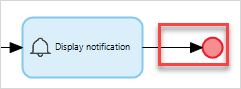
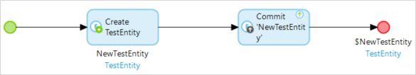

[todo: check that all "actions" are properly bolded]
[todo: correct all image caption text]

## 1 Introduction

This how-to will teach you to build local notifications for native applications. Local notifications will only allow you to schedule and send notifications confined to one mobile device. An example of a local notification might be an alarm app which sends a notification after an amount of time has elapsed.

**This how-to will teach you how to do the following:**

[todo: change some of these "understand" and "learn" verbs to more active, 'doing' verbs]

* Introduce the native notification module to your project 
* Configure the native notification module
* Understand the native notification module's JavaScript actions 
* Learn the capabilities of the new notification plugin widget for native (is this different than the bullet below?)
* Build an example app which uses native notifications

## 2 Prerequisites

Before starting this how-to, make sure you have completed the following prerequisites:

* Review the differences between local notifications and push notifications
* Install the Make it Native app on your mobile device

## 3 Create a Project and Configure Notifications

### 3.1 Display a Local Notification

1. Open Mendix Studio Pro.

2. Select **File** > **New Project**.

3.  Select the **Native Mobile Quickstart** app:

	

4.  Click **Use this starting point**:

	

5.  Click **Create App** to close the dialog box:

	{}{}

6.  Make sure you have a **Native Profile** enabled: [todo:check if this pic is right]

	{}{}

7.  Drag and drop a **Call nanoflow button** onto your app's home page, then click **New** to make a new nanoflow (note: you may wish to rename this button **Send Notification** later): 

	{}{}

8.  Name the nanoflow called *ACT_CreateAndSendNotification* and click **OK**:

	{}{}

9. In **ACT_CreateAndSendNotification**, drag and drop three **Create variable** activities onto your nanoflow and set them as string variables titled *Title*, *Subtitle*, and *Body*:

   {}{}

10.  Double-click your **Title** activity and then configure the activity: 
	a. Make sure **Data type** is set to **String**. 
	b. Click **Generate**. 
	c. Type *Title* into the **Constant** field. 
	d. Type *Title* into **Output** > **Variable**. 
	e. Click **OK**:

	{}{}

11. Double-click your **Subtitle** activity and configure it as you did your **Title** activity.

12. Double-click your **Body** activity and configure it as your did your **Title** activity.

At this stage you will set up the final logic necessary to display a notification. You must account for the fact that if an app user has not given permission to that app to send notifications, it cannot send them. You must include a **Request notification permission** activity in your nanoflow to account for this, as well as a few other activities.

1.  Drag and drop a **Has notification permission** activity onto your nanoflow:

	{}{}

2.  Double-click your **Has notification permission** activity, enter *NotificationPermission* into **Variable**, then click **OK**:

	{}{}

3.  Drag and drop a decision after your **Has notification permission** activity onto your nanoflow:

	{}{}

4.  Double-click that decision and give it the **Caption** *Permission*:

	{}{}
	
5.  Click **Expression wizard**, select **Variable** > **NotificationPermission (Boolean)**, and then click **OK** until you are back at your nanoflow:

	{}{}
	
6.  Drag and drop a **Request notification permission** activity onto your nanoflow:

	{}{}

7.  Double-click your **Request notification permission** activity and set **Output** > **Variable** to *PermissionGranted*:

	{}{}

8.  Drag and drop a decision next to your **Request notification permission** activity.

	{}{}

9.  Connect your activities and decisions, and set those connections' values, like this:

	{}{}

10. Double-click the decision, then set the **Caption** as *Permission?*:
11. Click **Expression wizard**
12. Select **Value** > **Variable** > **Permission (Boolean)** from the drop-down menu. When finished, your **Decision** should look like this:

	{}{}

13. Navigate back to your nanoflow.

14. Drag and drop a **Show message** activity on your nanoflow and connect it like this: 

	{}{}

15.  Double-click your **Show message** activity, then do the following: 
	a. Select **Type** > **Error** from the drop-down menu. 
	b. Into **Template** type *No notfication permissions, go to your app permission settings to grant permission.*. 
	Click **OK**.

16. Drag and drop an **End event** under your **Show message** and connect them like this:

	{}{}

Now you will set up the final piece of your nanoflow's logic. 

1.  Delete your upper end event, drag and drop a **Merge** in its place, and rebuild your connections:

	{}{}

2.  Drag and drop a **Display Notification** activity and connect it to your merge like this:

	{}{}

4.  Set its **Body**, **Title**, and **Subtitle** to the variables that you created in the same nanoflow:

	{}{}

5.  Set **Play sound** to **true**.

	{}{}

6.  Set **Action name** and **Action guid** to **empty**:

	{}{}
	
7.  Select **Use return value** > **no**:

	

8. Click **OK**, navigate back to your nanoflow.
9.  Add a final **End event** next to your **Display notification** activity and connect it like this:

	

10. When you are all finished, your nanoflow will look like this:

	{}{}

Now you can run your app and see if your notification works.

1.  Start and load the app in your mobile device and tap the nanoflow button. [todo fix/elaborate this step]

	{}{}

2. You will be prompted to **Allow notifications**. Click **OK**:

3.  When you allow notifications, you will receive a notification immediately:

	{}{}

	If you did not see a notification, try clicking **Run Locally** to reload your app, then tap the **Send Notification** button again.

Congratulations! You can now see local notifications on your device. Next, you will learn how to configure an action when a user taps on a notification.

### 3.2 Set a Badge Number

Badges are crucial for many apps on both iOS and Android. Badge numbers can indicate important information in various applications. For example with messaging applications, it is good practice to indicate how many messages are unread.

You will need to build badge functionality into your app so that when a user gets a notification, the app shows a badge number on its app's icon. Also, badge numbers are *not automatically decreased or removed* when a user checks an app. These two things must be handled manually by a developer.

Since we covered how to send a simple local notification, we can also set the badge number by following steps:

1. Open **ACT_CreateAndSendNotification**.
2.  Drag and drop a **Create variable** activity to the right of the three string variables you made:

	{}{}

3. Double-click the variable activity and select **Data type** > **Integer/Long**.

4. Type *1* into the expression value field. 

5.  Type *badge_number* into the **variable name** field:

	{}{}

6. Click OK.

7.  Drag and drop a **Set badge number** JavaScript action to the right of your merge activity:

	

8. Double-click the badge number activity.

9.  Set the value of **Badge number** to **$badge_number**

	

10. Click **OK**.

Start and load the app on your mobile device and tap the button which calls your nanoflow. You will see a notification. Go to your device's start screen to see the notification badge on your app:

{}{}

### 3.3 Set an Action for When a Notification is Tapped

In this section you will learn to show a page when a user taps a notification. [TODO: change flow to start with dropping a "notificaitons" activity onto the home page, selecting "open page" on tap action, etc]

1. Right-click your project module and click  **Add page**.
2. Click the **Phone (Native)** pane.
3. Type *NotifPage* into **Page Name**.
4. Click **Blank** pane on the left and select the **Blank** page template.
5. Click **OK** to create your native page.
6. Navigate back to your app's home page.
7.  Drag and drop a **Notifications** widget onto your home page [todo: check with mehmet -- am I supposed to drop the notifications widget on the Native home page or the Responsive one? Do previous screenshots in this how-to have to be redone? Some have new? feedback widget in the native home page. Some older ones in doc do not]. 

	{}{}

8. Double-click the widget.
9. Name your action *show_page*.
10. Click **Actions** > **New**. 
11. Select **On open to** > **Show a Page**.
12. Click **NotifPage** and click **Select**. Your finished action item should look like this:

	{}{}

13. Click the two **OK** buttons until you are back at your home page.

Great job. Now test the notification you've made:

1. Start the app on your mobile device 
2. Tap the nanoflow button you created in 3.1
3. Tap the notification to navigate to the page you selected. [todo: this didn't work. Is it because I have a blank page selected?]

Now you can show pages after notifications are tapped. Next you will learn to pass data to these pages. 

### 3.4 Send Data to Pages

One of the common practices when using notifications on mobile is that, when user taps a notification, it leads user to specific page with specific parameters set. For example, if you have details page which shows an entity object's details, you want to pass that particular entity to the details page. You can achieve this by sending data along with a notification.

Every item in [todo: a/the?] Mendix database has an unique ID. If you want to pass an object, you must retrieve this GUID and pass it to your local notification. When the notification is tapped, the widget can use the GUID to retrieve and pass that specific object to the action it is configured with. [todo: check this paragraph — it's complicated]

Currently there is no way for you to use the GUID you passed using the **DisplayNotifcation** JavaScript action in a nanoflow or a page opened from a notification [todo: ask about if this tech will be improved?]. To solve this, you willl create a workaround.

You will create:

* 2 entities: *TestEntity* to test how to show particular object, and *Notification* for your workaround
* 1 page: *DetailTestEntity* which will be shown on tapping a notification
* 1 microflow: *DS_TestEntity* to create dummy data for testing

1.  Navigate to your Domain Model, then create an entity: 

	{}{}

5.  Double-click it and name it *TestEntity*:

	{}{}

6. Click **Attributes** > **New**, name it *StringAttribute_1*, and click **OK**:

	{}{}

7. Click **OK** again until you are back at the domain model.
2. Create an entity *Notification* on your domain model with a string attribute *GUIDString*:

	{}{}

3. Create a nanoflow *DS_Notification* that creates an empty notification widget and returns this object. To enable your workaround, do this:
	a. Add an activity which only creates (does not commit) and set this object as return value via right-click context menu for the activity.
4.  Create a microflow *DS_TestEntity* that creates and commits any TestEntity object. 

	{}{}

7. Set this microflow to run after startup:  
	a. Double-click **Settings** in your Project Explorer: 
	
	{}{}
	
	b. Click the **Runtime** tab: 
	
	{}{}
	
	c. Click **After startup** > **Select**:  
	
	{}{}
	
	d. Click **DS_TestEntity** then click the **Select** button:  
	
	{}{}
	
	e. Click **OK**

5. Crete a native page *OnTap_Page* with dataview in it. Set its type to **Context** and entity to **TestEntity**. This will be the page we want to show when user taps the notification:

	

Next you will create a workaround which allows data to be passed to pages [todo: correct].

1. Create a nanoflow *ACT_PassGUIDToNotification* that retrieves an object, gets the GUID, and calls *DisplayNotification*: [todo: is 6 an instruction in and of itself, or is it summarizing the steps below it? The former I think. If so, these substeps below need to be reworked as discrete, nonsubsteps]
	a. Add a retrieve action, set **Source** to **From Database** and **Range** to **First**. [I set the required entity to TestEntity. Correct?]This will be the object that gets the GUID.
	b. Add a JavaScript action *Get_GUID*. Give the variable the name *GUIDForFirstObject* [todo where is "variable?"]. This JavaScript action is available under the NanoflowCommons module included in the Native Quickstarter template.
	c. Create 4 string objects: **Title**, **Subtitle**, **Body** and **ActionName**. Name them *title1*, *subtitle1*, *body1*, and *OpenPageWithParams* respectively.
	d. Add a JavaScript action called *Display notification* and set the title, subtitle, body, actionName and GUID with variables you created in step 6b (**GUIDForFirstObject**) and 6c (**Title**, **Subtitle**, **Body**, and **ActionName**).
	e. Drag this nanoflow to your homepage to create a button for easy access.
7. Create a detail page *DetailTestEntity*. Add a dataview with **Context** as a data source and **TestEntity** as an entity path. This page will show when a user taps a notification.
8. Create a nanoflow *ON_tapNotification* that receives **notificationEntity** as a parameter, retrieves an object via this parameter, and passes the object to a page [todo: same criticism as before with the other numbered item and sub list. Is this an instruction or a preview?]:
	a. Add a parameter with Entity type Notification [todo: check bolding for Entity type Notification] named *notificationEntity*.
	b. Add a JavaScript action called *Get object by GUIDE*, set its entity to **TestEntity**. Name the object *ReturnedObjectByGUID* [todo: name the object? which object?].
	c. Add a **Show Page** action with the **Object to pass** set to **ReturnedObjectByGuid**, and the **Page** set to **DetailTestEntity**.
9. On your home page, do the following:
	a. Create an additional **DataView**, set **Nanoflow as Data Source**, and choose **DS_Notification** (created in step 2).
	b. Move the **Notification** widget inside this dataview.
	c. Set **GUID** to **Notification.GUIDString**. Create a **New Action** called *OpenPageWithParams*, set **On open: Call a nanoflow**, and set **Nanoflow** to **ON_tapNotification**.
10. Start and load the app on your mobile device, tap the nanoflow button you created in 3.e, then tap the notification to navigate to the **DetailTestEntity** page with the proper object.

Explaining the workaround (all the steps/substeps above yes?):

* Since the Dataview is on your homepage and nanoflow is set as a data source, it creates an empty notification object. This object will be referred to as XwithGUID.
* We trigger a ACT_PassGuidToNotification: JSAction DisplayNotification creates a notification with respected params: title,subtitle,body,actionName,Guid. This is step happens before displaying notification.
* User taps the notification, before executing ON_tapNotification(because you set it in 4.b), you pass **XwithGUID** to your widget then set its GUID attribute programatically. Since you set the GUID attribute of the widget to **XwithGUID**, now you can use this in your **ON_tapNotification** nanoflow.
* Your widget executes **ON_tapNotification** that expects a notification object with GUID, which in this case will be **XwithGUID**. After this, you can safely use **ON_tapNotification**'s notification parameter for retrieval purposes.

## 4 Scheduling a Notification and Cancelling It

Local notifications should rarely notify a user right after they do an action. Here you will learn to configure local notifications to trigger after a period of time. To do this, you will use a JavaScript action called **ScheduleNotification**.

[todo: make sure to cover "on recieved" action in this section because we haven't yet]

We can still use our basic example in 3.1 by doing following changes:

1. Change JavaScript Action **Display Notification** to **Schedule Notification**.
2. Set the **Date** to **EndOfCurrentMinute**.
3. Change the **body**, **title**, and **subtitle** to the variables that you created. 
3. For now, set **Notification id** to empty.
4. Start and load the app in your mobile device.
5. Click the nanoflow button.

The notification should be displayed at the end of the minute. 

Be aware that if the app is in the foreground, it won't show any notification since its against user guidelines of IOS and Android. But it will still trigger onRecieve event. This will be enough for us to do custom actions like showing a page with pop-up layout.

But what if after scheduling the notification, we want to cancel notification it[todo: cancel after what? can make clearer? DONE] To do this you can use either the **Cancel Scheduled Notification** or **Cancel All Scheduled Notification** JavaScript actions. To cancel a specific notification, provide an identifier of that particular notification to **Cancel Scheduled Notification**. To cancel all notifications, call the **Cancel All Scheduled Notification** JavaScript action.

### 4.1 Cancelling all Scheduled Notifications

1. Create a nanoflow named  ACT_CancelAllScheduledNotifications
2. Create JsAction named "Cancel all scheduled notifications"
3. Set Use return value => false
3. Drag and drop this nanoflow to your home screen and name the button "cancel all".

Now we are set to see the effects of this new nanoflow we created.

Simply click the schedule notification button then click the cancel all button. You wont see any notifications at the end of the minute.

### 4.2 Cancelling a Specific Scheduled Notification

Now we will need to supply a "Notification ID" which needs to be cancelled. For that we need following changes in ACT_CreateAndSendNotification and :

1. Go to ACT_CreateAndSendNotification
2. Double-click the Schedule Notification to change "Notification id" by clicking edit. Then type and arbitrary string: "testId"
3. Create nanoflow named "ACT_CancelScheduledNotifications"
4. Inside this nanoflow create JsAction and choose "Cancel scheduled notification", double-click, set the id by clicking edit and type "testId" without quotes.
5. Drag and drop this nanoflow to your home screen and name the button "cancel specific notification". 

Simply click the schedule notification button then click the cancel specific notification button. You wont see any notifications at the end of the minute.