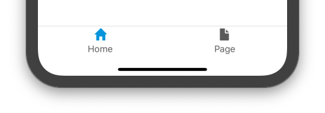

## 1 Introduction

Although you model native mobile apps in the same way as you're used to, some aspects of navigation in native mobile apps are a bit different than in web applications:

### 1.1 Web apps

In general, in web apps, there is only one page open. When a user opens a page, the current page is replaced with the new one. And when the user navigates back, the previous page is loaded. This has a negative effect on performance, because the page has to be reloaded.

### 1.2 Native mobile apps

In native mobile apps, pages are kept open by default. This makes it possible to instantly navigate back (e.g. by pressing the back button, or by swiping) while retaining the state of the previous page(s) (e.g. scroll location, active tab). This greatly benefits the overall user experience of the app. This has to be taken into account when developing mobile apps, to make sure that there will not be too many pages open (which will result in bad performance) and data is refreshed/updated accordingly. To manage this, you have more control over the exact navigation flow.

## 2 Layout Types

### 2.1 Default

After opening a page that has a default layout, you can navigate back to the previous page by using the back button in the header, the back button of the device (Android), or by swiping from the left side of the screen (iOS). When the app’s home page is open, pressing the Android back button closes the app.

### 2.2 Pop-Up

A page with a pop-up layout looks like a default page, but it shows up with a distinct animation, and it has a close icon instead of a back icon. On iOS it can also be closed by swiping down from the top of the pop-up. On Android it can be closed using the back button of the device. Pop-ups cannot have a bottom bar. A page with a pop-up layout cannot be used as the default home page, nor can it be added to the bottom bar.

Pop-ups can be very useful when asking for input in a certain context. One example is when the you have to scan a QR code. Another example is a wizard (form with multiple steps), as you can still go back to previous steps and change things until the process is finished and all pop-ups are closed.

## 3 Navigation related layout components

Native layouts have helpful properties that enable the most common patterns used in native apps:

### 3.1 Header

A layout that has the header property enabled will always show a bar at the top of the screen. A header consists of three parts: 

- Left part: not configurable, but can show a back icon or a close icon, depending on the layout type
- Center part: shows the title of the page
- Right part: configurable with widgets and is often used to contain buttons

{}{}

### 3.2 Bottom Bar

You can add bottom bar items in the native navigation profile. These items will show up on any page that has a layout with the bottom bar property enabled.

Every item in the bottom bar has its own navigation stack. This means that if you open a few pages in the first tab, then switch to the second tab and back to the first tab again, those pages will still be open there.

{}
Pages without a bottom bar are created in a separate stack. If you navigate from a page _without_ a bottom bar to a page _with_ a bottom bar, then all pages in that stack are closed.
{}

{}{}

## 4 How does Mendix native navigation work?

As mentioned above, by default pages are kept open to provide a better user experience, but they must also be managed correctly in order to get great performance and a logical UX/flow through the app.

### 4.1 Stacks

To keep pages open, the navigation system uses multiple 'stacks' of pages, and a mobile app can contain multiple stacks at the same time. A stack can be compared to a pile of cards, one can add cards to the top, and one can remove cards from the top.

#### 4.1.1 Single stack

If the app does not use a bottom bar, then there is a single stack. This situation resembles navigation on the web most closely. However, it is important to keep in mind that all pages in the stack are kept open, until you close them explicitly (or until the user presses the back button).

The first page on the stack is always the homepage. When the user clicks a button that opens a page, then there are two pages on the stack, and so on.

When the user closes a page (e.g. via back button, a close action, or swipe to go back (iOS)), only the current page is closed and the previous page becomes visible again.

{}{}

#### 4.1.2 Multiple stacks - Bottom bar navigation

If an app has bottom bar items, every item in the bottom bar will have a separate stack. Within a stack the user can navigate by opening and closing pages.

If the bottom bar item is not focused, pressing it will focus that item. Switching to another bottom bar item will not close pages in the focused one. If the item is already focused, press will dismiss all pages from its stack.

{}{}

#### 4.1.3 Pop-ups

When a page with a Popup layout is opened, a new stack is created and all pages in this stack fully cover the screen. To get back to the previous stack, the popup has to be closed.

It is possible to open other pop-up pages inside the pop-up, and it behaves as if it is a single stack. When opening a normal page from the pop-up, the pop-up(s) will be closed first.

{}{}

### 4.2 Opening and closing pages

Often there is a need to have control of the history, e.g. which page is shown see when the user presses the hardware back button on Android or when the users does a swipe to go back gesture (swipe from left to right). These actions will only close a single page in the current stack.

#### 4.2.1 Closing multiple pages

It is possible to navigate back multiple pages in history at once, by setting the appropriate number of pages in the Close Page action. A Close Page action that closes multiple pages results in a single animation, as your user would expect.

You can configure this behavior either on Close Page actions that you've modeled on your pages, or on the Close Page activity in your nanoflows. This number can be set using an expression, so that you can set either a static number or a snapshot calculated one, for more complex cases.

#### 4.2.2 Combining closing an opening pages

For more complex scenarios, it is possible to transparently remove one or more pages from the history (that is, from the current stack) when navigating to a new page. Doing so ensures that users cannot inadvertently navigate back to pages that are no longer relevant. For example, when a user reaches the end of a three-step wizard flow, you can configure the Open Page activity to open the third page and close the previous two pages at the same time. As a result, the user will see a single transition, and navigating back will not lead them to the first two pages.

In addition, you can configure the Open Page action to ‘clear history’ when navigating to a page. This effectively resets the entire navigation system, and the user will not be able to navigate back at all from the target page.

### 4.3 Updating data

It is important to remember that any changes you make to your data, will be immediately reflected on all active screens. However, this does not mean that these changes are also committed to the database; this remains an explicit action. Another consequence of this is that you are responsible for keeping track of (and possibly reverting) changes to data when the user decides to navigate back (e.g. by pressing the back button) without saying their changes. In the future, we will provide more control over back behavior.

## 5 Best practices & patterns

### 5.1 Make it simple for the user

It is important for a user to always understand where he is in the app, and what his next options are. Overall it is useful to show the bottom bar, so that the user sees where he/she is, and can go towards. However, in some flows it makes sense to create focus and remove distractions by using a layout without bottom bar or by using a popup layout.

### 5.2 Minimize the number of open pages to maintain high performance

As mentioned above, while the user navigates through the applications, all pages stay open in the background. This uses the device's resources, and having too many open pages can cause performance issues. The consequence of this is that the choice between using an Open Page or a Close Page action should be made more deliberately than with web applications.

Where possible, we advise you to use the Close Page action (or the above mentioned variants of the Show Page action) as much as possible, to ensure that you don't keep too many superfluous pages open.

### 5.3 Use popups for modal interactions

Most application consists of a set of primary user flows, and each primary flow may have secondary flows, e.g. to request some additional user input. For example, if we imagine a calendar app, then browsing the upcoming events will be the primary flow, and editing one event might be a secondary flow. In general, secondary flows should not disrupt the primary flow, meaning that after the user completes this secondary flow, they should end up right where they were in the primary flow.

Although such behavior can be modeled using the ability to close multiple pages, as described above, we generally recommend the use of popups for such scenarios. Popup pages exist entirely outside of the navigation stack, and they can be opened and closed without disrupting the navigation history of your application.

### 5.4 Startup flows

The ‘clear history’ option of the Open Page action can be used to model out complex behavior, but one of the most common use cases for it is that of a startup flow. Imagine for example an application that should show a series of tutorial screens on startup. After these screens, the user should land on the main page. From these, it should not be possible to navigate back. This can be achieved by using the Open Page action with the ‘clear history’ option to navigate from the final tutorial screen to the main page.

## 6 Customization

Out of the box, the bottom bar and top bar have a default styling. This styling can be changed as described [here](/refguide/native-styling-refguide#pages). However, if you want to further customize the styling to match your design, then it is possible to create [pluggable widgets](/apidocs-mxsdk/apidocs/pluggable-widgets#1-introduction) to replace some of the default navigation components.
