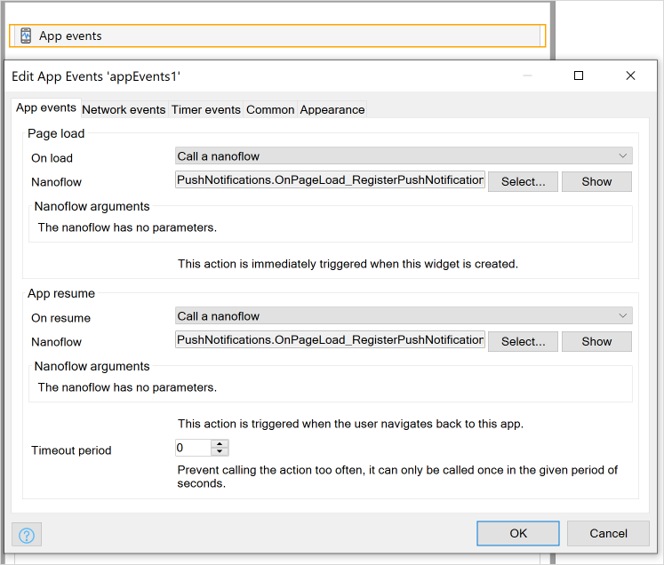
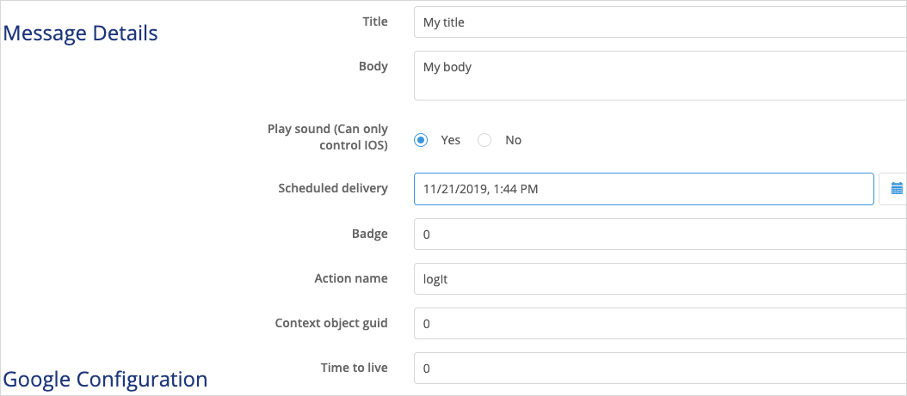
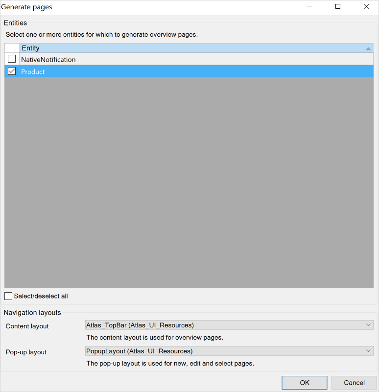
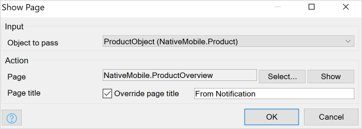
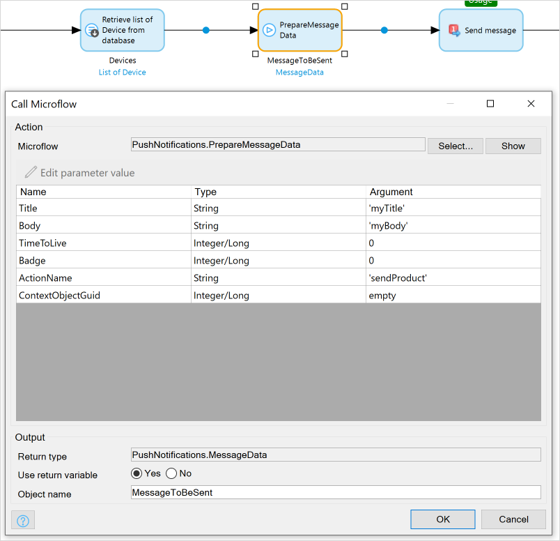

## 1 Introduction

remote notifications only work with apps created through the Native Builder. You cannot send notifications to an app inside the Make it Native app.

## 2 Prerequisites

If you want to use push notifications with custom apps which created with native builder, make sure you have completed the following prerequisites:

* Setting up native push notifications with native builder [Native Builder](https://docs.mendix.com/howto/mobile/native-builder#1-introduction) 

## 3 Setting Up Your Mendix Project

Create a Mendix project using the Native Mobile Quickstart starter app. [todo add link]

### 3.1 Installing Your Module 

1. Add the [Community Commons](https://appstore.home.mendix.com/link/app/170/) module to your app project.
2. Add the [Encryption] module to your module [todo add link].
3. Set the encryption private key by doing the following: 
	a. Double-click **Settings**. 
	b. Click **Edit**. 
	c. Click **Constants**. 
	d. Click **New**. 
	e. Type *encryptionkey*, select it, and add a 16 character **Value**:

	

3. Add the [Push Notifications Connector](https://appstore.home.mendix.com/link/app/3003/) module to your app project.

### 3.2 Set Up a Notification Widget

1. Drag and drop an app events widget onto your app's home page, double-click it, and do the following: 
    a. Set **Page load** > **On load** to **Call a nanoflow**, then specify **PushNotifications.OnPageLoad_RegisterPushNotifications**. 
    b. Set **App resume** > **On resume** to **Call a nanoflow**, then specify **PushNotifications.OnPageLoad_RegisterPushNotifications**: 
    
    

    This configured app events widget will allow for user devices to register with your notification interface, so that you can choose who to send push notifications to. Specifically it will register devices when they open the app or resume the app.

2. Create an entity called *NativeNotification* in your domain model with one `objectGUID` field:

    

3. Create a new *DS_Notification* nanoflow which creates a **NativeNotification** entity object and then returns it:

    

4. Drag and drop a data view widget onto your home page, set its **Data source** > **Nanoflow** to **DS_Notification**:

    

5. Inside of this data view, drag and drop a notifications widget.
6. Set the notifications widget's GUID to **NativeNotification.objectGUID**:

    

    This will allow you to pass objects with notifications.

7.  Open **Navigation**, in the **Responsive** pane click **New Item**, then add a new **Show page** item **PushNotifications/_USE ME/Administration**: 

    

### 3.3 Adding Actions to Your Notifications Widget

To set up actions which will occur after tapping or receiving a notification, do the following:

1. Create two nanoflows (*ACT_OnRecieve* and *ACT_OnOpen*) which will create two different logs (**onRecieve triggered** and **onOpen triggered**):

    

2. Double-click your notifications widget and do the following: 
    a. Add an action called *logIt*. 
    b. For **On recieve** select **ACT_OnRecieve**. 
    c. For **On open** select **ACT_OnOpen**:

    

### 3.4 Adding Firebase Configurations

Deploy your project and open your administration page in a web browser. Do the following:

1. Add a new FCM configuration.
2. Select **Enabled**.
3. Name your configuration.
4. Set it as **Development** (this will not affect any functionality, it is only a label).
5. Set the **Project id** to the project id you set in the [Native Apps] section of *How to Set Up the Google Firebase Cloud Messaging Server* [todo: fix link].
6.  Upload your private key (which you got in the [SOMETHING] section of *Setting up Remote Push Notifications* [todo: fix link]:

    

7. For both your Android and iOS **Messaging service settings**, select your FCM configuration.
8.  For the Android and iOS **Messaging service types**, select FCM:

    

Next you will test the implementation of your configurations.

### 3.5 Sending a Push Notification

1. Reload the app on your phone.
2. Put the app in the background by returning to your phone's home screen.
3. On your desktop browser, open the **Administration** page and click the **Devices** tab.

Now you should be able to see registered devices (which is probably only one: your testing device):

1. Click your device listed under **Registered Devices** and click **New Message**.
2.  Type some text into **Title** and **Body** fields, and in **Action name** type *logIt*:

    

3. Click **Send**.

You will see your notification with the text you configured:

    

1. Tap the notification. You will see a log message in your modeler console: **onOpen triggered**.
2. Now send and tap a notification while keeping the app open. You will see a different log in your modeler console: **onRecieve triggered**. 

## 4 Sending Data Using Push Notifications

Imagine your business has several products, and you want to send one product to a user using an administration module interface. How would you achieve this goal?

In this section you will learn the following:

* How to show a push notification to a user if their app is in the backgroud — when a user taps it, they will be brought to a product page
* How to show a small view to a user if their app is in the foreground — when a user taps the button in the animation, they will be brought to a product page

### 4.1 Push Notifications for an App in the Background

#### 4.1.1 Setting Up an Example Entity

1. In the **Domain Model**, add a *Product* entity with a *ProductName* attribute.
2.  Right-click **Product** > **Generate overview pages**
3. Make sure the **Navigation layouts** are Atlas layouts. Click **OK** which will make the pages **Product_NewEdit** and **Product_Overview**:

    

    

3. Drag and drop **Product_Overview** onto your app's home page to make a button which navigates to your new page.
4. Create a native page *NativeProductOverview* that has a data view with the **Data source** set to **Context** and Entity set to **Product**. Click **Ok** and then **Accept**. Now when you tap a notification, a page will be opened using the proper product object:

	

#### 4.1.2 Synchronizing Unused Entities [todo clarify title and section]

Studio Pro does smart data syncing, meaning if an entity has not been retrieved in native side, it will not be there. This situation will not occur since most Mendix native apps do retrieve entities which you want to show. For more information, see the [Sychronization](refguide/offline-first#sychronization) section of the *Offline First Reference Guide*.

Your app does not retrieve any products in any of its pages. Fix this by doing the following:

1. In **Navigation** > **Native mobile**, click **Sync configuration**.
2. Change **Product** to download **All Objects**:

    

#### 4.1.3 Determining GUIDs {#guid-objects}

In order to send a particular object to a page, first an object's GUID must be determined and sent using a push notification. To begin this process, you will log the object GUID to your Mendix Studio Pro's console (to be used later in the [Testing the Implementation](#testing-guid) section):

1.  Create a nanoflow *ACT_GetGUIDAndLog* which does the following: 
    a. Accepts **Product** object as a parameter. 
    b. Uses a JavaScript action **Get guid**, which sets the object as **$Product**. 
    c. Logs the returned value:
    
    

2.  Drag and drop this nanoflow inside **Product_NewEdit**'s data view:

    

#### 4.1.4 Creating a Data Passing Nanoflow

1.  Create a nanoflow *ACT_GetProductAndShowPage* which does the following: 
    a. Accepts a **Notification** object as a parameter: 
    
    
    
    b. Uses a JavaScript action **Get object by guid**, which sets **Entity** as **Product**, the **Object guid** as **parameter/objectGUID**, and the **Object Name** to *ProductObject*: 
    
    
    
    c. Shows the **NativeProductOverview** page using the passed object **ProductObject**:
    
    

2.  In the notification widget on **Home_Native**, create a new action named *sendProduct* which **On open** triggers **ACT_GetProductAndShowPage**:

    

#### 4.1.5 Testing the Implementation {#testing-guid}

1. Click the nanoflow button you created in [Determining GUIDs](#guid-objects) to log the object's GUID (which you can see in your Studio Pro Console).
2. Follow the steps in the [Simple Push Notification](#sending-simple-push-notification) section again, but with the following changes: 
    a. Set the action name to *sendProduct*. 
    b. Set **Context object guid** to the GUID you just logged:

    

3. With your app running in the background, send a notification and tap it. This will navigate to the **NativeProductOverview** page with the proper object.

## 4.2 Now lets cover when the app is in the foreground [todo: fix title]

1.  Add one more `boolean` field named `showNotification` to the `NativePush`:

    

2. In your `Home_Native` page inside of the NativeNotification Dataview: 
    a. add a Container. 
    b. Sets its visibility to `NativeNotification/showNotification`. 
    c. Add a text field saying `You have recieved a product`. 
    d. Drag and drop `ACT_GetProductAndShowPage` nanoflow next to it.

    

3. Create a nanoflow called `ACT_ShowNotificationOnRecieve` which will be responsible for switching `NativeNotification/showNotification` attribute: 

    a. NativeNotification as a parameter. 
    b. Change the `NativeNotification/showNotification` to `true`, without committing. 
    c. Javascript action `Wait` for `5000` ms. 
    d. Change the `NativeNotification/showNotification` to `false`, without committing.

4. Home_Native/ Notification widget => Change action named `sendProduct`, on recieve triggers `ACT_ShowNotificationOnRecieve`

    

Follow steps for the previous sections in [here](###testing-the-implementation) but this time put the app in the foreground. You will see the the text with a button for 5 seconds.

## 5 Sending notifications programetcally via Push Notifications API [todo fix title and number, also clarify what the advantage of this approach is]

What if you want to send messages to all your users' devices, but you do nott want to handle the GUID retrieval? The section below will illustrate this example. Specifically, you will send a [todo check rest of this sentence] product from web to all devices with a single button click.

### 5.1 Creating a microflow which will send particular product to all devices [todo fix title and number]

Create a microflow *ACT_SendProductToAllDevices* with the following elements [todo check where pics should go]:

1. Product as a parameter
2. Retrieve list of devices from database: `PushNotifications.Device`:

    
    
3. PrepareMessageData Microflow from `PushNotifications/_USE ME/API`: 
	a. title: myTitle. 
	b. body: myBody. 
	c. time to live: 0. 
	d. badge: 0. 
	e. actionName `sendProduct`. 
	f. ContextObjectGuid to `empty`:
	
	

	**ContextObjectGuid** is set to empty since you will pass the object itself to the **SendMessageToDevices** Java action where it will be retrieved automatically. 

4. SendMessageToDevices Java Action in `PushNotifications/_USE ME/API`: 
	a. Message data param: $MessageToBeSent. 
	b. Device param: $Devices. 
	c. Context object: $Product:
	
	
  
5. Go to `Product_NewEdit`, drag and drop the `ACT_SendProductToAllDevices` inside of dataview so that we can trigger this microflow

	

### 5.2 Testing the Implementation [todo is this title used elsewhere?]

Now run the app by doing the following:

1, Put the Native app in the background
2. In web go to a particular product and press `ACT_SendProductToAllDevices` microflow button. 

This will send notification to all available devices and when the user taps the notification it will be redirected to the particular product page that we modeled.

### 5.3 More Java Action Explanations

All JAVA actions which is available in Push notifications module with small explanations:

#### 5.3.1 PrepareMessageData Microflow

This allows users to create their own user interface in order to alter and create a push notification message. 

#### 5.3.2 SendMessageToDevice & SendMessageToDevices Java Action

We covered this Java action in this documentation. Params:
- `MessageDataParam` (PushNotifications.MessageData): This param can be generated by the PrepareMessageData microflow.
- `DeviceParam` (List of PushNotifications.Device): Can be used to send same message for a list of devices.
- `ContextObject`: Any mendix object which will be passed to the notification as GUID string.

#### 5.3.3 SendMessageToUsers & SendMessageToUser Java Action

Every user is allowed to have more than one device. In case of sending push notifications to every device of a particular user `SendMessageToUser` can be used.

In case of sending a push notification to all users `SendMessageToUsers` can be used.

## 6 Read More

