## 1 Introduction

This tutorial will teach you to configure and test remote notifications. Remote notifications only work with apps created through the Native Builder. You cannot send notifications to an app inside the Make it Native app.

## 2 Prerequisites

If you want to use push notifications with custom apps which created with native builder, make sure you have completed the following prerequisite:

* Complete [How to Deploy Your First Mendix Native Mobile App](/howto/mobile/deploying-native-app) through the end of the *Making Your First Build* section

## 3 Setting Up Your Mendix Project

Create a Mendix project using the Native Mobile Quickstart starter app:

1. Open Mendix Studio Pro. **Select File** > **New Project**, and then select the **Native Mobile Quickstart** app.
1. Click **Use this starting point**.
1. Click **Create app** to close the dialog box.

### 3.1 Installing Your Module 

To install your module, do the following:

1. Add the [Community Commons Function Library](/appstore/modules/community-commons-function-library) module to your app project.
1. Add the [Encryption](/appstore/modules/encryption) module to your app project.
1. Set the encryption private key by doing the following: 
	a. Double-click **Settings**. 
	b. Click **Edit**. 
	c. Click **Constants**. 
	d. Click **New**. 
	e. Type *encryptionkey*, select it, and add a 16 character **Value**:

	{}{}

1. Add the [Push Notifications Connector](/appstore/modules/push-notifications) module to your app project.

### 3.2 Setting Up a Notification Widget

To set up a notification widget, do the following:

1. Drag and drop an app events widget onto your app's home page, double-click it, and do the following: 
    a. Set **Page load** > **On load** to **Call a nanoflow**, then specify **PushNotifications.OnPageLoad_RegisterPushNotifications**. 
    b. Set **App resume** > **On resume** to **Call a nanoflow**, then specify **PushNotifications.OnPageLoad_RegisterPushNotifications**: 
    
    {}{}

    This configured app events widget will allow for user devices to register with your notification interface so that you can choose who to send push notifications to. Specifically, it will register devices when they open the app or resume the app.

1. Create an entity called *NativeNotification* in your domain model with one `objectGUID` field:

    {}{}

1. Create a new *DS_Notification* nanoflow which creates a **NativeNotification** entity object and then returns it:

    {}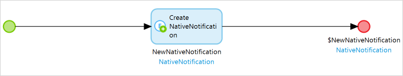{}

1. Drag and drop a data view widget onto your home page and set its **Data source** > **Nanoflow** to **DS_Notification**:

    {}{}

1. Drag and drop a notifications widget inside of this data view.
1. Set the notifications widget's GUID to **NativeNotification.objectGUID**:

    {}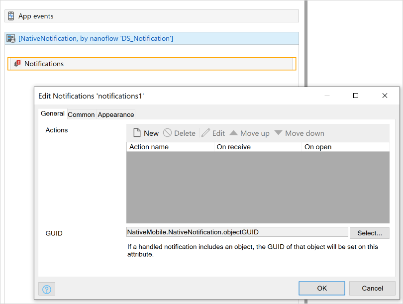{}

    This will allow you to pass objects with notifications.

1.  Open **Navigation**, in the **Responsive** pane click **New Item**, then add a new **Show page** item **PushNotifications/_USE ME/Administration**: 

    {}{}
    
### 3.3 Synchronizing Unused Entities

Studio Pro uses smart data syncing, meaning if an entity has not been retrieved on the native side, it will not be available in the native mobile app. This situation will not occur often, since most Mendix native mobile apps do retrieve entities which you want to show. For more information, see the [Synchronization](/refguide/offline-first#synchronization) section of the *Offline-First Reference Guide*.

Currently your app does not retrieve any notifications in any of its pages. Fix this by doing the following:

1. In **Navigation** > **Native mobile**, click **Sync configuration**.
1. Change the **NativeNotification** entity to download **All objects**.

### 3.4 Adding Actions to Your Notifications Widget

To set up actions which will occur after tapping or receiving a notification, do the following:

1. Create two nanoflows (*ACT_OnReceive* and *ACT_OnOpen*) which will create two different logs (**onReceive triggered** and **onOpen triggered**):

    {}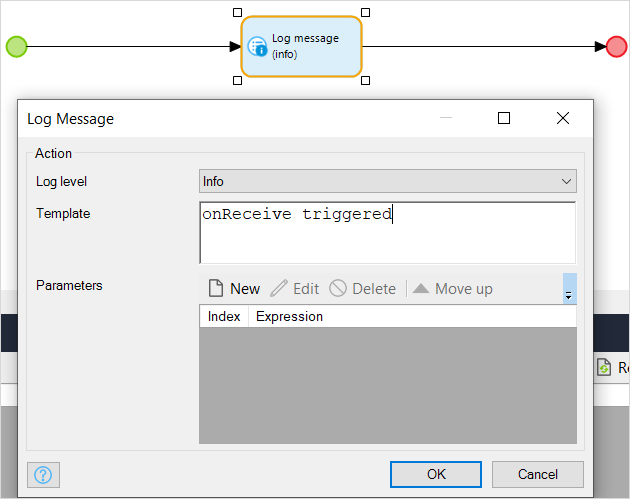{}

1. Double-click your notifications widget and do the following: 
    a. Add an action called *logIt*. 
    b. For **On receive** select **ACT_OnReceive**. 
    c. For **On open** select **ACT_OnOpen**:

    {}{}

### 3.5 Adding Firebase Configurations

Deploy your project and open your administration page in a web browser. Then, do the following:

1. Add a new FCM configuration.
1. Select **Enabled**.
1. Name your configuration.
1. Set it as **Development** (this will not affect any functionality, it is only a label).
1. Set **Project id** to the **Project ID** listed on the Firebase console website:

    {}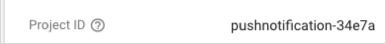{}

1.  Upload your private key (which you got in the [Setting up Firebase Cloud Messaging Service](setting-up-native-push-notifications#firebase-setup) section of *How to Set up Remote Notifications*:

    {}{}

1. For both your Android and iOS **Messaging service settings**, select your FCM configuration.
1.  For both your Android and iOS **Messaging service types**, select FCM:

    {}{}

Next you will test the implementation of your configurations.

### 3.6 Sending a Push Notification to a Single Device {#sending-single}

To see your changes from Studio Pro, rebuild your bundle using the Native Builder's `build` command. For more information on the `build` command, see the [Build](/refguide/native-builder#build) section of the *Native Builder* reference guide. Then, do the following:

1. Reload the app on your phone.
1. Put the app in the background by returning to your mobile device's home screen.
1. On your desktop browser, open the **Administration** page and click the **Devices** tab.

Now you should be able to see registered devices (which is probably only one: your testing device). Send a notification by doing the following:

1. Click your device listed under **Registered Devices** and click **New Message**.
1.  Type some text into **Title** and **Body** fields, and in **Action name** type *logIt*:

    {}{}

1. Click **Send**.

You will see your notification with the text you configured:

{}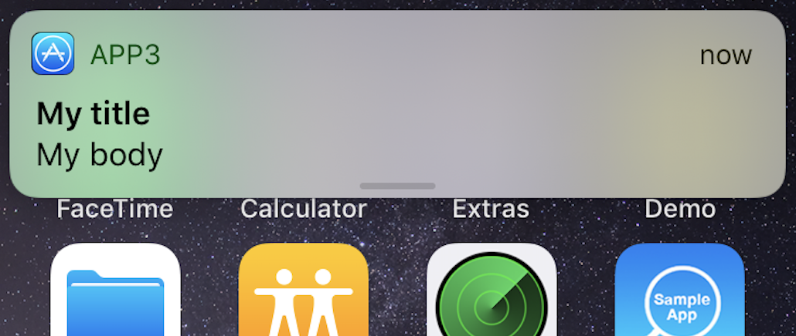{}

1. Tap the notification. You will see a log message in your Studio Pro console: **onOpen triggered**.
1. Now send and tap a notification while keeping the app open. You will see a different log in your modeler console: **onReceive triggered**. 

## 4 Sending Data Using Push Notifications

Imagine your business has several products, and you want to send one product to a user using an administration module interface. How would you achieve this goal?

Below you will learn the following:

* How to show a push notification to a user if their app is in the background—when a user taps it, they will be brought to a product page
* How to show a small view to a user if their app is in the foreground—when a user taps the button in the animation, they will be brought to a product page

### 4.1 Push Notifications for an App in the Background

#### 4.1.1 Setting Up an Example Entity

To set up an example entity, do the following:

1. In the **Domain Model**, add a *Product* entity with a *ProductName* attribute.
1.  Right-click **Product** > **Generate overview pages**.
1. Make sure your **Navigation layouts** are Atlas layouts. Click **OK**, which will make the pages **Product_NewEdit** and **Product_Overview**:

    {}{}

    {}{}

1. Drag and drop **Product_Overview** onto your app's home page to make a button which navigates to your new page.
1. Create a native page *NativeProductOverview* that has a data view with the **Data source** set to **Context** and **Entity** set to **Product**. Click **Ok** and then click **Accept**. Now when you tap a notification, a page will be opened using the proper product object:

	{}{}

#### 4.1.2 Synchronizing Unused Entities

While you did set up notification retrieval earlier, your app does not currently retrieve any products in any of its pages. Fix this by doing the following:

1. In **Navigation** > **Native mobile**, click **Sync configuration**.
1. Change the **Product** entity to download **All objects**:

    {}{}

#### 4.1.3 Determining GUIDs {#guid-objects}

In order to send a particular object to a page, first an object's GUID must be determined and sent using a push notification. To begin this process, you will log the object GUID to your Mendix Studio Pro's console (which you will use later in the [Testing the Implementation](#testing-guid) section below):

1.  Create a nanoflow *ACT_GetGUIDAndLog* which does the following: 
    a. Accepts **Product** object as a parameter. 
    b. Uses a JavaScript action **Get guid**, which sets the object as **$Product**. 
    c. Logs the returned value:
    
    {}{}

2.  Drag and drop this nanoflow inside **Product_NewEdit**'s data view:

    {}{}

#### 4.1.4 Creating a Data-Passing Nanoflow

To create a data-passing nanoflow, do the following:

1.  Create a nanoflow *ACT_GetProductAndShowPage* which does the following: 
    a. Accepts a **Notification** object as a parameter: 
    
    {}{}
    
    b. Uses a JavaScript action **Get object by guid**, which sets **Entity** as **Product**, the **Object guid** as **parameter/objectGUID**, and the **Object Name** to *ProductObject*: 
    
    {}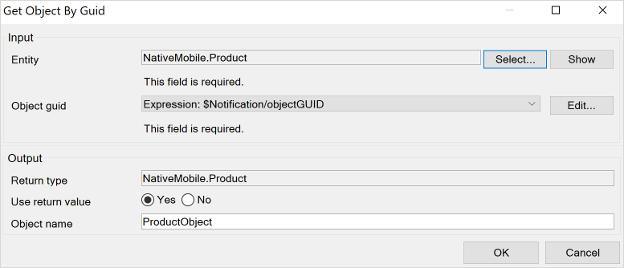{}
    
    c. Shows the **NativeProductOverview** page using the passed object **ProductObject**:
    
    {}{}

2.  In the notification widget on **Home_Native**, create a new action named *sendProduct* which **On open** triggers **ACT_GetProductAndShowPage**:

    {}{}

#### 4.1.5 Testing the Implementation {#testing-guid}

To test the implementation, do the following:

1. Click the nanoflow button you created in [Determining GUIDs](#guid-objects) to log the object's GUID (which you can see in your Studio Pro Console).
1. Follow the steps in the [Sending a Push Notification to a Single Device](#sending-single) section again, but with the following changes: 
    a. Set the action name to *sendProduct*. 
    b. Set **Context object guid** to the GUID you just logged:

    {}{}

1. With your app running in the background, send a notification, and tap it. This will navigate to the **NativeProductOverview** page with the proper object.

### 4.2 Push Notifications for an App in the Foreground

To enable push notifications for an app in the foreground, do the following:

1.  Add one more **boolean** field named *showNotification* to the **NativeNotification** entity:

	{}{}

1. In your **Home_Native** page inside of the **NativeNotification** data view, do the following: 
	a. Add a container. 
	b. Set its visibility to **NativeNotification/showNotification**. 
 	c. Add a text field saying *You have received a product*.  
 	d. Drag and drop your **ACT_GetProductAndShowPage** nanoflow next to it:

	{}{}

1. Create a nanoflow called *ACT_ShowNotificationOnReceive* which will be responsible for toggling the **NativeNotification/showNotification** attribute: 
	a. Set **NativeNotification** as a parameter. 
 	b. Change **NativeNotification/showNotification** to **true** without committing. 
 	c. Drag and drop a **Wait** JavaScript action, and set it for *5000* ms. 
 	d. Change the **NativeNotification/showNotification** to **false** without committing:
   
	{}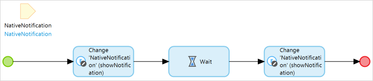{}

1. Navigate to your **Home_Native** page and do the following: 
	a. Double-click your notification widget 
	b. Change **sendProduct** so that on receive it triggers **ACT_ShowNotificationOnReceive**:

	{}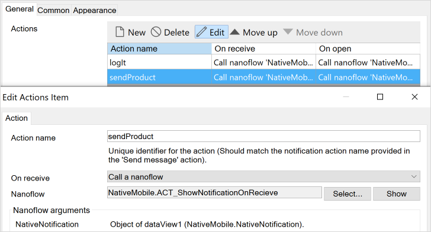{}

Now repeat the steps in [Testing the Implementation](#testing-guid), but this time put your app in the foreground. You will see a notification with your text and a button for five seconds:

{}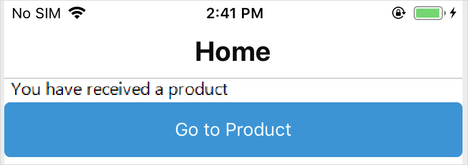{}

## 5 Sending Notifications to Multiple Devices

What if you want to send messages to all your users' devices with a single button push, but you do not want to handle the GUID retrieval? The section below will illustrate this. Specifically, you will send a push notification containing a data object to your users' devices via the Push Notifications API.

### 5.1 Creating a Microflow to Send a Data Object Push Notification 

Create a microflow *ACT_SendProductToAllDevices* with the following elements:

{}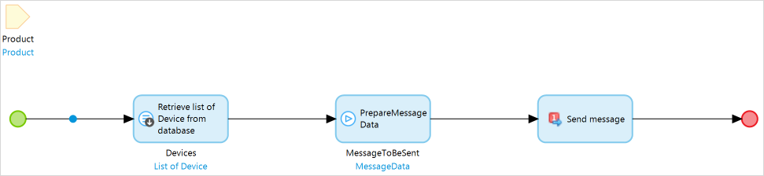{}

1. Add a *Product* data parameter to your microflow.
2. Retrieve the *PushNotifications.Device* entity list from a database:

    {}{}
    
3. Drag and drop the **PrepareMessageData** microflow from *PushNotifications/_USE ME/API* onto **ACT_SendProductToAllDevices** and configure the following: 
	a. Title: *myTitle*. 
	b. Body: *myBody*. 
	c. TimeToLive: *0*. 
	d. Badge: *0*. 
	e. ActionName: *sendProduct*. 
	f. ContextObjectGuid: *empty*:
	
	{}{}

	**ContextObjectGuid** is set to empty since you will pass the object itself to the **SendMessageToDevices** Java action where it will be retrieved automatically. 

4. Drag and drop the **SendMessageToDevices** Java action from `PushNotifications/_USE ME/API` onto **ACT_SendProductToAllDevices** and configure the following: 
	a. **Message data param**: **$MessageToBeSent**. 
	b. **Device param**: **$Devices**. 
	c. **Context object**: **$Product**:
	
	{}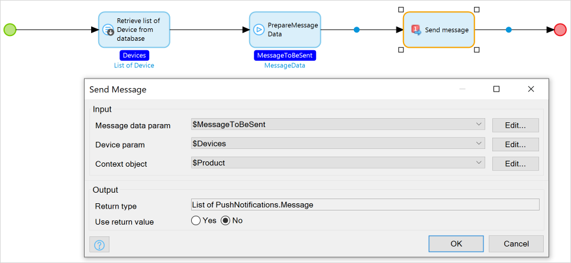{}
  
5. Go to **Product_NewEdit** and drag and drop **ACT_SendProductToAllDevices** inside of that page's data view:

	{}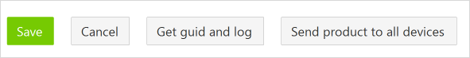{}

### 5.2 Testing the Implementation

Test your new push notification capabilities by doing the following:

1. Run your native app in your device's background.
2. In your web browser, go to **Product_NewEdit** and click your **ACT_SendProductToAllDevices** microflow button. 

This will send a notification to all available devices. When you tap the notification, you will be redirected to the particular product page you modeled.

## 6 More Java Action Explanations

For more detail on Java actions available in the Push notifications module, see the sections below.

### 6.1 PrepareMessageData Microflow

This allows users to create their own user interfaces in order to alter and create a push notification message. 

### 6.2 SendMessageToDevice and SendMessageToDevices Java Actions

These Java actions have the following parameters:

* **MessageDataParam** (PushNotifications.MessageData): This parameter can be generated by the **PrepareMessageData** microflow
* **DeviceParam** (List of PushNotifications.Device or PushNotification.Device): This parameter can be used to send the same message to a list of devices
* **ContextObject**: This parameter will allow any Mendix object to be passed to the notification

### 6.3 SendMessageToUsers and SendMessageToUser Java Actions

Every user is allowed to have more than one device. When sending push notifications to every device of a particular user, use  the **SendMessageToUser** Java action.

To send a push notification to all users, use the **SendMessageToUsers** Java action.

## 7 Trouble shooting
| Issue | Cause | Solution |
|-----|----|-----|
| Sending a message causes a **SenderId mismatch** error or **403: Forbidden** | Your native mobile app did register the device within your Mendix applications but not registerd with Firebase | [Build our own native app](setting-up-native-push-notifications#auto-changes) and make sure you add the google-services.json file |
| Sending a message causes a **Request contains an invalid argument** error or **400: Bad Request** | Your Project ID does not match with the project id in the private key json file | Upload the correct file or [generate a new private key](setting-up-google-firebase-cloud-messaging-server#6-setting-up-a-service-account) in Firebase and upload it |
| Mendix Runtime exception on JavaAction 'DecryptString': **Key should not be empty** | This module depends on the Encryption module, which requires an key | [Set the constant](native-remote-notifications#3-1-installing-your-module) **EncryptionKey** in the module **Encryption** with a key exactly *16 characters* |
| Building the app Teamcenter trows an error: **Execution failed for task ':app:processDevDebugGoogleServices'. > No matching client found for package name 'com.mendix.myapp.testlocal.developerapp'** | The google-services.json contains an package_name this should match with the Native app package identifier. Please note the native builder adds **.devleoperapp** at the end of the package name for dev apps | [Add an app](setting-up-google-firebase-cloud-messaging-server#native-apps) with the correct package identifier to Firebase and update the google-services.json in your GitHub repository |
| Error sending message **Error reading credentials from stream, 'type' field not specified. at PushNotifications.SendFCMMessages (JavaAction : 'GetFCMAccessToken')** | A wrong private key file was uploaded | Upload the correct file or [generate a new private key](setting-up-google-firebase-cloud-messaging-server#6-setting-up-a-service-account) in Firebase and upload it |

## 8 Read More

* [Use Local Notifications](local-notif-parent)
* [Set Up the Google Firebase Cloud Messaging Server](setting-up-google-firebase-cloud-messaging-server)
* [Set Up Hybrid Push Notifications](setting-up-hybrid-push-notifications)
