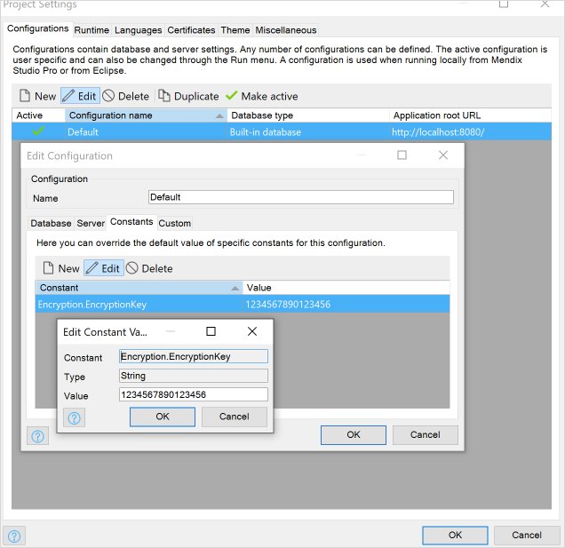
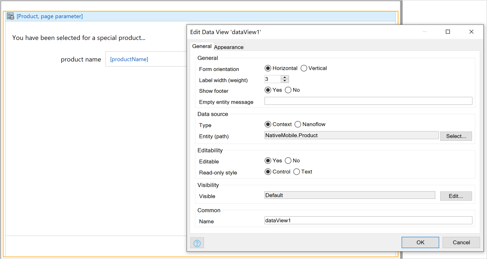
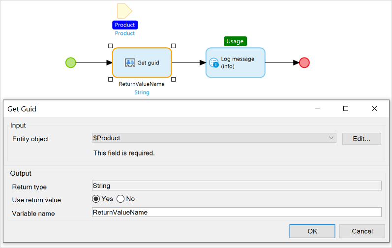
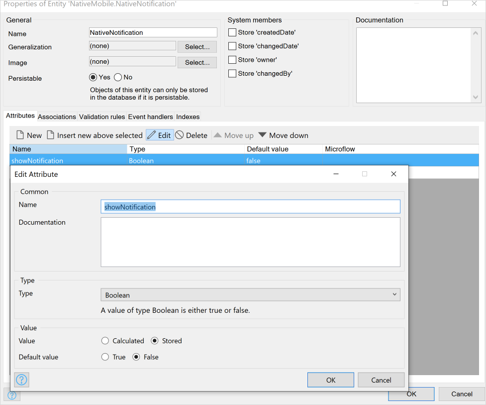
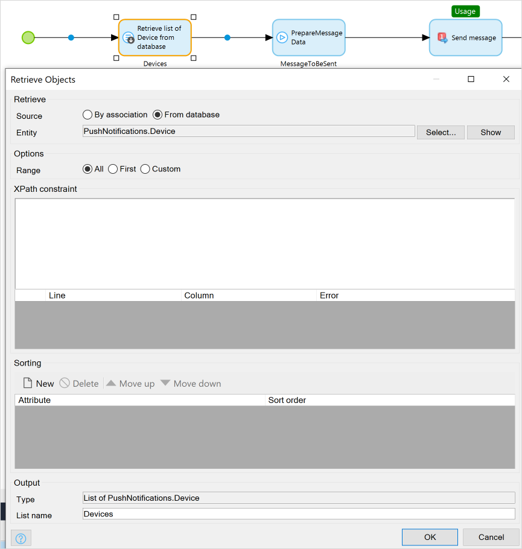

## 1 Introduction

Setting up remote native push notifications occurs over four major steps:

1) Native app creation with Native Builder
2) Firebase setup
3) Native Builder app customization (We need the files from firebase setup) 
4) Mendix project setup

**This how-to will teach you how to do the following:**

[TODO]
* Create...
* Build...
* Configure...

## 2 Prerequisites

Before starting this how-to, make sure you have completed the following prerequisites:

* How to create native app via [Native Builder](https://docs.mendix.com/howto/mobile/native-builder#1-introduction) 
* How to create simple mendix app from Mendix template
* How to work with GIT

## 3 Native Builder App Creation

Please follow [Deploy Your First Mendix Native App](deploying-native-app) all the way through section X [todo: how far must they go?]. Once you finish this, you will have a x and can y [todo: Connor will fill in after Mehmet explains previous todo].  We recommend you to follow Native Builder 3.0.0 which requires Mendix 8.3.0 and above. Although it wont affect the customizations which we will do [todo: then why are you recommending it?].

Clone the generated repository to your computer to enable customizations later.

## 4 Firebase Setup

[todo: rewrite this section to be have more numbered list instructions]

FILES WILL BE USED LATER: 
`google-services.json`
`GoogleService-Info.plist`
`FirebasePrivateKey.json`

ID's will be used later:
Project ID: `yourProjectIdFromFirebase`

Complete *Creating a New FCM Project* in [How to Set Up the Google Firebase Cloud Messaging Server](setting-up-google-firebase-cloud-messaging-server) to create a new FCM project. During this process, be sure to enable both Android and iOS app builds, since this how to will use both platforms [todo: where does the user add these apps in the process?]. 

The `IOS bundle ID` and `Android package name` will be the same [todo: what does this have to do with anything?]. You can find these values in the cloned repo:

`android/app/src/main/AndroidManifest.xml`

`<manifest xmlns:android="http://schemas.android.com/apk/res/android" package="com.mendix.nativetemplate">`

Because you are using the Native Template, your package's name is `com.mendix.nativetemplate`.

Download the `google-services.json` and `GoogleService-Info.plist` file to your computer since you will use it in your generated native app later.

Navigate to the **Service Accounts** tab.

Create a private key and save it as *dontshareThis.json* in a place you will not lose it.

## 5 Setting up Native Builder Customizations

Out of the box, native builder will create ios and android part of the code. We will do different customizations for different platforms.

### 5.1 Customizing Android part

1. Change `android/app/build.gradle`s with following additions

```diff
@@ -101,6 +101,10 @@ dependencies {
     implementation fileTree(dir: "libs", include: ["*.jar"])
     implementation "com.facebook.react:react-native:+"  // From node_modules
     implementation "org.webkit:android-jsc:r245459"
+    implementation "com.google.android.gms:play-services-base:16.1.0"
+    implementation "com.google.firebase:firebase-core:16.0.9"
+    implementation "com.google.firebase:firebase-messaging:18.0.0"
+    implementation 'me.leolin:ShortcutBadger:1.1.21@aar'
 }
```

2. add downloaded `google-services.json` inside of `android/app` so it looks like this: `android/app/google-services.json`

3. Change `android/app/src/main/AndroidManifest.xml`
We will be testing our implementation against local mendix instance, that means we wont using `https` which means we have to add `android:usesCleartextTraffic="true"` please remove this change afterwards.

```diff
--- a/android/app/src/main/AndroidManifest.xml
+++ b/android/app/src/main/AndroidManifest.xml
@@ -2,9 +2,11 @@
   package="com.mendix.nativetemplate">

     <uses-permission android:name="android.permission.INTERNET" />
-
+    <uses-permission android:name="android.permission.RECEIVE_BOOT_COMPLETED" />
+    <uses-permission android:name="android.permission.VIBRATE" />
     <application
       android:name=".MainApplication"
+      android:usesCleartextTraffic="true"
       android:label="@string/app_name"
       android:icon="@mipmap/ic_launcher"
       android:roundIcon="@mipmap/ic_launcher_round"
@@ -13,6 +15,7 @@
       <activity
         android:name=".MainActivity"
         android:label="@string/app_name"
+        android:launchMode="singleTop"
         android:configChanges="keyboard|keyboardHidden|orientation|screenSize"
         android:windowSoftInputMode="adjustResize">
         <intent-filter>
@@ -21,6 +24,20 @@
         </intent-filter>
       </activity>
       <activity android:name="com.facebook.react.devsupport.DevSettingsActivity" />
+        <receiver android:name="io.invertase.firebase.notifications.RNFirebaseNotificationReceiver"/>
+        <receiver android:enabled="true" android:exported="true"  android:name="io.invertase.firebase.notification
+            <intent-filter>
+                <action android:name="android.intent.action.BOOT_COMPLETED"/>
+                <action android:name="android.intent.action.QUICKBOOT_POWERON"/>
+                <action android:name="com.htc.intent.action.QUICKBOOT_POWERON"/>
+                <category android:name="android.intent.category.DEFAULT" />
+            </intent-filter>
+        </receiver>
+        <service android:name="io.invertase.firebase.messaging.RNFirebaseMessagingService">
+            <intent-filter>
+                <action android:name="com.google.firebase.MESSAGING_EVENT" />
+            </intent-filter>
+        </service>
     </application>

 </manifest>
```

4. Change `android/app/src/main/java/com/mendix/nativetemplate/MainApplication.java`

```diff
 import fr.greweb.reactnativeviewshot.RNViewShotPackage;
 import io.invertase.firebase.RNFirebasePackage;
+import io.invertase.firebase.messaging.RNFirebaseMessagingPackage;
+import io.invertase.firebase.notifications.RNFirebaseNotificationsPackage;

 public class MainApplication extends MendixReactApplication {
   @Override
   public boolean getUseDeveloperSupport() {
-    return false;
+    return true;
   }

   @Override
@@ -53,6 +55,8 @@ public class MainApplication extends MendixReactApplication {
             new ImagePickerPackage(),
             new RNGeocoderPackage(),
             new RNFirebasePackage(),
+            new RNFirebaseMessagingPackage(),
+            new RNFirebaseNotificationsPackage(),
             new RNDeviceInfo(),
             new RNCameraPackage(),
             new CalendarEventsPackage(),
```
- Change `android/build.gradle`
```diff
        }
     }
     dependencies {
-        classpath("com.android.tools.build:gradle:3.4.0")
+        classpath("com.android.tools.build:gradle:3.4.1")
+        classpath 'com.google.gms:google-services:4.2.0'
         // NOTE: Do not place your application dependencies here; they belong
         // in the individual module build.gradle files
     }
```

5. Change the `android/app/src/main/res/raw/runtime_url`
6. Add your local ip
7. Commit and push changes to master. This will trigger an App Center build. Or you can run it locally.

### 3.1 Customizing iOS part

Remote notifications on Simulator [todo: Simulator?] will not work. Open `app/ios/yourProjectName.xcworkspace` in Xcode to add files to this project and change its capabilities.

1. Add `GoogleService-Info.plist` to NativeTemplate folder, it should be at the same level as `Info.plist`

2. Change `/ios/AppDelegate.swift`

Please note that we are adding our own local ip because we want to test against local mendix instance.

```diff
 import Foundation
 import UIKit
 import MendixNative
+import Firebase
+

 @UIApplicationMain
 class AppDelegate: UIResponder, UIApplicationDelegate {
@@ -10,11 +12,24 @@ class AppDelegate: UIResponder, UIApplicationDelegate {
     guard let url = Bundle.main.object(forInfoDictionaryKey: "Runtime url") as? String, let runTimeUrl = AppUrl.forRuntime(url: url) else {
       fatalError("Missing the 'Runtime url' configuration within the Info.plist file")
     }
-    guard let bundleUrl = ReactNative.instance.getJSBundleFile() else {
+    guard let bundleUrl = AppUrl.forBundle(url: "http://LOCALIP:8080", remoteDebuggingPackagerPort: 8083, isDebuggingRemotely: true, isDevModeEnabled: true) else {
       fatalError("Could not properly load JS bundle file")
     }
-
+    FirebaseApp.configure()
+    RNFirebaseNotifications.configure()
     ReactNative.instance.start(MendixApp(bundleUrl: bundleUrl, runtimeUrl: runTimeUrl, warningsFilter: WarningsFilter.none))
     return true
   }
+
+  func application(_ application: UIApplication, didReceive notification: UILocalNotification) {
+    RNFirebaseNotifications.instance().didReceive(notification)
+  }
+
+  func application(_ application: UIApplication, RemoteNotification userInfo: [AnyHashable : Any], fetchCompletionHandler completionHandler: @escaping (UIBackgroundFetchResult) -> Void) {
+    RNFirebaseNotifications.instance().didReceiveRemoteNotification(userInfo, fetchCompletionHandler: completionHandler)
+  }
+
+  func application(_ application: UIApplication, didRegister notificationSettings: UIUserNotificationSettings) {
+    RNFirebaseMessaging.instance().didRegister(notificationSettings)
+  }
 }
```

3. Add `ios/Podfile` if the following lines exists, otherwise add:

```
  pod 'RNFirebase', :path => '../node_modules/react-native-firebase/ios'
  pod 'Firebase/Core' 
  pod 'Firebase/Messaging', '~> 5.15.0'
```

4. Change `Info.plist` runtime URL to your local IP address.

5.  Add capabilities
     

## 4 Mendix project setup

Create a Native starter project.

### 4.1 Module installation

1. Add Community commons
2. Add encryption
     2.1 Set the private key
     
     

3. Add push notification module

### 4.2 Push Notification Modeler Work

#### 4.2.1 Set Up Notification Widget

1. Drag and drop an App events [todo: check] to your home page and configure the following:
     1.1 Page load / on load to `PushNotifications.OnPageLoad_RegisterPushNotifications`
     1.2 App resume / on resume `PushNotifications.OnPageLoad_RegisterPushNotifications`
    
         

     This will allow devices to register automatically when they opened the mendix app

2. Create an entity called `NativePush` in your domain model with one `- objectGUID` field:

     

3. Create a new *DS_Notification* nanoflow which creates a *NativePush* entity object and then returns it:

     

4. Drag and drop a Dataview [todo check] onto your homepage.

5.  Set its **Source** to **Nanoflow** > **DS_Notification**:

     

5. Drag and drop a Notifications widget inside of the dataview [todo check]
6. Set its **GUID** to **NotificationEntity/objectGUID**:

     

     This will allow you to pass objects with your push notifications

7. Add one more Show page item [todo check] to your responsive profile navigation: PushNotification/_USE ME/Administration

     

#### 4.2.2 Add Actions to Your Notification Widget

- Create two nanoflows (`ACT_OnRecieve`,`ACT_OnOpen`) which will simply two different logs => "onRecieve triggered" - "onOpen triggered"


- Go to your Notification widget/ 
     - add an action called `logIt`
     - on recieve select the nanoflow `ACT_OnRecieve`
     - on open select the nanoflow `ACT_OnOpen`


#### 4.2.3 Add Firebase Configurations

Deploy the project and head for the administartion screen of the push notifications, we will add configurations

- add new FCM configuration
- check enabled
- Give a random name
- Set it as Development / it wont affect any functionality, it is a helper (TODO: How ?)
- Set the project id to the project id we referred in [here](#2-firebase-setup)
- upload the private key


- Set the messaging service settings in the dropdown for both ios and adroid
- Set the messaging service type for ios and android for FCM


Lets test the implementation

#### Sending a Push Notification

- Reload the app in the phone
- Put the app in the background 
- Go to devices tab in the admin module

Now you should be able to see registered devices

- Select device and click new message
- Set title-body and action name to `logIt`


When the app is in the background you will see that notification is handled by OS and shown a message. 


When you tap the notification you will recieve a log in your modeler console  `onOpen triggered` 

When the app is in the foreground you wont see that notification but you will recieve a log in your modeler console  `onRecieve triggered` 

## 5 Sending Data Using Push Notifications

Lets imagine we have bunch of products and we want to send A product to a user via administration module interface.  

In this section we will cover a scenario where we will:
- Show push notification to a user if app is in the backgroud, when user taps it, it will go to a proper product page.
- Show a small view to a user if app is in the foreground for X amount of seconds, when user taps the button in the animation, it will go to a proper product page.

### Setup example entity

- Add `Product` entity with `ProductName` attribute and right click to generate overview pages  => `Product_NewEdit`, `Product_Overview`


- Drag and drop `Product_Overview` to your homepage so it can be accessible

- Create a native page called `NativeProductOverview` that has a dataview which listens contexts with entity: Product. Fill the contents => This page will be opened with proper product when user taps the notification



#### Sync the unused entities in the native side

In mendix we do smart syncing, meaning if an Entity has not been retrieved in native side, it wont be there. This situation wont occur in 90% of the apps since we DO retrieve entities that we want show. 

But for our case, we dont retrieve any products in any of the pages, this could be fixed in two easy cases:
1) Create a list of `Products` in one of the native pages. Datasource doesnt matter since it is bound to retrieve the Entities
2) Change Navigation/Native mobile/ Sync config/ Product => Download All Object


### Get the GUIDs of the objects in Edit view

For an example we want to keep the things simple:

- Create a nanoflow `ACT_GetGUIDAndLog` which has:
    - Product object as a parameter
    - Javascript action Get guid, set the object the Parameter object
    - Log the returned value
    


- Drag and drop this nanoflow to the `Product_NewEdit` inside of the Dataview


### Create a nanoflow which will handle data passing for notification

Create a nanoflow `ACT_GetProductAndShowPage` which has:
- Notification object as a parameter

- JS action `get object from a GUID` where `Entity type` is `Product` and GUID is `parameter/objectGUID` name the return value to `ProductObject`

- Show `NativeProductOverview` page with passed object: `ProductObject`


Go to your Home_Native/ Notification widget and create new action named `sendProduct`, on open triggers `ACT_GetProductAndShowPage`


#### Testing the implementation

- Get a Product GUID by clicking the button that we created in `Get the GUIDs of the objects in Edit view`

Follow the steps for sending [simple push notification](#sending-simple-push-notification). This time we will set:
- action name to `sendProduct`
- set `Context object guid` to the GUID we got


Put the app in the backgorund and send the message, when we tap the notification, it will navigate to the `NativeProductOverview` page with proper object.


## Now lets cover when the app is in the foreground

- Add one more `boolean` field named `showNotification` to the `NativePush`  



- In your `Home_Native` page inside of the NativeNotification Dataview:
    - add a Container
    - Sets its visibility to `NativeNotification/showNotification`
    - Add a text field saying `You have recieved a product`
    - Drag and drop `ACT_GetProductAndShowPage` nanoflow next to it


- Create a nanoflow called `ACT_ShowNotificationOnRecieve` which will be responsible for switching `NativeNotification/showNotification` attribute:

    - NativeNotification as a param
    - Change the `NativeNotification/showNotification` to `true`, without committing
    - Javascript action `Wait` for `5000` ms
    - Change the `NativeNotification/showNotification` to `false`, without committing

- Home_Native/ Notification widget => Change action named `sendProduct`, on recieve triggers `ACT_ShowNotificationOnRecieve`


Follow steps for the previous sections in [here](###testing-the-implementation) but this time put the app in the foreground. You will see the the text with a button for 5 seconds.


#### Sending notifications programetcally via Push Notifications API (This section can be split from the rest)

What if we want to send messages to all devices, and doesn't want to handle the GUID retrieval. In this section we will cover this scenario where we will send a product from web to all devices with a single button click.

##### Create a microflow which will send particular product to all devices

- Create a microflow `ACT_SendProductToAllDevices` which has:


     - Product as a parameter
     - Retrieve list of devices from database: `PushNotifications.Device`
     
     - PrepareMessageData Microflow from `PushNotifications/_USE ME/API`
          - title: myTitle
          - body: myBody
          - time to live: 0 
          - badge: 0
          - actionName `sendProduct`
          - ContextObjectGuid to `empty`
     

     As you can see we set the ContextObjectGuid to empty since we will pass the object itself to the SendMessageToDevices Java action where it will be retrieved automatically for us. 

     - SendMessageToDevices Java Action in `PushNotifications/_USE ME/API`
          - Message data param: $MessageToBeSent
          - Device param: $Devices
          - Context object: $Product
     
     
- Go to `Product_NewEdit`, drag and drop the `ACT_SendProductToAllDevices` inside of dataview so that we can trigger this microflow


##### Test the implementation

Now run the app
- Put the Native app in the background
- In web go to a particular product and press `ACT_SendProductToAllDevices` microflow button. This will send notification to all available devices and when the user taps the notification it will be redirected to the particular product page that we modeled.

## 4 Read More

All JAVA actions which is available in Push notifications module with small explanations:

### PrepareMessageData Microflow

This allows users to create their own user interface in order to alter and create a push notification message. 

### ​SendMessageToDevice & ​SendMessageToDevices Java Action

We covered this Java action in this documentation. Params:
- `MessageDataParam` (PushNotifications.MessageData): This param can be generated by the PrepareMessageData microflow.
- `DeviceParam` (List of PushNotifications.Device): Can be used to send same message for a list of devices.
- `ContextObject`: Any mendix object which will be passed to the notification as GUID string.

### SendMessageToUsers & SendMessageToUser Java Action

Every user is allowed to have more than one device. In case of sending push notifications to every device of a particular user `SendMessageToUser` can be used.

In case of sending a push notification to all users `SendMessageToUsers` can be used.

