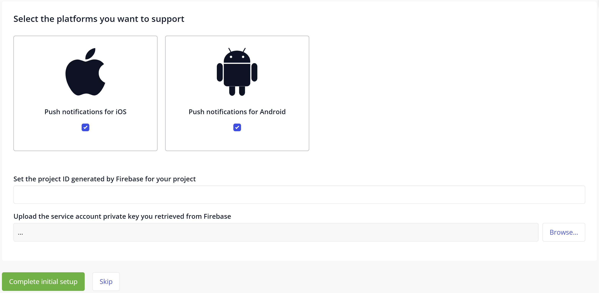

## 1 Introduction 

This how-to will teach you to configure the runtime for using push notifications in native apps. 

## 2 Configuring Your Notifications

If you have completed [Add Module Dependencies](notif-add-module-depends) and [Implement the Push Notifications Module](notif-implement-module) per your use case, do the following to configure your push notifications:

1. Open your app in Mendix Studio Pro.
1. Log in as the Administrator user you [previously designated](notif-implement-module#config).
1. Navigate to the **Administration** page.

The first time you open this page it will present you with a wizard to set up the Firebase configuration. If you have not set up Firebase yet, see [Set Up the Google Firebase Cloud Messaging Server](setting-up-google-firebase-cloud-messaging-server). 

{}{}

When selecting a platform to support, the wizard will ask for the Google Firebase project ID and service account private key. Upload the private key file here.

| **File**    | **Source**   | **Usage**      |
| -------- | -------- | ------- |
| **{project_id}-firebase-adminsdk-{identifier}.json** | Google Firebase | Private key for the Firebase service account, used in runtime configuration. |  

Now you completed the initial setup wizard, you can move on to [Native Push Notification Implementation](notif-implement-native).