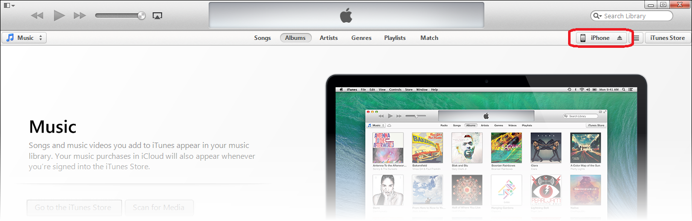
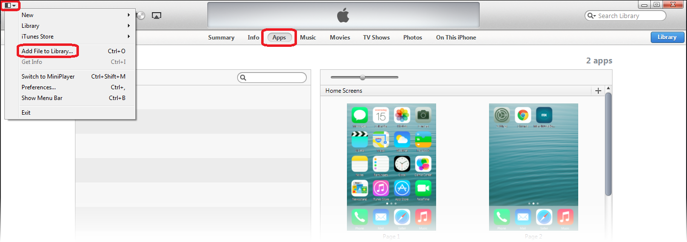

## 1 Introduction

Once you have finished developing a Mendix mobile app, you will want to make it available as an app for mobile platforms such as Apple's iOS and Google Android. We make it possible to produce a platform-specific native app in the **Publish** section of the Mendix Developer Portal.

The hybrid mobile app publishing process is based on Adobe PhoneGap. Manually using Adobe PhoneGap is very tedious, because you need both a Microsoft Windows machine and an Apple Mac machine, and they need to be set up with the correctly configured development environments. However, we have integrated the [Adobe PhoneGap Build](https://build.phonegap.com/) service into Mendix to eliminate this burden and to provide support for automatically building the required hybrid mobile packages. Instead of worrying about technical details, you can focus on the essentials: rapidly developing an app to support your business processes.

This how-to leads you step-by-step through the process of packaging your Mendix app as a hybrid mobile app that you can then deploy on your iOS developer device or publish in the Apple App Store.

**This how-to will teach you how to do the following:**

* Complete the packaging process
* Set up the app signing keys
* Install an iOS app on a test device

## 2 Prerequisites

Before starting this how-to, make sure you have completed the following prerequisites:

* Have a Mendix app with mobile support running in the Mendix Cloud, either as a free app or on a licensed cloud node
* Have an account for Adobe PhoneGap Build (you can create one for free [here](https://build.phonegap.com/plans/free-adobeid))
* Have an iOS device (iPhone or iPad) for testing the iOS package that will be produced
* Have an iOS deployment certificate for which your test device is activated
    * You need both a *.p12* certificate file and a *.mobileprovision* profile file
    * For details on how to obtain app signing keys, see [Managing App Signing Keys](/refguide7/managing-app-signing-keys) in the Mendix Reference Guide
* Have Apple iTunes installed on your computer for deploying the iOS package that will be produced on your test device

## 3 Starting the Packaging Process

Before starting, make sure you have a Mendix app with mobile support enabled running in the Mendix Cloud, either as a free app or in a licensed cloud node. If you do not have one ready yet, set up the Company Expenses app from the Mendix App Store as a free app to try out its mobile features.

To start the packaging process, follow these steps:

1. Open the Mendix Developer Portal from the [launchpad](https://home.mendix.com/home/).
2. Go to the project of the Mendix app that you want to publish.
3. Go to the **Publish** tab of the project.
4. Click **Publish for Mobile App Stores**. You will be shown the **Publish App for Mobile App Stores** page, where you need to set up some options for your hybrid mobile app.
5. Use the **Edit** button on the **App Info** tab to set up the following settings for your app:
    * Fill in the name that your app will have in the App Stores and on the device (for example, *Company Expenses*)
    * Set the unique **App Identifier** for your app, (for example, *com.example.CompanyExpenses*)
        * Both the **Name** and the **App Identifier** should correspond to the ones set up in your Apple certificate
6. Select the platforms that you want to support (this how-to assumes that you will choose at least iOS).
7. Optionally, upload custom branded app icons and splash screens under the tabs for the different platforms. You can find those tabs next to the **App Info** tab.
    * If you do not upload any images, the default Mendix-branded images that are shown will continue to be used
    * Take note of the required resolutions and file types for the image files, as the system will not allow you to upload images with different resolutions (because your app packages will not function properly)
    * For the purposes of this how-to, it is not necessary to upload any images yourself
8. Click **Publish for Mobile App Stores**. You will be presented with the **Build Mobile App Store Packages** page.
9. Select the environment that you want to publish:
    * For Community Edition apps, the only option is **Sandbox** (for example, for a free app)
    * For apps running on a licensed cloud node, you can choose from **Test**, **Acceptance**, and **Production** (depending on what is available on your cloud node)
10. Leave the default choice of how to build the package: **Build Mobile App Store packages for me by sending the build configuration to Adobe PhoneGap Build**. You can use the alternative option to manually download a PhoneGap Build package, which you can then inspect, modify, and upload manually to Adobe PhoneGap Build (for more information, see [Customizing PhoneGap Build Packages](/refguide7/customizing-phonegap-build-packages) in the Mendix Reference Guide). Please note that this is unnecessary in almost all scenarios.
11. Start the actual hybrid mobile app package building process by clicking **Start PhoneGap Build job**, which will initiate the packaging process.
12. The first time you start this process, you will need to authorize the Mendix Developer Portal to act on your behalf with the Adobe PhoneGap Build service. You will be presented with a pop-up window to start the redirect to Adobe PhoneGap. To build for the authorization, click **Authorize use of Adobe PhoneGap Build**, and you will be temporarily redirected to the website of Adobe PhoneGap Build.
13. On the Adobe PhoneGap Build service page, you will be asked whether you want to authorize the **Mendix Developer Portal** to act on your behalf. Choose **Yes** to allow the start of building jobs using your account. You will then be redirected back to the Mendix Developer Portal.
    * If you choose "No", you will be redirected back to the Mendix developer Portal and you will not be able to publish your app
    * If you do not have a session with Adobe PhoneGap Build in your current browser, before being presented with the authorization request, you will be asked to log in

After you have been redirected back to the Mendix Developer Portal, the packaging process will continue and you will have to set up the proper signing keys for your app.

## 4 Setting Up App Signing Keys

The **PhoneGap Build: Signing Key Required** page asks you to go to the PhoneGap Build and set up the app signing keys. To set up the app signing keys, follow these steps:

1. Click **Log in to PhoneGap Build**. A new tab will be opened for [https://build.phonegap.com/apps](https://build.phonegap.com/apps), where you can see the PhoneGap Build app that was created by the Mendix Developer Portal for your app. The app is named as you defined it in the **App Info** in [3 Starting the Packaging Process](#StartingthePackagingProcess).
2. Set up the app signing key for your app in your account.
3. Configure the app to be built by going to your PhoneGap Build account details. Click the avatar icon at the top-right of the page, and then click **Edit account**.
4. Click the **Signing Keys** tab, and under **iOS**, click **add a key ...**.
5. A pop-up window will be shown where you must upload a certificate file and a provisioning profile file. You can get those files from Apple. The certificate is the *.p12* file, and the provisioning profile is the *.mobileprovision* file. For more information, see [Managing App Signing Keys](/refguide7/managing-app-signing-keys) in the Mendix Reference Guide.
6.  Give the key a title that you can easily recognize, and upload the files. 

    {}

    Before using the key, it must be unlocked with the passphrase that was set up for the key. Click the lock with the yellow background on the same row as the key and enter the passphrase. As the pop-up window states, the key can now be used for builds for the period of an hour. After an hour, the passphrase needs to be entered again for security reasons.

    {}
7. Now you are ready to configure the app. Click **Apps** at the top of the page to go to an overview showing your app(s). Click the logo or the name of your app to go to the details of the app.
8. Select the correct key for your app. Next to the text **iOS**, there is a drop-down menu with the **No key selected** option. Select the newly uploaded key from the drop-down menu, which should be listed under **unlocked**.

Your PhoneGap Build account is now ready and you can continue the packaging process.

## 5 Completing the Packaging Process

To complete the packaging process in the Mendix Developer Portal, follow these steps:

1. Close the **Adobe PhoneGap Build** tab and go back to the original **Mendix Developer Platform** tab.
2. Click **Restart build job** to restart the packaging process. You will be presented with a page showing the build status of your apps titled **Building Mobile App Store Packages**. It will show the status of **Building...** while PhoneGap Build is processing your app. Once ready, it will show the status of **Done**, and a button will be available to start the download of your iOS package.
3. When the build process is done, click **Download iOS package** and save the package (the *.ipa* file) to your computer.

## 6 Installing the iOS App on Your Test Device

You can now deploy your app to your test device. An easy way to do this is with Apple iTunes.

To install the iOS app on your test device, follow these steps:

1. Open iTunes and connect your iOS device to your computer.
2. At the top-right of the screen, click the device selector to show the contents of your device.

    

3. Click **Apps** to show available and installed apps.
4. Open the menu in the top-left corner of the iTunes window, and click **Add File to Library...**:

    

6. Select the *.ipa* package file that you downloaded earlier.
7. iTunes will ask if you want to replace an existing version of the app. If there is one, do so. You can also open an *.ipa* file directly with iTunes by double-clicking it.
8. Your app should show up in the list of apps. Click the **Install** button next to your app.
9. Click **Apply** at the bottom of the screen to execute the actual installation.

The app should now be visible on your device. Open it and log in to the app with a regular user account (set one up in the Mendix app in your desktop browser if you have not done so yet).

## 7 Examples

** How to build a Phonegap app in the cloud **

{}

## 8 Related Content

* [Mobile How-To's](../mobile/)
* [How to Deploy your First Hybrid Mobile App](deploy-your-first-hybrid-mobile-app)
* [How to Use the Mobile Slider Custom Widget](../custom-widget-development/the-mobile-slider-custom-widget)
* [How to Debug a Hybrid Mobile Application](../monitoring-troubleshooting/debug-a-hybrid-mobile-application)
