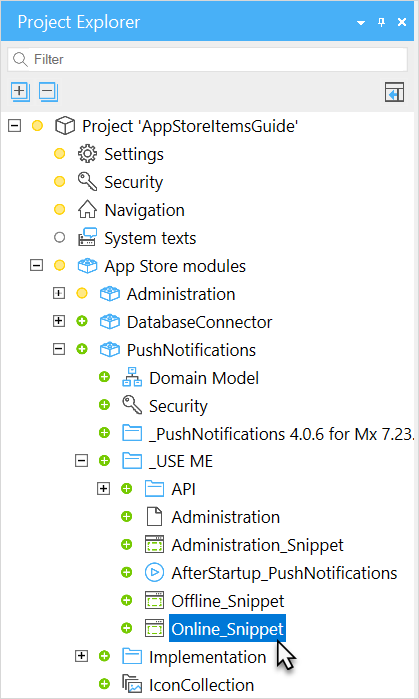

## 1 Overview

This is a list of microflow actions that can be called by your application to send push notifications. They are located in the **Toolbox** under the **Push notifications** category.

| Microflow Action Name | Description |
| --- | --- |
| SendMessageToDevice | An action to send a message to a device immediately. |
| SendMessageToDevices | An action to send a message to multiple devices immediately. |
| SendMessageToUser | An action to send a message to all the devices of a user immediately. |
| SendMessageToUsers | An action to send a message to all the devices of multiple users immediately. |

All actions accept a MessageData object as first parameter. The MessageData entity contains all input data for the notification, such as title, body, and timeToLive.
You may use the **PrepareMessageData** microflow to generate this entity (but you can also create it manually).

| Parameter | Description |
| --- | --- |
| Title | The title of the message. |
| Body | The extended text of the notification. |
| TimeToLive | The number of seconds before the notification expires. |
| Badge | The number to show on the app icon. |
| ActionName | The name of the action to perform when the recipient clicks on the notification (see below). |
| ContextObjectGuid | The Mendix object id of the entity to pass to the specified action. |

In addition, you can modify the NextTry attribute to influence when the notification is delivered.

As an alternative to providing a contextObjectGuid, you can pass the entity that you would like to use as context object to the **SendMessage...** Microflow actions.

## 2 Actions

You can specify actions to be performed once the recipient clicks a notification. To do so, you should specify the available actions in the widget:

Locate the **Online_Snippet** or **Offline_Snippet** document and open it.

Double click the widget to open the properties.

Use the **New** button to add new actions. Each action requires a name, an action type (Open Page or Call Microflow), and optionally an entity (the type of the context object).
Depending on the action type, you should configure the page to be opened, or the microflow to be called.

The names of the actions can be used as the vlaue of the ActionName attribute of the MessageData entity.

### Shortcomings

- Nanoflows are not yet supported.
- Microflows can only be used in online apps. In offline apps, microflows are not supported.
