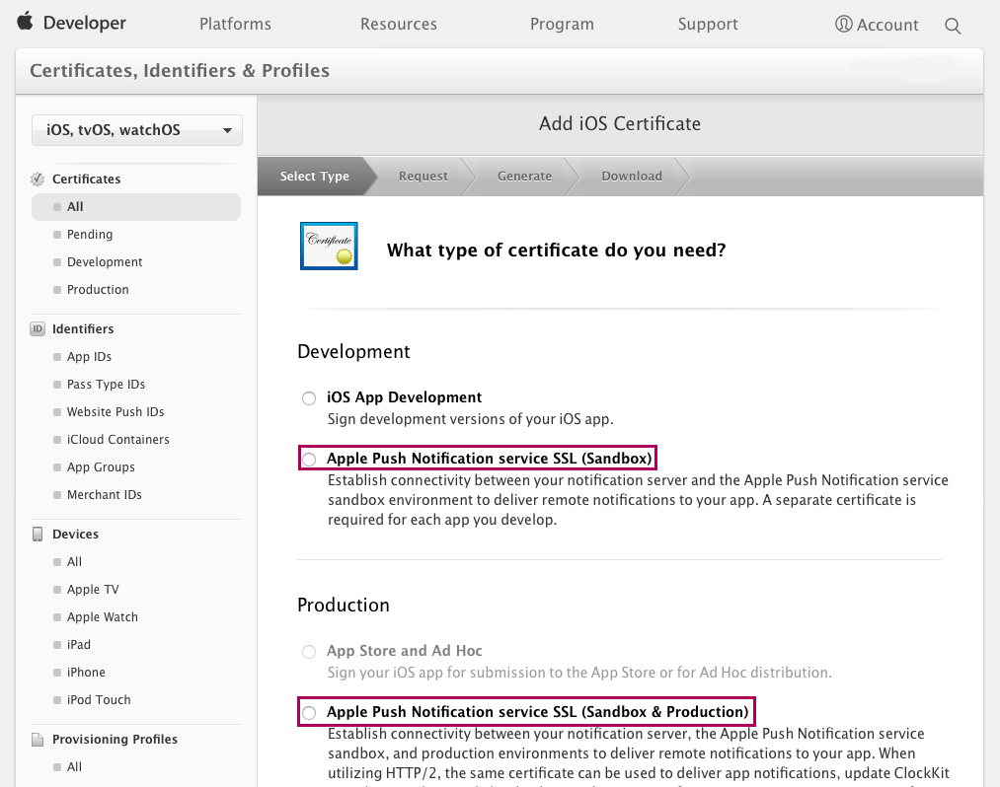

In order to proceed you need an Apple developer license and a device running Mac OS X.

We assume that you already have the app signing key with provisioning profile and can freely build and install your mobile app (if not, please refer to [this how-to](publishing-a-mendix-hybrid-mobile-app-in-mobile-app-stores)). Take into account that your App ID should use `Explicit App ID` and have `Push Notifications` turned on so you can receive push notifications with your app.

If this is not the case, you need to create new App ID with `Explicit App ID` and `Push Notifications` turned on. After that, you'll need to download the new provisioning profile for this App ID and use it to rebuild the mobile app.

If everything is set up and you can build and deploy your application, you can proceed with setting up the push notifications server. To establish connectivity between your notification server and the Apple Push Notification service you will need an Apple Push Notification service SSL certificate in `.p12` format.

Follow these steps to obtain an Apple Push Notifications service SSL certificate from Apple:

### Step 1 - Log in to Apple Developer center

Log in to Apple Developer and go to [https://developer.apple.com/account/ios/certificate/create](https://developer.apple.com/account/ios/certificate/create).

### Step 2 - Choose certificate's type

Choose Push Notification service certificate. As you may see, there are two types of certificates: _development_ and _production_. Note that the development type certificate can only work with the sandbox environment. More about this will be explained later on in this guide.

### Step 3 - Select App ID

Pick your App ID from the dropdown list. If your app is not in the list, then you need to check your App ID entity. Most likely the push notification service is not turned on for the app.

### Step 4 - CSR file

During the next step you should be asked for your CSR file (Certificate Signing Request). You may use the same CSR that you used to create the app signing certificate. If you don't have one, please follow the instructions as shown below.

### Step 5 - Download the certificate

Download your Apple Push Notification service SSL certificate and add it to your Keychain.

This certificate needs to be converted into the `.p12` format. If you don’t know how to do this, please refer to [this page](https://developer.apple.com/library/ios/documentation/IDEs/Conceptual/AppDistributionGuide/MaintainingCertificates/MaintainingCertificates.html).

### Step 6 - Configure APNs in your application

For the last step you need to configure APNs within your application. This can be done by logging into your application as a user with Administrator role and opening the Configuration tab of the `PushNotifications_Administration` page that was set up in [step 8](implementation-guide) of the Implementation Guide.

For this purpose you need to

*   Add your Apple Push Notification service SSL certificate in `.p12` format
*   Add the server url and port. This is `gateway.sandbox.push.apple.com:2195` for sandbox and `gateway.push.apple.com:2195` for production.
*   Add the feedback url and port. This is `feedback.sandbox.push.apple.com:2196` for sandbox and `feedback.push.apple.com:2196` for production.

Note: At this moment, multiple configuration objects are not supported; having more than one of these objects will lead to unpredictable behavior. This will be fixed in the near future.
